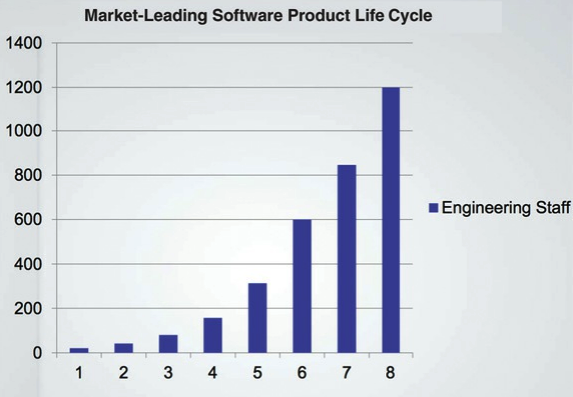
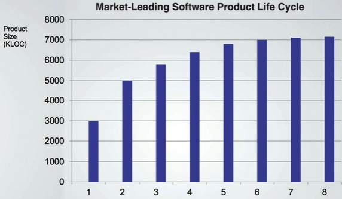
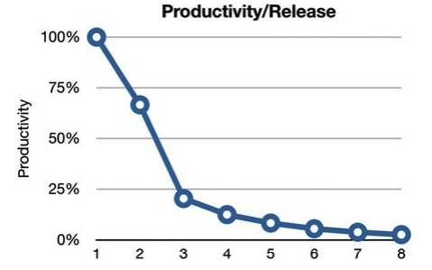
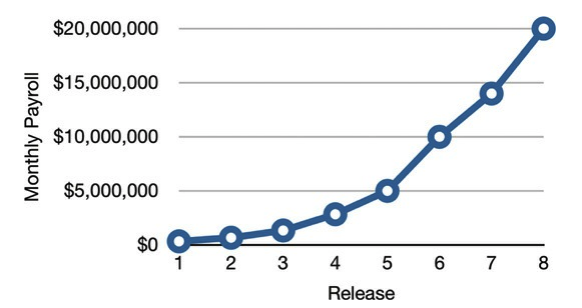
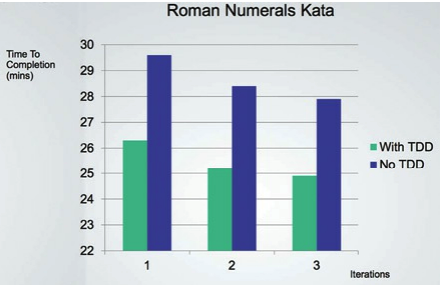
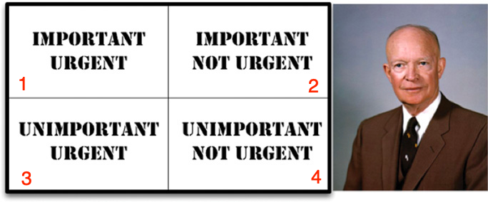

# Part 1 - Introduction

  * [What is design and architecture?](#what-is-design-and-architecture-)
  * [A tale of two values](#a-tale-of-two-values)

Writing software to work is easy - kids in high-school can do it nowadays. Writing software right is hard - it requires patience, knowledge, discipline & dedication.

When you write software right, you don't need gigantic issue tracking systems or a global programmer farm. The defect rates are low & support cost is minimal.
When software is written right, you need only a handful of developers to maintain it. Otherwise, you need a hoard of them to maintain it.

## What is design and architecture?
Design == Architecture. Design implies a focus on low-level structuring details. Architecture implies focusing on higher-level components divorced from the low-level details.
Architecture is actually both as both are important for good architecture.

The goal of good software architecture is to minimize the human resources needed to build & maintain a project.

The measure of good software architecture is the effort needed to satisfy client requirements. If that effort is low, then the architecture is good.

### Case study of bad software architecture
Here's real data from a company & its product's growth over time.

Here's a graphic of the growth of engineering staff:

Here's a graphic of the company's productivity measured in simple lines of code:

Finally, taking this altogether produces the $ cost per LOC for the company:

This is clearly disastrous as a company cannot sustain this cost for so long. At some point, the cost of development will greatly outweigh the income the software brings.

From the developers' perspective, here's how their productivity looks like:

Although they are working hard & doing overtime, their focus is slowly shifted from developing new features to managing the ever-increasing mess.

From the executive's perspective, this looks even grimmer:

### What went wrong?
The author uses the "Hare vs. Tortoise" metaphor to describe the ancient rationale that "slow and steady wins the race".

Developers nowadays, act like the hare as they are overconfident in their abilities to make a mess now & clean it up later.
The cleaning up, however, never comes.

Hence, the only way to go fast is to stay clean. There is no such thing as being fast in the short term and cleaning things up in the long term.

Example \w an acquaintance of the author attempting to solve a popular problem using TDD & no TDD over a span of a week:

> The only way to go fast is to go well

Also, a redesign of the whole system is not the solution as the team's overconfidence will bring them to the same situation after the redesign is done.

## A tale of two values
Every software system provides two values to the stakeholders - behavior & structure.
Unfortunately, most developers focus most on the lesser of the two values - behavior.

Behavior == making the computer do what the clients want.
Many programmers believe this is the entirety of their jobs.
They are sadly mistaken.

### Architecture
Software == "soft product"

The purpose of software is for it to be flexible & easy to change.
Good architecture provides the means to achieve that.

Bad architecture, on the other hand, makes engineering costs higher with every release.

### The greater value
Function or architecture? Which is more important?

Clients will often say that function is more important than later flexibility.
However, that is the wrong attitude.

If you have a system that doesn't work but is easy to change, you can easily program it to work correctly.
If you have a system that can't be changed but works correctly, further requirements cannot be applied to that system.

### Eisenhower's Matrix

The behavior of the system is in quadrants 2 (Important, Urgent) and 3 (Unimportant, Urgent). The architecture is in quadrant 1 (Important, Not urgent).

What business developers often make as a mistake is to promote problems in quadrant 3 (Unimportant, Urgent) to quadrant 2 (Important, Urgent).
This way, the important bits of quadrant 1 (Important, Not urgent) never get the proper attention.

It is the software developer's job to stress the importance of architecture to the business & prioritize quadrant 1 (Important, Not urgent) over quadrant 3 (Unimportant, Urgent).

### Fight for the architecture
Fulfilling your duty of emphasizing the importance of architecture to the business is part of your responsibilities as a software developer.

This will inevitably lead to a fight with other stakeholders, but remember - you are also a stakeholder. A stakeholder of the code you write.
It is your responsibility to safeguard it & ensure that it grows with sustainable architecture.

