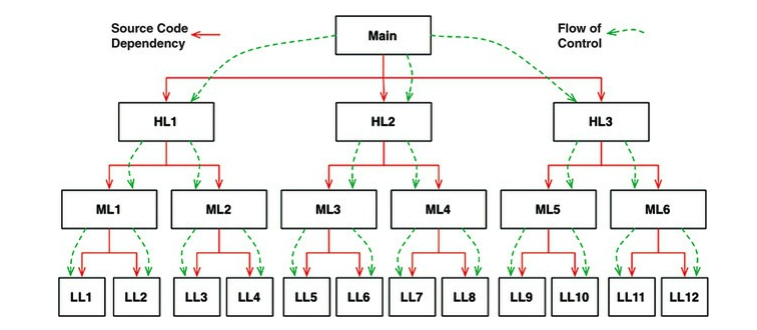
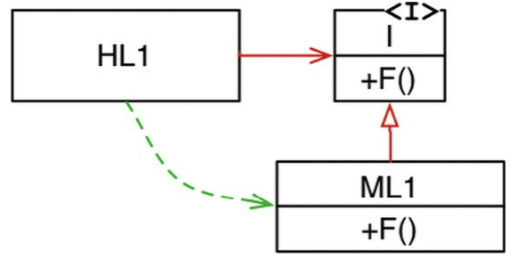
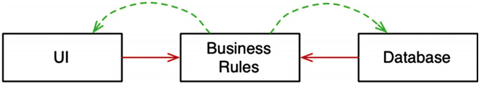

# Part 2 - Starting with the bricks: Programming Paradigms

  * [Paradigm Overview](#paradigm-overview)
  * [Structured programming](#structured-programming-1)
  * [Object-Oriented Programming](#object-oriented-programming-1)
  * [Functional programming](#functional-programming)
  * [Conclusion](#conclusion)

Since programming was first conceived, there were numerous programming languages created. But there only three programming paradigms created.
It is unlikely that there will be more paradigms invented in the future.

Programming language == set of programming structures available in your toolbox.
Programming Paradigm == discipline on what programming structures to use and when to use them.

## Paradigm Overview
There are three programming paradigms

### Structured programming
Not the first one to be invented but the first one to be adopted.

Created by Edsger Dijkstra via his discipline on avoiding `goto` statements.

He replaced those jumps with the more familiar `if/then/else` and `do/while/until`.

> Structured programming imposes discipline on direct transfer of control

### Object-Oriented Programming
Invented two years earlier than structured programming.

It is based on the discovery that local function variables could live on the heap, rather than the stack & result in variables existing long after a function has returned.

These variables became known as instance variables, the function became known as a constructor and the nested functions became methods.
Via this route, it was later discovered that polymorphism was possible via the disciplined use of function pointers.

> Object-oriented programming imposes discipline on indirect transfer of control

### Functional Programming
The latest one to be adopted, but the first one to be discovered is functional programming.

It is based on lambda calculus & the notion of immutability - that variables do not change.
This effectively means that functional programming languages lack an assignment statement.

> Functional programming imposes discipline upon assignment

### Food for thought
Notice that all these paradigms don't add anything to the programmer's capabilities. They only **remove** capabilities from them.

Paradigms tell us what not to do, rather than telling us what to do.

All these paradigms were discovered in the 1950s' and 1960s'. There were no major paradigms added afterward.

## Structured programming
The paradigm was discovered by Edsger Dijkstra by analyzing existing programs in an attempt to establish mathematical proofs for programs.

What he discovered was that if a program uses simple constructs - sequence (e.g. `cmd1; cmd2;`), selection (e.g. `if/then/else`), iteration (e.g. `do/while`), such programs were provable.
However, if a program used `goto`s to do undisciplined jumps across function boundaries, these were very hard to prove.

At the same time, some computer scientists proved that **all programs can be constructed from these simple structures**.

Hence, it was concluded that sticking to these three simple structures allowed one to construct any program he'd like, while also keeping his program mathematically provable.
This is how structured programming was born.

It all began with the publication of the renowned letter named "Go To statement considered harmful". 
Although some complained at the time & didn't support this idea, it eventually went through and modern programming languages don't have support for uncontrolled uses of `goto` at all.

### Functional Decomposition, formal proof & science
In the 1970s and 1980s, some disciplines such as structured analysis and structured design were invented, which allowed programmers to decompose large systems into small provable functions by decomposing the entire stack into modules -> functions -> statements, which were recursively provable.

However, the idea of mathematically proving a program is correct didn't get popularized & Dijkstra's idea slowly faded & died.
But there was another highly successful alternative - the scientific method.

Mathematics focuses on proving that a statement is true. Science focuses on proving that a statement is false.

For example, no one can prove that Newton's second law of motion `F = ma` is true, but many people can show that it is a very reliable approximation by demonstrating it is correct up to a lot of decimal places.

If a statement cannot be proved false after much effort it is deemed to be true enough for our purposes.
This is the discipline used in programming nowadays

### Tests
Tests are the practical implementation of the scientific method in programming.

We don't focus on proving that a program is correct (free of bugs). We focus on proving that a program is incorrect.
And if we fail to do so, than we deem the program sufficiently correct for our purposes.

However, these techniques can only be applied to provable programs - those which are free of `goto`s.
Only then can we apply functional decomposition to separate our program into small provable functions, for which we use tests to prove they are sufficiently correct.

Software architects also apply such restrictive disciplines, albeit at a much higher level, in order to structure programs into distinct modules, which can be separately tested & proved correct enough.

## Object-Oriented Programming
The typical definition of OOP is very vague at best as people tend to explain it as "a way to model the real-world" or by using the three magic words of OO - encapsulation, inheritance & polymorphism.

All these things have been available to languages predating OOP as well.

### Encapsulation
In C, you can achieve the optimal encapsulation by forward-declaring a struct in a header file like so:
```c
// point.h
struct Point;
struct Point* makePoint(double x, double y);
double distance (struct Point *p1, struct Point *p2);
```

```c
#include "point.h"
#include <stdlib.h>
#include <math.h>

struct Point {
    double x,y;
};

struct Point* makepoint(double x, double y) {
    struct Point* p = malloc(sizeof(struct Point));
    p->x = x;
    p->y = y;

    return p;
}

double distance(struct Point* p1, struct Point* p2) {
    double dx = p1->x - p2->x;
    double dy = p1->y - p2->y;

    return sqrt(dx*dx+dy*dy);
}
```

In modern languages like Java & C#, the header-implementation files split was abolished & there is no longer a way to separate the definition and declaration of a class.
Hence, modern languages actually have a weaker form of encapsulation than C (a non-OO language) as they rely on the programmer's non-ill intent instead.

### Inheritance
Inheritance == redeclaration of a group of variables and functions within an enclosing scope. 

You could do that manually in C long before an OO language was invented:
```c
// namedPoint.h
struct NamedPoint;
struct NamedPoint* makeNamedPoint(double x, double y, char* name);
void setName(struct NamedPoint* np, char* name);
char* getName(struct NamedPoint* np);
```

```c
// namedPoint.c
#include "namedPoint.h"
#include <stdlib.h>

struct NamedPoint {
    double x,y;
    char* name;
};

struct NamedPoint* makeNamedPoint(double x, double y, char* name) {
    struct NamedPoint* p = malloc(sizeof(struct NamedPoint));
    p->x = x;
    p->y = y;
    p->name = name;

    return p;
}

void setName(struct NamedPoint* np, char* name) {
    np->name = name;
}

char* getName(struct NamedPoint* np) {
    return np->name;
}
```

```c
// main.c
#include "point.h"
#include "namedPoint.h"
#include <stdio.h>

int main(int ac, char** av) {
    struct NamedPoint* origin = makeNamedPoint(0.0, 0.0, "origin");
    struct NamedPoint* upperRight = makeNamedPoint (1.0, 1.0, "upperRight");

    printf("distance=%f\n", distance((struct Point*) origin, (struct Point*) upperRight));
}
```

However, this was merely a trick to achieve inheritance, modern languages make it easier to do this by e.g. not requiring explicit upcasting to the super class.
Additionally, this kind of inheritance relies on the fact that the member variables on `NamedPoint` come in the same order as `Point`, hence the upcasting can work.

OO languages get half a point for inheritance here as it is easier to use inheritance in those languages.

### Polymorphism
Polymorphism could be achieved in C way before any OO language was invented.

It was achieved via the use of function pointers. Example definition of a old-style "interface":
```c
struct FILE {
    void (*open)(char* name, int mode);
    void (*close)();
    int (*read)();
    void (*write)(char);
    void (*seek)(long index, int mode);
};
```

Any file driver can implement that interface like so:
```c
#include "file.h"

void open(char* name, int mode) {/*...*/}
void close() {/*...*/};
int read() {int c;/*...*/ return c;}
void write(char c) {/*...*/}
void seek(long index, int mode) {/*...*/}

struct FILE console = {open, close, read, write, seek};
```

And then, that struct can be used regardless of implementation:
```c
extern struct FILE* STDIN;

int getchar() {
    return STDIN->read();
}
```

However, although polymorphism was possible, it relied on the careful use of function pointers. 
Since using those properly was hard and messing something up can result in devastating bugs, there were a lot of manual conventions to follow to make sure the usage was correct.

OO languages removed the need for these conventions as they've made the usage of polymorphism much more safer and convenient.
So that's the big breakthrough of OO languages.

### The power of polymorphism
The great power of polymorphism is that if in the future a new driver is developed, the program using the driver needs not be recompiled as it has a source code dependency on the `FILE` interface, rather than the specific driver implementation.

In short, drivers are plugins to the UNIX OS.
This was necessary as we've learned in the 1950s that we want our programs to be device-independent as otherwise, we would need to write a lot of device-specific code which differs by little.

Even though this was very convenient, programmers didn't use it that much as using function pointers was quite dangerous & best left to experts.
With the advent of OO languages, polymorphism has become something simple enough that anyone could do.

### Dependency inversion
In typical software architecture, predating OO languages, the flow of control followed the source code dependencies:


This meant that any change in a low-level component required the recompilation of the entire stack.

However, something very different happened when polymorphism is used:


The high-level component depended on an interface, which was implemented by a low-level component.
Hence, although the source code dependency is from the high-level component to the interface, the flow of control is to the low-level component instead.

This is **dependency inversion**.

What it grants us is the ability to reorganize the source code dependencies in any way we prefer.

For example, instead of having the business rules depend on the UI and database, the source code dependencies can be turned around:


This means that the business rules can be deployed separately from the UI and database and if any change occurs in the database/UI, the business rules need not be recompiled.

This means we've achieved independent **deployability**. If the components can be deployed independently, then it means they can also be developed by independent teams, allowing your teams to scale considerably faster.

## Functional programming
Functional programming is about having discipline with assignment.

For example, see how a square of integers program is implemented in Java:
```java
public class Squint {
    public static void main(String args[]) {
        for (int i=0; i<25; i++)
            System.out.println(i*i);
    }
}
```

In clojure, it would be implemented like so:
```clojure
(println (take 25 (map (fn [x] (* x x)) (range))))
```

What the above means is to print the first 25 elements of a never-ending list, whose elements are evaluated as `x = x * x`.

The big difference between the two implementation is that the java implementation relies on mutating a single variable `i`.
In the clojure variant, there is no mutability whatsoever. Every time an operation is performed, a new object is created.

In other words, elements are immutable by default.

### Immutability and architecture
The great benefit of immutability is that it saves us from all possible concurrency problems - race conditions, deadlocks, etc.

If variables aren't mutated, there can't be any concurrency issues. This makes developing programs for multiple processors/threads much easier.

Total immutability, however, is only practical if one has infinite storage and infinite processor speed.
Hence, in order for this to be practical, certain compromises need to be done.

### Segregation of mutability
The way this compromise is achieved in functional programs is by segregating your components into purely immutable ones and mutable components.

The mutable components' state is guarded by some kind of a transactional memory, achieved by e.g. using the `atom` keyword, which is an implementation of atomic variables.
Of course, not all concurrency problems can be solved by using atomic variables, there are more sophisticated mechanisms available when multiple state variables participate in an invariant.

But the point is that with functional languages, you are applying discipline to mutability.

### Event sourcing
A great application of this approach to immutability is event sourcing - instead of modeling your database as a system supporting CRUD operations, you only support CR operations.
Every single transaction made to the database is recorded & stored. If you want to get the current balance of a bank account, all you have to do is replay all the transactions from the beginning of time.

This, of course, sounds absurd as you'd need infinite processing power & storage. However, it is practical if you only consider this for the lifetime of your application & you apply well-known techniques for improving performance (e.g. snapshoting).

Using such a scheme, there cannot be any concurrent update issues as there are no update/delete operations whatsoever.

## Conclusion
These are the three major software engineering paradigms ever invented.

None of them adds anything to our capabilities, they only take away something from us.
Hence, realize that software is not a rapidly-evolving discipline. It has stayed the same ever since Alan Turing wrote his first line of code.

All programs consist of some permutation of sequence, selection, iteration and indirection. Nothing more, nothing less.
It is only our tools and knowledge of how to write software that has evolved.
