# Part 3 - Design Principles

  * [The Single Responsibility Principle](#the-single-responsibility-principle)
  * [The Open-Closed Principle](#the-open-closed-principle)
  * [The Liskov Substitution Principle](#the-liskov-substitution-principle)
  * [The Interface Segregation Principle](#the-interface-segregation-principle)
  * [The Dependency Inversion Principle](#the-dependency-inversion-principle)

Good software systems begin with clean code. If your bricks aren't well made, the architecture of a house doesn't really matter.

On the other hand, you can make a substantial mess will well-made bricks.

That's where the SOLID principles come into play. Their goal is the creation of mid-level software structures that:
 * Tolerate change
 * Are easy to understand
 * Are the basis of reusable components

They aren't confined to object-oriented programming or classes. Rather, they are applicable to any notion of a "component".
These principles are applied to mid-level components, meaning just one level above the level of the code.

However, they aren't sufficient for a good architecture as one can make a substantial mess with good mid-level components.

The executive summary of the principles is:
 * Single Responsibility Principle (SRP)
   * Every class should have exactly one reason to change
   * In other words, there should be only one person/group of people who would like to change it.
 * The Open-Closed Principle (OCP)
   * In order for software components to be easy to change, their design should be made such that changes are applied by adding new code, not changing existing code
 * The Liskov Substitution Principle (LSP)
   * The gist of this principle is that in order to build systems from interchangeable parts, those parts must adhere to a contract in a way that they can be easily changed without this affecting the rest of the code
 * The Interface Segregation Principle (ISP)
   * Don't depend on things you don't need
 * The Dependency Inversion Principle (DIP)
   * The code that implements high-level policy should not depend on the code that implements low-level details. It is the details which should depend on the policies

## The Single Responsibility Principle

SRP is the least well-understood principle as it is very easy to confuse it for:
> A module should do exactly one thing

That's not what SRP is about. The official definition is:
> A module should have one, and only one, reason to change

A "reason to change" refers to the user or stakeholders who might want to change something.
However, users & stakeholders aren't a good formal definition, so a better word would be "actor":
> A module should be responsible for one, and only one, actor.

The reason for us to want to adhere to this principle is to make sure that if different teams/people working on different tasks don't modify the same classes/modules.
If we let this happen, there is a possibility that when someone makes a change in a class to satisfy stakeholder A, it might accidentally make changes to the behavior demanded by stakeholder B.

Here are several symptoms which signal the violation of this principle:

### Symptom 1: Accidental Duplication
Say we have an `Employee` class with three methods:

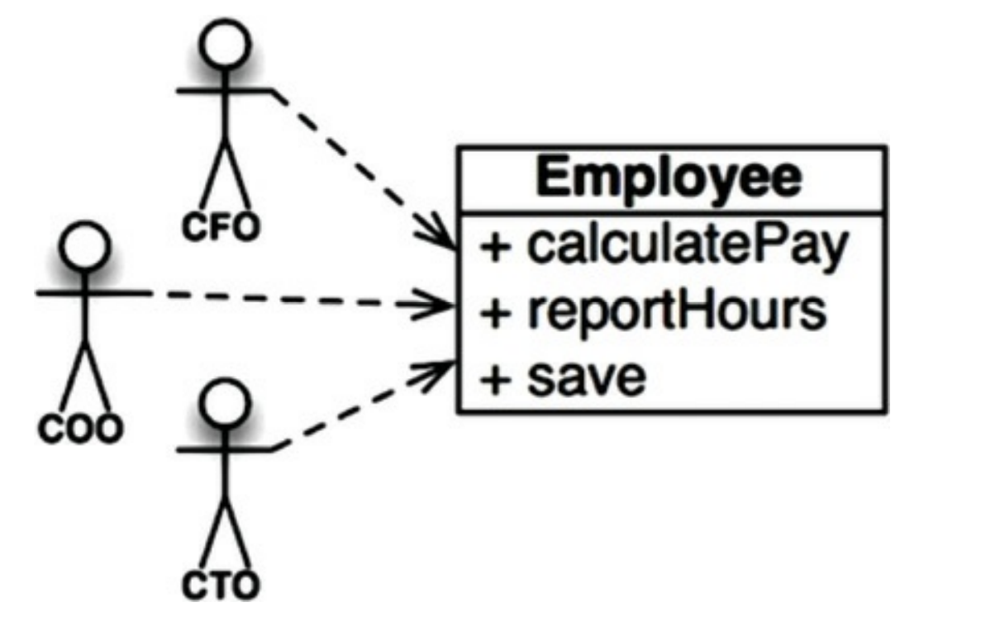

This class is a violation of SRP as the three methods adhere to different actors:
 * `calculatePay()` adheres to requirements specified by the accounting department
 * `reportHours()` adheres to requirements from the HR department
 * `save()` adheres to requirements from the DBAs

With such a structure, here's an example bad scenario:

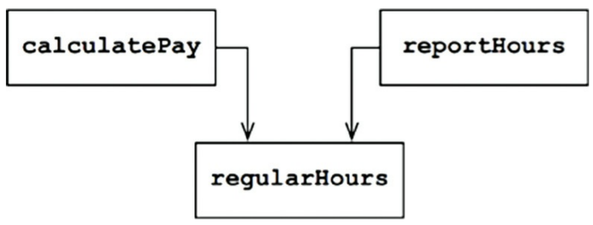


`reportHours()` and `calculatePay()` use the same shared function `regularHours()` which mandates the calculation of a user's regular hours.

If the HR department wants to change the way the regular hours are calculated, one might go to this class, change the shared function, carefully test it and satisfy the new requirements laid out by HR.

However, since this function is also used by the `calculatePay()` method, which is used by accounting, you've accidentally changed the way regular hours are calculated from an accountant's perspective, resulting in wrong documents, which can lead to huge liability risk and/or incident expenses.

### Symptom 2: Merges
If there's a merge conflict since two developers, possibly from different teams, have changed the same source file, then this probably indicates a violation of SRP.

If a class adheres to a single actor, developers from different teams shouldn't have a need to modify the same file.

### Solutions
An example solution to this problem is to separate the functions from the data:

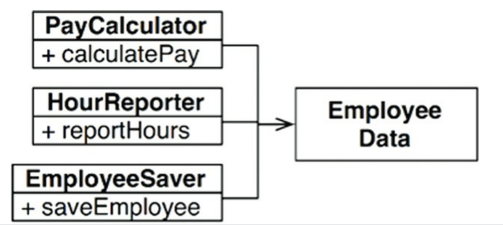

This way, there is a single data structure class `Employee`, which is used by three different classes, adhering to different actors.

The problem with this approach is that we now have to keep track of instantiating three more classes, instead of focusing on instantiating a single class.

This problem can be alleviated by using the `Facade` pattern:

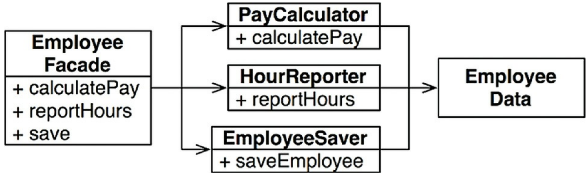


## The Open-Closed Principle
> A software artifact should be open for extension but closed for modification

In other words, a software component should be extendible without having to modify that component.

Why is this important?

If small extensions in requirements force massive changes throughout the codebase, then there is clearly an architectural issue.
The purpose of this principle is to guide you in designing your system in a way that extensions to requirements can be satisfied by adding additional code, not by changing existing code.

### A thought experiment
Say we are given a system that displays a financial summary on a web page.
Stakeholders come and want us to extend the system to support printing the same info on a PDF to be printed.

A good architecture would allow this to be achieved by only adding additional code, not changing existing code.
A side-note here is that, of course, some code will have to be changed - e.g. the wiring-related code which creates class instances, but that should be a small, isolated part of the system.

This can be achieved by properly separating things that change for different reasons (SRP) and properly organizing dependencies between these components (DIP).

The provided solution is:

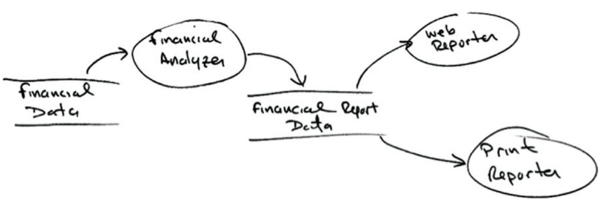


The main insight is that the classes responsible for calculating the data need to be different from the classes displaying it.
Additionally, the source code dependencies need to be organized in a way that changes to one of these responsibilities doesn't cause changes in the other one.

The full design of the system:

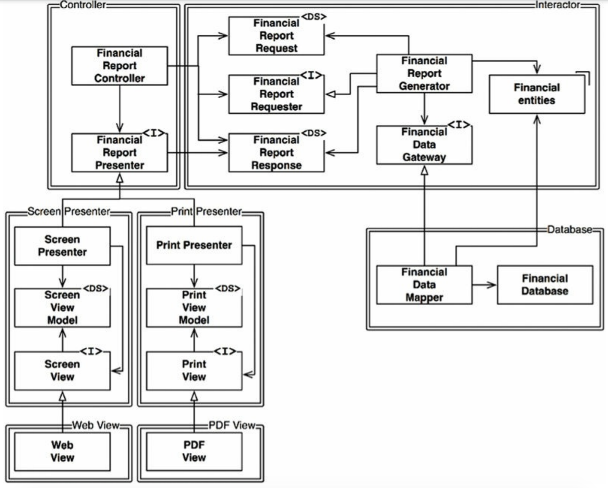


One thing to notice is that all dependencies between components are unidirectional:

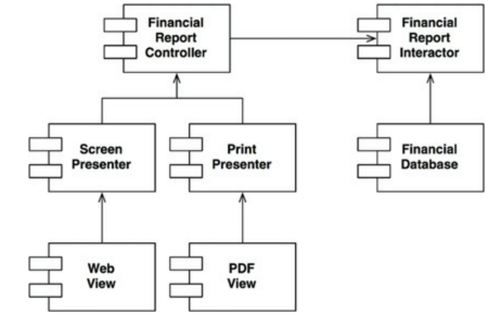


The higher-level components (e.g. Interactor) know nothing about the lower-level components which implement the higher-level interfaces.
If we want to protect a component A from changes in component B, then component B should depend on component A, not the other way around.

In this diagram, the Interactor is the highest-level component, which holds the business rules. It should be protected from changes in any other component.
The Controller, on the other hand, is dependent on the Interactor, but is protected from changes in the Presenters and the Views.

This dependency chain should flow from the highest-level components to the lowest-level ones.

## The Liskov Substitution Principle
The gist of this principle is that if there is an object T, all objects that inherit that one should be interchangeable - the other parts of the program shouldn't change their behavior.

### Guiding the use of inheritance
A good example of a structure conforming to LSP:

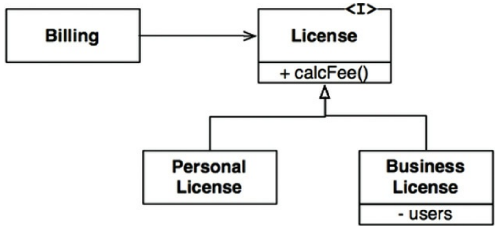

The `Billing` component does not depend in any way on what specific fee calculation is used, although it varies by specific subtype.

### The Square/Rectangle Problem
A classical bad example of LSP violation:

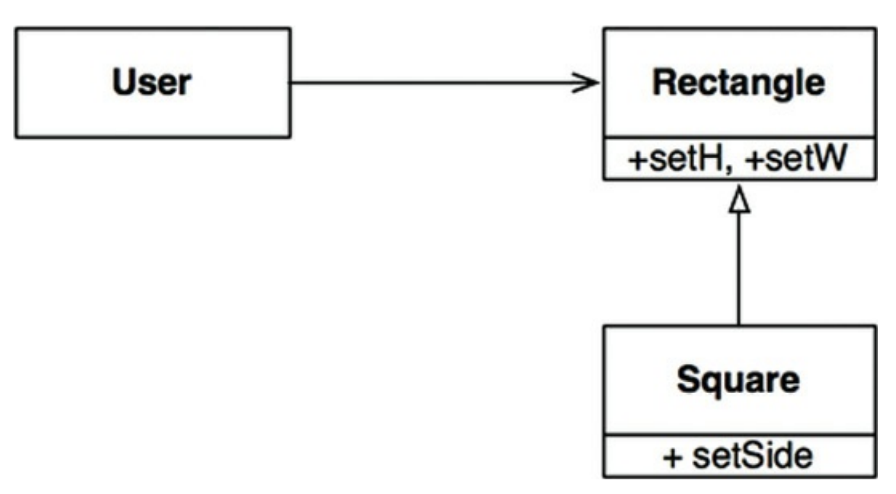

In this example, the `Square` is not a proper subtype of `Rectangle` as its height and width are not independently mutable, unlike the rectangle.

Since the user believes they are communicating with a rectangle, they could easily make an error:
```java
Rectangle r = ...

r.setW(5);
r.setH(2);
assert(r.area() == 10);
```

The only way to guard themselves, the user has to type-check whether the `Rectangle` is a `Square`.
Since the behavior of the user depends on the types they use, these types are not substitutable.

### LSP And Architecture
In the beginning, LSP was used as a guiding principle for designing subclasses.

With time, it also became acknowledged as a principle applicable to high-level software design.
The interfaces in question, need not explicitly be (e.g.) Java interfaces. They can be a set of classes conforming to a REST API.

The best way to understand LSP from the eyes of the architect is to see what happens when the principle is violated.

### Example of LSP Violation
Suppose you have a taxi dispatch aggregator, which can order a taxi on a user's behalf on a single platform, regardless of specific taxi company.

This can be implemented by having the taxi companies conform to the following REST API:
```
purplecab.com/driver/%s/pickupAddress/%s/pickupTime/%s/destination/%s
```

However, a new taxi company is onboarded and they have a different Rest API and you have to implement support for it.

Hence, you will have to have a special rule for that specific taxi company when routing the dispatch request.
This can be implemented by an if statement, or if you're an architect worth their salt, you'd create a specific dispatch configuration module which will host these special rules:


This violation of LSP has forced us to implement such complex mechanisms to handle the situation where the APIs of the taxi companies do not conform to the same Rest API.

## The Interface Segregation Principle
This principle derives its name from the following diagram:

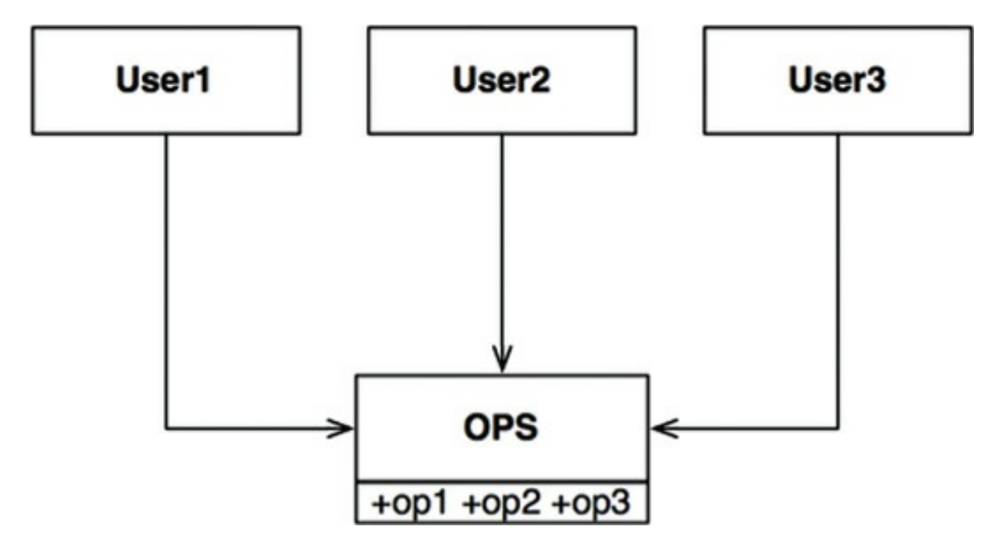

The problem with this structure is that `User1` only uses `op1`, `User2` only uses `op2` and `User3` only uses `op3`.
Yet, they all depend on the rest of the operations as well.

This is problematic because a change in `op2` and `op3` would force `User1` to recompile & redeploy his code, although he doesn't care about those changes.

If this is segregated into interfaces, this is how the diagram looks like:

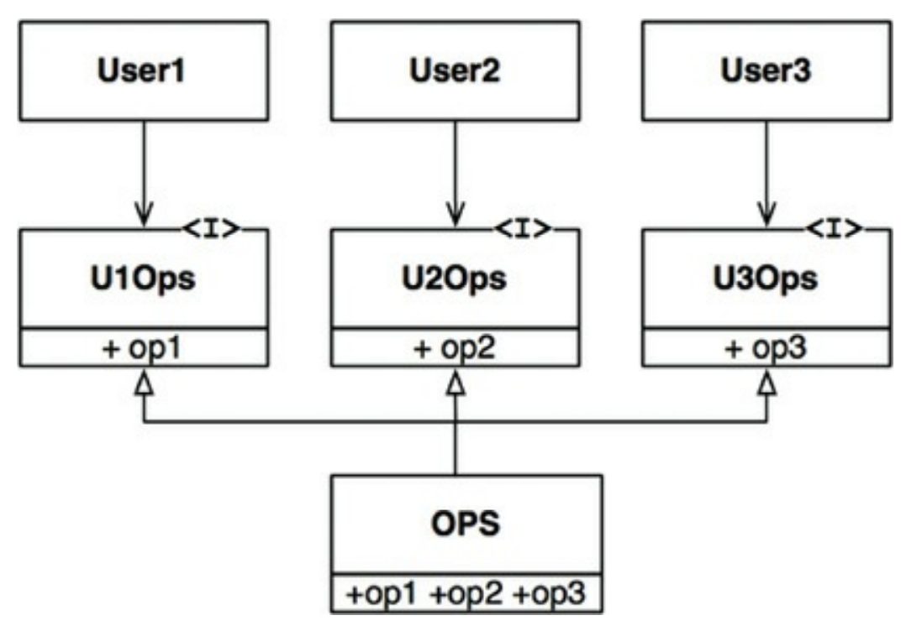

Note that there is still only one class that implements all three operations, but now, each user only depends on the interface they need.
Hence, a change in `OPS`, which `User1` doesn't care about won't force `User1` to recompile & redeploy.

### ISP and Language
In terms of programming language, there are some differences in how this principle is applied.

In statically-typed languages, implementing interfaces means there is a source-code dependency of the class to the interface.
In dynamically-typed languages, such a source code dependency doesn't apply.

Hence, one might conclude that this principle is a language issue, rather than an architectural issue.

### ISP and Architecture
There's a deeper concern lurking in here.

This principle can be generalized as "you shouldn't depend on modules that contain more than you need".
This is true in terms of source code dependency as this can force recompilation & redeployment, but it also applies at an architectural level.

Consider the following system:

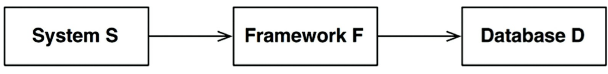

In this example, system S depends on framework F, which uses a particular database D.

Now, database D probably has certain features which F doesn't need and S doesn't care about.

Hence, a change in any of these features will force a redeployment in F, leading to a redeployment in S.
What's worse, a failure in one of these features in D may cause failures in both F and S.

The conclusion is that depending on something which carries baggage you don't need can cause you troubles that you didn't expect.

## The Dependency Inversion Principle
What this principle entails is that a stable module has source code dependencies only on abstractions, rather than concretions.

In statically-typed languages, for example, this means that no `import`, `use` and `include` statement should refer to concrete classes. Only abstract classes and interfaces.

This is unrealistic to achieve as, for example, you have to depend on concretions such as `String`, for example.
However, classes like these rarely change and if they do, that is strictly controlled by the language developers.

Hence, we tend to ignore this principle for standard library and platform modules.

Where this principle applies is in depending on **volatile** modules - those which are actively developed. 
Typically, those are the custom modules created in our project.

### Stable Abstractions
The reason for following this principle is that abstractions tend to be stable & rarely change.
Concrete classes, on the other hand, change quite often but rarely do those changes cause changes in their interfaces.

This is why, depending on abstractions will lead you to create more stable components that change less often.
At the other extreme, a change in a low-level module might propagate changes in all other modules in the system.

This principle boils down to a very specific set of coding practices:
 * Don't refer to volatile concrete classes - refer to abstract interfaces instead.
 * Don't derive from volatile concrete classes - this is an extension to the previous practice and is especially important in statically-typed languages. Inheritance is a very rigid & strong source code dependency. Much stronger than e.g. composition.
 * Don't override concrete functions - concrete functions carry some source code dependencies with them. When you override them, you don't remove them. Instead, you inherit them. To manage this, you should make the function abstract and create multiple implementations
 * Never mention the name of anything concrete and volatile

### Factories
To comply with these rules, there must be special handling for initializing concrete instances of low-level objects.
This is necessary as creating a concrete instance requires a source code dependency.

This problem is typically solved by using abstract factories.

Example:

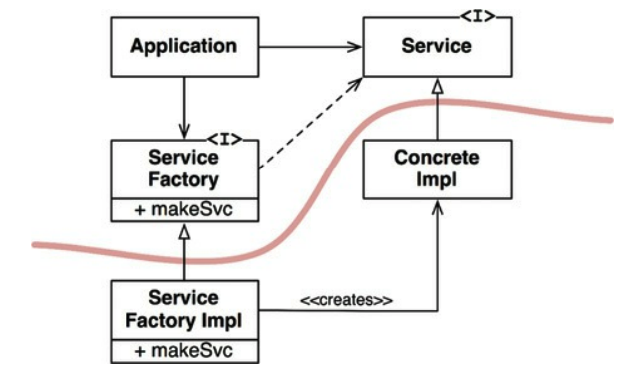

Note that the flow of control is opposite to the source code dependencies - i.e. control flow goes from `Application` to `ConcreteImpl` although it is `ConcreteImpl` which has a source code dependency on the `Application`'s module
This is why this principle is referred to as dependency inversion.

### Concrete Components
Although DIP is applied here, there will be a necessity for a module which instantiates `ServiceFactory` to `ServiceFactoryImpl`. This is inevitable and expected.
However, we should keep the number of such components as low as possible. Typically, this wiring is done in the main function.

This can also be achieved by relying on a dependency injection framework.

