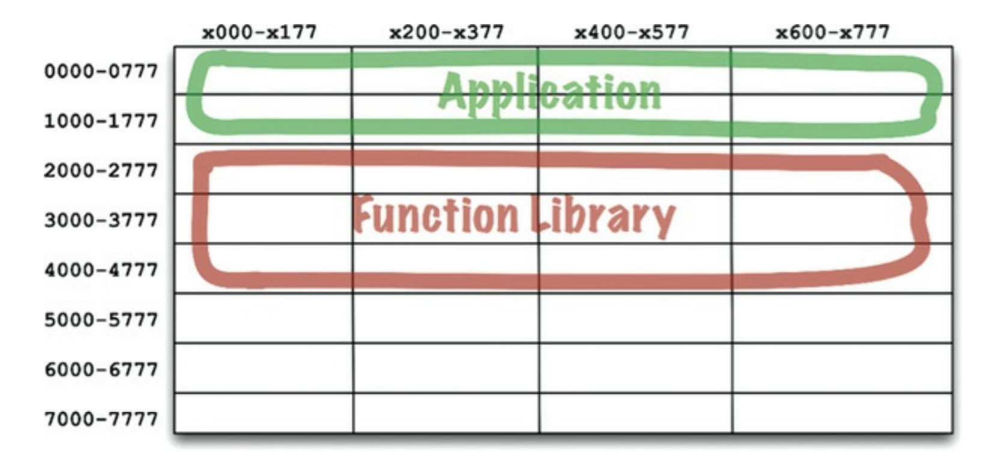
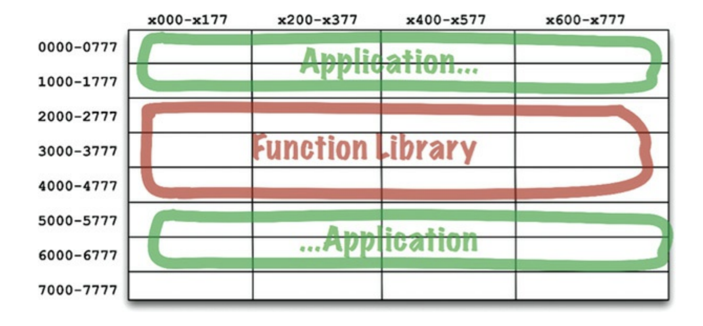
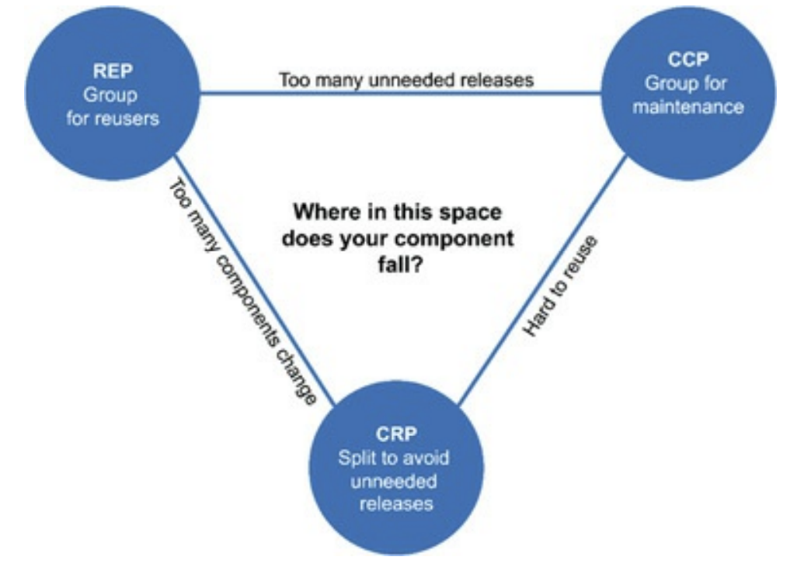
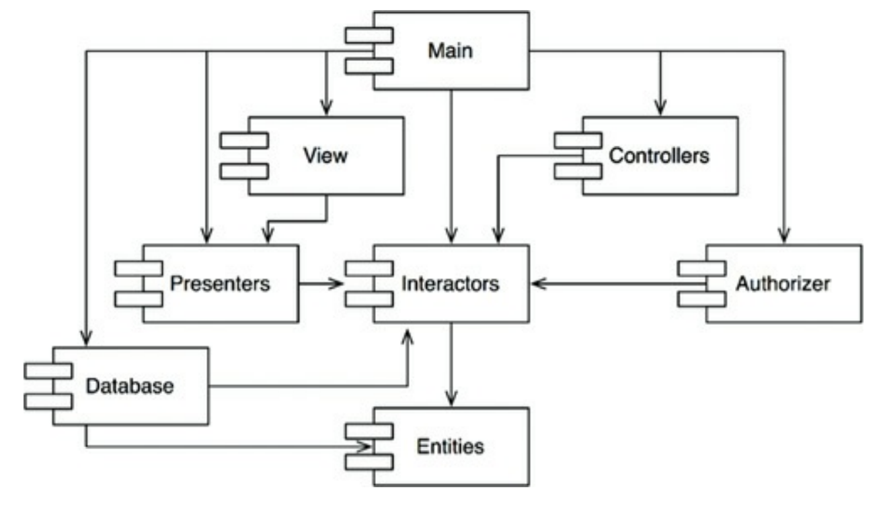
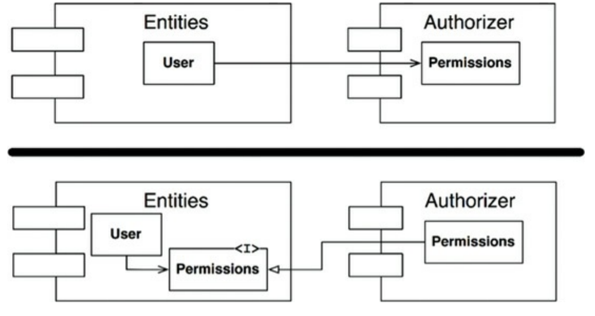
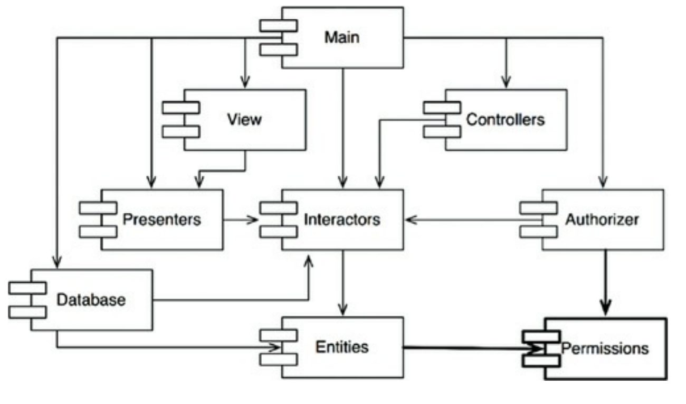

# Part 4 - Component Principles

If the SOLID principles tell us how to arrange the bricks into walls and rooms, then the component
principles tell us how to arrange the rooms into buildings. 

Large software systems, like large buildings, are built out of smaller components

## Components 

Components == units of deployment

The smallest entities that can be deployed as a single unit. Examples - jar file, DLL, shared library, etc.

They can be combined into single binaries or kept separate as plugins to other binaries.
Whatever the use-case, good components always retain the ability to be independently deployable and, hence, independently developable.

### A brief history of components
Initially, library code and application code was shipped as a single binary.
Additionally, developers had to decide where to store the different sections of their programs in memory.

The following scheme was used:

There were some hardcoded addresses for library code and for application code.

The necessity for this was due to the fact that memory was slow and expensive at the time and compilers didn't have the means necessary to store the entire source code in memory.
Hence, they were doing this to ensure that library code could be compiled separately from application code & not recompiled together with application code.

Otherwise, compilation times were enormous.

And if the application code grew too big, this lead to fragmentation:

Hence, at this point, programmers had to manually adjust memory locations to avoid fragmentation & allocate enough space for library/application code.

### Relocatability
The solution was in automating the memory allocation for their programs.

This was achieved by adjusting the compilers not to output direct memory addresses, but instead - output relocatable binaries.

These binaries had some "hints" for a program called smart loader about where different parts of the program should be stored in memory.
But the smart loader was responsive for setting the correct memory locations based on application size & its "hints".

Additionally, if some function reference was never used, the loader didn't include it in the final binary.

Finally, if an application references a library function, the compiler emitted an external reference of that function.
And the compiled library emitted an external definition of its available functions.

It was the smart loader's job to get an external reference and substitute it for the specific address where the external definition was loaded.

### Linkers
At some point, the smart loaders became too slow to tolerate as programs became bigger.

The reason was that the linking component of it was very slow.
That's why programmers divided the loader into a linked and a loader.

The linked was responsible for outputting a relocatable binary and the loader could then quickly load it into memory.

This way, if your source code was already compiled & linked, the deployment of it was very quick.
It would only be slow if you had to recompile it again.

Despite these improvements though, in the 1980s programs started become quite big again and we were experiencing huge compile/link times again.

Loading time was fast, but compile/link time was the bottleneck.

We were experiencing Murphy's law of program size:
> Programs will grow to fill all available compile and link time.

However, there came Moore who said that we'll experience exponential growth in hardware capacity over the next years.
And that did happen, which lead to a situation where the hardware capabilities outpaced programmers' ambitions for program size.

Computers and devices had gotten so fast that linking could once again be done at load time.
This enabled the rise of component plugin architecture.

Previously, it was unthought of due to the cost of linking. But now, it was once more in reach as link times were fast again.

## Component Cohesion
Which classes belong to which components?

This is an important decision guided by several principles:
 * REP - The Reuse/Release Equivalence Principle
 * The Common Closure Principle
 * The Common Reuse Principle

### The Reuse/Release Equivalence Principle
> The granule of reuse is the granule of release

The gist of this principle is that in order for a component to be reused, it has to be tracked through a release process and assigned release numbers (versions).

This is done so that clients of a component know what version of that component they're using and decide if they should upgrade to the new version based on the changes in it.
Additionally, without release numbers it would be impossible to ensure that the reused components are compatible with each other.

From an architect's point of view, this principle means that classes which are part of a component should be part of the same cohesive group.
The component cannot simply consist of a random set of classes and modules. Instead, there must be some overarching theme or purpose for them.

For example, the `java.util.concurrent` is a component which contains classes with the overarching theme of providing concurrency primitives & collections.
A bad example would be a component which contains several different kinds of classes which are unrelated in function.

### The Common Closure Principle
> Gather into components those classes that change for the same reasons and at the same times. 
> Separate into different components those classes that change at different times and for different reasons.

This is a high-level version of the Single Responsibility Principle.
For most applications, maintainability is more important than reusability. This principle guides one's codebase towards the former at the expense of the latter.

Why?
Because you would prefer the changes for e.g. implementing a new feature to be concentrated in one component, rather than being scattered across the entire codebase.

If changes are confined in a single component, then we only need to revalidate and redeploy that component, not the entire system.

This principle is related to the Open-Closed Principle - classes should be open for extension and closed for modification.

100% Closure is not attainable, but you can at least design your classes to have closure for the most common reasons to change which you are aware of.
CCP helps you achieve that by gathering in the same component those classes which are likely to change for the same reason.

CCP and SRP can both be summarized the following way:
> Gather together those things that change at the same times and for the same reasons. 
> Separate those things that change at different times or for different reasons.

### The Common Reuse Principle
> Don't force users of a component to depend on things they don't need.

CRP states that classes that tend to be reused together should reside in the same component.

Reusable classes are seldom used in isolation. They are typically reused together with other classes.

For example, collection classes are typically reused with the collection's associated iterator.
Such classes belong in the same component, according to CRP.

Why?
Because if e.g. you have your iterators and collections in different components, you will need to depend on two separate components, than on one component only.
This will lead to more frequent redeploys/recompilations of your component as it has dependencies on two components, instead of one.

What's more, CRP tells us which classes should not be together in a component.
When one component uses another a dependency is present. Even if you are only using one class from a component, you are still dependent on the entire component.
Due to this, whenever the used component is changed, that would cause changes in the using component as well.

Hence, we want to make sure that the classes put together in a component are inseparable.
Otherwise, we will have to redeploy our components due to changes we don't depend on and don't care about.

CRP is the component-level version of the Interface Segregation Principle.
ISP suggests that we don't depend on classes with methods we don't need.
CRP suggests we don't depend on components with classes we don't use.

### The tension diagram for component cohesion
These three principles are exclusive to one another - you cannot satisfy all three of them.
At most, you can satisfy two.

The edges in the diagram show the cost of abandoning the principle in the opposite vertex.

 * If you Adhere to CCP and REP, you will have a package which contains classes with the same reason to change and the package will be reusable via release numbers.
   * But that doesn't mean that the components inside are typically used together (CRP). Hence, dependent packages will have to often be redeployed together
 * If you adhere to REP and CRP, you will have a releasable package with classes, which tend to be reused together.
   * But changes in the system will touch too many components all at once
 * If you adhere to CCP and CRP, ??? - I have a lot of unanswered questions regarding this chapter, so I'll complete the notes after follow-up research

Typically, you strive towards one edge of that tension diagram based on the phase in which you're project is at.

In the beginning, it is typically beneficial to focus on CCP in order for the project to be easily maintainable.
In the future, you can shift the project to be reusable in order to e.g. be more easily used by other teams in the organization.

## Component Coupling
These next principles deal with relationships between components (i.e. dependencies)

### The Acyclic Dependencies Principle
> Allow no cycles in the component dependency graph

This principle states that you shouldn't have any cyclic dependencies between components. In Golang, for example, this is not possible as the language prohibits it altogether.

Why is this a problem?  
Because it leads to "the morning after" syndrome" - you make some changes in the evening, go home and the next morning, your code no longer works.
This happens because someone has stayed later than you that evening & changed components you depend on.

Here are some solutions to this problem.

#### The weekly build
The developers ignore each other for a week & develop in isolation. When the end of the week comes, there is an "integration cycle", where someone is tasked to integrate all the pieces together.

The problem with this approach is the large integration time overhead.
And this overhead grows as the project and team grows.

#### Eliminating dependency cycles
An alternative is to partition the development environment into releasable components.

When a team/developer gets a component working, they release it with a version number & the rest of the teams can now use it.
The other teams can decide whether they will use the new component immediately, or stick to the old version for a while.

This is efficient but in order for this mechanism to work, there must be no cyclic dependencies across components. Otherwise, the "morning after" syndrome is unavoidable.

A good example of acyclic dependency graph:

This depedency graph has no cycles - it is acyclic.

In this scheme, the developers of the `Presenters` component don't care at all about the `Main` component. It has no effect on the rest of the system.
On the other hand, they consider the versions of `Interactors` and `Entities` they prefer to use and stick to them. No need to involve the developers of any of those components.

#### The effect of a cycle in the component dependency graph
If a cycle is introduced, say by making a dependency of `Entities` to `Authorizer`, then the `Entities`, `Authorizer` and `Interactors` become one big indivisible component.
In our example, a cycle appears by making the `User` class in `Entities` use the `Permissions` class from `Authorizer`. 

Now, developers have to carefully coordinate what version of each component they are using and the morning after syndrome is unavoidable.

Additionally, if you want to test the `Entities` component, you now have to depend on the `Authorizer` and `Interactors` as well.
This leads to unit tests where you have to import a bunch of unrelated libraries/components in order to set up your tests.

In sum, having cycles in the dependency graph makes independent development of components and testing very hard.

#### Breaking the cycle
The above specific problem, we encountered, can be solved in the following way:
 * Apply the Dependency Inversion Principle (DIP) - create an interface, which has the methods the `User` needs. This interface can be placed in `Entities` and the class from `Authorizer` inherits it.
   * This way, the dependency is inverted and the DAG property of the dependencies is maintained

 * Create a new component, which both `Entities` and `Authorizer` depend on.

#### The "Jitters"
As requirements change, your dependency graph changes accordingly.
In order to maintain the DAG property, you should set up some monitoring in place to check whether new cycles have reappeared.

### Top-down design
The problem we discussed so far leads to the conclusion that the component structure cannot be made top-down - ie starting with the high-level architecture towards the low-level classes.
Instead, the structure evolves as the system grows and changes.

The dependency graph is not something describing the functionality of an application.
What it helps us see is the **buildability** and **maintainability** of an application.

Hence, you can't desing the dependency graph before you have any classes to maintain. 
Attempting to do so would be rather hard as you don't know about any common use-cases of the system yet in order for you to e.g. apply the Common Closure Principle.

Typically, the way all these principles so far are applied is:
 * First, the CCP and SRP principles come into play to structure your components into the known use-cases which tend to change often
 * As the program size grows, we start becoming more concerned about extracting reusable components to avoid duplicate efforts. At this point, the Common Reuse Principle is typically applied
 * Finally, as dependency cycles appear, the Acyclic Dependencies principle is applied in order to keep the developability of the system at a high level

One overriding concern, however, is to separate the volatile components from the non-volatile ones.
E.g. the GUI is a volatile component which often changes, while the high-level application policies is a non-volatile component.

Changes in the GUI should not have an effect on the high-level application policies.

The next principle helps us tackle this problem.

### The stable dependencies principle

