# Part 5 - Architecture

## What is architecture?

First of all, software architects are programmers, some of the best actually.  
They may not write as much code as everyone else does, but they do continue engaging in programming tasks.

The architecture of a system is its shape - the way the application is decomposed into components & the way those components interact with each other.

**The purpose of architecture is to make it easier to develop, maintain, deploy and operate the application. It is not to make the application work.**

### Development

A software system which is hard to develop is not likely to have a long and healthy lifetime.
Hence, the architecture of a system should make it easy to develop for the owning teams.

Very often, when a system is developed by a small team, the team decides to not invest in building proper interfaces and superstructures to avoid the impediment of one.
This is likely the reason why so many applications lack a good architecture these days.

### Deployment
To be effective, a software system has to be deployable.

Higher cost of deployment => the system is less useful.

This is often problematic in typical codebases as a deployment strategy is not considered in the early days of a project.
This can lead to e.g. someone making a "micro-service" architecture, but without a good means of deployment, it is hell to make all the services synchronize & communicate together.

### Operation
The impact of architecture on system operation tends to be lesser than the impact on the other paramenters.

Any operational problem can be tackled by throwing more hardware at a problem without that impacting the system's architecture.

Due to this, architectures that impede operation are less costly than architectures that impede developability and deployability.
The reason is that hardware is cheap, but people are expensive.

This is not to say that architecture which aids operation is not desirable. But it is to say that the cost equation leans more towards the other parameters.

### Maintenance
Of all aspects of a software system, maintenance is the most costly.

The never ending flow of new features and the inevitable trail of defects consumes vast amounts of man hours.A

The cost of maintenance is expressed in the time it takes to determine the best place for a new feature and the risk associated with adding it.

A good architecture greatly mitigates these costs. When components have stable interfaces and proper boundaries, ambiguity and risk will be reduced.

### Keeping options open

The goal of an architecture is to make a software system flexible.

That can be achieved by "keeping options open".

Every software can be decomposed into two distinct sections - business rules and details.

Examples of details are:
 * What database will be used
 * Is this a web server/GUI application/Sprint application, etc
 * Is it using a dependency injection framework

A good software architecture should defer making the decision whether any of these technologies will be used to as late as possible.

The longer you defer making any of these decisions, the more information you have whether you actually need them.

> A good architect maximizes the number of decisions not made

### Device independence
The author shares an example of not following this approach from the 1960s, when he wrote software which was heavily device specific.
Once they had to migrate the software to a different device, that operation was extremely difficult as all the code had to be rewritten for the new device.

In the end, the programming society has learnt its lesson by abstracting away the specific devices being used behind an operating system interface.

### Junk Mail
Here, the author shows a constrasting story to the previous one in which he worked for a company, which had to print junk mail on a particular medium.
At some point, they had to change the medium and since they were using the OS interface for interacting with the external device, they were able to migrate seamlessly.

And the value of "keeping options open" was enormous as the new medium saved the company a lot of time and money, and it was achieved with insignificant development effort.

### Physical addressing
The author goes on to share yet another story about how he worked on a project, which didn't follow the advice in this chapter and things weren't going well.
I've omitted this one for brevity.

## Independence
As already stated, a good architecture must support:
 * The use cases and operations of the system
 * The maintenance of the system
 * The development of the system
 * The deployment of the system

### Use cases
One of the architect's top priorities is to support the use cases of the system.
If you're making a shopping cart application, the architecture should support shopping cart behavior.

But architecture is not about behavior, as already mentioned. However, it should expose the behavior so that it is visible at the structural level.
A shopping cart application should look like a shopping cart application when you look at it from a bird's eye view.

### Operation
One of the goals of the architecture is to support the scaling needs of the application.
If the application needs to process a lot of data, then the architecture should support that operation.

However, a good architecture should leave this option open - if an architecture is good, it an easily be migrated from a monolithic structure into a micro-service architecture, for example.

### Development
Architecture plays a significant role in supporting the development environment.

A system operated by many development teams should be aided by an architecture, which enables these teams to work in parallel, independently.

### Deployment
Architecture plays a significant role in the deployment process of a system.

A good architecture, supporting deployment, doesn't require manual file/directory creations or various config file tweaking.
This is achieved by properly partitioning and isolating the different components of the system.

### Leaving options open
One of the hardest parts about designing an architecture which satisfies all these conditions is that we often don't have knowledge of the use cases and/ro scale which the system has to support.

This is why it's crucial that the architecture enables the system to be easy to change.

### Decoupling layers
The architect doesn't know the use cases of the system but wants to support them all.
However, one does know the basic intent of the system - e.g. it's a shopping cart application.

Hence, the architect can employ SRP and CCP to collect the things that change for the same reason.

There are also some obvious components, which should be separated from the business rules - UI, database, schema, etc.
All these are technical details, which should be decoupled from the rest of the system.

### Decoupling use cases
Use cases also change for different reasons among themselves. Use cases are a very natural way to divide the system.

They are thin vertical slices which use different parts of our horizontal layers.
Hence, we need to keep the horizontal layers decoupled from each other on the vertical as well - e.g. the UI for the "add-order" use case should be separate from the "delete order" use-case UI.

### Decoupling mode
Some of the use cases we talked about so far might have different operational needs than others - they might need to run at higher throughputs.

Since we decoupled those use cases from one another, we can now independently scale them as needed - e.g. we could separate a particular use-case in a separate micro service or process.

### Independent develop-ability
So long as the use cases & horizontal layers are separate from each other, the system will support independent developability via multiple teams.

E.g. the UI team need not know anything about how the business rules are implemented and vice versa. What's more, one could separate the system further per use case.
The team of use case X doesn't know or care about the team of use case Y.

### Independent deployability
By separating the use cases in this way, we can also achieve a higher degree of deployability.

For example, if there is a change in a particular use case, that can be deployed independently without causing the whole system to have downtime.

### Duplication
There are two kinds of duplication - real and accidental.

Real duplication is the one we are honor-bound to avoid by e.g. extracting a common function.
However, there is also accidental duplication - it is duplicated code, present in separate use-cases which can be reused.
This kind of duplication should not be addressed by reusing it.

The reason is that although the two components have a similar structure and/or code, they change for very different reasons.
Hence, although they look similar now, they will likely diverge a lot in the future.

Reusing a common function/component which changes for different reasons violates SRP and will lead to maintenance issues.

Same goes for reusing data structure which look similar - e.g. one could directly pass the database data structure to the UI since the view model looks the same as the model.
This should be avoided as this is also accidental duplication. Addressing it will lead to coupling between components which change for different reasons.

### Decoupling modes (again)
There are many ways to decouple layers and use cases. They can be decoupled at the source code/binary or even service layer:
 * Source level - we can control the dependencies we use in our source code so that changes in a component doesn't lead to changes in an unrelated component, which is in the same address space
 * Deployment level - we can control the dependencies between our deployment units (e.g. jar files) so that changes in one component don't lead to redeployment of unrelated components.
 * Service level - We can reduce the dependencies at a minimum and eventually make separate components execute in different binaries and reside in different source trees

Which decoupling mode to use is based on what needs our system has. Those needs can change as time passes.
A good architecture should allow for migrating to a different decoupling mode if there is need for it.

A modern approach to this is to start from the service level decoupling from the very get-go. This is a bad approach as service level decoupling leads to a lot more maintenance, development effort & wasted network cycles.

Instead, a system usually starts from a monolith, keeping options open as it has clear boundaries between unrelated components.

And, if need be, it can grow into decoupled deployment units and eventually - separate services.

### Conclusion
The decoupling mode is one of those things which can change over time and a good architecture should setup the system to easily change the mode if necessity comes.

## Boundaries: Drawing Lines
Software architecture == the art of drawing lines, called "boundaries"

Boundaries which are drawn early are for the purposes of deferring decisions for much later in order to prevent those decisions from polluting the core business logic.
One of the main reasons development slows down as a project evolves is because of the coupling of the project with early decisions.

### A couple of stories
The first "sad story" being told is about a company which had a successful GUI application & clients wanted a web version of it.
To accomplish this, the developers decided to create a complex "three-tier architecture" which was meant to live in multiple servers.

This complicated development tremendously as any message had to be marshalled/unmarshalled multiple times & there was, in general, a lot of overhead.

In the end, the company never utilized server farms and sold their solution as a single-server application. The overdesign was unnecessary.

Another sad story being told is about a company running a small taxi-like business, managing fleets of cars. They hired an "architect" to help with their software.
The guy decided, off of the get-go, that what this company needed was a full-blown enterprise-level service-oriented architecture.

Needless to say, this whole effort consumed tremendous amounts of people hours for an unneedlessly complex system.

Finally, a good example of a story is given about developing "FitNesse" - a project created by Uncle Bob and his son for managing acceptance tests.
Early on, they drew boundaries between the core business rules and the database layer.

Since their needs initially were small, they used a mock database, which simply stubbed the methods altogether.
Eventually, they needed some form of persistence, so they wrote an in-memory "database" for a short amount of time, which comformed to the interface they needed.

Finally, when they had to achieve persistence, they wrote a component to store the data in flat files, since they decided that they don't need MySQL for now.
And they never did, eventually.

This way of scaling the system iteratively saved them a lot of headaches around dealing with a real database and the way they had architected their system allowed them to defer decisions for a lot later.
And when the time to migrate came, the migration was extremely easy as the database layer was independent from the business rules.

### Which lines do you draw and when do you draw them
Lines should be drawn between things that matter and things that don't.

The things that matter are the business rules. The things that don't are all technical details such as the GUI or what database is being used.

Example:


At a higher level, this is how this component looks:


Note that the database knows about the business rules, but not vice versa.
This means that the database can be changed with whatever is necessary, without that having an effect whatsoever on the business rules.

### What about input and output?
The IO is irrelevant. The customers often just see the GUI and think that the application is the GUI, which is wrong.

The GUI is merely a means to visualize the data managed by the core business rules.


### Plugin architecture
Putting this altogether, what we are creating is a plugin architecture - a system which allows third-party plugins to be embedded in the system without changing the rest of the system.
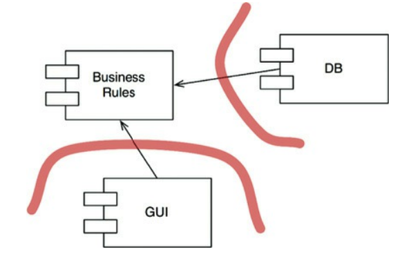

Because the database and the GUI are plugins in this architecture, they can easily be changed to whatever:
 * MySQL, Oracle, NoSQL, etc for the database
 * Web-based, CLI, Desktop app, mobile, etc for the GUI

### The plugin argument
An analogy is how Visual Studio works with ReSharper - both tools are developed by different teams, working in very distant countries.

And yet, both tools integrate together quite well. This is because Visual Studio supports plugin architecture.

What's more Visual Studio is immune to any problems caused by the ReSharper team due to the direction of the dependencies:

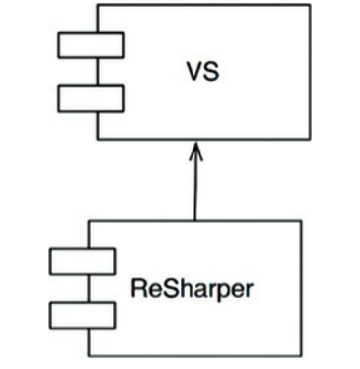

On the other hand, if Visual Studio collapses, the ReSharper team will be seriously affected.

This is how we want to structure the dependencies between our components as well.

We want our business rules to not be dependent on database/gui/etc.
It should be the other way around.

In sum, boundaries should be drawn between components which change at different rates and for different reasons.
This is the Single Responsibility Principle, applied to architecture.

## Boundary Anatomy
Architecture of a system == set of components + boundaries between them

This chapter focuses on the most common types of boundaries.

### Boundary crossing
Boundary crossing == function on one side of a boundary calling a function on the other side of a boundary and passing along some data

The trick to creating good boundary crossings lies in appropriately managing source code dependencies.

The reason source code dependencies matter is because changing source code leads to recompilation and redeployment.
Managing and building firewalls against these changes is what boundaries are all about.

### The dreaded monolith
The simplest way of structuring an application is in a single monolithic binary - be it an EXE file, a statically linked C/C++ binary, a java JAR, etc.

In these applications, boundaries still exist, but they are at the source code level. From a deployment's perspective, there is a single binary, regardless of internal boundaries.

Even so, making appropriate boundaries is still valuable as this enables easier testing & developability of different components (in other words, different teams can focus on different parts of the system).

For example, without appropriate boundaries, a high-level component will have to depend on low-level components:


If an appropriate boundary is made, the low-level component will depend on the high-level one, allowing different teams to focus on different parts of the system:


### Deployment components
The simplest physical version of an architectural boundary is a dynamically linked library - e.g. DLL files, JAR files, Unix shared library.

Deploymeny doesn't involve compilation. Instead, the components are delivered in binary form. They are typically bundled in a conveninent form, eg. an archive.

Other than that deployment specific, deployment-level decoupling is the same as the monolith-level of decoupling. The functions generally all exist in the same address space.
The strategies for segregating the components and managing their dependencies are the same.

### Threads
Threads are not architectural boundaries. They are a way to organize and schedule the order of execution.
Both monoliths and deployment components can leverage threads.

### Local processes
A stronger architectural boundary is the local process.

Local processes run in the same processor space, but are not running in the same address space.
Typically, the processes do not share memory, although that is possible.

From an architectural perspective, the same rules apply when defining dependencies between local processes.
Lower-level processes have to depend on higher-level processes, not the other way around.

The goal is for lower-level processes to be plugins to the higher-level ones.

One thing to consider in addition to this is that communication between local processes has moderate overhead, meaning that one should be careful when making external calls.

### Services
Services are the strongest level of boundary. Services assume that they are running in independent process and address space & all calls to other services are network calls.

Communication across service boundaries are very slow compared to normal function calls or local process communication. Communications at this level must deal with high levels of latency.

Other than that, the same rules apply here as for all other architectural boundaries.

### Conclusion
Most applications use several forms of boundaries, not just one type. Hence, one must often deal with all boundary types which were enumerated thus far.

## Policy and level
Software systems == statements of policy.

Applications are merely detailed sets of policies which govern how input data is to be transformed into output.

Software architecture is partly about effectively grouping and separating policies based on the way they change.

In any case, low-level policies should depend on high-level ones.

### Level
Definition of level == distance from inputs and outputs

The farther a policy is from the inputs and outputs, the higher-level it is.

Structure of a simple encryption program:


An incorrect way to structure this program would be:
```
function encrypt() {
    while(true)
        writeChar(translate(readChar()));
}
```

This is incorrect as the high-level `encrypt` function depends on the lower-level `readChar` and `writeChar` functions.

A better approach would be:


The reason this approach is better is because the low-level IO-related components are separated from the higher-level policy.

This allows the components to change in different rates and for different reasons.

## Business rules
We are dividing our application into business rules and plugins.

What are business rules - rules or procedure that make or save the business money.
They don't have to necessarily be implemented by a computer & would be executed manually if a computer were not present.

We shall call these **critical business rules**. These rules often need some data to work with - **the critical business data**.

Critical business rules & data are inextricably bound and we'll bound them to an object, which we'll call an **Entity**.

### Entities
Entity == an object which embodies a small set of critical business rules, operating on critical business data.

The interface of the entity consists of functions that implement the critical business rules that operate on the data:

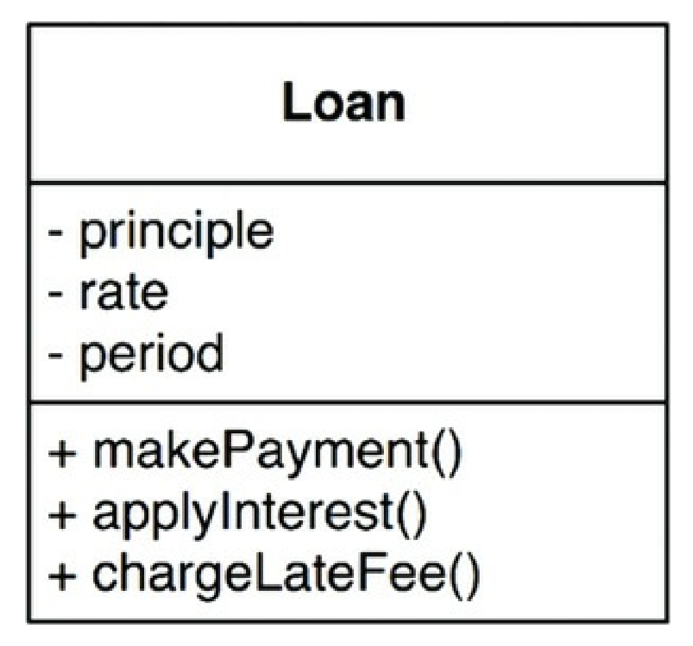

The entity is pure business and nothing else - it is not concerned with databases or IO. It will look the same way regardless of how the system is used.

### Use cases
Use case == description of how an automated system is used

They provide **application-specific** business rules as opposed to **critical business rules**.

Example of a use case:


Use cases work with entities & control how they are managed.

From use cases, one cannot determine if the application is web-based or console-based.
How the data gets in the application is irrelevant to the use-cases.

Use cases depend on Entities, not the other way around.

Why?

Because use-cases are specific to a particular application, while entities are generalizations that can be used across many applications.

### Request and response models
The way use-cases communicate with the IO layer is via request/response data structures, which have no notion of the specific IO being used.

These data structures shouldn't know anything about HTTP or Console or HTML.

These data structures should not have references to the Entity objects, although they might share a lot of the data.
The purpose of these two objects is very different and over time, will change for different reasons.

### Conclusion
The business rule should be the most independent and reusable code in the system.

## Screaming architecture
When you look at the structure of your code base at a high level, it should show what the system is about, NOT what frameworks it uses.

If you are developing an inventory management system, the structure of the codebase should scream "Inventory Management System". It shouldn't scream "ASP" or "Sprint" or "Rails".

### The theme of an architecture
The structure of an application should scream about the **use cases** of that application.

Architecture is not about frameworks. It should be about supporting the use cases of the business.

### The purpose of an architecture
A good architecture focuses on supporting the use cases and leaving the specific tools to be used a peripheral concern.

It is also about making it easy to change your mind about the tools you use.

### But what about the web?
The web is not an architecture, it is an IO device and your architecture should treat it as such.

A good architecture should enable the application to be ignorant of the specific IO being used - whether it's web or console or Desktop.

### Frameworks are tools, not ways of life
You should not embrace a let-the-framework-do-everything approach.

Every framework should be considered with skepticism - how can it help, how can it get in the way?

Think about how you can preserve the use-case emphasis of the system. You shouldn't let any framework take over the architecture of a system.

### Testable architectures
If your architecture is independent of the frameworks, you should be able to test it in isolation.

You shouldn't need to have the database or web server running to run your unit tests.

### Conclusion
Your architecture should tell readers about the system, not the frameworks that you used.

## Clean Architecture
Over the year, there were multiple ideas for an ideal architecture.

The "clean architecture" is the author's attempt to consolidate all those ideas into a single actionable approach:
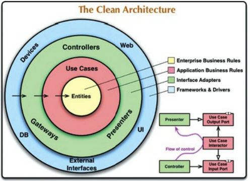

All those architectures have several things in common, as does the "clean architecture":
 * Independent of frameworks
 * Independent of the UI
 * Independent of the database
 * Independent of any external agent
 * Testable

### The dependency rule
The concentric circles in the "clean architecture" picture are different areas of the software.

The deeper you go, the higher-level the components at this level.

To abide by this architecture, one must follow the "dependency rule":
> Source code dependencies must point only inward, toward higher-level policies

### Entities
Entities encapsulate the enterprise-wide critical business rules. It can be an object with methods or a set of data structures and functions.
It doesn't matter so long as the entities can be used by many different applications in the enterprise.

If you don't have an enterprise, but merely a simple application, then these entities encapsulate the business rules of your application.

Those are the highest-level rules in the application which change the least often.

### Use cases
Use cases contain the application-specific business rules. They encapsulate all the use cases the application needs to support.

This layer works with Entities and manage all the interactions with them.A

Changes in this layer should not affect use cases and it shouldn't be affected by changes in UI/database/etc.

### Interface adapters
This layer contains the components responsible for transforming the data from a format suitable to the use cases and entities, to a format suitable for the frameworks and tools.
Typically, the MVC structure of an application resides at this layer.

All layers inward of this one should not be aware of any of the tools being used.
This layer is the deepest one where knowledge of SQL/HTML/etc can reside.

### Frameworks and drivers
This layer is where all the details go.
Typically, you need not write much code in this layer, only glue code at times.

### Only four circles?
This schematic is guidance, not strict rules. You may have more than 4 layers depending on the nature of your application.

What still applies, however, is the dependency rule.

### Crossing boundaries
Boundaries across layers are crossed via dependency inversion.

At the boundary between the use cases and the interface adapters, there are interfaces, which some components in the interface adapters implement.
The same technique is used across all the boundaries in the architecture.

### Which data crosses the boundaries
When we pass data across a boundary, it is always in a format most suitable for the components in the inner circles.

We shouldn't pass database result rows to the use cases and we shouldn't pass entities back to the interface adapters/tools.

### A typical scenario
Here's an example of a java application, which follows the clean architecture:


### Conclusion
Following these rules is not hard and it will save you a lot of headaches.

## Presenters and humble objects
Presenters are in the clean architecture to protect us from crossing architectural boundaries.
They, very often, follow the humble object design pattern.

### The humble object pattern
This pattern was invented with the aim of helping people doing unit tests.

Its goal is to separate the hard to test behavior from the easy to test behavior by separating the two in separate classes/modules.

For example, GUIs are very hard to unit test. However, some of the behavior of a GUI is easy to test.
We can separate that part via the humble object pattern and write unit tests for that.

### Presenters and views
The "View" is the humble object, which is hard to test. The code in this object is stripped to its bare minimum.

The presenter, on the other hand, is testable. Its job is to accept application data and format it in a nice way for the view to display on the UI.
E.g. format the dates/currencies appropriately.

Nothing should be left for the View, other than loading the data from the ViewModel to the UI.

### Testing and architecture
The humble object pattern is a technique which creates an architectural boundary between testable and non-testable objects.

### Database gateways
Between the use case interactors and the databases are the database gateways.
They create methods for the CRUD operations you need on a database.

The classes, which implement database gateways in the database layer are humble objects.

### Data mappers
The ORM data structures are another humble object. They should reside at the database layer.

### Service listeners
Your service boundaries are also humble objects - the classes which interact with external services.

## Partial boundaries
Oftentimes, creating a full-fledged boundary between two components can be considered an overkill because you might not need that boundary.

Creating boundaries left and right in anticipation of "a more complex system" is often frowned upon via YAGNI - You aren't gonna need it.

This is why, sometimes architects don't create full-fledged boundaries where they have to be, but instead, create partial boundaries which enable one to migrate to a full-fledged one if need be.

### Skip the last step
One way to create a partial boundary is to go through all the work of creating the boundary, but in the end, not separating it in a new component.

This requires the same amount of effort as a full boundary, but it does not incur the same administration overhead of managing multiple components.

### One-dimensional boundaries
The full-fledged boundary maintains reciprocal interfaces (interfaces on both sides of the boundary) to maintain isolation in both directions.

Maintaining separation in both directions is often expensive in terms of maintenance and ongoing development.

A simpler approach is to still use DIP but with a single interface:


This sets the stage for a future architectural boundary, but also poses danger that the dependency rule can be violated as shown by the red dotted line.

### Facades
An even simpler partial boundary is using the `Facade` pattern:


In this case, even dependency inversion is sacrificed. The point of this approach is that the client doesn't have direct access to the service implementations.

Note, however, that the client still has a transitive dependency on the service implementations -> changes in any of the services will lead to recompilation of the client.

### Conclusion
In this chapter, three approaches for partial boundaries were shown. Each has its trade-offs and use-cases.

Each can also be degraded if a boundary never materializes and each can be upgraded to a full-fledged architectural boundary.

## Layers and boundaries
This chapter is a case study of implementing a simple video game using clean architecture.

### Hunt the wumpus
This is a text-based computer game, where a player is hunting for the wumpus while avoiding traps. The user controls the player by issuing commands go left, go right, etc.

One of the first decisions is to decouple the game rules from the UI, which allows the game to be translated to any language:
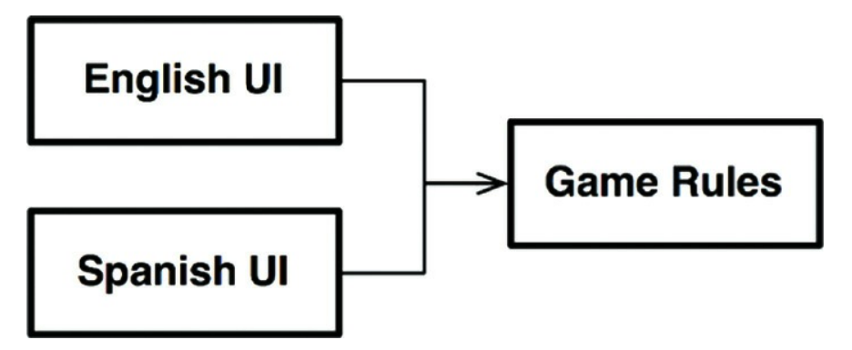

Additionally, the game rules can be stored in some kind of persistent storage. We will form the dependencies in a way that the game rules don't care about the details of how the rules are persisted:


### Clean architecture?
Clean architecture can be applied to this problem. But we haven't discovered all architectural boundaries yet.

For example, we don't know if decoupling the language from the game rules is enough of an architectural boundary & if it is the only axis of change for the UI.

What if, e.g. we want to deliver the game via different output devices? Perhaps we can form an architectural boundary between the language processing and the text delivery:
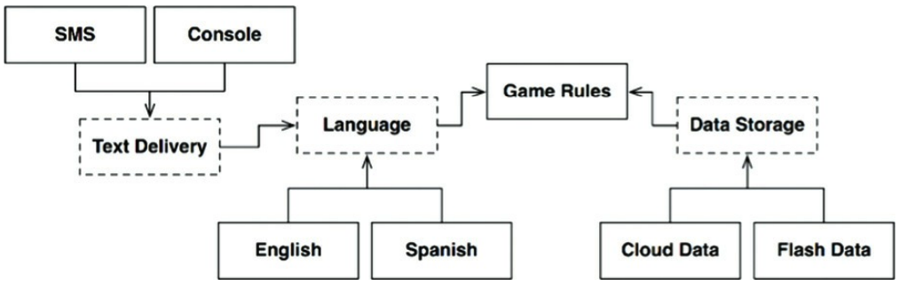

The main thing to have in mind in this design is that the boundary interfaces are owned by the upstream components.
For example, the boundary interface for language is owned by the game rules component, not the languages component.

Here's a simplified version of the previous diagram:
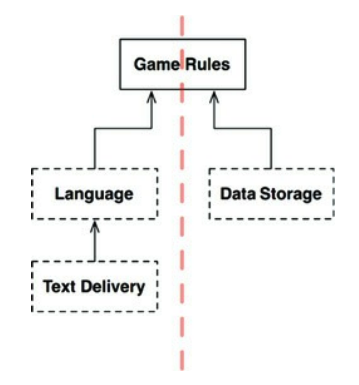

Notice that the dependency rule is adhered to as all components point up towards the highest level component - the game rules.
Additionally, in the current design, there are two separate streams which are not crossed - the data persistence and the output stream.

### Crossing the streams
There might be more than two streams in this game, and in any application. For example, if one wants to implement an online HTW, then you'd need a network stream as well:


### Splitting the streams
In the current design, all streams eventually meet at the top in a single component. In reality, the design might be more complicated than that.

For example, the game rules can be split in two components - one which manages the player and the other which manages movement:


One could even split the components into microservices and e.g. the player management can be handled by an online server.
In this case, one would have to define a `PlayerManagement` interface, which is implemented by a proxy to a distant server:


### Conclusion
This is a simple game, which can be written in 200 lines of code, but the author has taken it and extrapolated it into a full-fledged architecture with a lots of boundaries.

An architect needs to balance the act of setting boundaries in anticipation of future changes and not setting them in an effort to not over-engineer the solution.
Hence, it is a guessing game. One must be vigilant over the lifetime of the project & put those boundaries when they are really needed.

Putting them too early can cause the system to be over-engineered. Putting them too late can, well, be too late as the system is already hard to change.

## The main component
In any system, there is at least one component which creates, coordinates and oversees others. The author calls that the "Main" component.

### The ultimate detail
The main component is the lowest-level policy possible. Nothing, other than the operating system, depends on it.

It's job is to instantiate all major objects in your system and hand over control to the high-level abstract portions of the system.
This is where the Dependency Injection Framework should reside.

Once the dependencies are instantiated by the framework, the Main component should distribute the dependencies normally.

The author then shares some code snippets from his "Hunt the Wumpus" main function.
In it, one can find:
 * Instantiations of all constant strings which the game needs to use but not know about.
 * Basic input/output processing via the terminal
 * Creation of the game map

One interesting hint the author gives about the "Main" component is that you can have separate main components per configuration - one for test, one for dev, etc.

But in sum, it is yet another plugin to the system.

## Services: Great and Small
Microservices & Service-oriented architectures have become very popular because:
 * Services seem to be very decoupled from each other
 * Services seem to support independence of development and deployment

### Service Architecture?
Just because you are using services, doesn't mean that you have an architecture.

Architecture is defined by boundaries that follow the dependency rule. Services that simply have decoupled behavior are little more than a more expensive function call.

### Service Benefits?
This section is going to challenge some of the popular believes around service-oriented architecture benefits

#### The decoupling fallacy
One supposed benefit of using microservices is that services are decoupled from one another.

This is only partially true - yes, services are decoupled as they run in different processes, but they can strongly depend on each other due to the data which they share.
If a new public field is added in the data which a service returns, all dependent services need to be changed.

#### The fallacy of independent development and deployment
Another supposed benefit of services is that they can be independently developed and deployed by different teams.

There is some truth to this, but only some. History has shown that big enterprises can be built from big monoliths and yet, be scalable. Services are not the only option for this.

Apart from that, services might still be dependent on one another in terms of development & deployment if they are strongly coupled to each other.

### The kitty problem
This section shows examples of the previously stated fallacies by exploring a taxi aggregation system, which is built using microservices:


If, at some point, the marketing department comes and says that they want to offer a kitty delivery service, all these services need to be changed because that kitty delivery service is a cross-cutting concern.

Neither monoliths, nor service-oriented architectures are resilient to cross-cutting concerns.

### Objects to the rescue
This section explores a solution to the above problem in a component-based system (ie no microservices):
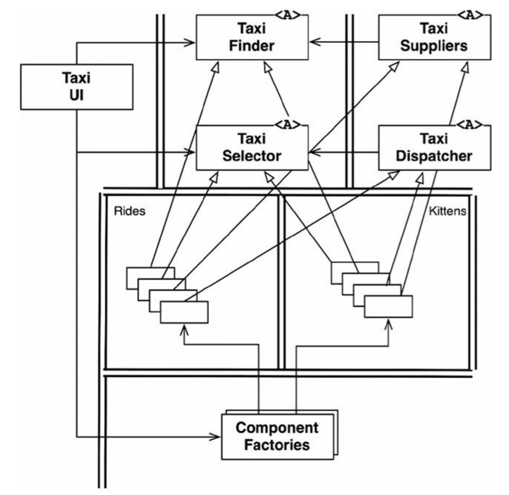

The main idea behind this structure above is that there is a set of abstract classes & interfaces - Taxi Finder, Taxi Selector, Taxi Dispatcher, Taxi supplier.
None of these are concrete implementations.

There is also a component factory which creates instances of components with a set of classes inside which implement all these interfaces.
If the kitty delivery problem is faced here, one would have to create a new component, which inherits all the interfaces & instantiate it in the component factory.

### Component-based services
The question is - can we do this for services? Yes, we can.

This structure can be created in a service-oriented architecture by creating services, which have their own internal component structure, which implements this structure:


Each service has its own internal component design. New features can be added as new derivative classes.
Those derivative classes live within their own components.

### Cross-cutting concerns
The services don't define the architectural boundaries in the system. The components inside those services do.

### Conclusion
Although services can be useful to the developability and deployability of the system, they are not architecturally significant elements.

The architecture is defined by the components inside the services. They define the architectural boundaries.

## The Test Boundary
Tests are part of the system and they participate in its architecture.

### Tests as system components
Tests, whatever they are - unit, integration, system, acceptance, BDD, etc, etc, follow the same rules.

They all follow the dependency rule. They are among the most concrete and detailed components there are - the outermost circle of the clean architecture.
Nothing within the system depends on the tests and the tests depend on components in the system.

### Design for testability
Oftentimes, developers tend to think tests are beyond the scope of the system design, which is not a good point of view.
If one takes such a stance, tests in his system might be extremely coupled to the system components, making the system very rigid and hard to change.

Trivial changes in common system components can cause hundreds of tests to fail - this is called the **Fragile Tests Problem**.

An example of fragile tests are ones which test the GUI by relying on how one navigates through a login screen. Changing the layout of the login screen can cause all these tests to fail.

The solution is to not depend on volatile things. GUIs are volatile - design your system in a way that the business rules can be tested without the GUI.

### The Testing API
The way to accomplish this is by creating an API which the tests can use to verify all the business rules.

This API should have superpowers which short-circuit the tests' access to the system - it bypasses security, middleware, etc.
The purpose of this API is to decouple the tests from the application.

This API decouples the structure of the tests from the structure of the application.

#### Structural Coupling
Imagine a system where there is a test for every test class and a test function for every public class function.
Such a test suite is deeply coupled to the structure of the application.

When one of those production methods changes, a large number of tests must change as well.

The testing API's goal is to hide the structure of the application from the tests. This allows the application structure to be refactored without that affecting the tests and vice versa.

This is necessary as the tests & the application evolve in different directions - tests tend to become more concrete, the application tends to become more abstract.

Structural coupling prevents this necessary evolution of an application.

#### Security
If the testing API is deployed in a production system, then security might be a concern. That is why, it is advisable to deploy this API in a separate testing environment.

### Conclusion
The system should be designed with tests in mind. Otherwise, tests tend to become more and more difficult to maintain, which leads to them being discarded altogether at some point.

## Clean Embedded Architecture
This chapter focuses on explaining clean architecture principles/techniques, specific to embedded development.

The driving force behind this is the notion that firmware and hardware change more often than software.
Hence, there should be strict boundaries between those three layers.

Firmware == code which tightly depends on hardware.

In order for an embedded application to be scalable, the firmware and hardware should be detached from the rest of the software.

### App-titude test
The reason why so much software & firmware becomes coupled is because developers typically consider their software don on step one of this process:
 1. Make it work
 2. Make it right
 3. Make it fast

Most embedded software is written with the first point and optionally the third point in mind, but not the second one.

Real-life example of a source file from an embedded project:
```c
ISR(TIMER1_vect) { ... }
ISR(INT2_vect) { ... }
void btn_Handler(void) { ... }
float calc_RPM(void) { ... }
static char Read_RawData(void) { ... }
void Do_Average(void) { ... }
void Get_Next_Measurement(void) { ... }
void Zero_Sensor_1(void) { ... }
void Zero_Sensor_2(void) { ... }
void Dev_Control(char Activation) { ... }
char Load_FLASH_Setup(void) { ... }
void Save_FLASH_Setup(void) { ... }
void Store_DataSet(void) { ... }
float bytes2float(char bytes[4]) { ... }
void Recall_DataSet(void) { ... }
void Sensor_init(void) { ... }
void uC_Sleep(void) { ... }
```

This file contains routines from across various boundaries.
This kind of file structure implies that the only way to test the code is on the physical embedded target.

This software passed the app-titude test - it works. But that's not enough to make a scalable application.

### The target-hardware bottleneck
If the target embedded device is the only place where you can test your code, you will have the target-hardware bottleneck.

### A clean embedded architecture is a testable embedded architecture
This section explores how to apply some of the clean architecture principles to embedded development.

#### Layers
We'll start from a simple layered view, which includes three layers:

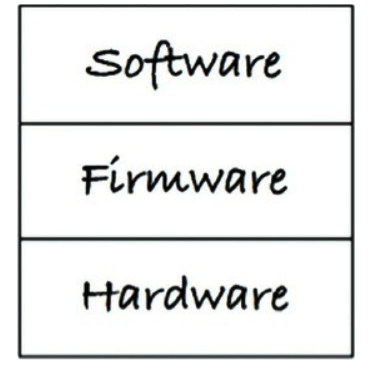

The hardware layer is the one which will change the most due to Moore's law - hardware quickly becomes obsolete.

The separation between hardware and the rest of the system is a given as it is quite physical and has strict interfaces the firmware has to adhere to.
The problem is that oftentimes, the separation between software and firmware is not so well defined.

When one is only focusing on making the application work, they're polluting the software with hardware-related details. This effectively makes the whole software - firmware:


This kind of structure makes changing the software very hard and risky.
The only way to prevent oneself from regressions is by running full-blown manual system tests on the target hardware. This will force one to spend a lot of time doing manual testing.

#### The Hardware is a detail
The line between software and firmware is typically not so well defined as the line between hardware and firmware:


Your job, as an embedded developer, is to make that line firm by introducing the Hardware Abstraction Layer (HAL):
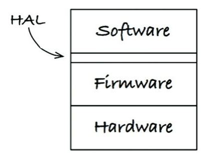

An example of an interaction between software and the HAL is - the software needs to persist some data in persistent memory.
The HAL should provide a routine which e.g. stores data in flash memory. The software should in no way know that its data is persisted in flash memory, only that it is persisted somewhere.

Another example is that there is a LED which can turn on somewhere on the hardware. The API for turning it on from the hardware library might be `Led_TurnOn(5)`.
This is a very low API and the HAL should hide it beneath its own API, indicating what the LED is used for - e.g. `Indicate_LowBattery()`.

### Don't reveal hardware details to the user of a HAL
A clean embedded architecture is testable off the target embedded device. A successful HAL provides that set of substitution points which facilitates off-target testing.

#### The processor is a detail
When you use a specific hardware, the manufacturer typically provides some header files to help you interact with their hardware.
Any code which uses these header files is firmware. These files should only be used in the HAL layer.

Alternatively, if the header files are important and meant to be used throughout the software, they should be wrapped in your own header.

For example, this is a vendor-provided header file defining the standard integer types for a specific processor:
```c
#if defined(_ACME_X42)
    typedef unsigned int Uint_32;
    typedef unsigned short Uint_16;
    typedef unsigned char Uint_8;
    typedef int Int_32;
    typedef short Int_16;
    typedef char Int_8;
#elif defined(_ACME_A42)
    typedef unsigned long Uint_32;
    typedef unsigned int Uint_16;
    typedef unsigned char Uint_8;
    typedef long Int_32;
    typedef int Int_16;
    typedef char Int_8;
#else
    #error <acmetypes.h> is not supported for this environment
#endif
```

You shouldn't use this directly in your source files. Instead, wrap that in your own header file:
```c
#ifndef _STDINT_H_
#define _STDINT_H_
#include <acmetypes.h>

typedef Uint_32 uint32_t;
typedef Uint_16 uint16_t;
typedef Uint_8 uint8_t;
typedef Int_32 int32_t;
typedef Int_16 int16_t;
typedef Int_8 int8_t;

#endif
```

The reason is that otherwise, you won't be able to test your code off-target as it is tied to the specific processor you're using.

#### The Operating System is a detail
In some systems, a HAL is sufficient for am embedded applications.
In others, you might need to have some kind of an operating system - e.g. a Real-Time Operating System (RTOS).

You have to threat the OS as a detail as well and put it behind a boundary, just like the firmware:

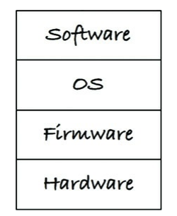

To protect yourself against the OS changing because e.g. the provider is acquired by another company & the OS is no longer supported, you need an OS Abstraction Layer (OSAL):


The OSAL provides similar benefits to the HAL - your application is testable off-target and off-OS.
Additionally, you might e.g. provide a common mechanisms for message passing across threads instead of letting threads handcraft their own concurrency models.

#### Programming to interfaces and substitutability
Apart from having a HAL and OSAL layers, you should also apply the principles covered in this book to separate the rest of the software into separate layers.

#### DRY conditional compilation directives
One common use-case in embedded software is the use of `#ifdef`s.

This should also be encapsulated in the HAL layer in order to not have an `#ifdef` span across your entire code base.


