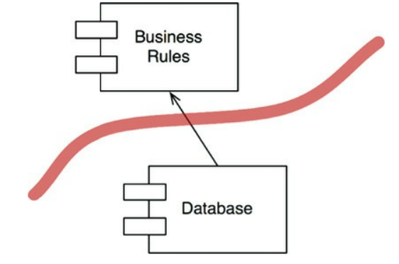
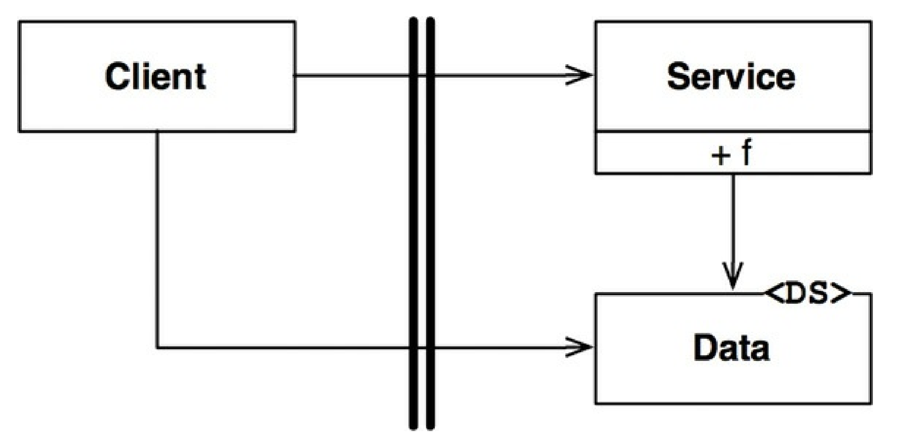
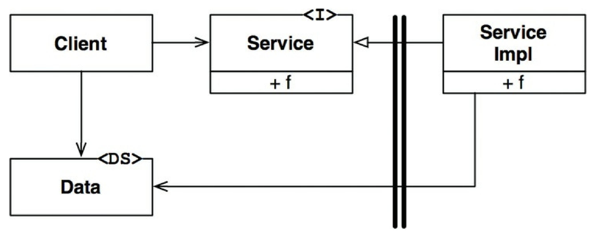

# Part 5a - Architecture Fundamentals

  * [What is architecture?](#what-is-architecture)
  * [Independence](#independence)
  * [Boundaries: Drawing Lines](#boundaries--drawing-lines)
  * [Boundary Anatomy](#boundary-anatomy)
  * [Policy and level](#policy-and-level)
  * [Business rules](#business-rules)
  * [Screaming architecture](#screaming-architecture)

## What is architecture?

First of all, software architects are programmers, some of the best actually.  
They may not write as much code as everyone else does, but they do continue engaging in programming tasks.

The architecture of a system is its shape - the way the application is decomposed into components & the way those components interact with each other.

**The purpose of architecture is to make it easier to develop, maintain, deploy, and operate the application. It is not to make the application work.**

### Development

A software system which is hard to develop is not likely to have a long and healthy life.
Hence, the architecture of a system should make it easy to develop for the owning teams.

Very often, when a system is developed by a small team, the team decides to not invest in building proper interfaces and superstructures to avoid the impediment of one.
This is likely the reason why so many applications lack good architecture these days.

### Deployment
To be effective, a software system has to be deployable.

Higher cost of deployment => the system is less useful.

This is often problematic in typical codebases as a deployment strategy is not considered in the early days of a project.
This can lead to e.g. someone making a "micro-service" architecture, but without a good means of deployment, it is hell to make all the services synchronize & communicate together.

### Operation
The impact of architecture on system operation tends to be lesser than the impact on the other paramenters.

Any operational problem can be tackled by throwing more hardware at a problem without that impacting the system's architecture.

Due to this, architectures that impede operation are less costly than architectures that impede developability and deployability.
The reason is that hardware is cheap, but people are expensive.

This is not to say that architecture which aids operation is not desirable. But it is to say that the cost equation leans more towards the other parameters.

### Maintenance
Of all aspects of a software system, maintenance is the most costly.

The never-ending flow of new features and the inevitable trail of defects consumes vast amounts of man-hours.

The cost of maintenance is expressed in the time it takes to determine the best place for a new feature and the risk associated with adding it.

A good architecture greatly mitigates these costs. When components have stable interfaces and proper boundaries, ambiguity and risk will be reduced.

### Keeping options open

The goal of an architecture is to make a software system flexible.

That can be achieved by "keeping options open".

Every software can be decomposed into two distinct sections - business rules and details.

Examples of details are:
 * What database will be used
 * Is this a web server/GUI application/Sprint application, etc
 * Is it using a dependency injection framework

Good software architecture should defer making the decision whether any of these technologies will be used to as late as possible.

The longer you defer making any of these decisions, the more information you have whether you actually need them.

> A good architect maximizes the number of decisions not made

### Device independence
The author shares an example of not following this approach from the 1960s when he wrote software which was heavily device-specific.
Once they had to migrate the software to a different device, that operation was extremely difficult as all the code had to be rewritten for the new device.

In the end, the programming society has learned its lesson by abstracting away the specific devices being used behind an operating system interface.

### Junk Mail
Here, the author shows a contrasting story to the previous one in which he worked for a company, which had to print junk mail on a particular medium.
At some point, they had to change the medium and since they were using the OS interface for interacting with the external device, they were able to migrate seamlessly.

And the value of "keeping options open" was enormous as the new medium saved the company a lot of time and money, and it was achieved with insignificant development effort.

### Physical addressing
The author goes on to share yet another story about how he worked on a project, which didn't follow the advice in this chapter and things weren't going well.
I've omitted this one for brevity.

## Independence
As already stated, a good architecture must support:
 * The use cases and operations of the system
 * The maintenance of the system
 * The development of the system
 * The deployment of the system

### Use cases
One of the architect's top priorities is to support the use cases of the system.
If you're making a shopping cart application, the architecture should support shopping cart behavior.

But architecture is not about behavior, as already mentioned. However, it should expose the behavior so that it is visible at the structural level.
A shopping cart application should look like a shopping cart application when you look at it from a bird's eye view.

### Operation
One of the goals of the architecture is to support the scaling needs of the application.
If the application needs to process a lot of data, then the architecture should support that operation.

However, a good architecture should leave this option open - if an architecture is good, it can easily be migrated from a monolithic structure into a micro-service architecture, for example.

### Development
Architecture plays a significant role in supporting the development environment.

A system operated by many development teams should be aided by an architecture, which enables these teams to work in parallel, independently.

### Deployment
Architecture plays a significant role in the deployment process of a system.

A good architecture, supporting deployment, doesn't require manual file/directory creations or various config file tweaking.
This is achieved by properly partitioning and isolating the different components of the system.

### Leaving options open
One of the hardest parts about designing an architecture that satisfies all these conditions is that we often don't have knowledge of the use cases and/or scale which the system has to support.

This is why it's crucial that the architecture enables the system to be easy to change.

### Decoupling layers
The architect doesn't know the use cases of the system but wants to support them all.
However, one does know the basic intent of the system - e.g. it's a shopping cart application.

Hence, the architect can employ SRP and CCP to collect the things that change for the same reason.

There are also some obvious components, which should be separated from the business rules - UI, database, schema, etc.
All these are technical details, which should be decoupled from the rest of the system.

### Decoupling use cases
Use cases also change for different reasons among themselves. Use cases are a very natural way to divide the system.

They are thin vertical slices that use different parts of our horizontal layers.
Hence, we need to keep the horizontal layers decoupled from each other on the vertical as well - e.g. the UI for the "add-order" use case should be separate from the "delete order" use-case UI.

### Decoupling mode
Some of the use cases we talked about so far might have different operational needs than others - they might need to run at higher throughputs.

Since we decoupled those use cases from one another, we can now independently scale them as needed - e.g. we could separate a particular use-case in a separate microservice or process.

### Independent develop-ability
So long as the use cases & horizontal layers are separate from each other, the system will support independent developability via multiple teams.

E.g. the UI team need not know anything about how the business rules are implemented and vice versa. What's more, one could separate the system further per use case.
The team of use case X doesn't know or care about the team of use case Y.

### Independent deployability
By separating the use cases in this way, we can also achieve a higher degree of deployability.

For example, if there is a change in a particular use case, that can be deployed independently without causing the whole system to have downtime.

### Duplication
There are two kinds of duplication - real and accidental.

Real duplication is the one we are honor-bound to avoid by e.g. extracting a common function.
However, there is also accidental duplication - it is duplicated code, present in separate use-cases that can be reused.
This kind of duplication should not be addressed by reusing it.

The reason is that although the two components have a similar structure and/or code, they change for very different reasons.
Hence, although they look similar now, they will likely diverge a lot in the future.

Reusing a common function/component which changes for different reasons violates SRP and will lead to maintenance issues.

The same goes for reusing data structure which look similar - e.g. one could directly pass the database data structure to the UI since the view model looks the same as the model.
This should be avoided as this is also accidental duplication. Addressing it will lead to coupling between components that change for different reasons.

### Decoupling modes (again)
There are many ways to decouple layers and use cases. They can be decoupled at the source code/binary or even service layer:
 * Source level - we can control the dependencies we use in our source code so that changes in a component doesn't lead to changes in an unrelated component, which is in the same address space
 * Deployment level - we can control the dependencies between our deployment units (e.g. jar files) so that changes in one component don't lead to redeployment of unrelated components.
 * Service level - We can reduce the dependencies at a minimum and eventually make separate components execute in different binaries and reside in different source trees

Which decoupling mode to use is based on what needs our system has. Those needs can change as time passes.
A good architecture should allow for migrating to a different decoupling mode if there is the need for it.

A modern approach to this is to start from the service level decoupling from the very get-go. This is a bad approach as service level decoupling leads to a lot more maintenance, development effort & wasted network cycles.

Instead, a system usually starts from a monolith, keeping options open as it has clear boundaries between unrelated components.

And, if need be, it can grow into decoupled deployment units and eventually - separate services.

### Conclusion
The decoupling mode is one of those things which can change over time and a good architecture should set up the system to easily change the mode if necessity comes.

## Boundaries: Drawing Lines
Software architecture == the art of drawing lines, called "boundaries"

Boundaries that are drawn early are for the purposes of deferring decisions for much later in order to prevent those decisions from polluting the core business logic.
One of the main reasons development slows down as a project evolves is because of the coupling of the project with early decisions.

### A couple of stories
The first "sad story" being told is about a company that had a successful GUI application & clients wanted a web version of it.
To accomplish this, the developers decided to create a complex "three-tier architecture" which was meant to live in multiple servers.

This complicated development tremendously as any message had to be marshaled/unmarshaled multiple times & there was, in general, a lot of overhead.

In the end, the company never utilized server farms and sold its solution as a single-server application. The overdesign was unnecessary.

Another sad story being told is about a company running a small taxi-like business, managing fleets of cars. They hired an "architect" to help with their software.
The guy decided, off of the get-go, that what this company needed was a full-blown enterprise-level service-oriented architecture.

Needless to say, this whole effort consumed tremendous amounts of people hours for an unneedlessly complex system.

Finally, a good example of a story is given about developing "FitNesse" - a project created by Uncle Bob and his son for managing acceptance tests.
Early on, they drew boundaries between the core business rules and the database layer.

Since their needs initially were small, they used a mock database, which simply stubbed the methods altogether.
Eventually, they needed some form of persistence, so they wrote an in-memory "database" for a short amount of time, which conformed to the interface they needed.

Finally, when they had to achieve persistence, they wrote a component to store the data in flat files, since they decided that they don't need MySQL for now.
And they never did, eventually.

This way of scaling the system iteratively saved them a lot of headaches around dealing with a real database and the way they had architected their system allowed them to defer decisions for a lot later.
And when the time to migrate came, the migration was extremely easy as the database layer was independent of the business rules.

### Which lines do you draw and when do you draw them
Lines should be drawn between things that matter and things that don't.

The things that matter are the business rules. The things that don't are all technical details such as the GUI or what database is being used.

Example:


At a higher level, this is how this component looks:



Note that the database knows about the business rules, but not vice versa.
This means that the database can be changed with whatever is necessary, without that having any effect whatsoever on the business rules.

### What about input and output?
The IO is irrelevant. The customers often just see the GUI and think that the application is the GUI, which is wrong.

The GUI is merely a means to visualize the data managed by the core business rules.


### Plugin architecture
Putting this all together, what we are creating is a plugin architecture - a system that allows third-party plugins to be embedded in the system without changing the rest of the system.


Because the database and the GUI are plugins in this architecture, they can easily be changed to whatever:
 * MySQL, Oracle, NoSQL, etc for the database
 * Web-based, CLI, Desktop app, mobile, etc for the GUI

### The plugin argument
An analogy is how Visual Studio works with ReSharper - both tools are developed by different teams, working in very distant countries.

And yet, both tools integrate together quite well. This is because Visual Studio supports plugin architecture.

What's more Visual Studio is immune to any problems caused by the ReSharper team due to the direction of the dependencies:


On the other hand, if Visual Studio collapses, the ReSharper team will be seriously affected.

This is how we want to structure the dependencies between our components as well.

We want our business rules to not be dependent on database/gui/etc.
It should be the other way around.

In sum, boundaries should be drawn between components that change at different rates and for different reasons.
This is the Single Responsibility Principle, applied to architecture.

## Boundary Anatomy
Architecture of a system == set of components + boundaries between them

This chapter focuses on the most common types of boundaries.

### Boundary crossing
Boundary crossing == function on one side of a boundary calling a function on the other side of a boundary and passing along some data

The trick to creating good boundary crossings lies in appropriately managing source code dependencies.

The reason source code dependencies matter is because changing source code leads to recompilation and redeployment.
Managing and building firewalls against these changes is what boundaries are all about.

### The dreaded monolith
The simplest way of structuring an application is in a single monolithic binary - be it an EXE file, a statically linked C/C++ binary, a java JAR, etc.

In these applications, boundaries still exist, but they are at the source code level. From a deployment's perspective, there is a single binary, regardless of internal boundaries.

Even so, making appropriate boundaries is still valuable as this enables easier testing & developability of different components (in other words, different teams can focus on different parts of the system).

For example, without appropriate boundaries, a high-level component will have to depend on low-level components:



If an appropriate boundary is made, the low-level component will depend on the high-level one, allowing different teams to focus on different parts of the system:



### Deployment components
The simplest physical version of an architectural boundary is a dynamically linked library - e.g. DLL files, JAR files, Unix shared library.

Deployment doesn't involve compilation. Instead, the components are delivered in binary form. They are typically bundled in a convenient form, eg. an archive.

Other than that deployment-specific, deployment-level decoupling is the same as the monolith-level of decoupling. The functions generally all exist in the same address space.
The strategies for segregating the components and managing their dependencies are the same.

### Threads
Threads are not architectural boundaries. They are a way to organize and schedule the order of execution.
Both monoliths and deployment components can leverage threads.

### Local processes
A stronger architectural boundary is the local process.

Local processes run in the same processor space, but are not running in the same address space.
Typically, the processes do not share memory, although that is possible.

From an architectural perspective, the same rules apply when defining dependencies between local processes.
Lower-level processes have to depend on higher-level processes, not the other way around.

The goal is for lower-level processes to be plugins to the higher-level ones.

One thing to consider in addition to this is that communication between local processes has moderate overhead, meaning that one should be careful when making external calls.

### Services
Services are the strongest level of boundary. Services assume that they are running in independent process and address space & all calls to other services are network calls.

Communication across service boundaries are very slow compared to normal function calls or local process communication. Communications at this level must deal with high levels of latency.

Other than that, the same rules apply here as for all other architectural boundaries.

### Conclusion
Most applications use several forms of boundaries, not just one type. Hence, one must often deal with all boundary types which were enumerated thus far.

## Policy and level
Software systems == statements of policy.

Applications are merely detailed sets of policies that govern how input data is to be transformed into output.

Software architecture is partly about effectively grouping and separating policies based on the way they change.

In any case, low-level policies should depend on high-level ones.

### Level
Definition of level == distance from inputs and outputs

The farther a policy is from the inputs and outputs, the higher-level it is.

Structure of a simple encryption program:


An incorrect way to structure this program would be:
```
function encrypt() {
    while(true)
        writeChar(translate(readChar()));
}
```

This is incorrect as the high-level `encrypt` function depends on the lower-level `readChar` and `writeChar` functions.

A better approach would be:


The reason this approach is better is because the low-level IO-related components are separated from the higher-level policy.

This allows the components to change at different rates and for different reasons.

## Business rules
We are dividing our application into business rules and plugins.

What are business rules - rules or procedure that make or save the business money.
They don't have to necessarily be implemented by a computer & would be executed manually if a computer were not present.

We shall call these **critical business rules**. These rules often need some data to work with - **the critical business data**.

Critical business rules & data are inextricably bound and we'll bound them to an object, which we'll call an **Entity**.

### Entities
Entity == an object which embodies a small set of critical business rules, operating on critical business data.

The interface of the entity consists of functions that implement the critical business rules that operate on the data:


The entity is pure business and nothing else - it is not concerned with databases or IO. It will look the same way regardless of how the system is used.

### Use cases
Use case == description of how an automated system is used

They provide **application-specific** business rules as opposed to **critical business rules**.

Example of a use case:


Use cases work with entities & control how they are managed.

From use cases, one cannot determine if the application is web-based or console-based.
How the data gets in the application is irrelevant to the use-cases.

Use cases depend on Entities, not the other way around.

Why?

Because use-cases are specific to a particular application, while entities are generalizations that can be used across many applications.

### Request and response models
The way use-cases communicate with the IO layer is via request/response data structures, which have no notion of the specific IO being used.

These data structures shouldn't know anything about HTTP or Console or HTML.

These data structures should not have references to the Entity objects, although they might share a lot of the data.
The purpose of these two objects is very different and over time, will change for different reasons.

### Conclusion
The business rule should be the most independent and reusable code in the system.

## Screaming architecture
When you look at the structure of your code base at a high level, it should show what the system is about, NOT what frameworks it uses.

If you are developing an inventory management system, the structure of the codebase should scream "Inventory Management System". It shouldn't scream "ASP" or "Sprint" or "Rails".

### The theme of an architecture
The structure of an application should scream about the **use cases** of that application.

Architecture is not about frameworks. It should be about supporting the use cases of the business.

### The purpose of an architecture
A good architecture focuses on supporting the use cases and leaving the specific tools to be used a peripheral concern.

It is also about making it easy to change your mind about the tools you use.

### But what about the web?
The web is not an architecture, it is an IO device and your architecture should treat it as such.

A good architecture should enable the application to be ignorant of the specific IO being used - whether it's web or console or Desktop.

### Frameworks are tools, not ways of life
You should not embrace a let-the-framework-do-everything approach.

Every framework should be considered with skepticism - how can it help, how can it get in the way?

Think about how you can preserve the use-case emphasis of the system. You shouldn't let any framework take over the architecture of a system.

### Testable architectures
If your architecture is independent of the frameworks, you should be able to test it in isolation.

You shouldn't need to have the database or web server running to run your unit tests.

### Conclusion
Your architecture should tell readers about the system, not the frameworks that you used.

