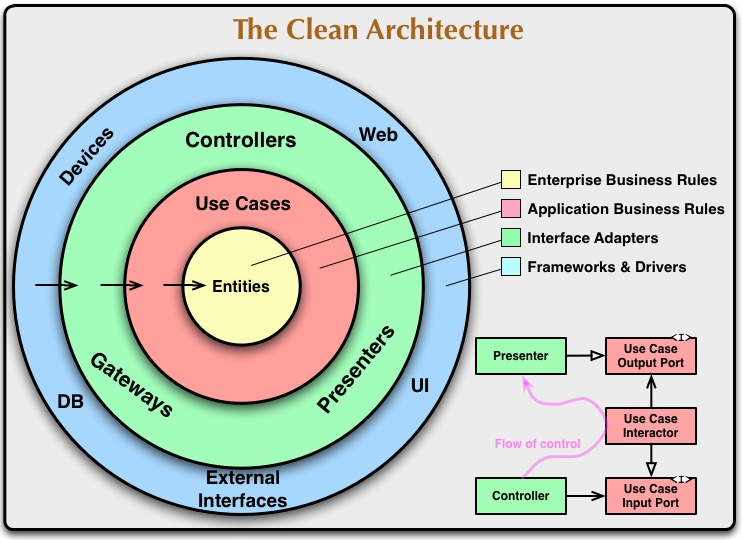
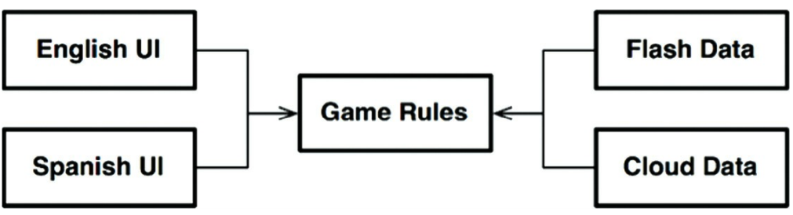
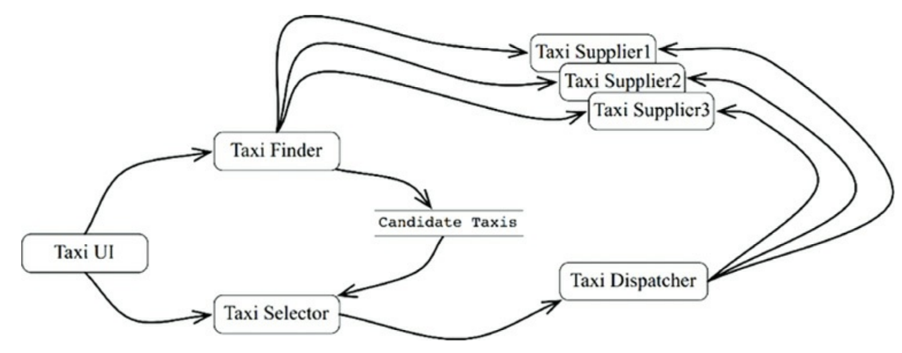
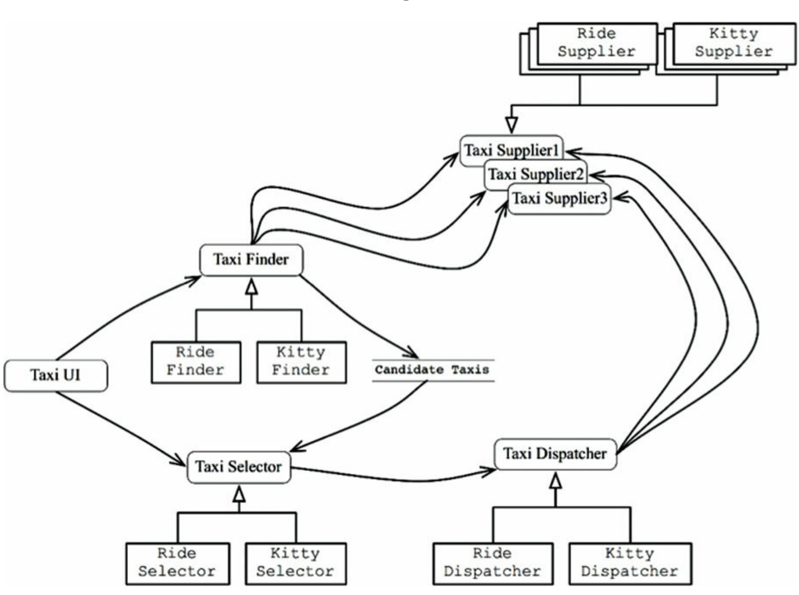

# Part 5b - Clean Architecture

  * [Clean Architecture](#clean-architecture)
  * [Presenters and humble objects](#presenters-and-humble-objects)
  * [Partial boundaries](#partial-boundaries)
  * [Layers and boundaries](#layers-and-boundaries)
  * [The main component](#the-main-component)
  * [Services: Great and Small](#services-great-and-small)
  * [The Test Boundary](#the-test-boundary)
  * [Clean Embedded Architecture](#clean-embedded-architecture)

## Clean Architecture
Over the year, there were multiple ideas for an ideal architecture.

The "clean architecture" is the author's attempt to consolidate all those ideas into a single actionable approach:



All those architectures have several things in common, as does the "clean architecture":
 * Independent of frameworks
 * Independent of the UI
 * Independent of the database
 * Independent of any external agent
 * Testable

### The dependency rule
The concentric circles in the "clean architecture" picture are different areas of the software.

The deeper you go, the higher-level the components at this level.

To abide by this architecture, one must follow the "dependency rule":
> Source code dependencies must point only inward, toward higher-level policies

### Entities
Entities encapsulate the enterprise-wide critical business rules. It can be an object with methods or a set of data structures and functions.
It doesn't matter so long as the entities can be used by many different applications in the enterprise.

If you don't have an enterprise, but merely a simple application, then these entities encapsulate the business rules of your application.

Those are the highest-level rules in the application which change the least often.

### Use cases
Use cases contain the application-specific business rules. They encapsulate all the use cases the application needs to support.

This layer works with Entities and manage all the interactions with them.

Changes in this layer should not affect use cases and it shouldn't be affected by changes in UI/database/etc.

### Interface adapters
This layer contains the components responsible for transforming the data from a format suitable to the use cases and entities to a format suitable for the frameworks and tools.
Typically, the MVC structure of an application resides at this layer.

All layers inward of this one should not be aware of any of the tools being used.
This layer is the deepest one where knowledge of SQL/HTML/etc can reside.

### Frameworks and drivers
This layer is where all the details go.
Typically, you need not write much code in this layer, only glue code at times.

### Only four circles?
This schematic is guidance, not strict rules. You may have more than 4 layers depending on the nature of your application.

What still applies, however, is the dependency rule.

### Crossing boundaries
Boundaries across layers are crossed via dependency inversion.

At the boundary between the use cases and the interface adapters, there are interfaces, which some components in the interface adapters implement.
The same technique is used across all the boundaries in the architecture.

### Which data crosses the boundaries
When we pass data across a boundary, it is always in a format most suitable for the components in the inner circles.

We shouldn't pass database result rows to the use cases and we shouldn't pass entities back to the interface adapters/tools.

### A typical scenario
Here's an example of a java application, which follows the clean architecture:


### Conclusion
Following these rules is not hard and it will save you a lot of headaches.

## Presenters and humble objects
Presenters are in the clean architecture to protect us from crossing architectural boundaries.
They, very often, follow the humble object design pattern.

### The humble object pattern
This pattern was invented with the aim of helping people doing unit tests.

Its goal is to separate the hard to test behavior from the easy to test behavior by separating the two in separate classes/modules.

For example, GUIs are very hard to unit test. However, some of the behavior of a GUI is easy to test.
We can separate that part via the humble object pattern and write unit tests for that.

### Presenters and views
The "View" is the humble object, which is hard to test. The code in this object is stripped to its bare minimum.

The presenter, on the other hand, is testable. Its job is to accept application data and format it in a nice way for the view to display on the UI.
E.g. format the dates/currencies appropriately.

Nothing should be left for the View, other than loading the data from the ViewModel to the UI.

### Testing and architecture
The humble object pattern is a technique which creates an architectural boundary between testable and non-testable objects.

### Database gateways
Between the use case interactors and the databases are the database gateways.
They create methods for the CRUD operations you need on a database.

The classes, which implement database gateways in the database layer are humble objects.

### Data mappers
The ORM data structures are another humble object. They should reside at the database layer.

### Service listeners
Your service boundaries are also humble objects - the classes which interact with external services.

## Partial boundaries
Oftentimes, creating a full-fledged boundary between two components can be considered an overkill because you might not need that boundary.

Creating boundaries left and right in anticipation of "a more complex system" is often frowned upon via YAGNI - You aren't gonna need it.

This is why, sometimes architects don't create full-fledged boundaries where they have to be, but instead, create partial boundaries which enable one to migrate to a full-fledged one if need be.

### Skip the last step
One way to create a partial boundary is to go through all the work of creating the boundary, but in the end, not separating it in a new component.

This requires the same amount of effort as a full boundary, but it does not incur the same administration overhead of managing multiple components.

### One-dimensional boundaries
The full-fledged boundary maintains reciprocal interfaces (interfaces on both sides of the boundary) to maintain isolation in both directions.

Maintaining separation in both directions is often expensive in terms of maintenance and ongoing development.

A simpler approach is to still use DIP but with a single interface:


This sets the stage for a future architectural boundary, but also poses danger that the dependency rule can be violated as shown by the red dotted line.

### Facades
An even simpler partial boundary is using the `Facade` pattern:


In this case, even dependency inversion is sacrificed. The point of this approach is that the client doesn't have direct access to the service implementations.

Note, however, that the client still has a transitive dependency on the service implementations -> changes in any of the services will lead to recompilation of the client.

### Conclusion
In this chapter, three approaches for partial boundaries were shown. Each has its trade-offs and use-cases.

Each can also be degraded if a boundary never materializes and each can be upgraded to a full-fledged architectural boundary.

## Layers and boundaries
This chapter is a case study of implementing a simple video game using clean architecture.

### Hunt the wumpus
This is a text-based computer game, where a player is hunting for the wumpus while avoiding traps. The user controls the player by issuing commands go left, go right, etc.

One of the first decisions is to decouple the game rules from the UI, which allows the game to be translated to any language:


Additionally, the game rules can be stored in some kind of persistent storage. We will form the dependencies in a way that the game rules don't care about the details of how the rules are persisted:



### Clean architecture?
Clean architecture can be applied to this problem. But we haven't discovered all architectural boundaries yet.

For example, we don't know if decoupling the language from the game rules is enough of an architectural boundary & if it is the only axis of change for the UI.

What if, e.g. we want to deliver the game via different output devices? Perhaps we can form an architectural boundary between the language processing and the text delivery:


The main thing to have in mind in this design is that the boundary interfaces are owned by the upstream components.
For example, the boundary interface for language is owned by the game rules component, not the languages component.

Here's a simplified version of the previous diagram:


Notice that the dependency rule is adhered to as all components point up towards the highest level component - the game rules.
Additionally, in the current design, there are two separate streams which are not crossed - the data persistence and the output stream.

### Crossing the streams
There might be more than two streams in this game, and in any application. For example, if one wants to implement an online HTW, then you'd need a network stream as well:


### Splitting the streams
In the current design, all streams eventually meet at the top in a single component. In reality, the design might be more complicated than that.

For example, the game rules can be split in two components - one which manages the player and the other which manages movement:


One could even split the components into microservices and e.g. the player management can be handled by an online server.
In this case, one would have to define a `PlayerManagement` interface, which is implemented by a proxy to a distant server:


### Conclusion
This is a simple game, which can be written in 200 lines of code, but the author has taken it and extrapolated it into a full-fledged architecture with a lots of boundaries.

An architect needs to balance the act of setting boundaries in anticipation of future changes and not setting them in an effort to not over-engineer the solution.
Hence, it is a guessing game. One must be vigilant over the lifetime of the project & put those boundaries when they are really needed.

Putting them too early can cause the system to be over-engineered. Putting them too late can, well, be too late as the system is already hard to change.

## The main component
In any system, there is at least one component which creates, coordinates and oversees others. The author calls that the "Main" component.

### The ultimate detail
The main component is the lowest-level policy possible. Nothing, other than the operating system, depends on it.

It's job is to instantiate all major objects in your system and hand over control to the high-level abstract portions of the system.
This is where the Dependency Injection Framework should reside.

Once the dependencies are instantiated by the framework, the Main component should distribute the dependencies normally.

The author then shares some code snippets from his "Hunt the Wumpus" main function.
In it, one can find:
 * Instantiations of all constant strings which the game needs to use but not know about.
 * Basic input/output processing via the terminal
 * Creation of the game map

One interesting hint the author gives about the "Main" component is that you can have separate main components per configuration - one for test, one for dev, etc.

But in sum, it is yet another plugin to the system.

## Services: Great and Small
Microservices & Service-oriented architectures have become very popular because:
 * Services seem to be very decoupled from each other
 * Services seem to support independence of development and deployment

### Service Architecture?
Just because you are using services, doesn't mean that you have an architecture.

Architecture is defined by boundaries that follow the dependency rule. Services that simply have decoupled behavior are little more than a more expensive function call.

### Service Benefits?
This section is going to challenge some of the popular believes around service-oriented architecture benefits

#### The decoupling fallacy
One supposed benefit of using microservices is that services are decoupled from one another.

This is only partially true - yes, services are decoupled as they run in different processes, but they can strongly depend on each other due to the data which they share.
If a new public field is added in the data which a service returns, all dependent services need to be changed.

#### The fallacy of independent development and deployment
Another supposed benefit of services is that they can be independently developed and deployed by different teams.

There is some truth to this, but only some. History has shown that big enterprises can be built from big monoliths and yet, be scalable. Services are not the only option for this.

Apart from that, services might still be dependent on one another in terms of development & deployment if they are strongly coupled to each other.

### The kitty problem
This section shows examples of the previously stated fallacies by exploring a taxi aggregation system, which is built using microservices:



If, at some point, the marketing department comes and says that they want to offer a kitty delivery service, all these services need to be changed because that kitty delivery service is a cross-cutting concern.

Neither monoliths, nor service-oriented architectures are resilient to cross-cutting concerns.

### Objects to the rescue
This section explores a solution to the above problem in a component-based system (ie no microservices):


The main idea behind this structure above is that there is a set of abstract classes & interfaces - Taxi Finder, Taxi Selector, Taxi Dispatcher, Taxi supplier.
None of these are concrete implementations.

There is also a component factory which creates instances of components with a set of classes inside which implement all these interfaces.
If the kitty delivery problem is faced here, one would have to create a new component, which inherits all the interfaces & instantiate it in the component factory.

### Component-based services
The question is - can we do this for services? Yes, we can.

This structure can be created in a service-oriented architecture by creating services, which have their own internal component structure, which implements this structure:



Each service has its own internal component design. New features can be added as new derivative classes.
Those derivative classes live within their own components.

### Cross-cutting concerns
The services don't define the architectural boundaries in the system. The components inside those services do.

### Conclusion
Although services can be useful to the developability and deployability of the system, they are not architecturally significant elements.

The architecture is defined by the components inside the services. They define the architectural boundaries.

## The Test Boundary
Tests are part of the system and they participate in its architecture.

### Tests as system components
Tests, whatever they are - unit, integration, system, acceptance, BDD, etc, etc, follow the same rules.

They all follow the dependency rule. They are among the most concrete and detailed components there are - the outermost circle of the clean architecture.
Nothing within the system depends on the tests and the tests depend on components in the system.

### Design for testability
Oftentimes, developers tend to think tests are beyond the scope of the system design, which is not a good point of view.
If one takes such a stance, tests in his system might be extremely coupled to the system components, making the system very rigid and hard to change.

Trivial changes in common system components can cause hundreds of tests to fail - this is called the **Fragile Tests Problem**.

An example of fragile tests are ones which test the GUI by relying on how one navigates through a login screen. Changing the layout of the login screen can cause all these tests to fail.

The solution is to not depend on volatile things. GUIs are volatile - design your system in a way that the business rules can be tested without the GUI.

### The Testing API
The way to accomplish this is by creating an API which the tests can use to verify all the business rules.

This API should have superpowers which short-circuit the tests' access to the system - it bypasses security, middleware, etc.
The purpose of this API is to decouple the tests from the application.

This API decouples the structure of the tests from the structure of the application.

#### Structural Coupling
Imagine a system where there is a test for every test class and a test function for every public class function.
Such a test suite is deeply coupled to the structure of the application.

When one of those production methods changes, a large number of tests must change as well.

The testing API's goal is to hide the structure of the application from the tests. This allows the application structure to be refactored without that affecting the tests and vice versa.

This is necessary as the tests & the application evolve in different directions - tests tend to become more concrete, the application tends to become more abstract.

Structural coupling prevents this necessary evolution of an application.

#### Security
If the testing API is deployed in a production system, then security might be a concern. That is why, it is advisable to deploy this API in a separate testing environment.

### Conclusion
The system should be designed with tests in mind. Otherwise, tests tend to become more and more difficult to maintain, which leads to them being discarded altogether at some point.

## Clean Embedded Architecture
This chapter focuses on explaining clean architecture principles/techniques, specific to embedded development.

The driving force behind this is the notion that firmware and hardware change more often than software.
Hence, there should be strict boundaries between those three layers.

Firmware == code which tightly depends on hardware.

In order for an embedded application to be scalable, the firmware and hardware should be detached from the rest of the software.

### App-titude test
The reason why so much software & firmware becomes coupled is because developers typically consider their software done on step one of this process:
 1. Make it work
 2. Make it right
 3. Make it fast

Most embedded software is written with the first point and optionally the third point in mind, but not the second one.

Real-life example of a source file from an embedded project:
```c
ISR(TIMER1_vect) { ... }
ISR(INT2_vect) { ... }
void btn_Handler(void) { ... }
float calc_RPM(void) { ... }
static char Read_RawData(void) { ... }
void Do_Average(void) { ... }
void Get_Next_Measurement(void) { ... }
void Zero_Sensor_1(void) { ... }
void Zero_Sensor_2(void) { ... }
void Dev_Control(char Activation) { ... }
char Load_FLASH_Setup(void) { ... }
void Save_FLASH_Setup(void) { ... }
void Store_DataSet(void) { ... }
float bytes2float(char bytes[4]) { ... }
void Recall_DataSet(void) { ... }
void Sensor_init(void) { ... }
void uC_Sleep(void) { ... }
```

This file contains routines from across various boundaries.
This kind of file structure implies that the only way to test the code is on the physical embedded target.

This software passed the app-titude test - it works. But that's not enough to make a scalable application.

### The target-hardware bottleneck
If the target embedded device is the only place where you can test your code, you will have the target-hardware bottleneck.

### A clean embedded architecture is a testable embedded architecture
This section explores how to apply some of the clean architecture principles to embedded development.

#### Layers
We'll start from a simple layered view, which includes three layers:


The hardware layer is the one which will change the most due to Moore's law - hardware quickly becomes obsolete.

The separation between hardware and the rest of the system is a given as it is quite physical and has strict interfaces the firmware has to adhere to.
The problem is that oftentimes, the separation between software and firmware is not so well defined.

When one is only focusing on making the application work, they're polluting the software with hardware-related details. This effectively makes the whole software - firmware:


This kind of structure makes changing the software very hard and risky.
The only way to prevent oneself from regressions is by running full-blown manual system tests on the target hardware. This will force one to spend a lot of time doing manual testing.

#### The Hardware is a detail
The line between software and firmware is typically not so well defined as the line between hardware and firmware:


Your job, as an embedded developer, is to make that line firm by introducing the Hardware Abstraction Layer (HAL):


An example of an interaction between software and the HAL is - the software needs to persist some data in persistent memory.
The HAL should provide a routine which e.g. stores data in flash memory. The software should in no way know that its data is persisted in flash memory, only that it is persisted somewhere.

Another example is that there is a LED which can turn on somewhere on the hardware. The API for turning it on from the hardware library might be `Led_TurnOn(5)`.
This is a very low API and the HAL should hide it beneath its own API, indicating what the LED is used for - e.g. `Indicate_LowBattery()`.

### Don't reveal hardware details to the user of a HAL
A clean embedded architecture is testable off the target embedded device. A successful HAL provides that set of substitution points which facilitates off-target testing.

#### The processor is a detail
When you use a specific hardware, the manufacturer typically provides some header files to help you interact with their hardware.
Any code which uses these header files is firmware. These files should only be used in the HAL layer.

Alternatively, if the header files are important and meant to be used throughout the software, they should be wrapped in your own header.

For example, this is a vendor-provided header file defining the standard integer types for a specific processor:
```c
#if defined(_ACME_X42)
    typedef unsigned int Uint_32;
    typedef unsigned short Uint_16;
    typedef unsigned char Uint_8;
    typedef int Int_32;
    typedef short Int_16;
    typedef char Int_8;
#elif defined(_ACME_A42)
    typedef unsigned long Uint_32;
    typedef unsigned int Uint_16;
    typedef unsigned char Uint_8;
    typedef long Int_32;
    typedef int Int_16;
    typedef char Int_8;
#else
    #error <acmetypes.h> is not supported for this environment
#endif
```

You shouldn't use this directly in your source files. Instead, wrap that in your own header file:
```c
#ifndef _STDINT_H_
#define _STDINT_H_
#include <acmetypes.h>

typedef Uint_32 uint32_t;
typedef Uint_16 uint16_t;
typedef Uint_8 uint8_t;
typedef Int_32 int32_t;
typedef Int_16 int16_t;
typedef Int_8 int8_t;

#endif
```

The reason is that otherwise, you won't be able to test your code off-target as it is tied to the specific processor you're using.

#### The Operating System is a detail
In some systems, a HAL is sufficient for am embedded applications.
In others, you might need to have some kind of an operating system - e.g. a Real-Time Operating System (RTOS).

You have to threat the OS as a detail as well and put it behind a boundary, just like the firmware:


To protect yourself against the OS changing because e.g. the provider is acquired by another company & the OS is no longer supported, you need an OS Abstraction Layer (OSAL):


The OSAL provides similar benefits to the HAL - your application is testable off-target and off-OS.
Additionally, you might e.g. provide a common mechanisms for message passing across threads instead of letting threads handcraft their own concurrency models.

#### Programming to interfaces and substitutability
Apart from having a HAL and OSAL layers, you should also apply the principles covered in this book to separate the rest of the software into separate layers.

#### DRY conditional compilation directives
One common use-case in embedded software is the use of `#ifdef`s.

This should also be encapsulated in the HAL layer in order to not have an `#ifdef` span across your entire code base.


