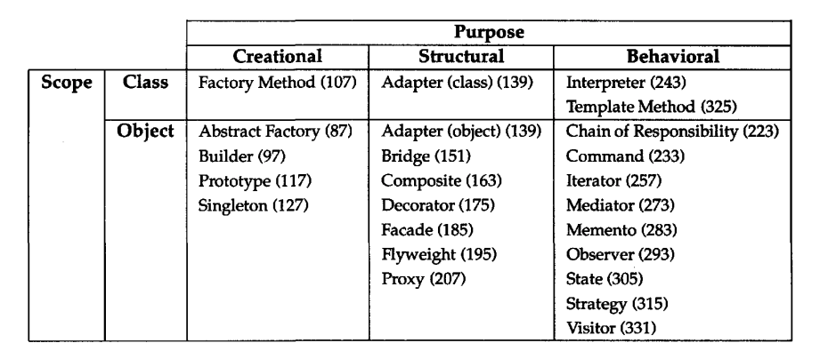
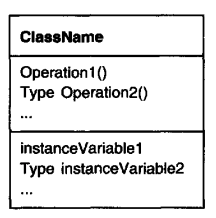
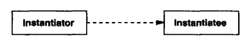
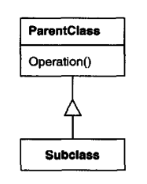
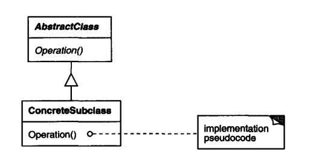
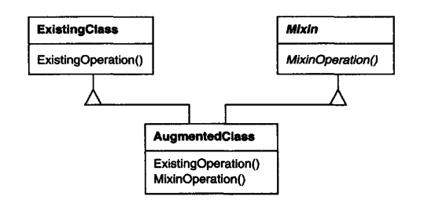
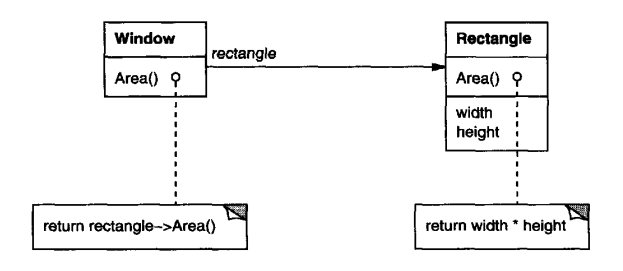
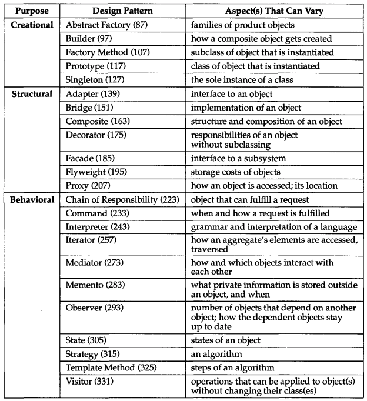

# Introduction
Designing object-oriented software is hard:
 * Factor objects into classes with the right granularity
 * Design should be specific for the problem but general enough to address future problems & requirements.
 * Avoid redesign or at least minimize it.

Yet, there are some noticeable patterns in experienced OO designers which help them make good designs - they reuse solutions that have worked well for them in the past, instead of starting from first principles
These patterns are solutions to common problems, which makes OO software more flexible, elegant & reusable.

Purpose of the book - record OO design experience in the form of design patterns.

## What Is a Design Pattern?
> Each pattern describes a problem which occurs over and over again in our environment, and then describes the core of the solution to that problem, in such a way that you can use this solution a million times over, without ever doing it the same way twice"

A pattern has four elements:
 * Name - a handle to quickly describe a design problem in a few words.
 * Problem - when to apply the pattern.
 * Solution - The elements which make up the design.
 * Consequences - results & trade-offs of applying the pattern

> A design pattern names, abstracts, and identifies the key aspects of a common design structure that make it useful for creating a reusable object-oriented design.

## Describing Design Patterns
This section covers how the patterns in the book are structured & the goal behind every part of the structure:
 * Pattern Name and Classification - Convey the essence of the pattern succinctly
 * Intent - answers "What does the pattern do? What's its rationale? What particular problem does it address?
 * Also Known As - other well-known names for the pattern if any
 * Motivation - An example scenario where the pattern can be put to use
 * Applicability - When can the pattern be applied?
 * Structure - A graphical representation of the classes in the pattern
 * Participants - Classes participating in the pattern & their responsibilities
 * Collaborations - How the participants collaborate to carry out their responsibilities
 * Consequences - What are the trade-offs and results of using the pattern
 * Implementation - Pitfalls, hints or techniques to be aware of while implementing the pattern
 * Sample Code - example implementation
 * Known Uses - Examples of the pattern found in real systems
 * Related Patterns - Other closely related design patterns

## The Catalog of Design Patterns
This section briefly covers the design patterns explored in the book & what they solve in a nutshell:
 * [Abstract Factory](./../ch03/01.abstract-factory) - Create related or dependent objects through a common interface without specifying the concrete type.
 * [Adapter](./../ch04/01.adapter) - Convert an incompatible interface to a compatible one, which the client expects.
 * [Bridge](./../ch04/02.bridge) - Decouple abstraction from implementation so that they can vary independently.
 * [Builder](./../ch03/02.builder) - Separate object construction from representation so that construction can support multiple representations.
 * [Chain of Responsibility](./../ch05/01.chain-of-responsibility) - Avoid coupling the sender of a request to its receiver by creating a chain of receivers.
 * [Command](./../ch05/02.command) - Encapsulate a request as an object, letting you support request history, undo/redo, logging, etc.
 * [Composite](./../ch04/03.composite) - Compose objects into tree structures to represent recursive hierarchies.
 * [Decorator](./../ch04/04.decorator) - Attach responsibilities to an object dynamically.
 * [Facade](./../ch04/05.facade) - Provide a unified interface to a set of interfaces in a subsystem.
 * [Factory Method](./../ch03/03.factory-method) - Define an interface for creating an object, but let subclasses decide the specific instance.
 * [Flyweight](./../ch04/06.flyweight) - Use sharing to support large numbers of small objects efficiently.
 * [Interpreter](./../ch05/03.interpreter) - Define a grammar for a language as well as an interpreter for that grammar.
 * [Iterator](./../ch05/04.iterator) - Provide a way to access elements of a collection without exposing internal representation.
 * [Mediator](./../ch05/05.mediator) - Define an object which encapsulates how a set of objects interact.
 * [Memento](./../ch05/06.memento) - Capture & externalize an object's internal state without violating encapsulation.
 * [Observer](./../ch05/07.observer) - Define a one-to-many dependency between objects (i.e. publish-subscribe model).
 * [Prototype](./../ch03/04.prototype) - Define a set of related objects via a common prototype. Derive new objects from this prototype.
 * [Proxy](./../ch04/07.proxy) - Control access to an object via a placeholder for it.
 * [Singleton](./../ch03/05.singleton) - Ensure a class has only one instance.
 * [State](./../ch05/08.state) - Alter object's behavior based on its internal state changes.
 * [Strategy](./../ch05/09.strategy) - Define a common interface for a family of algorithms & let them vary independently.
 * [Template Method](./../ch05/10.template-method) - Define a skeleton of an algorithm & defer some steps to subclasses.
 * [Visitor](./../ch05/11.visitor) - Represent an operation to be performed on a given object family.

## Organizing the Catalog

Interpreting the table:
 * Purpose - define what's a class' purpose.
    * Creational - concerned with object creation. 
    * Structural - concerned with object composition.
    * Behavioral - concerned with how objects behave & distribute responsibility.
 * Scope - whether a pattern concerns objects (dynamic, runtime) or classes (static, compile-time).

## How Design Patterns Solve Design Problems
How design patterns help you solve problems in your day to day.

### Finding Appropriate Objects
One way to decompose a system into a set of objects is to model the classes via entities found in the real world.

The problem with this approach is that the system will be able to represent today's reality but not tomorrow's. This trumps one of the core value propositions of software - being flexible to change.

Instead, throughout the lifecycle of a system, classes which don't have counterparties in the real-world will emerge - eg builders, composites, etc.

These classes help the system evolve to meet new requirements. Design patterns help you find less-obvious abstractions and how to implement them effectively.

### Determining Object Granularity
Objects can vary tremendously in size & number. Design patterns help you decide what should be in an object.

Different patterns provide ways to e.g. decompose an object into smaller parts (builder, visitor), handle large number of small objects (flyweight), represent a subsystem as an object (Facade).

### Specifying Object Interfaces
Design patterns help you specify object interfaces by identifying the key elements which go in an interface.

E.g. Memento specifies that an object should define two interfaces - public & restricted (which exposes internal details).
E.g. Decorator require that the interfaces of the decorators be identical to the decorated object.

### Interpreting Common UML Constructs
Defining a class - lines separate class name from operations from data.

Dashed Line - class instantiates objects of another class:

Line with arrow in the middle - inheritance:

Abstract classes are written in italic. Dog-eared box represents example implementation in pseudocode:

Mixin - provide optional interface of functionality through multiple inheritance:

### Specifying Object Implementation
Class inheritance == define object implementation in terms of another's implementation
Interface inheritance == define when an object can be used instead of another

Class inheritance is a mechanism for reusing functionality in a parent class. Additionally, it lets you define a family of objects with a common interface.

Common wisdom is to "program against an interface, not an implementation". I.e. use interfaces as much as you can.

However, you need to specify concrete implementations which implement the interfaces at some point in your program and certain design patterns help you encapsulate that process (abstract factory, factory method, etc).

### Putting Reuse Mechanisms to Work
Most people understand the primitives of OO programming - classes, interfaces, objects, etc.

The challenge is how to apply those primitives to build flexible, reusable software.

#### Inheritance versus Composition
Most common techniques for reusing functionality in OO systems - class inheritance & object composition.

Class inheritance is also referred to as "white-box reuse" - the internals of the inherited class are visible to the subclass.
Object Composition is referred to as "black-box reuse" - only the public API of the composed class is visible.

Inheritance is defined statically at compile-time and is easy to use. When you override an inherited operation, you're potentially overriding non-inherited operations as well.
This makes it easier to have high impact on implementation with low cost.

The disadvantages of inheritance:
 * You can't change the inherited class at runtime. With composition, you can change the composed object at runtime.
 * The subclass' implementation is heavily coupled with the base class' implementation. "Inheritance breaks encapsulation"
   * Any change in the base class will force all subclasses to change
 * If the current implementation doesn't fit a new domain, you want to use the class for, you'll have to rewrite the base class or change it altogether
   * This hinders a subclass' reusability
   * One cure for this is to only inherit abstract classes which have little to no implementation

Advantages of composition:
 * Objects are required to respect each others' interfaces, hence, encapsulation is not broken
 * Any object can be replaced by another at runtime as long as it has the same type (or interface)

> Favor object composition over class inheritance

#### Delegation
Two objects are involved in handling a request - a receiving object delegates operations to its delegate.

Example:

The object composition can be changed at runtime - if eg the Window becomes circular, it can change its delegate to be `Circle`.

The main issue with delegation is that dynamic code is harder to understand than static code.
Delegation is a good design choice only if it simplifies more than it complicates.

#### Inheritance versus Parameterized Types (Generics)
Generics lets you specify types without specifying the concrete other types it uses.

E.g. defining a list which can take any type for its element - `List<T>`.

Object Composition lets you change composed behavior at runtime.  
Inheritance lets you provide default implementations for operations and let subclasses override them.  
Generics let you change the types that a class uses.

Inheritance and Generics can't change at runtime.

#### Designing for Change
The key to writing reusable software lies in anticipating new requirements and changes to existing ones.
That way, you can write your software in a way that it evolves gracefully.

Design patterns help make some aspect of your system susceptible to change.

Common causes of redesign along with design patterns that address them:
 * Creating an object by specifying a concrete type explicitly (ie `new MyClass()`)
   * This commits you to a specific implementation instead of a particular interface. 
   * Design Patterns - Abstract Factory, Factory Method, Prototype
 * Depending on specific operations
   * This commits you to one way of satisfying a request
   * Design Patterns - Chain of Responsibility, Command
 * Dependence on hardware and software platform
   * This commits you to a particular hardware/software platform, making it hard to port your software to a different platform 
   * Design Patterns - Abstract Factory, Bridge
 * Dependency on object representation/implementation
   * Code which knows details of how an object is stored or implemented might have to change when the internal representation changes
   * Design Patterns - Abstract Factory, Bridge, Memento, Proxy
 * Algorithmic dependencies
   * Objects that depend on algorithms will have to change once the algorithm changes
   * Design Patterns - Builder, Iterator, Strategy, Template Method, Visitor
 * Tight Coupling
   * Classes which are tightly coupled are hard to reuse in isolation 
   * Also, tightly coupled systems lead to the necessity to understand the whole system to change a part of it
   * Design Patterns - Abstract Factory, Bridge, Chain of Responsibility, Command, Facade, Mediator, Observer
 * Extending functionality by subclassing
   * Subclassing requires one to understand the parent class in great detail
   * It can also lead to an explosion of classes even for small extensions
   * Composition provides a flexible alternative at the cost of more complicated design
   * Many design patterns use both techniques
   * Design Patterns - Bridge, Chain of Responsibility, Composite, Decorator, Observer, Strategy
 * Inability to alter classes conveniently
   * Sometimes you have to modify a class, which you're not allowed to modify
   * E.g. you don't have the source code
   * E.g. changing it will require changing a whole subsystem
   * Instead, you can hide the legacy interface behind a new interface which fits your use-case
   * Design Patterns - Adapter, Decorator, Visitor

These examples are different kinds of flexibility you can achieve via design patterns. Which of these features you need depends on the software you're building.

### Role of design patterns in different kinds of software
#### Application Programs
Internal reuse, maintainability and extension are high priorities.

These ensure you don't have as much overhead when extending the application leading to faster feature velocity.

Design patterns can help you:
 * have less dependencies which lead to a more extendable system
 * remove platform dependencies
 * separate a system into layers

#### Toolkits
Toolkits provide some general-purpose functionality in the form of libraries.

Writing toolkits is harder than application programs and loose coupling is all the more important.

Avoiding assumptions and unnecessary dependencies is crucial to make your toolkit reusable across many programs.

#### Frameworks
Frameworks provide a reusable design for a specific class of software.

Benefits:
 * Different applications have similar structure
 * Hard design decisions are already made for you

Frameworks are hardest to write because its architecture is the main value proposition for its usage.

Differences between design patterns and frameworks:
 * Design patterns are abstract, frameworks are concrete - frameworks can be directly used in code. Patterns need to be translated to the specific program being written.
 * Design patterns are smaller architectural elements than frameworks.
 * Frameworks are domain-specific, design patterns are not.

## How to Select a Design Pattern
There are many design patterns in this book's catalog. How to choose the design pattern which is right for your problem?
 * Consider which design problems are solved by which patterns
 * Scan the "Intent" sections
 * Study how patterns are related to each other
 * Study patterns of a similar type - creational, structural, behavioral
 * Examine the [cause of redesign](#designing-for-change)
 * Consider what you might want to be able to change in the future

## How to Use a Design Pattern
 * Read the pattern once for an overview
 * Go back and study the "Structure", "Participants" and "Collaborations" sections
 * Check out the "Sample Code" sections
 * Choose names for your participants which are specific for your application
   * But still consider indicating which pattern you're implementing in your class names - e.g. `SelectionSortStrategy` 

Design patterns should not be used without purpose. 
The cost of using them is more complex programs.
Only use design patterns if their value outweighs the cost in your specific context.
