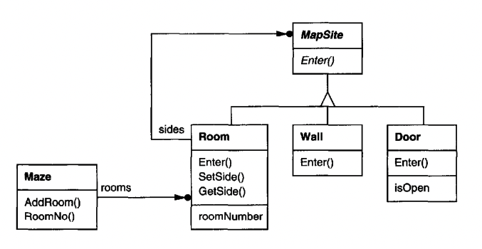

# Introduction

Creational design patterns abstract the instantiation process - ie, making the system independent of how its objects are created, composed and represented.

They encapsulate knowledge about which concrete classes the system uses. All the system knows about these classes is their interfaces.
Creational patterns give flexibility over **what** gets created, **who** creates it, **how** it gets created, and **when**.

In this section, the patterns will be presented by solving the same problem - creating a maze. 


```java
public enum Direction {North, South, East, West};
```

`MapSite` is the common abstract class for all the components of a maze:
```java
public abstract class MapSite {
  public abstract void enter();
}
```

The concrete objects a maze has is a `Room`, `Wall` and `Door`:
```java
public class Room extends MapSite {
    private List<MapSite> sides;
    int roomNumber;

    public Room(int roomNo) { ... }

    MapSite getSide(Direction dir) { ... }
    void setSide(Direction dir, MapSite ms) { ... }

    @Override
    public void enter() { ... }
}

public class Wall extends MapSite {
    public Wall() { ... }

    @Override
    public void enter() { ... }
}

public class Door extends MapSite {
    private Room room1;
    private Room room2;
    boolean isOpen;

    public Door(Room room1, Room room2) { ... }

    @Override
    public void enter() { ... }

    Room otherSideFrom(Room r) { ... }
}
```

The `Maze` class represents a collection of rooms:
```java
public class Maze {
    public Maze() { ... }

    public void addRoom(Room r) { ... }
    Room roomNo(int n) { ... }
}
```

Finally, `MazeGame` creates the maze for our game:
```java
public class MazeGame {
    Maze createMaze() {
        Maze aMaze = new Maze();
        Room r1 = new Room(1);
        Room r2 = new Room(2);
        Door theDoor = new Door(r1, r2);

        aMaze.addRoom(r1);
        aMaze.addRoom(r2);

        r1.setSide(North, new Wall());
        r1.setSide(East, theDoor);
        r1.setSide(South, new Wall());
        r1.setSide(West, new Wall());

        r2.setSide(North, new Wall());
        r2.setSide(East, new Wall());
        r2.setSide(South, new Wall());
        r2.setSide(West, theDoor);

        return aMaze;
    }
}
```

The problem with this approach of creating a maze is its inflexibility - the layout of the maze and its concrete types are hard-coded.
Creational patterns can help to make this design more flexible - easier to change the classes that define the components of the maze.

Example - you want to enhance the game to support enchanted mazes, with `DoorNeedingSpell`, `EnchantedRoom`, etc.

How to solve this issue:
 * `CreateMaze` can call static functions for instantiating the objects, instead of constructors (Factory Method)
 * `CreateMaze` can be passed an object as parameter which instantiates the objects which the maze needs (Abstract Factory)
 * `CreateMaze` can be passed an object as parameter that can create a maze with operations such as adding doors, rooms, etc (Builder)
 * `CreateMaze` can be passed objects which represent prototypes for the objects it needs & you need to copy them to create your own ones (Prototype)

The remaining creational pattern (Singleton) can ensure there's only one maze per game and that all game objects have access to it without using global variables or functions.
