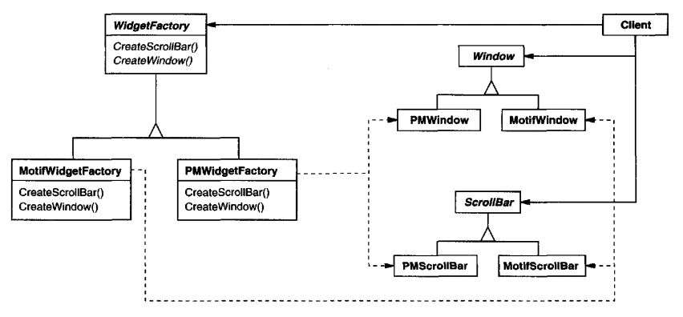
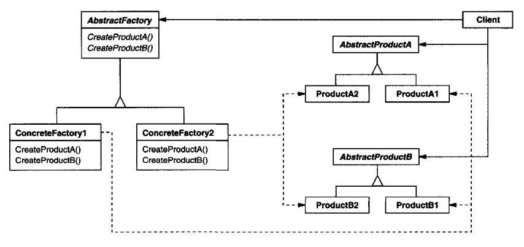

# Abstract Factory

## Intent
Providing an interface for creating families of related or dependent objects without specifying their concrete classes.

## Also Known As
Kit

## Motivation
A user interface can have different look-and-feel families - e.g. UIs on Windows look very differently compared to MacOS.
These different families have the same types of widgets which all share the same look-and-feel standard - scroll bars, windows, buttons.

To be portable across multiple such standards, an application should not hard-code the first standard it happened to implement.

How to solve this?
 * Define an abstract `WidgetFactory` which has factory methods for each type of widget
 * The factory methods instantiate concrete types, based on the look-and-feel family being used, but the client gets an abstract class instead
 * The factory also enforces that widgets of a particular family only use widgets of the same family



## Applicability
When to use Abstract Factory?
 * When a system needs to be unaware of how its products are created, composed & represented
 * When a system needs to be configured with one among a multiple family of products
 * You need to enforce a constraint where a product of a given family can only use other products of the same family
 * To provide a class library of related products and you only want to expose their interfaces, rather than concrete types

## Structure


## Participants
 * AbstractFactory (WidgetFactory) - an interface for operations that create abstract products of the same family
 * ConcreteFactory (MotifWidgetFactory, PMWidgetFactory) - implement the factory operations for the given family
 * AbstractProduct (Window, ScrollBar) - declares the interface for a product type, which clients have access to
 * ConcreteProduct (MotifWindow, MotifScrollBar) - a concrete product which adheres to a family, created by `ConcreteFactory`
 * Client - uses only the interfaces for the provided product types

## Collaborations
 * A single instance of `ConcreteFactory` is created at runtime. This instance creates products of a given family. 
   Clients which want to use a different family should use a different factory implementation.
 * `AbstractFactory` defers creation of product objects to its `ConcreteFactory` subclass

## Consequences
 * It isolates concrete classes - the factory classes control which instances your application use. Client code doesn't have direct access to concrete class types.
 * It makes exchanging product families easy - simply change the concrete factory implementation you're using to instantiate your objects.
 * It promotes consistency among products - you can enforce that products of a given family only work with other products of the same family.
 * Supporting new kinds of products is difficult - e.g. adding a `TextBox` when one is not supported yet. This involves extending the factory interface & all concrete implementations.

## Implementation
Useful techniques for implementing Abstract Factory:
 * Factories as singletons - an app usually needs only one instance of a factory, so it's best to complement this with the Singleton pattern
 * Creating the products - The most common way is to use factory methods, but if many product families are possible, you can also use the Prototype pattern.
 * Defining flexible factories - usually, factories have a separate method for each product type, which makes adding new product types cumbersome.
   Alternatively, you can have a single `make(ProductType pt)` factory method which creates a new product based on the type passed.
   The problem with this approach is that you'll need to type cast the specific product returned on the client-side.

## Sample Code
Example default `MazeFactory`:
```java
public class MazeFactory {
    public Maze makeMaze() { return new Maze(); }
    public Wall makeWall() { return new Wall(); }
    public Room makeRoom(int n) { return new Room(n); }
    public Door makeDoor(Room r1, Room r2) { return new Door(r1, r2); }
}
```

Usage:
```java
public class MazeGame {
    Maze createMaze(MazeFactory factory) {
        Maze aMaze = factory.makeMaze();
        Room r1 = factory.makeRoom(1);
        Room r2 = factory.makeRoom(2);
        Door theDoor = factory.makeDoor(r1, r2);

        aMaze.addRoom(r1);
        aMaze.addRoom(r2);

        r1.setSide(North, factory.makeWall());
        r1.setSide(East, theDoor);
        r1.setSide(South, factory.makeWall());
        r1.setSide(West, factory.makeWall());

        r2.setSide(North, factory.makeWall());
        r2.setSide(East, factory.makeWall());
        r2.setSide(South, factory.makeWall());
        r2.setSide(West, theDoor);

        return aMaze;
    }
}
```

How to create an enchanted maze?
```java
public class EnchantedMazeFactory extends MazeFactory {
  @Override
  public Room makeRoom(int n) { return new EnchantedRoom(n); }

  @Override
  public Door makeDoor(Room r1, Room r2) { return new DoorNeedingSpell(r1, r2); }
}
```

How to create a maze with bombs?
```java
public class BombedMazeFactory extends MazeFactory {
  @Override
  public Room makeRoom(int n) { return new RoomWithBomb(n); }

  @Override
  public Wall makeWall() { return new BombedWall(); }
}
```

Notice that the `MazeFactory` is a concrete class which is subclassed to reuse its default implementations. 
This avoids having to define a separate `AbstractMaze` interface. This is a typical way to implement Abstract Factory.

## Related Patterns
Abstract factory classes are often implemented via factory methods (Factory Method), but they can also be imlpemented via prototypes (Prototype).

A concrete factory is usually a Singleton.
