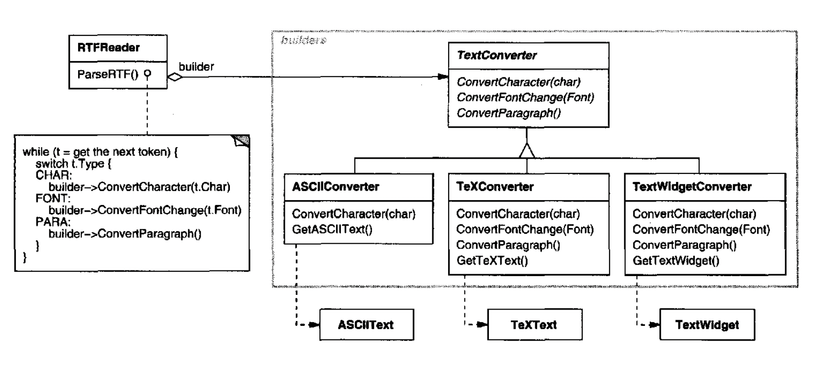
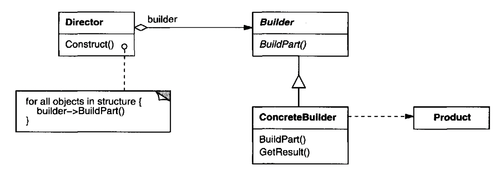
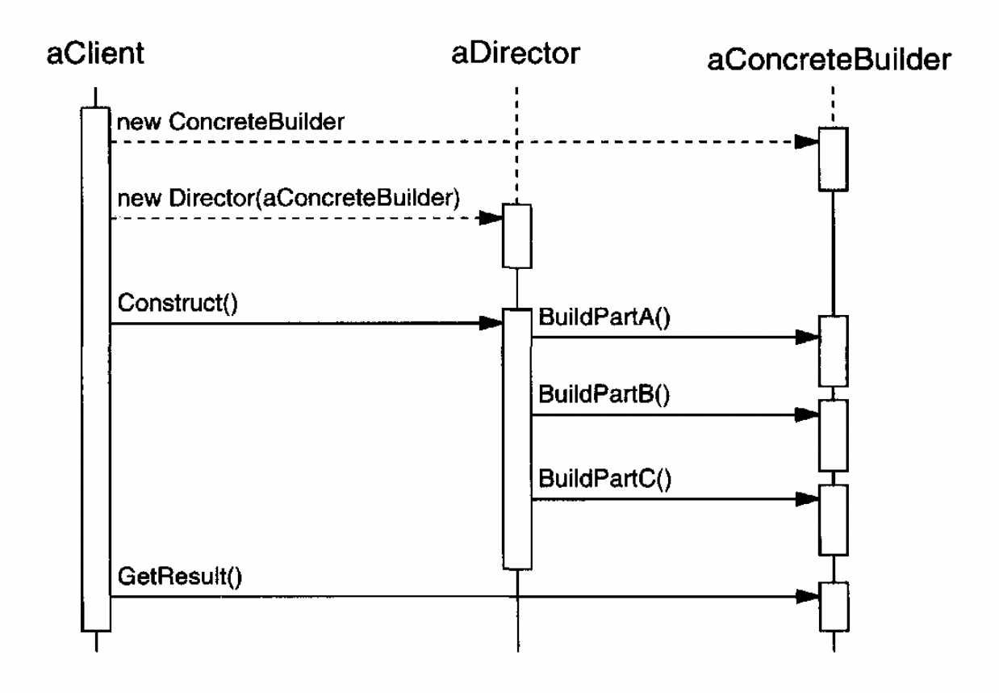

# Builder

## Intent
Separate the construction of a complex object from its representation so that the same construction process can create multiple representations.

## Motivation
An RTF reader should be able to convert a rich-text-format document to other types of text - eg ASCII, TeX, etc.

It should be easy to create new conversions without changing the RTF reader's representation.

To do this, one can pass a `TextConverter` class to the RTF reader which is responsible for converting the RTF tokens as they are encountered.
Subclasses of `TextConverter` specialize in different types of conversions - eg ASCII, TeX, etc.



The `Builder` pattern gives a name to this mechanism.
Each converter class is a `builder`, while the RTF reader is the `director`.

In this example, the Builder pattern allows us to separate the conversion algorithm from the final representation.
This lets us keep the RTF Reader implementation in tact, while allowing us to flexibility to change the conversion classes on demand.

## Applicability
Use the Builder pattern when:
 * The algorithm for constructing an object should be separate from the representation of the object
 * The construction process should allow different representations for the object that's constructed.
 * You want to get rid of a constructor with many parameters which are optional

## Structure


## Participants
 * Builder (TextConverter) - Interface for creating parts of a Product object.
 * ConcreteBuilder (ASCIIConverter, TeXConverter) - implements the construction process + provides interface for retrieving the constructed object.
 * Director (RTFReader) - Encapsulates object construction done via a `Builder` object.
 * Product (ASCIIText, TeXText) - The object under construction. 

## Collaborations
 * Client creates the `Director` and configures it with the target `Builder`
 * `Director` notifies the `Builder` whenever a part of the object needs to be constructed
 * `Builder` handles requests & builds the object step by step
 * The client retrieves the final `Product` from the `Builder`



## Consequences
 * It lets you vary a product's internal representation - just change the builder in use
 * It isolates code for construction and representation
 * Finer control over the construction process - iterative construction process vs. one-shot construction

## Implementation
 * There's an abstract `Builder` class which defines the construction operations, but they do nothing by default.
 * The `Builder` class should be general enough to represent multiple different internal representations.
 * There is no abstract class/interface for the built products because their representations are drastically different, hence, it makes no sense to define one.
    * Since the client configures the `Director` with a concrete builder, it can retrieve the concrete product using the concrete builder's interface.
    * Note that the abstract `Builder` class doesn't have a method for retrieving the constructed product, but the concrete builders do.
 * The `Builder` abstract class has empty methods by default to avoid clients overriding methods they're not interested in.
    * e.g. ASCIIConverter is not interested in converting special RTF symbols. It's only interested in the actual characters.

## Sample Code
We'll implement the Builder pattern for constructing the maze, seen in the previous chapters.

First, the abstract `Builder` class:
```java
public abstract class MazeBuilder {
  public void BuildMaze() {}
  public void BuildRoom(int room) {}
  public void BuildDoor(int roomFrom, int roomTo) {}
  public Maze GetMaze() { return null; }
}
```

In this case, the `GetMaze()` method is defined in the abstract class because the constructed product has a common interface.

The `Director` is the `MazeGame` class:
```java
public class MazeGame {
  public Maze CreateMaze(MazeBuilder builder) {
    builder.BuildMaze();
    builder.BuildRoom(1);
    builder.BuildRoom(2);
    builder.BuildDoor(1, 2);
      
    return builder.GetMaze();
  }
}
```

The `MazeBuilder` can be subclassed to create concrete maze builders:
```java
// Creates a standard maze
public class StandardMazeBuilder extends MazeBuilder {
  @Override
  public void BuildMaze() { ... }
  public void BuildRoom(int room) { ... }
  public void BuildDoor(int roomFrom, int roomTo) { ... }
    
  public Maze GetMaze() { ... }
}

// Creates an enchanted maze
public class EnchantedMazeBuilder extends MazeBuilder {
  ...
}

// Doesn't create a maze at all, but counts the number of doors/rooms/etc
public class CountingMazeBuilder extends MazeBuilder {
  ...

  public int GetRoomsCnt() { ... }
  public int GetDoorsCnt() { ... }
}
```

Note that the fluent interface pattern can be leveraged to make the build process look more fancy:
```java
public abstract class MazeBuilder {
  public MazeBuilder BuildMaze() { return this; }
  public MazeBuilder BuildRoom(int room) { return this; }
  public MazeBuilder BuildDoor(int roomFrom, int roomTo) { return this; }
  public Maze GetMaze() { return null; }
}

public class MazeGame {
  public Maze CreateMaze(MazeBuilder builder) {
    return builder
      .BuildMaze().BuildRoom(1).BuildRoom(2).BuildDoor(1, 2)
      .GetMaze();
  }
}
```

Similar to other creational patterns, you can scale directors and builders independently:
```java
public Maze CreateComplexMaze(MazeBuilder builder) {
  builder.BuildMaze();
  builder.BuildRoom(1);
  ...
  builder.BuildRoom(1001);

  return builder.GetMaze();
}
```

Creating a new type of builder allows you to use it with all available mazes, instead of creating special mazes, tailored for the specific builder.

## Known Uses
Builder is a common pattern in Smalltalk-80 (interpreter):
 * The `Parser` class is a director which takes a `ProgramNodeBuilder` as argument
 * Once the construction is done, the parse tree is retrieved from the client via `ProgramNodeBuilder`

## Related Patterns
Abstract Factory is very similar to Builder as it also may construct complex objects.

The difference is that AF constructs the object in a single step, the Builder does it step by step.
Also, AF is usually used to constructs families of similar objects. Builder constructs a single object.

Builders are often used to create Composites due to their complicated construction nature.
