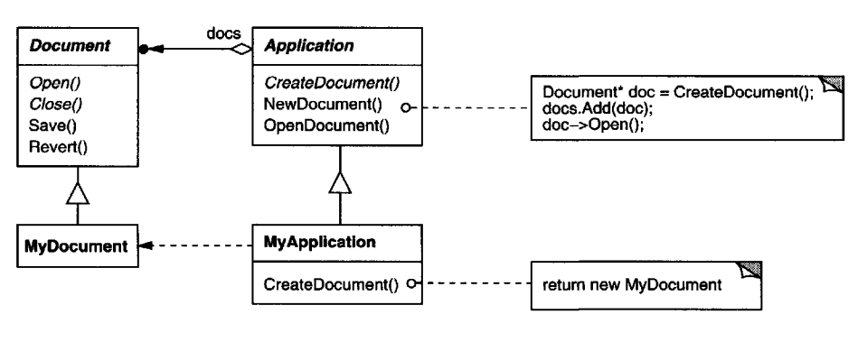
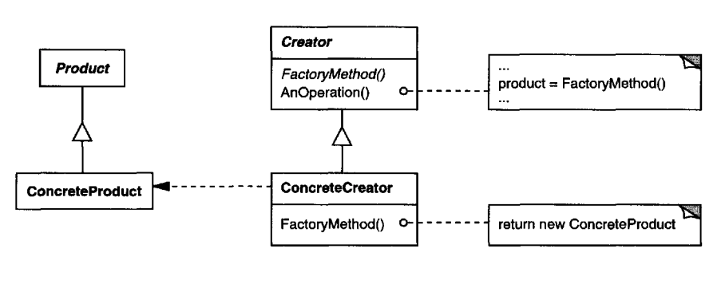
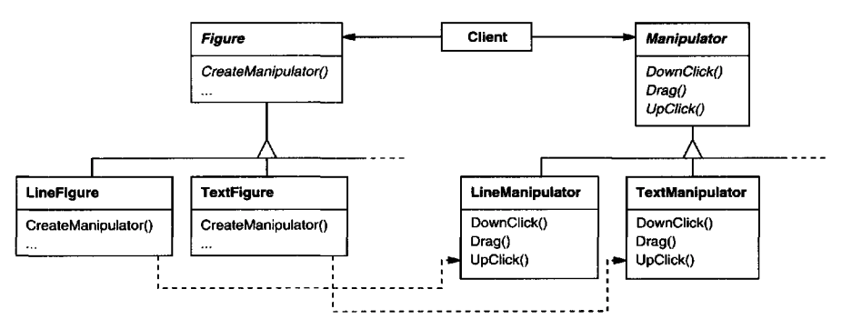

# Factory Method

## Intent
Define interface for creating objects but let subclasses implement the instantiation.

## Also Known As
Virtual Constructor

## Motivation
Frameworks often use some classes throughout their lifecycle, whose implementation is intended to be defined by framework users.

Using abstract classes, frameworks can use the abstract methods in such classes, which users can define. 
But how would the framework handle instantiation of the concrete user-defined implementations?

The Factory Method pattern is a solution - it encapsulates the knowledge of concrete object creation & moves that knowledge outside the framework.

Example:


## Applicability
Use factory methods when:
 * a class can't anticipate the class of objects it must create
 * a class wants subclasses to specify which objects it is to use
 * classes want part of its implementation to be handled by helper subclasses & you want to place the knowledge of which helper class is instantiated at a single place

## Structure


## Participants
 * Product (Document) - interface for the objects being created
 * ConcreteProduct (MyDocument) - specific object which is created & implements `Product`
 * Creator (Application) - Declares the factory method, optionally invokes it and optionally provides a default implementation
 * ConcreteCreator (MyApplication) - Overrides the factory method to return a `ConcreteProduct`

## Consequences
 * You can avoid binding low-level classes into your high-level components.
 * Provides hooks for subclasses to extend an object, which is used throughout the abstract class
 * Connects parallel class hierarchies - ie one class representing a figure and one class representing how a figure is moved. The two concrete implementations are closely related:


Using a factory method in this example, one can localize the knowledge of which two class pairs should be used in conjunction.

 * Disadvantage - all concrete products should implement the same interface as the abstract factory method's return value defines the interface being returned.
 * Disadvantage - clients have to subclass creators to create concrete objects, which increases complexity.

## Implementation
 * Two major varieties - `Creators` specify a default implementation or not.
 * Parameterized factory methods - specify which class is to be instantiated based on a parameter. This saves you from having to subclass the creator.
```java
public class Creator {
  public Product create(ProductType type) {
    if (type == ProductType.MINE) {
      return new MyProduct();
    } else if (type == ProductType.YOURS) {
      return new YourProduct();
    }

    return null;
  }
}
```

This pattern can also be extended by subclassing & providing your own product types, or change the objects returned via the already defined types.

 * Lazy initialization - instead of creating new objects every time, you can cache already created objects & create those cached object instances on each invocation. This is helpful for objects whose construction is heavy.
 * Using templates (generics) to avoid subclassing - instead of subclassing, you can define a generic method which creates a product based on the type you specify.

Implementing this in java is a bit of a workaround due to limitations of java generics:
```java
public class Creator {
  public <T> T create(Class<T> clazz) {
    try {
      return clazz.getConstructor().newInstance();
    } catch (Exception e) {
      throw new RuntimeException(e);
    }
  }
}

// Usage:
MyProduct p = new Creator().create(MyProduct.class);
```

## Sample Code
Here's an example of the `Maze`'s object construction problem solved using factory methods:
```java
public class MazeGame {
  Maze CreateMaze() {
    Maze m = makeMaze();
    Room r1 = makeRoom(1);
    Room r2 = makeRoom(2);
    Door door = makeDoor(r1, r2);

    m.addRoom(r1);
    m.addRoom(r2);

    r1.setSide(North, makeWall());
    r1.setSide(East, door);
    r1.setSide(South, makeWall());
    r1.setSide(West, makeWall());

    r2.setSide(North, makeWall());
    r2.setSide(East, makeWall());
    r2.setSide(South, makeWall());
    r2.setSide(West, door);
        
    return m;
  }

  public Maze makeMaze() { return new Maze(); }
  public Room makeRoom(int n) { return new Room(n); }
  public Wall makeWall() { return new Wall(); }
  public Door makeDoor(Room r1, Room r2) { return new Door(r1, r2); }
}
```

Having this structure, subclasses can define their own components:
```java
public class EnchantedMazeGame extends MazeGame {
  @Override
  public Room makeRoom(int n) { return new EnchantedRoom(n, castSpell()); }

  @Override
  public Door makeDoor(Room r1, Room r2) { return new DoorNeedingSpell(r1, r2); }
}

public class BombedMazeGame extends MazeGame {
  @Override
  public Wall makeWall() { return new BombedWall(); }

  @Override
  public Room makeRoom(int n) { return new RoomWithBomb(n); }
}
```

## Related Patterns
 * Abstract Factory is often implemented with Factory Methods
 * Factory Methods are usually invoked within Template Methods.
