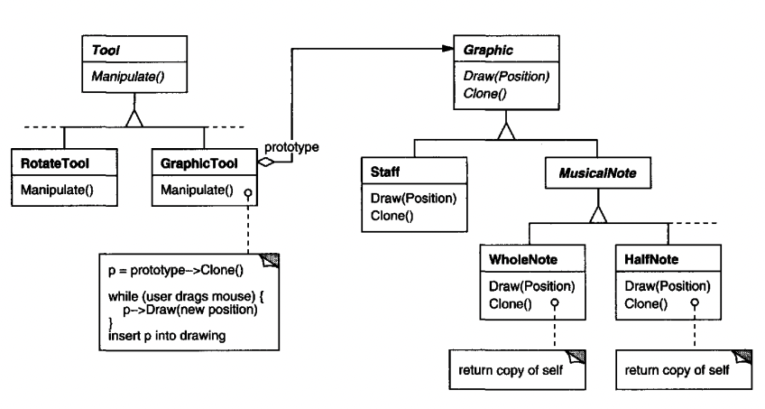
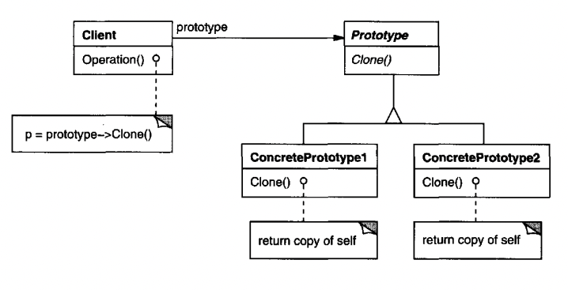

# Prototype

## Intent
Define a prototypical object instance which you can copy.

## Motivation
A music editor has functionality to create various music elements (e.g. notes, staves) & add them on the screen to create a music composition.

There's a class called `GraphicTool` which allows one to drag-n-drop new graphic elements on the screen.

Problem - how can the `GraphicTool` instantiate user-defined types & manipulate them on the screen, given that `GraphicTool` is part of a framework?
Answer - create a common interface with a `clone()` function which allows `GraphicTool` to copy prototypical instances of your user-defined types & manipulate them via a common interface.



An added benefit is that using prototypes you can avoid creating too many subclasses because when subclasses are effectively different configurations of a given class, you can just create different prototypes representing the different configurations.

## Applicability
Use `Prototype` when the system should be independent of how its products are created & represented. Also:
 * when the classes have to instantiated dynamically at runtime.
 * to avoid building a factory class hierarchy which mimics the class hierarchy of products.
 * when instances of a class can have one of only a bunch of possible configurations.

## Structure


## Participants
 * Prototype (Graphic) - declares an interface for `clone`
 * ConcretePrototype (Staff, WholeNote, HalfNote) - concrete implementation that can `clone` itself
 * Client (GraphicTool) - creates new objects by asking a prototype to clone itself

## Consequences
Prototype shares many of the consequences of Abstract Factory and Builder - clients need not know about the concrete products they're creating.

Added benefits:
 * Products can be added and removed at runtime
 * Specifying new objects by varying values - instead of subclassing to change an object's configuration, you can create different prototypes of the same class
 * Specifying new objects by varying structure - you can clone an entire hierarchy of objects, defined as a prototype. E.g. a composite structure can be copied, reused & extended when defined as a prototype.
 * Reduced subclassing - Factory Method often produces a hierarchy of `Creator` classes, which parallels the products hierarchy. With Prototype, this can be avoided.

Main drawback:
 * Each subclass needs to implement `clone` which might be difficult for certain kinds of objects - eg ones with circular dependencies.

## Implementation
 * Using a prototype manager - if the # of prototypes in a system is dynamic, you can keep a registry of available prototypes.
 * Implementing `clone` - you need to differentiate between shallow & deep copying. A hack for implementing `clone` is to serialize & deserialize an object if it supports it.
 * Initializing clones - `clone` doesn't support adding any parameters to eg initialize a prototype's internal state. Therefore, you might have to supplement prototypes with an `initialize` function or additional setters.

## Sample Code
We'll define a `MazePrototypeFactory` which has factory methods for creating maze objects by leveraging the prototype pattern:
```java
public class MazePrototypeFactory extends MazeFactory {
  private final Maze mazeProto;
  private final Wall wallProto;
  private final Room roomProto;
  private final Door doorProto;

  public MazePrototypeFactory(Maze m, Wall w, Room r, Door d) {
    this.mazeProto = m;
    this.wallProto = w;
    this.roomProto = r;
    this.doorProto = d;
  }

  @Override
  public Maze makeMaze() {
    return mazeProto.clone();
  }

  @Override
  public Wall makeWall() {
    return wallProto.clone();
  }

  @Override
  public Room makeRoom() {
    return roomProto.clone();
  }

  @Override
  public Door makeDoor(Room r1, Room r2) {
    Door d = doorProto.clone();
    d.initialize(r1, r2);
    return d;
  }
}
```

To create a standard maze:
```java
MazePrototypeFactory f = new MazePrototypeFactory(new Maze(), new Wall(), new Room(), new Door());
Maze m = game.createMaze(f);
```

To create a bombed maze:
```java
MazePrototypeFactory f = new MazePrototypeFactory(new Maze(), new BombedWall(), new RoomWithABomb(), new Door());
Maze m = game.createMaze(f);
```

## Related Patterns
Prototype and Abstract Factory are competing patterns, but they can also be used together. An abstract factory might store a set of prototypes from which objects are initialized.

Designs that make use of Decorator and Composite can also benefit from Prototype.
