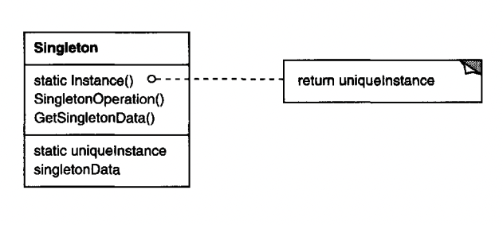

# Singleton

## Intent
Ensure a class has only one instance & provide a global access to it.

## Motivation
Some classes have the constraint that they must be instantiated only once in an application.

Example - file system, window manager.

One option to achieve this is to use a global variable. The problem is that clients can freely change the object to something else.
A better solution is for a class to keep track of its sole instance & provide a single point of access to that instance.

## Applicability
Use the Singleton pattern when:
 * there must be exactly one instance of a class
 * the sole instance has to be extensible by subclassing and clients should be able to use an extended instance without modifying their code

## Structure


## Participants
 * Singleton - defines a static `Instance` method that lets clients access to the global instance & is responsible for managing how the instance is initialized

## Collaborations
 * Clients access the singleton instance through the `Instance` method

## Consequences
 * Controlled access to a sole instance
 * Reduced namespace - global variables pollute the global namespace, whereas singleton does not
 * Can be subclassed
 * Can be extended to permit a variable number of instances
 * The static `Instance` method can't be overriden by subclasses, but it is possible to implement it in a way, which allows the singleton to be extended

## Implementation
Implementation issues to consider:
 * Ensuring a unique instance can be achieved by using a static method & a private (or protected) constructor
 * Lazy initialization can be achieved if need be, but it's preferable to use a static object regardless of the performance consequences. (Effective Java recommendation)
 * Subclassing the singleton - this can be achieved by defining a registry of singletons, which is populated by subclasses or environment variables.
```java
public static class MySingleton {
  private static MySingleton instance;

  public static MySingleton getInstance() {
    if (instance == null) {
      instance = lookup(System.getenv("SINGLETON"));
    }
      
    return instance;
  }
    
  // ...
}
```

## Sample Code
```java
public static class MazeFactory {
  private static MazeFactory instance = new MazeFactory();

  public static MazeFactory getInstance() {
    return instance;
  }

  private MazeFactory() {}
}
```

A more idiomatic way to achieve this as advised in the Effective Java book:
```java
public enum MazeFactory {
  INSTANCE;

  int value;
  public int getValue() {
    return value;
  }

  public void setValue(int value) {
    this.value = value;
  }
}
```

The `value` related code is just an example of adding some sort of implementation to the enum.

If the singleton needs to support different instance types:
```java
public static class MazeFactory {
  private static Map<String, MazeFactory> instances = new HashMap<>() {{
    put("bombed", new BombedMazeFactory());
    put("enchanted", new EnchantedMazeFactory());
  }};

  public static MazeFactory getInstance() {
    return instances.getOrDefault(System.getenv("SINGLETON"), new MazeFactory());
  }

  private MazeFactory() {}
}
```

## Related Patterns
Many patterns can be implemented using Singleton, e.g. AbstractFactory.
