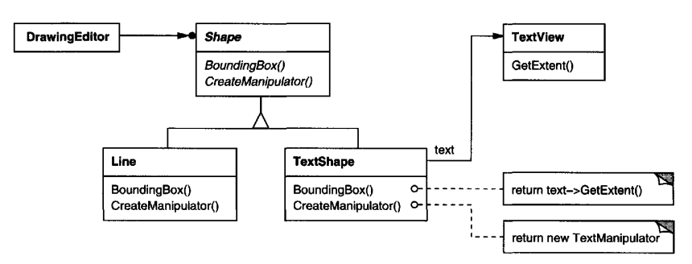
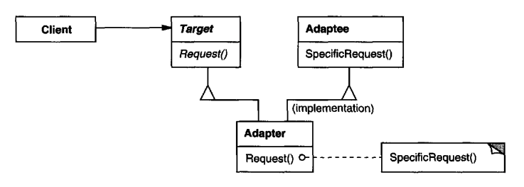
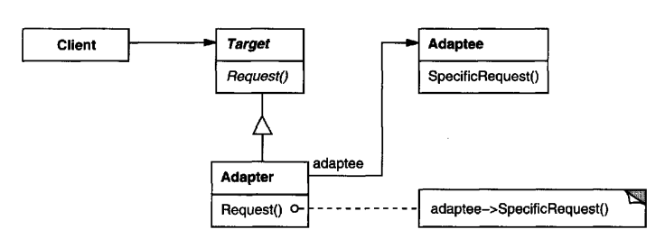
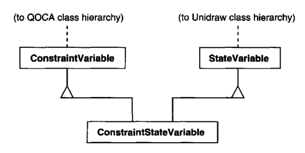

# Adapter

## Intent
Convert an interface of a class to another one, which a client expects.

## Motivation
You might have an application which is used to working with a domain-specific interface and you want to integrate into it a third-party library whose code you don't have access to.
The third-party lirary uses a different incompatible interface.

Via the Adapter pattern, you can connect the incompatible interface to the domain-specific interface the rest of your application expects.

Example - A drawing editor lets users draw & arrange graphical elements on a canvas.
The main abstraction is a class called `Shape` which knows how to draw itself.

Most of the shapes in our app implement this interface & they can be used, but there is a `TextView` shape, coming from a third-party toolkit library which allows displaying & editing text, but doesn't conform to the `Shape` interface.
Implementing this widget yourself would be hard because `TextView` is a non-trivial component.

Instead, we can define a `TextShape` class which adapts the `TextView` to the `Shape` interface.
This can be achieved by:
 * implementing `Shape` & inheriting `TextView` (class adapters)
 * composing a `TextView` and implementing `Shape` (object adapters)

Class adapters often require multiple inheritance which makes them inappropriate for most programming languages.

Object adapter example:

In the above example, the `TextManipulator` is another class defined by us which knows how to animate a shape in response to user input.

## Applicability
Use the Adapter pattern when:
 * you want to use an existing class which has an incompatible interface
 * you want to implement a reusable class which can cooperate with unforeseen classes in the future, which have incompatible interfaces
 * you want to adapt the interface of many subclasses by not subclassing each one of them. How? - adapt the interface of their parent class. This is applicable to object adapters only.

## Structure
Class Adapter:

Object Adapter:

## Participants
 * Target (Shape) - The domain-specific interface the Client requires
 * Client (DrawingEditor) - Collaborates with objects which implement Target
 * Adaptee (TextView) - An existing interface which needs to be adapted
 * Adapter (TextShape) - Adapts the interface of Adaptee to Target

## Collaborations
 * Clients call operations on the Adapter instance which are forwarded to the Adaptee

## Consequences
A class adapter:
 * adapts an Adaptee by inheriting it. Therefore, using class adapters you can't adapt other subclasses
 * allows you to override some of Adaptee's behavior

An object adapter:
 * lets an Adapter work with many Adaptees
 * can't override Adaptee's behavior

Other Concerns:
 * Pluggable adapters
 
An unsusual use-case for the Adapter pattern is to build your `Target` API with future adapters in mind. 
The general recommendation is to keep the expected interface small to allow for more & simpler adapters.

Example - a `TreeDisplay` class which is intended to visualize hierarchies can be made with future adapters in mind by using a small interface which can easily be adapted.

 * Two-way adapters - an Adapter hides the interface of the Adaptee. 
It is possible to implement the `Adapter` interface to conform to the `Adaptee` interface as well as the `Target` interface so that it can be used for both use-cases.

This, however, requires using a class adapter, which demands using multiple inheritance:

## Implementation
TODO

## Sample Code
TODO
