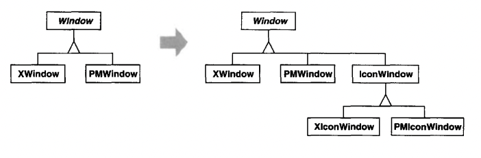
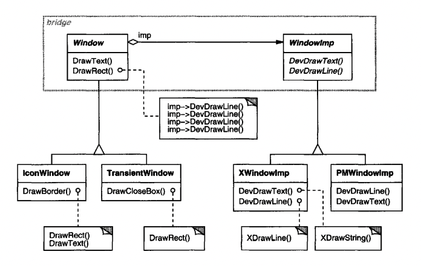
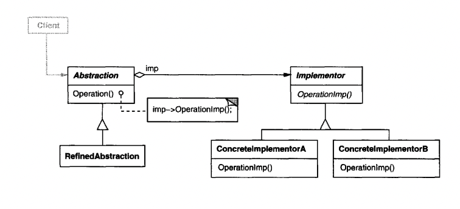

# Bridge

## Intent
Decouple abstraction from implementation so that they can vary independently.

## Motivation
A typical way to extend an abstraction which can have multiple implementations is to use inheritance.
This approach isn't always ideal because it binds the implementations to the abstraction permanently.
This makes it difficult to modify & reuse the abstractions & implementations independently.

Example - a `Window` class which can have different implementations for different platforms.

Initially, using inheritance does the trick, but if the class needs to support different inheritance dimensions - eg platform-specific implementations & window-type-specific implementations, this can result in an explosion of classes.


In addition to this, this approach makes the client code platform dependent, because the client has to choose which platform-specific class to instantiate - eg `XWindow` or `PMWindow`. 
Porting the code to a new platform would require changes in the code & recompilation.

The Bridge pattern addresses these two problems by having separate class hierarchies for platform-specific windows & different window types:


This decouples the window abstractions from the platform-specific implementations.

## Applicability
Use the Bridge pattern when:
 * you want to avoid a binding between an abstraction and an implementation. This can be useful if the implementation needs to be switched or determined at runtime.
 * Both the abstraction and the implementation have to be extensible by subclassing
 * Changes in the implementation should not impact clients - they shouldn't have to recompile
 * You have a class explosion when an inheritance hierarchy is trying to represent multiple dimensions
 * You want to reuse an implementation across multiple clients

## Structure


## Participants
 * Abstraction (Window) - defines the abstractions interface & maintains a reference to the implementation
 * RefinedAbstraction (IconWindow) - a concrete implementation of the Abstraction interface
 * Implementor (WindowImp) - Defines the implementation interaface. This interface can vary greatly from the abstractions interface.
 * ConcreteImplementor (XWindowImp, PMWindowImp) - a concrete implementation of the Implementor interface.

## Consequences
 * Decoupling interface & implementation
    * an implementation's interface can vary independently of the abstraction
    * the implementation can be specified & changed at run-time
    * changing the implementation doesn't cause a change in the abstraction & doesn't require recompilation of that part of the system
 * Hiding implementation details - clients are unaware of how the implementation works and if there are any tricks behind the scenes - eg reusing an implementation for multiple abstractions

## Implementation
Issues to consider:
 * Only one implementor
    * if you have a single implementation, you could omit the Implementation interface & use a concrete class directly. This is a degenerate version of the Bridge pattern.
    * however, you should consider that this approach does not shield the abstraction from changes in the implementation, leading to recompilation
 * How, when and where to instantiate the implementation - there are multiple options
    * do that in the Abstraction constructor so that clients don't need to make that call
    * extract that in a separate factory so that the Abstraction doesn't depend on concrete implementations
    * dynamically change the implementation at runtime once conditions change - eg a collection grows beyond a certain point, change the internal implementation to best suit the scale

## Sample Code
Example abstraction (Window) and implementation (WindowImpl) interfaces:
```java
public abstract class Window {
  private final WindowImpl impl;

  public Window(WindowImpl impl) {
    this.impl = impl;
  }
    
  abstract void open();
  abstract void close();
  abstract void iconify();

  // etc...
}

public abstract class WindowImpl {
  abstract void top();
  abstract void bottom();
  abstract void setExtent(Point p);

  // etc...
}
```

Example Window implementation - IconWindow. It leverages the WindowImpl instance to make changes to the screen:
```java
public class IconWindow extends Window {
  @Override
  public void drawContents() {
    getWindowImpl().deviceBitmap(bitmapName, 0, 0);
  }
}
```

The `bitmapName` is some private `IconWindow` field the class maintains.

Different `WindowImpl` implementations hold different internals & implement the operations differently.

How do the implementations get constructed?
```java
public WindowImpl getImpl() {
  if (impl == null) {
    impl = WindowImplFactory.getInstance();
  }
    
  return impl;
}
```

## Related Patterns
An Abstract Factory can create & configure a particular Bridge.

Adapter is usually used to extend an existing system, while Bridge is often applied as an up-front design for a system, expected to get extended.
