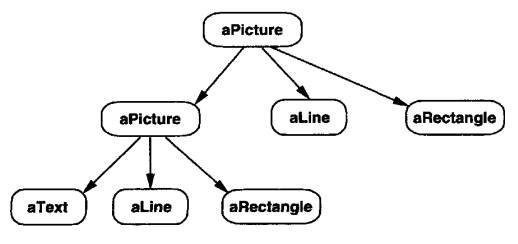
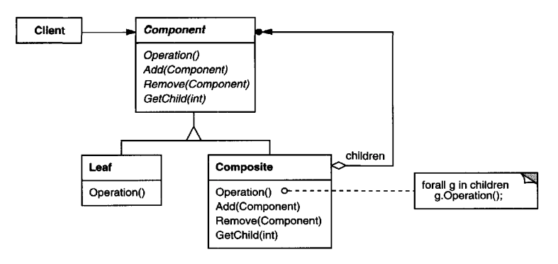
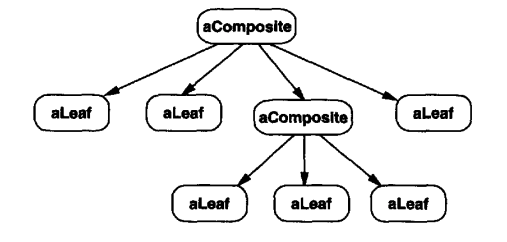

# Composite
## Intent
Represent hierarchical objects in an abstract & convenient way for clients, whilst enabling extension for adding new classes without affecting the client.

## Motivation
Graphical applications typically consist of simple components and containers which allow multiple components to be nested inside. Containers can be recursively nested.

A naive approach is to define two classes - one for simple classes and one for containers.
Problem - clients must treat these two types of objects differently.

The Composite pattern's approach is using an abstract class which represents both primitives and their containers.
For a graphical application, that class is called `Graphic` and it contains methods which all drawable objects share, ie `Draw` as well as methods for adding new children to the hierarchy.

Primitive objects like `Line`, `Rectangle`, `Text` implement the `Draw` method while `Picture` implements both `Draw` and the child management methods.

Example composite structure:

## Applicability
Use Composite when:
 * you want to represent a hierarchical composition of objects
 * you want clients to be oblivious of whether they're using composites or primitives

## Structure

This is how a typical composite structure looks like:

## Participants
 * Component (Graphic)
    * declares the interface for objects in the composition 
    * implements default behavior as appropriate
    * declares an interface for accessing and managing children
    * (optional) provides an interface for accessing the parent of a composite element
 * Leaf (Rectangle, Line, Text, etc) - has no children & defines the behavior for the particular primitive object
 * Composite (Picture)
    * defines behavior for components which contain children
    * stores child components
    * implements the child-related operations in `Component`
 * Client - manipulates objects in the composition via the `Component` interface

## Consequences
The Composite pattern:
 * defines class hierarchies of composite and primitive objects. 
 * makes the client simple. Client code isn't aware if it's using a composite or a primitive
 * allows easy extension of the hierarchy by adding new composite/primitive objects without affecting client code
 * makes your design overly generalized. If you want to restrict a composite to contain only certain objects, you'll need to rely on runtime checks.
 
## Implementation
Issues to consider:
 1) Explicit parent references
Maintaining these references can simplify traversal and management and it also enables implementing Chain of Responsibility.

When implementing this, it is important to maintain the invariant that a component is the parent of all its children.
To simplify achieving this, setting up the parent reference can be done in the abstract Component class so that inherited classes don't risk implementing it themselves.

 2) Sharing components
It's sometimes useful to share components to reduce storage usage. This, however, prevents us from implementing parent references, because children would have multiple parents.

The Flyweight patterns is useful for implementing sharing.

 3) Maximizing the Components interface
Ideally, the `Component` interface should implement the operations common to all children. This lets clients use more features without type switching.

However, not all components implement all operations - eg primitives can't define operations for children management. This can be resolved by:
 * defining a subclass `CompositeComponent` which has the children-related operations. Composites inherit that, primitives don't.
 * being creative in defining the operations to be applicable for primitives. E.g. `getChildren` returns and empty array.
 * returning an error if someone invokes an unsupported operation - this violates the Liskov substitution principle and makes it hard for clients to use `Composite` implementations uniformly.

 4) Should the `Component` maintain the list of children?
This is handy but takes up additional space for primitives which don't have children. It's applicable if there aren't a lot of children or if there aren't substantial memory constraints.

 5) Child Ordering
If children need to be ordered, access and management need to be defined carefully to not violate this constraint.
Iterator can be leveraged for iterating over all children in order.

 6) Caching to improve performance
If you need to often traverse the composite structure, you can cache the results from previous traversals to improve performance.
Changes to the structure would require you to partially or fully invalidate the cache and you'd have to account for this.

 7) What's the best data structure for storing components?
The choice depends on efficiency and requirements. Anything is acceptable - linked lists, arrays, hash tables, sorted maps, etc.

## Sample Code
TODO

## Related Patterns
 * Often, the `parent` operation is used to implement the Chain of Responsibility pattern.
 * Decorators are often used with Composites.
 * Flyweight lets you reuse components, but it prohibits you from defining the `parent` operation
 * Iterator can be used to traverse composite structures
