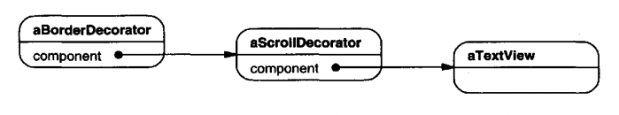
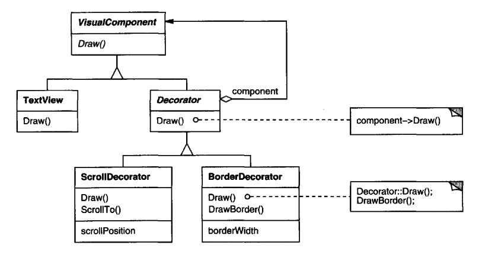
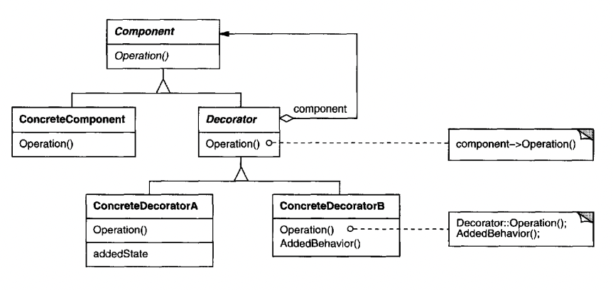
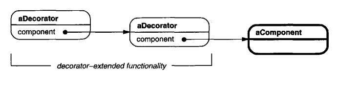

# Decorator

## Intent
Attach additional responsibilities to an object dynamically. An alternative to subclassing for extending behavior.

## Motivation
Say you want to enhance a text view in a graphical editor with a border. One option to do so is with inheritance.
The problem is that inheritance is static. Clients can control how and when a class has a border or not.

A more flexible approach is to wrap the object with another one which adds the border. The wrapper is referred to as decorator.

The decorator conforms to the interface of the wrapped object, which allows clients to use decorated and non-decorated classes interchangeably.

Example - we need a text view with a scrollbar and a border.
We can use two decorators - `ScrollbarDecorator` and `BorderDecorator` to wrap the text view on demand.


And here's the structure of the classes:


## Applicability
Use Decorator:
 * to add (and remove) responsibilities to an object dynamically and transparently
 * when extension by subclassing is infeasible due to class explosion

## Structure


## Participants
 * Component (VisualComponent) - The interface for the main component which can be wrapped
 * ConcreteComponent (TextView) - the wrapped object
 * Decorator - maintains reference to the Component object and conforms to its interface
 * ConcreteDecorator (BorderDecorator, ScrollDecorator) - adds responsibilities to an object

## Consequences
 * More flexible than static inheritance - responsibilities can be added and removed at runtime. It also makes easy mix and matching.
 * Avoids upfront feature-heaby classes - it lets you "pay as you go". Instead of anticipating all future changes and creating the functionality accordingly, you can extend it gracefully using decorators.
 * Decorator is not identical to component - this can lead to issues involving equality of objects
 * Lots of little objects - this makes systems easy to customize, but hard to extend by someone not familiar with them

## Implementation
Several issues to have in mind:
 * Interface conformance - a decorator must conform to the interface of the object it decorates
 * Omitting the abstract Decorator class - the abstract `Decorator` lets you reuse some functionality across several concrete decorators. You can avoid doing that if you don't need it
 * Keeping Component classes lightweight - the `Component` interface should be lightweight so that there are more objects which can implement it.
 * Change the skin vs. change the guts - Decorator lets you change the skin of an object, while Strategy lets you change its guts.

Strategies are a better choice when the Component class is heavyweight, making the Decorator hard to apply.
Instead, a Strategy allows a component to actively alter some of its behavior by delegating part of its responsibilities to a strategy object.

Decorators are transparent to a component, while strategies are actively maanged by them. What's more, decorators need to conform to the interface of the object, while strategies need not.

Example decorator structure:


Example strategy structure:


## Sample Code
Example `Component` interface and `ConcreteComponent`:
```java
public interface VisualComponent {
  void draw();
  void resize();
}

public class TextView implements VisualComponent {
  @Override
  public void draw() { ... }

  @Override
  public void resize() { ... }
}
```

Example `Decorator`s hierarchy:
```java
public abstract class Decorator implements VisualComponent {
  private VisualComponent component;

  public Decorator(VisualComponent c) {
    this.component = c;
  }

  @Override
  public void draw() {
    component.draw();
  }

  @Override
  public void resize() {
    component.resize();
  }
}

public class BorderDecorator extends Decorator {
  public BorderDecorator(VisualComponent c) {
    super(c);
  }

  @Override
  public void draw() {
    super.draw();
    drawBorder();
  }

  private void drawBorder() { ... }
}
```

Example usage:
```java
VisualComponent c = new BorderDecorator(new TextView());
c.draw();
```

## Related Patterns
Decorators only enhance an object's responsibility without affecting its interface. Adapters change the object's interface altogether.

Composite is a more advanced version of a Decorator. A Decorator can be viewed as a degenerate composite with a single child.
However, the intent of Decorator is different - to add responsibilities, rather than aggregate objects.

Strategy lets you change the guts of an object, while a Decorator lets you change its skin.
