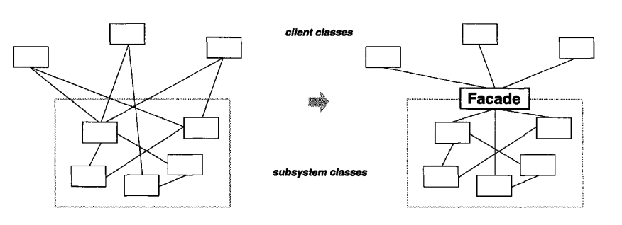
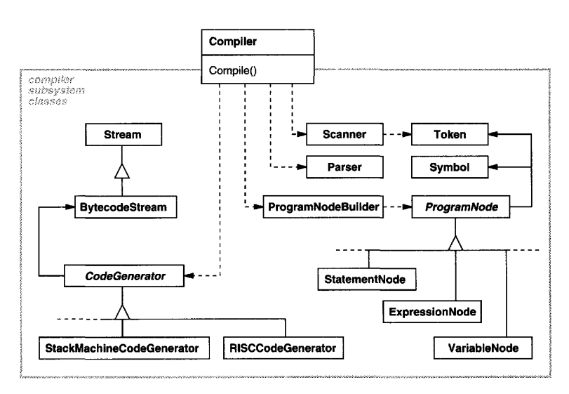
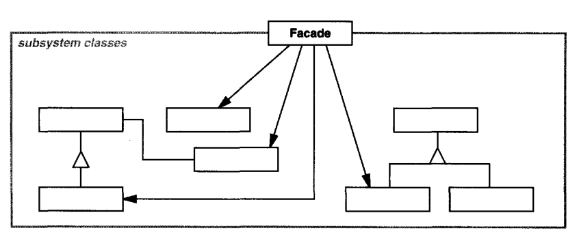

# Facade

## Intent
Provide a unified interface to a set of classes in a subsystem. This makes the subsystem easier to use.

## Motivation
Structuring a system into subsystems reduces complexity but a challenge is how to reduce the dependencies between different subsystems.
This can be achieved using the Facade pattern, which provides a unified interface to a subsystem.


Example - a compiler subsystem which has classes such as Scanner, Parser, ProgramNode, etc which need to be used together for the compilation process.

Some specialized applications might need access to these classes directly but most applications don't care about details such as parsing and code generation.
To serve these non-specialized clients, the compiler provides a high-level interface via a Compiler class which provides a single, unified and simple interface to the underlying subsystem.


## Applicability
Use the Facade pattern when:
 * you need a simple interface to a complex subsystem - many small classes make a system easy to customize and extend, but harder to use. 
   A facade can provide a default and simple view into the subsystem which is good enough for most clients.
 * you want to reduce the dependencies between clients and implementation classes of a subsystem.
 * you want to layer your system & need entrypoints for each layer

## Structure


## Participants
 * Facade (Compiler) - has knowledge about subsystem specifics & forwards client requests to appropriate subsystem classes 
 * Subsystem classes (Scanner, Parser, ProgramNode, etc.)
    * Implement subsystem functionality & has no knowledge of the facade

## Consequences
Benefits of using Facade:
 * Shields clients from subsystem specifics, which makes subsystem easier to use
 * Promotes weak coupling between the subsystem and its clients - this lets subsystem component vary independently of the clients which use them 
 * Doesn't prevent clients from using subsystem classes directly if they really need to

## Implementation
Potential issues with implementing Facade:
 * Reducing client-subsystem coupling
    * instead of clients using the Facade directly, they can use an abstract Facade class with multiple Facade implementations, which offer different implementations of the subsystem.
    * Alternatively, you can pass particular subsystem classes as parameters to the Facade so that you can tweak some parts of the system which are susceptible to change 
 * Public vs. private subsystem classes - a subsystem has a set of private & public classes. Facade is part of the public interface of the subsystem, but so can other classes be part of that.
    * Unfortunately, not all languages have the ability to define classes private to a given subsystem (possible via package-private classes in Java)

## Sample Code
Example subsystem classes in a compiler:
```java
public class Scanner {
  private InputStream stream;

  public Scanner (InputStream s) {
    this.stream = s;
  }

  public Token scan() { return null; }
}

public class Parser {
  public void parse(Scanner s, ProgramNodeBuilder b) {}
}

public class ProgramNodeBuilder {
  public ProgramNode newVariable(String name) { return null; }
  public ProgramNode newAssignment(ProgramNode variable, ProgramNode expression) { return null; }
  // etc...
}

public abstract class ProgramNode {
  public abstract void add(ProgramNode n);
  public abstract void remove(ProgramNode n);

  public abstract void traverse(CodeGenerator cg);
}

public abstract class CodeGenerator {
  public abstract void Visit(ProgramNode n);
  // etc...
}

public class RISCCodeGenerator extends CodeGenerator {
  // etc...
}
```

In the above example:
 * `Scanner` takes a stream of characters and produces a stream of `Token`s
 * `Parser` uses a `ProgramNodeBuilder` to produce a parse tree from the token stream (Builder pattern example)
 * `ProgramNodeBuilder` produces a hierarchy of `ProgramNode`s (Composite pattern example)
 * The `traverse` operation in `ProgramNode` takes in a `CodeGenerator` which produces machine code from the parse tree (Visitor pattern example)
 * `CodeGenerator` has subclasses for different computer architectures

The `Compiler` is a facade which encapsulates how the subsystem is used to compile a whole program:
```java
public class Compiler {
  public OutputStream compile(InputStream s) {
    Scanner scanner = new Scanner(s);
    ProgramNodeBuilder builder = new ProgramNodeBuilder();
    Parser parser = new Parser();

    parser.parse(scanner, builder);

    OutputStream out = new ByteArrayOutputStream();
    RISCCodeGenerator cg = new RISCCodeGenerator(out);
    ProgramNode parseTree = builder.getRoot();
    parseTree.traverse(cg);
      
    return out;
  }
}
```

The target architecture is hardcoded in the above example. If we need to support multiple architectures, the compiler can take in a `CodeGenerator` parameter.

## Related Patterns
 * Abstract Factory can be used with a Facade to provide an interface for creating interrelated subsystem objects. This avoids the Facade having to depend on concrete classes.
 * Mediator is similar to Facade as it abstracts functionality of existing classes. Its purpose is to centralize communication between colleague objects which doesn't belong to either of them.
   * Facade merely hides implementation details and subsystem components don't know about it. They do, however, know about the Mediator
 * Usually one Facade object is sufficient, so it is often a Singleton
