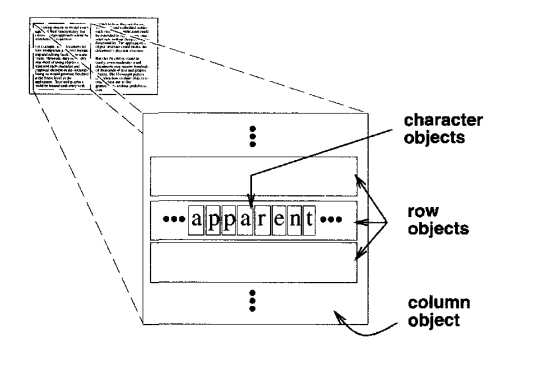
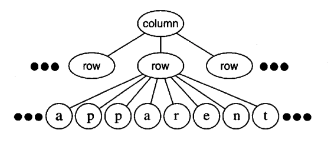
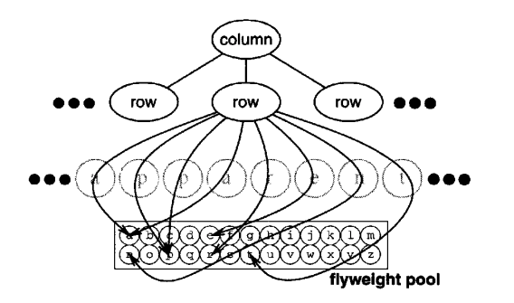
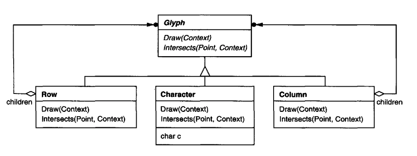
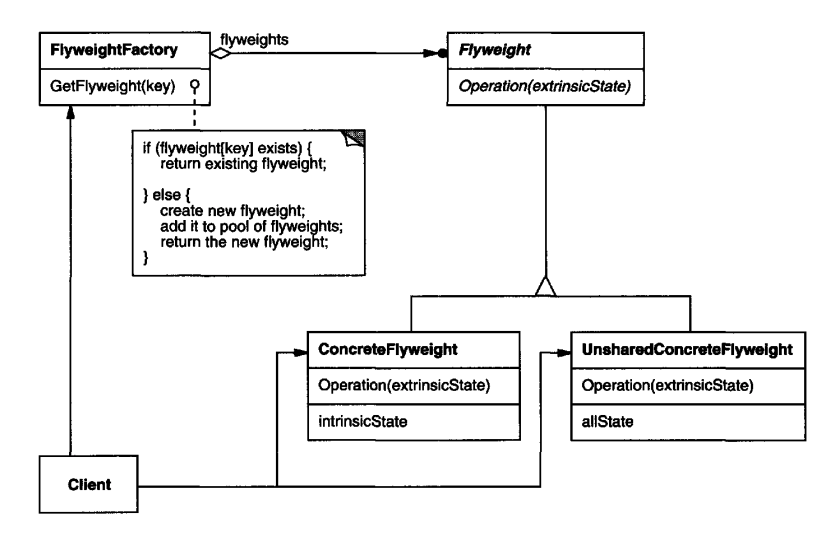
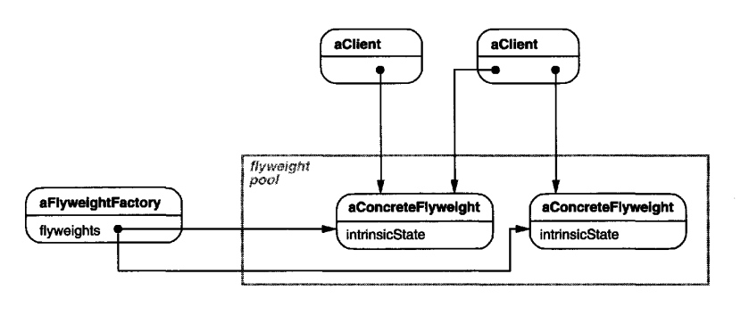

# Flyweight

## Intent
Use sharing to support a large number of small objects effectively.

## Motivation
To most applications, it comes naturally to represent entities in them via objects. But to some of them, doing this naively is resource-intensive.

Example - a text document with thousands of characters in it. Representing every character as an object is suitable, but not efficient as it would take up a lot of memory.

Flyweight enables us to represent such structures in a cost-effective way.

Flyweight == shared object which can be used in multiple different contexts simultaneously.
From a client's perspective, it's indistinguishable from a non-shared, unique object.

When designing flyweights, a key distinction to make is between intrinsic & extrinsic state:
 * Intrinsic state - immutable state, which can safely be shared. E.g. the character code 'e'.
 * Extrinsic state - mutable, non-shared state which is only relevant for the flyweight in a given context. E.g. the font of character 'e'.

Intrinsic state is stored in the flyweight, extrinsic state is passed to the flyweight at runtime.

Example flyweight logical representation:

Example flyweight physical representation:

Example class structure of the above:

In the above example, `char c` is an intrinsic state in the flyweight object `Character`. The extrinsic state is passed via the `Context` object.

Using this technique, a document which might have thousands of characters, will effectively have ~100 objects representing them.

## Applicability
Use flyweight if and only if:
 * An application uses a large number of objects.
 * Storage costs are high due to the # of objects.
 * Most of the object state can be made extrinsic.
 * Many object groups can be represented by a low number of objects once extrinsic state is detached.
 * The application doesn't depend on object identity - flyweight objects can be conceptually different 

## Structure

Example sharing of flyweight objects:

## Participants
 * Flyweight (Glyph) - An interface through which flyweights can receive and act on extrinsic state.
 * ConcreteFlyweight (Character) - implements the Flyweight interface and stores the intrinsic state. The state must be immutable.
 * UnsharedConcreteFlyweight (Row, Column) - objects returned by the flyweight factory which are not real flyweights (they are unique per instance) but do implement the Flyweight interface for easier use by clients.
 * FlyweightFactory - creates and manages flyweight objects + ensures flyweights are shared properly.
 * Client - maintains flyweight object references, computes and/or stores extrinsic flyweight state and passes it to flyweight objects

## Consequences
With flyweights, you're trading run-time cost for storage savings. Computing & finding extrinsic state increases runtime costs, but these costs are offset by the storage savings in the long run.

Several factors contribute to storage savings:
 * The reduction in # of instances
 * The amount of intrinsic state.
 * Whether extrinsic state is computed or stored.

The more flyweights are shared, the greater the savings.

Flyweight is often combined with Composite to represent hierarchies of objects, which are efficiently shared via Flyweight.
One drawback is that the parent pointer cannot be part of the intrinsic state of the flyweight object. It has to be calculated as part of extrinsic state.

## Implementation
Issues when implementing Flyweight:
 * Removing extrinsic state - whether the pattern would be beneficial is greatly determined by the amount and size of extrinsic state. If intrinsic state is small and extrinsic state is where the bottleneck is, you'd need to apply more advanced techniques. E.g. representing extrinsic state via a separate efficient data structure.
 * Managing shared objects - objects should only be instantiated within the FlyweightFactory. Additionally, some form of garbage collection might be necessary but is usually not required if the # of flyweights is small.

## Sample Code
for an example implementation, check out [this article](https://refactoring.guru/design-patterns/flyweight#pseudocode) which provides a better example than the one in the book due to being more simple.

## Related Patterns
Flyweight is often combined with Composite to implement a logical hierarchy with shared leaf nodes.
