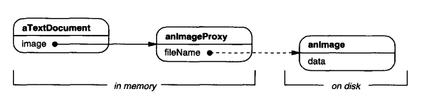
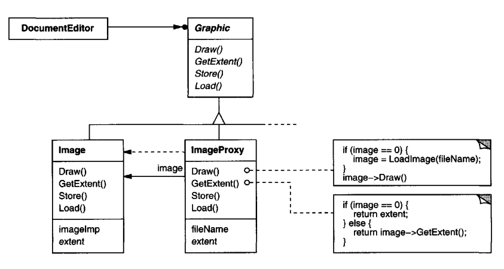
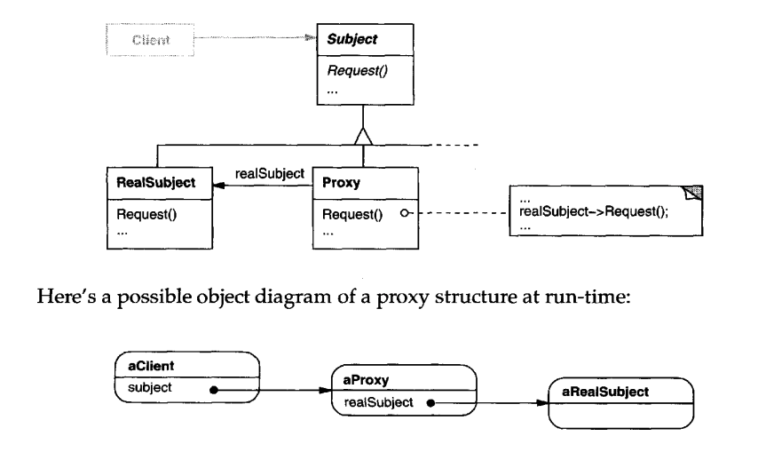

# Proxy

## Intent
Provide a placeholder for an object to control access to it.

## Motivation
One possible reason to control access to an object is to defer instantiating it when we actually need it.

Example - document editor with lots of graphics, but only a limited view of the document at a time. One can defer instantiation of a given graphic only once it's in sight.

Solution - use a proxy which acts as a placeholder for the graphic, but actually instantiates it when it's needed.


The proxy uses the `filename` to load the image from disc when needed. It also caches the image's extent to not calculate it multiple times.


## Applicability
Proxy is applicable when there is a need for a more versatile reference than a standard reference to an object.

Common use-cases:
 * Remote proxy - local representation for an object stored in a remote location
 * Virtual proxy - create expensive objects on demand
    * A nice example use-case - copy-on-write lets one copy an object without making a new instance of it. The new instance is created only if the copied instance is modified. 
 * Protection proxy - control access to an object's operations
 * (C++ only) Smart reference - smart pointers which do reference counting & free an object once it's no longer in use

## Structure


## Participants
 * Proxy (ImageProxy) - maintain reference to actual object, implement the object's interface for client's benefit, controls access to object
 * Subject (Graphic) - The common interface implemented by the real subject and its proxy
 * RealSubject (Image) - The real object which the proxy guards

## Consequences
The proxy introduces a level of indirection when accessing an object which is an opportunity to plug-in additional behavior. (See [Applicability](#applicability))

## Implementation
Some issues to have in mind:
 * (C++ only) a proxy can override the pointer indirection operators to avoid making the same operation on each function of the common interface
 * A proxy can inherit a "default proxy implementation" which simply forwards requests to the proxied object to allow adding additional behavior only on the operations of interest.
 * One can avoid storing a reference to the concrete implementation of an object if the proxy need not manage the proxied object's lifecycle

## Sample Code
Example interface & implementation:
```java
public interface Graphic {
  void draw(Point p);
  void handleMouse(Event e);
  Point getExtent();
  void load(InputStream from);
}

public class Image implements Graphic {
    // etc...
}
```

Example proxy:
```java
public class ImageProxy implements Graphic {
  private Image image;
  private Point extent;
  private String filename;

  public ImageProxy(String filename) {
    this.filename = filename;
  }

  @Override
  public void draw(Point p) {
    getImage().draw(p);
  }

  @Override
  public Point getExtent() {
    if (extent == null) {
      extent = getImage().getExtent();
    }

    return extent;
  }

  private Image getImage() {
    if (image == null) {
        image = new Image();
    }

    return image;
  }
}
```

Example usage:
```java
public static Image newImageFrom(String filename) {
  return new ImageProxy(filename);
}
```

## Related Patterns
Adapter provides a different interface to an object it adapts. A proxy sticks to the same interface. Additionally, a proxy might restrict access to certain operations, which alters the original interface.

Decorators are very similar to proxies but they have a different purpose. Decorators enhance an object's responsibilities. Proxies control access to the object.
Additionally, proxies (in most cases) control the lifecycle of the proxied object, while decorators do not.
