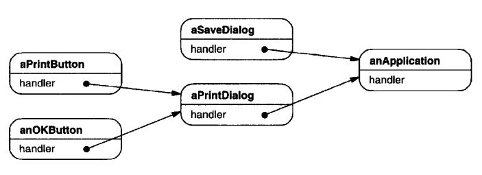
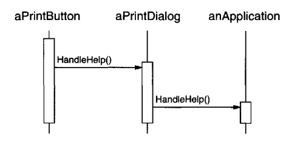
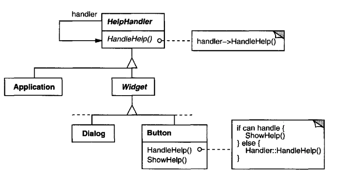
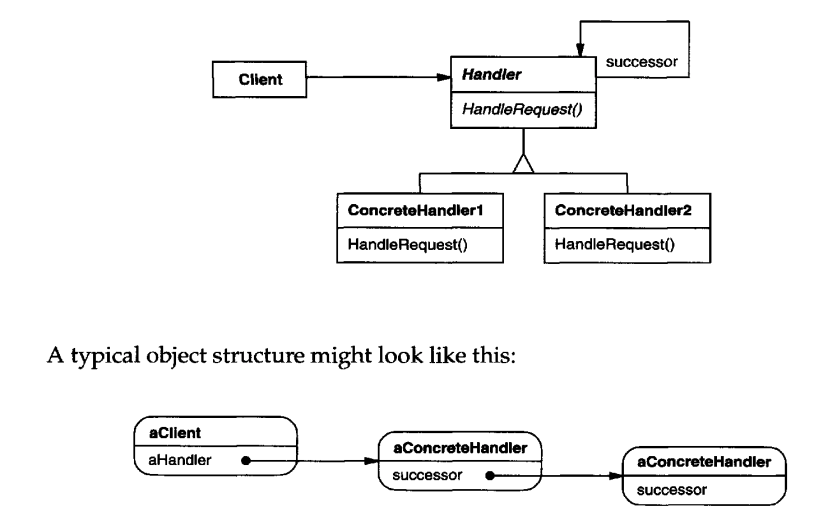

# Chain of Responsibility

## Intent
Avoid coupling a request sender to its receiver by giving more than one object a chance to handle the request.
Chain the receiving objects and pass the request along it until someone handles it.

## Motivation
Consider a context-aware help facility in an UI. You can click a component in the app and it has to display its related help pop-up.
If the immediate selected widget doesn't have a help entry, then the help entry of the immediate next widget has to be shown.

The problem is that the object which needs to provide the help isn't known to the object which is directly clicked (e.g. the button).
We have to decouple the object which initiates the help request (Button) from the one which provides it. Chain of Responsibility can help us here.

The request gets passed along a chain of objects until it gets handled:


The first object in the chain receives the request and either handles it or forwards it.


For this mechanism to work, every object in the chain implements a common interface which indicates it can handle the help request.


## Applicability
Use CoR when:
 * more than one object can handle a request and the handler isn't known beforehand
 * You want to send a request to multiple objects without specifying the receiver explicitly
 * The set of handlers should be defined dynamically
 
## Structure


## Participants
 * Handler (HelpHandler) - defines a common interface & default implementation to forward request
 * ConcreteHandler (PrintButton, PrintDialog) - handles respective requests, falls back to successor if it can't
 * Client - initiates the request to ConcreteHandler in the chain

## Consequences
Benefits & liabilities of CoR:
 * Reduced coupling - the pattern lets object in the chain be oblivious of neighboring objects in the chain
 * Flexibility to add responsibilities to an object - simply add/remove objects from the chain
 * Receipt isn't guaranteed - if no one handles the request, it will stay unhandled. Consequence depends on implementation (e.g. exception)

## Implementation
Issues to consider when implementing CoR:
 * Implementing the successor chain:
    * Define new links (as was shown above)
    * Use existing links - this is possible if the objects are already part of a hierarchy using e.g. the Composite pattern
 * Connecting successors - the abstract base class can define a default implementation which forwards every request to the successor to avoid boilerplate in concrete handlers
 * Representing requests - there are various options:
    * a function with no parameters. Useful if the request is straightforward
    * an enum parameter indicating the type of request
    * a request object, which contains the type of request (enum) and additional parameters, which are request-specific.

## Sample Code
Example abstract class:
```java
public abstract class HelpHandler {
  private final HelpHandler successor;

  public HelpHandler(HelpHandler successor) {
    this.successor = successor;
  }

  void handleHelp() {
    if (successor != null) {
      successor.handleHelp();
    }
  }

  boolean hasHelp() {
    return false;
  }
}
```

Example implementations:
```java
public class Widget extends HelpHandler {
  public Widget(HelpHandler h) {
    super(h);
  }
}

public class Button extends Widget {
  public Button(Widget enclosing) {
    super(enclosing);
  }

  @Override
  boolean hasHelp() { return false; }

  @Override
  void handleHelp() {
    if (hasHelp()) {
      // handle...
    } else {
      super.handleHelp();
    }
  }
}

public class Dialog extends Widget {
  public Dialog(HelpHandler enclosing) {
    super(enclosing);
  }

  // similar implementation...
}

public class Application extends HelpHandler {
  public Application() {
    super(null);
  }

  // similar implementation...
}
```

Example usage:
```java
Button b = new Button(new Dialog(new Application()));
b.handleHelp();
```

## Related Patterns
Often used with Composite to piggyback on the parent links in the hierarchy, using them as successors.
