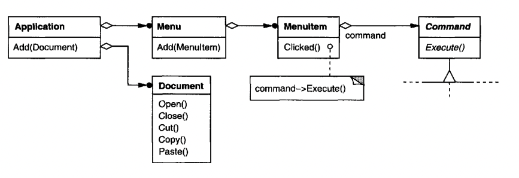
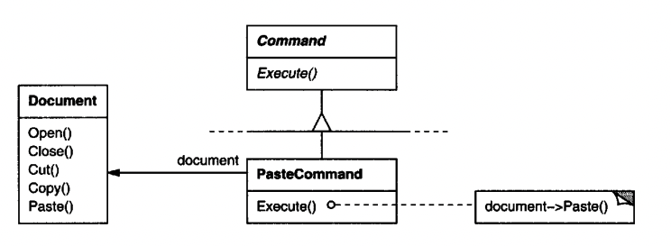
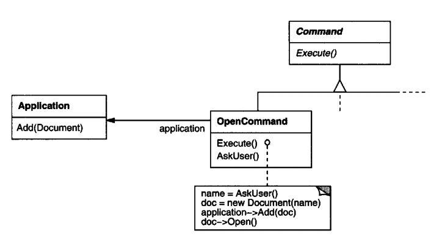
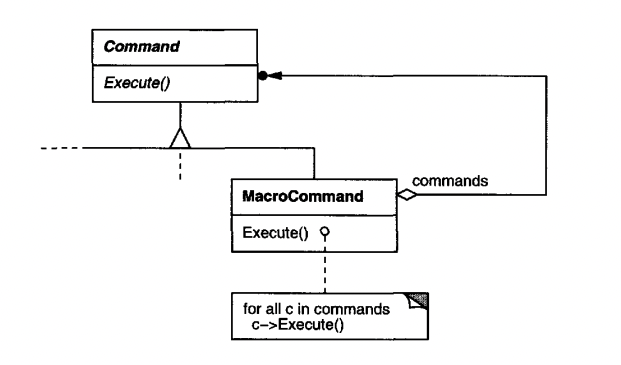
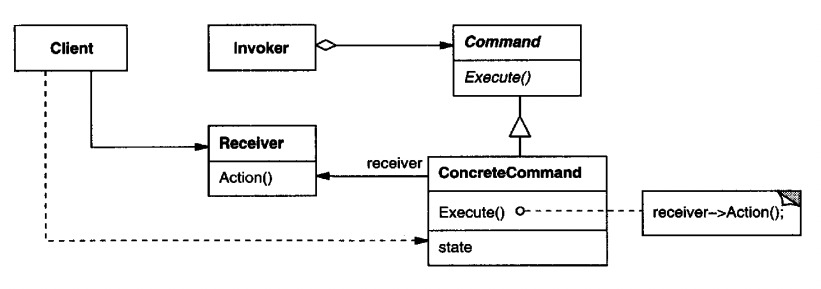
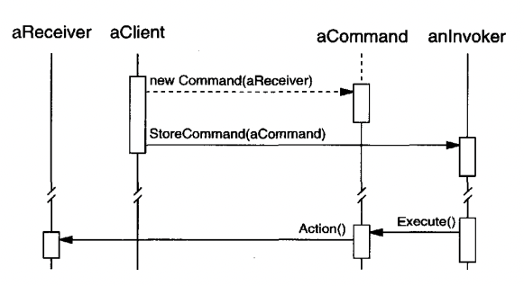

# Command

## Intent
Encapsulate a request as an object, detaching the invoker from the receiver of the request.

## Motivation
Sometimes, we need to issue requests without knowing anything about its receiver.

Example - a UI toolkit which supports onClick events doesn't have to know about the specific receiver of an event.

The key is an abstract `Command` class which defines an interface for executing operations.
The concrete command implementations store references of the receivers & execute the necessary operation using them.


Example usage:
In a GUI, `Menu` has a set of `MenuItem`s. Each menu item has a `Command` instance which executes the necessary action once the menu item is clicked.

This way, the menu item is fully detached from the actual operation which has to be carried out.

One such operation is paste:


Another one is for opening a new document:


Sometimes, a menu item needs to execute multiple commands which can be encapsulated in a `MacroCommand`:


This flexibility enables us to reuse operations on various UI objects, such as menu items, but also buttons or key mappings.
We can also compose commands into larger ones.

## Applicability
Use the Command pattern when:
 * Pass an action as a parameter to an object. A more lightweight alternative to the pattern is simply passing a `callback` function instead of a whole object.
 * Delegate command execution to a different process than your own. E.g. invoke an API and execute the command once the request is complete.
 * Support Undo. This requires additional state in the `Command` object as well as an `Unexecute` method.
 * Support logging the changes done to a system so that the history can be played back & the system state restored.

## Structure


## Participants
 * Command - declares an interface for executing the command
 * ConcreteCommand (PasteCommand, OpenCommand) - implements `Execute` and maintains reference to the request receiver.
 * Client (Application) - Creates a `ConcreteCommand` and specifies its receiver.
 * Invoker (MenuItem) - Asks the command to carry out the request
 * Receiver (Document, Application) - Knows how to handle the request or a subset of it.

## Collaborations


## Consequences
 * Command decouples the invoker from the object which carries out the request
 * Commands are first-class objects. They can be extended & manipulated as any other object.
 * Commands can be composed to create MacroCommands
 * It's easy to add new commands because that doesn't require modifying existing classes

## Implementation
Some issues to consider when implementing Command:
 * How intelligent should a command be - just forward a request to a receiver or carry out the request in place?
The former approach makes commands more lightweight & enables reuse, the latter reduces dependencies at the cost of less reuse.

 * Supporting undo and redo
This requires commands to maintain some state. State might include the receiver of a request, the parameters passed to it, any values mutated by the receiver.

Additionally, the application needs some kind of history list managers, which carries out the undo/redo on commands.
When doing this, commands might have to be copied if the state can change on subsequent invocations.
This would require employing the Prototype pattern.

 * Creating simple reusable commands for multiple use-cases.
E.g. creating a simple command which just forwards a request to a receiver method. This can be done by having a command accept a callback and unconditionally forward execute requests to it.

## Sample Code
Example `Command` interface and some sample implementations:
```java
public interface Command {
  void execute();
}

public class OpenCommand implements Command {
  private final Application app;
  public OpenCommand(Application app) {
    this.app = app;
  }

  @Override
  public void execute() {
    // asks user for document name, opens it and forwards to Application...
  }
}

public class PasteCommand implements Command {
  private final Document doc;

  public PasteCommand(Document doc) {
    this.doc = doc;
  }

  @Override
  public void execute() {
    doc.paste();
  }
}
```

Example simple reusable command:
```java
public class SimpleCommand implements Command {
  private final Runnable r;
  public SimpleCommand(Runnable r) {
    this.r = r;
  }

  @Override
  public void execute() {
    r.run();
  }
}
```

Example usage:
```java
SimpleCommand cmd = new SimpleCommand(() -> System.out.println("hello world"));

// in some invoker
cmd.execute(); // prints "hello world"
```

## Related Patterns
Composite can be used to implement macro commands.

Memento can keep the state a command requires for undo.

A command that must be copied, can implement that via Prototype.
