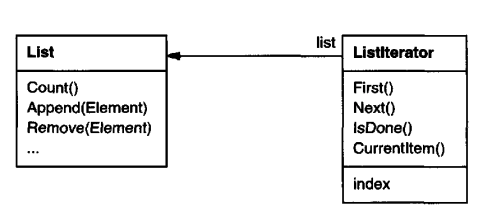
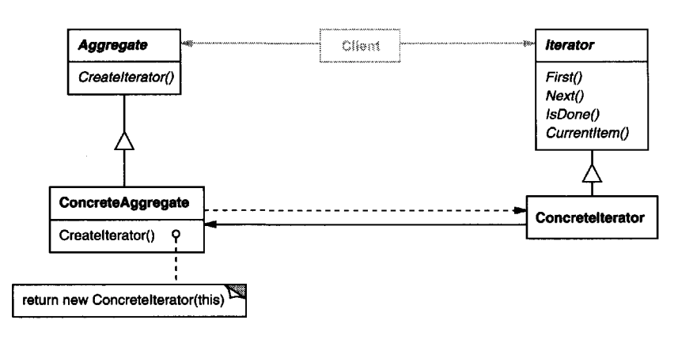

# Iterator

## Intent
Provide an interface for iterating over an aggregate object without exposing internal representation.

## Motivation
An aggregate such as a List should provide a way for accessing its elements without exposing internal structure.

What's more, you might want to traverse the list in different ways. However, those goals should not bloat the List interface with unnecessary operations.

The Iterator pattern lets you solve these issues. It takes the responsibility of maintaining traversal state & the mechanism for accessing the aggregate and it encapsulates it in an iterator object.


Separating the traversal algorithm from the list lets us vary the traversal algorithm.

In the above example, the iterator is coupled to the list implementation, meaning that the client needs to commit to a particular iterator implementation.

A more generalized approach is to define an `AbstractList` and an `Iterator` interface which can be subclassed:


There still needs to be an abstract `CreateIterator` in the `AbstractList` which can be overridden by subclasses where the concrete iterator is instantiated. This is an example of a Factory Method.

## Applicability
Use the Iterator:
 * to access an aggregate object's contents without exposting its internals
 * to support multiple traversals of aggregate objects
 * to provide a uniform interface for iterating over different aggregate objects

## Structure


## Participants
 * Iterator - defines an interface for accessing elements of an aggregate
 * ConcreteIterator - implements the Iterator interface, keeps track of current position throughout iteration
 * Aggregate - defines an interface for creating an Iterator
 * ConcreteAggregate - implements the CreateIterator factory method which instantiates the Iterator

## Consequences
 * It supports variation in the traversal of an aggregate - e.g. backwards traversal or traversal of tree structures
 * It simplifies the Aggregate interface, since the Aggregate doesn't need to provide an interface for traversal
 * More than one traversal can be ongoing on the same aggregate

## Implementation
Some issues to consider:
 * Who controls the traversal implementation?

If the user is responsible for invoking First, Next, IsDone, etc. then this is referred to as an external iterator and the user controls the implementation.
If, instead, the iterator just accepts a callback function applied to each element of the aggregate, then this is an internal iterator and the iterator controls the implementation.

External iterators are more flexible but internal iterators are simpler to use.

 * Who defines the traversal algorithm - the iterator or the aggregate?

It's possible for the aggregate to define the traversal algorithm, while the iterator just holds the state of iteration. 
In that case, the Aggregate expose traversal functions, which accept the iterator as an argument.

If the iterator defines the traversal algorithm, this provides flexibility to use different algorithms on the same aggregate or use the same algorithm on different aggregates.
However, some traversal algorithms might require the iterator to use private state of the aggregate.

 * How robust is the iterator - e.g. does it break if the collection is modified during traversal?

Robust iterators ensure that modifications won't affect traversals. This can be done by either copying the state of the aggregate for iteration, but it is inefficient.
In practice, it's achieved by having the aggregate to be aware of iterators and changing their state/notifying them on insertion/removal so that they can modify their state.

Other more simpler implementations simply throw an exception if a concurrent modification is detected.

 * Additional Iterator Operations - e.g. providing a Previous function to go back to the previous element during traversal. Another one might be SkipTo, which makes sense for ordered collections.
 * Iterators might have privileged access to Aggregates - for e.g. accessing private state. In C++, this can be done via friend classes, in Java - via internal static classes.
 * Iterators for Composites - since a composite's hierarchy is hard to traverse from normal people, it might make sense to use an internal iterator for those aggregates.
 * Null iterators - might be useful for boundary conditions. E.g. asking for an iterator of a leaf node's children. A null iterator always returns true on IsDone invocations.
 
## Sample Code
In Java, the standard library provides the `Iterable` interface which you can implement for your collection to provide an Iterator, which is compatible with standard Java mechanisms, such as for loops.
```java
public class MyList<T> implements Iterable<T> {
  private final List<T> elements;

  public MyList(List<T> elements) {
    this.elements = elements;
  }
    
  @Override
  public Iterator<T> iterator() {
    return new Iterator<T>() {
      private int index = 0;

      @Override
      public boolean hasNext() {
        return index < elements.size();
      }

      @Override
      public T next() {
        return elements.get(index++);
      }

      @Override
      public void remove() {
        throw new UnsupportedOperationException();
      }
    };
  }
}
```

Example usage:
```java
MyList<Integer> list = new MyList<>(Arrays.asList(1, 2, 3, 4, 5));
for (Integer el : list) {
  System.out.println(el);
}
```

The difference between the Java standard Iterator and the one described in the book is that it has a simpler interface of only `T next()` and `boolean hasNext()`.
In contrast, the one described in the book has a `First()` function which resets the iterator and the `next()` function is separated into `void Next()` and `T CurrentItem()`.

Java's iterator interface has a `forEach` function as well, which has a default implementation and effectively acts as an internal iterator which implements the traversal algorithm, executing an action on each element.

## Related Patterns
Iterators are often applied on Composites.

Factory Method is often used to instantiate Iterators.

Memento is often used to store the Iterator's internal state.
