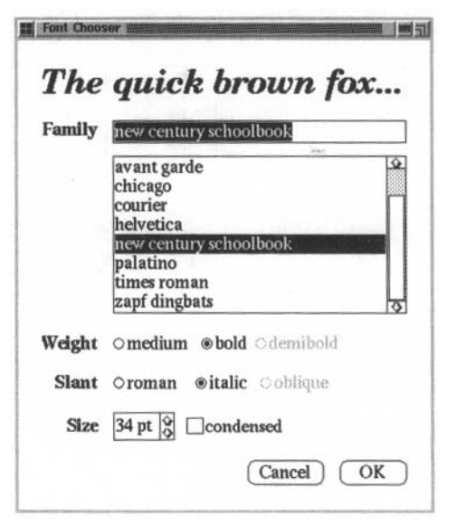
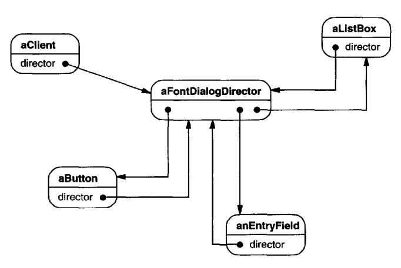
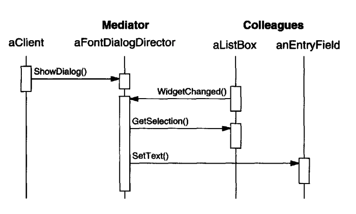
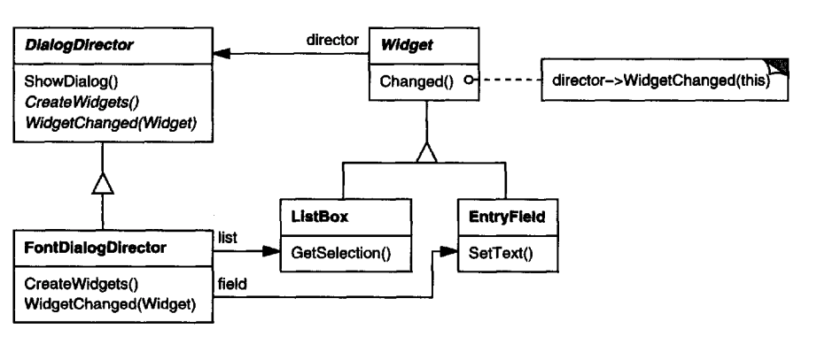
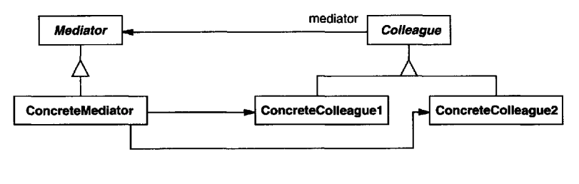
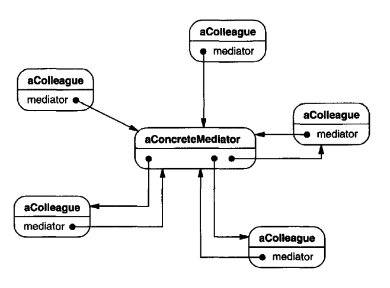

# Mediator

## Intent
Define an object which encapsulates the collaboration between independent, loosely coupled objects.

## Motivation
For an object-oriented structure to be reusable and detached, it is often composed of multiple collaborating, small objects.

In some cases, however, the collaborations are very interconnected. This can lead to a situation where each object knows about each other object.

The Mediator is a pattern which encapsulates complex collaborations between small, loosely coupled objects.

Example:

In this dialog, there are multiple independent components, which need to collaborate on certain events. E.g. if a font is chosen, which doesn't support certain weights, the dropdown needs to notify the rabio buttons component to disable the third radio button.

If we make an explicit dependency between the dropdown and the radio button, then that dependency will only make sense in the context of this specific dialog box.
If you want to reuse the same dropdown and rabio button classes for a different dialog, with a different scenario, that dependency will get in the way.

To solve this issue, an intermediate object is introduced to mediate the communication between the two interconnected components:

In this case, the `aFontDialogDirector` is a Mediator which has a reference to all used widgets and every widget has a reference to the mediator.

Whenever a certain event happens - e.g. an item is chosen from the dropdown, the mediator is notified and it can update the state of all dependent widgets accordingly.

If you need to integrate this mediator in a class library, you can make it abstract vs. making it concrete:

## Applicability
Use the Mediator when:
 * a set of objects communicate in well-defined but complex ways.
 * Reusing an object is difficult because it has many dependencies.
 * behavior, distributed among several classes needs to be customizable without a lot of subclasses.

## Structure

A typical object structure:

## Participants
 * Mediator (DialogDirector) - defines an interface for communicating with Colleague objects
 * ConcreteMediator (FontDialogDirector) - implements a concrete implementation of object collaboration
 * Colleague classes (ListBox, EntryField) - knows their mediator and communicates with it on certain events

## Consequences
 * It limits subclassing - no need to subclass colleague classes for changing behavior. Just subclass/change the mediator.
 * It decouples colleagues - colleagues can stay reusable while being used to implement complex interconnected behaviors.
 * Simplifies object communication - by changing many-to-many communication with one-to-many which is simpler to use & understand.
 * Abstracts how objects cooperate - this reduces dependencies between interconnected objects.
 * Centralizes control - this makes the classes it uses reusable, but makes the mediator harder to maintain and reuse.

## Implementation
*Personal opinion follows*

In practice, the Mediator pattern is mostly used for UI-based applications. In particular, modern UI development uses the Mediator pattern in the form of e.g. React components.

Each react component is a Mediator, which mediates interconnected behavior among many reusable components (e.g. button/textbox/text fields/etc.).

The difference is that instead of the used objects having a reference to the mediator, they communicate with it via callbacks and event hooks - e.g. invoking a callback passed as a parameter `onMouseClick`.
This makes the dependency one-way only, making the components more reusable.

In the book, this enhancement is referred to as using the Observer pattern.

## Sample Code
Since this pattern is not applicable in most applications, using Java, I've decided not to provide code examples.

For code examples, check out the book and [the examples from this article](https://refactoring.guru/design-patterns/mediator#pseudocode).

## Related Patterns
Facade abstracts a subsystem of objects to provide a more convenient interface. It typically mediates unidirectional communication.

Mediator is used when the communication flows in multiple directions.

Colleagues can communicate via the Mediator using the Observer pattern.
