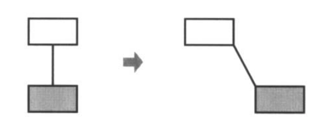
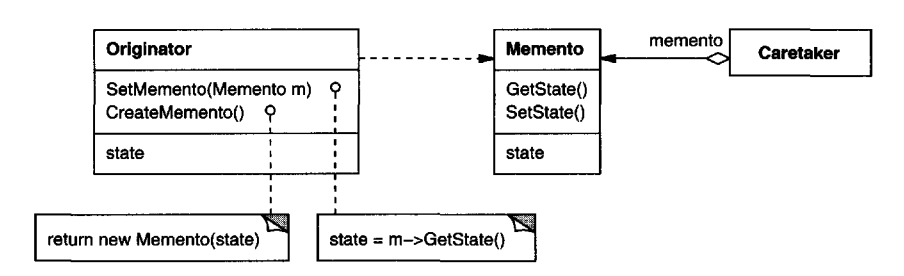
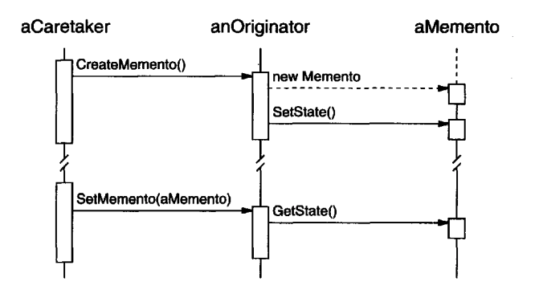

# Memento

## Intent
Capture an object's state so that it can restore that state in a later point in time. All while not violating encapsulation.

## Motivation
Sometimes, you need to snapshot an object's state to support checkpoints and undo operations.
However, objects usually encapsulate part or all of its state so how do you externalize that state without breaking encapsulation?

Additionally, sometimes implementing an `Unexecute` operation is not feasible.

Example, in a graphical editor, connected rectangles can be moved around:


One might think that moving the rectangle back by the same distance will reverse the operation, but that's not always the case because there might be some slack in the connection.

Instead, this can be achieved by recording the previous state of the objects and rolling back to that state in the future, whilst preserving encapsulation. That's what Memento enables you to do.

Memento is an object that stores a snapshot of another object's internal state - the memento's originator.

Here's how it works:
 * The editor requests a memento from the originator object
 * The originator creates a memento which captures all of the internal state
 * When the user undoes the operation, the editor provides the originator with the memento it produced
 * Based on the memento, the originator changes its internal state to whatever was contained in the memento

The memento is an object which only exposes its fields to the originator class. This can be achieved by using nested classes in Java.
For info on how to implement this in other languages, see [this article](https://refactoring.guru/design-patterns/memento)

## Applicability
Use Memento when:
 * A snapshot of an object's state must be saved so that it can be restored later
 * Making the object's state public would expose implementation details and break encapsulation

## Structure


## Participants
 * Memento (SolverState) - stores internal state & protects it from being accessed by anyone other than the originator
 * Originator (ConstraintSolver) - creates a Memento on demand and can restore its state from a Memento on request
 * Caretaker (undo mechanism) - Safekeeps the Memento without ever examining its state

Example workflow:


## Consequences
 * Preserving encapsulation
 * It simplifies Originator because it doesn't have to store & manage the actual Memento object
 * Using mementos might be expensive due to memory constraints

## Implementation
Some implementation issues to have in mind:
 * Language support - the Memento has a wide and narrow interfaces. Different languages allow you to achieve this in different ways:
    * Java has nested classes of whom you can access private state
    * C++ has friend classes
 * Storing incremental changes - to store mementos more efficiently, you could only store incremental state instead of the whole state

## Sample Code
Example originator and memento:
```java
public class Person {
  private String firstName;
  private String lastName;

  public Person(String firstName, String lastName) {
    this.firstName = firstName;
    this.lastName = lastName;
  }

  public void setFirstname(String fn) {
    this.firstName = fn;
  }

  public void print() {
    System.out.printf("My name is %s %s\n", firstName, lastName);
  }

  public Memento getMemento() {
    return new Memento(firstName, lastName);
  }

  public void restore(Memento m) {
    this.firstName = m.firstName;
    this.lastName = m.lastName;
  }

  private static class Memento {
    private final String firstName;
    private final String lastName;

    private Memento(String firstName, String lastName) {
      this.firstName = firstName;
      this.lastName = lastName;
    }
  }
}
```

Example usage:
```java
Person p = new Person("Hello", "World");
p.print(); // Hello World

Person.Memento m = p.getMemento();
p.setFirstname("Goodbye");
p.print(); // Goodbye World

p.restore(m);
p.print(); // Hello World
```

## Related Patterns
Commands use mementos to support undoable operations.

Mementos can also be used to implement Iterators which can proceed in both directions.
