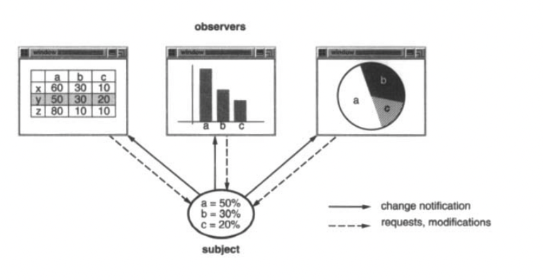
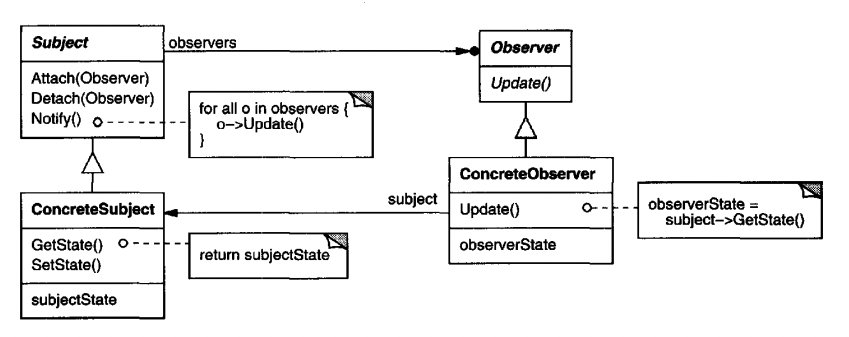
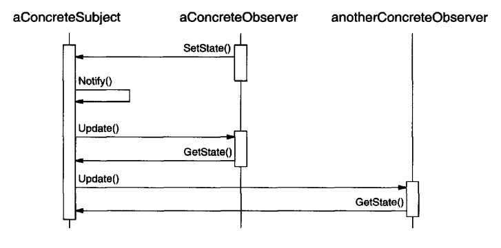
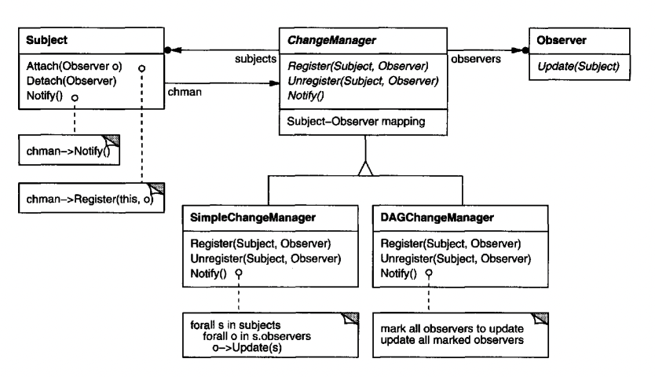

# Observer

## Intent
Define a one-to-many dependency between objects so that all objects are notified once the publisher changes its state.

## Motivation
Sometimes, you have a bunch of interrelated classes, which need to be kept consistent at all times. But ideally, you want to achieve it using minimum coupling.

Example - an Excel-like program, which updates its charts when a given cell changes its values:


This implies that the charts are all dependent on state changes of particular cells and they should be notified once that state change occurs.

The Observer pattern lets you establish these dependencies effectively. It defines "subjects" and "observers". 
A subject can have an infinite amount of observers, which are all notified on a given event.

When an observer is notified of an event, they can query the subject's state to update itself accordingly.

This interaction is often referred to as the "pubish-subscribe" model. A subject publishes notifications to observers without knowing who the observers are.

## Applicability
Use the Observer pattern when:
 * When an Abstraction needs to be split in two objects so that they can vary independently.
 * When a change in an object requires a change in others, but you don't know which ones exactly.
 * When an object should be able to notify others without knowing who they are.

## Structure


## Participants
 * Subject - knows its observers and provides an interface for adding/removing observers.
 * Observer - defines an interface for objects that should be notified of a given event.
 * ConcreteSubject - Stores the state of interest for observers & notifies observers on the given event.
 * ConcreteObserver - Maintains a reference to ConcreteSubject, implements the Observer interface & stays consistent with ConcreteSubject state.

Example interaction:


## Consequences
Observer lets you vary subjects and observers independently.

Other benefits of the pattern:
 * Abstract coupling between Subject and Observer - these classes have abstract dependencies on each others, which allow their implementing classes to have tight coupling among each other.
 * Support for broadcast communication - the message a subject sends is not tied to a specific observer. You can add/remove an arbitrary number of observers.
 * Unexpected updates - because observers are unaware of each other, them updating the subject might lead to unexpected updates in other observers.

## Implementation
Some issues to consider:
 * Mapping subjects to observers - instead of having subjects store observers directly, you can have a global registry of subject to observer mapping, which reduces storage cost, but trades complexity.
 * Observing more than one subject - It might make sense to depend on more than one subject. In that case, the Update interface needs to be extended so that observers know which subject notified them.
 * Who triggers the update? - clients or subjects?
    * Subjects - easier for clients to use, but can lead to unexpected updates if e.g. multiple compound updates follow in a row. 
    * Clients - harder for clients to use, but more flexibility on the exact point when observers are notified.
 * Dangling references to deleted subjects - A subject should notify its observers when its deleted so that they can clear their references to it.
 * Make sure Subject's state is consistent before notification.
    * ie the subject first does the state change and then notifies observers. 
    * This is easy to mess up in case of using inherited operations. Example:
```java
public void operation(int val) {
    super.operation(val); // invokes notification
    this.val += val; // does state change
}
```

This can be avoided by leveraging the Template Method pattern.

 * Avoiding observer-specific update protocols - should an event contain the data observers need or should observers have to explicitly query the subject for the data they need?
    * The former is the push model - it can lead to observer-specific event data, which can make observers less reusable.
    * The latter is the pull model - it leads to less coupling but more complexity in the observer as they need to locate what changed in the subject themselves.
 * Specifying modifications of interest explicitly - a cost-effective extension to the Observer pattern is to let observers register themselves to specific events, rather than any event.
    * When such events occur, the subject informs only those observers which are interested in the particular event. 
 * Encapsulating complex update semantics - when there are multiple interconnected subjects and observers, you might need a special intermediary which efficiently resolves the updates.
    * This is referred to as the `ChangeManager` and it can have different strategies for resolving updates - eg one update for all changed subjects, one update per changed subject, etc.

Example structure:


## Sample Code
Example Observer and Subject interfaces:
```java
public interface Observer {
  void update(Subject subject);
}

public abstract class Subject {
  private List<Observer> observers = new ArrayList<>();

  public void attach(Observer o) {
    observers.add(o);
  }

  public void detach(Observer o) {
    observers.remove(o);
  }

  public void sendNotifications() {
    for (Observer o : observers) {
      o.update(this);
    }
  }
}
```

Example concrete implementations:
```java
public class ClockTimer extends Subject {
  private final Timer timer = new Timer();

  public ClockTimer(int delayMs) {
    timer.scheduleAtFixedRate(new TimerTask() {
      @Override
      public void run() {
        tick();
      }
    }, 0, delayMs);
  }

  public void stop() {
    timer.cancel();
  }

  private void tick() {
    super.sendNotifications();
  }
}

public class DigitalClock implements Observer {
  @Override
  public void update(Subject subject) {
    System.out.println("the time is " + Instant.now());
  }
}
```

Example usage:
```java
ClockTimer timer = new ClockTimer(1000);
timer.attach(new DigitalClock());

// after you're done...
timer.stop();
```

## Related Patterns
The ChangeManager mentioned in the Implementation section is an example of a Mediator.

Singleton - the ChangeManager might be implemented as a singleton.
