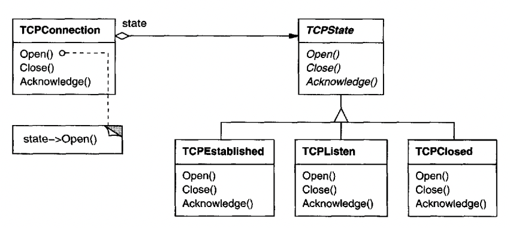
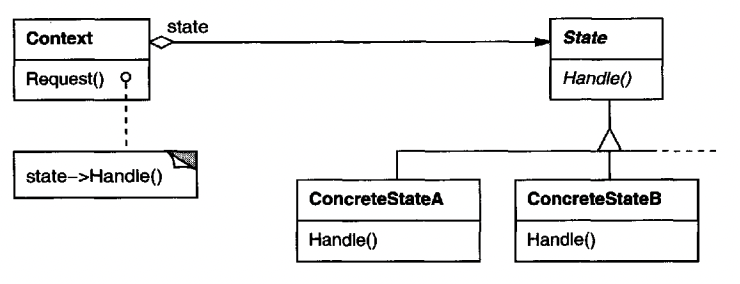

# State

## Intent
Enable an object to alter its behavior when its internal state changes.

## Motivation
Some use-cases require our application to behave differently based on the state it's in.

Example - a video game will behave very differently while it's in the launch menu and while it's in-game.

An effective way to represent these kinds of programs/classes is by using the State pattern.

Example from the book - a TCPConnection object, which behaves differently based on the state of the connection:


The TCPConnection class maintains a `state` object which refers to an instance of `TCPState` which is implemented by specific classes, which encapsulate the intended behavior during the given state.
Apart from controlling behavior, these classes can also control state transitions. `TCPConection` delegates the varying behavior to the state class implementation.

To change the current state of TCPConnection, it has to modify the `state` variable.

## Applicability
Use the State pattern in case:
 * an object's behavior depends on its state and that state/behavior can change at runtime
 * Operations in an object have large if-else-driven expressions, based on the object's state, which are effectively an embedded State pattern

## Structure


## Participants
 * Context (TCPConnection) - defines the interface for clients & delegates behavior to the ConcreteState
 * State (TCPState) - defines the interface which all states share
 * ConcreteState subclasses (TCPListen, TCPClosed) - implements the behavior associated to the given state it implements

## Consequences
 * Localizes state-specific behavior and partitions behavior for different states
    * This trades complexity (many classes vs. single one) for flexibility
    * It is much easier to extend the state machine and add new states without risking those changes impact the rest of the states
 * It makes state transitions explicit - using the pattern makes state transitions explicit, which is easier to debug, reason about & understand
 * State objects can be shared - this can be done if they only encapsulate behavior and don't have any internal state.

## Implementation
Some issues to consider:
 * Who defines the state transitions? 
If they are fixed, they can be defined in Context, but it is generally more flexible and appropriate for them to be defined in the State implementations.
A disadvantage of this latter approach is that States will know about each other, which creates additional dependencies.

 * A table-based alternative - A way to implement state transitions is by maintaining a table which maps inputs into a succeeding state.
This is useful when you want to avoid encoding rules in code, and want to encode them via data instead.

It's, however, usually difficult to accompany these state transitions with additional actions.
This enhancement makes sense for state transitions only and that's only if they're fixed.

 * Creating and destroying State objects - create state objects when they're needed or create them beforehand and reuse them?
The former approach is preferable if state transitions aren't known before runtime and state transitions happen infrequently.

If you, however, change states frequently and are facing a performance bottleneck, you can create the states beforehand and reuse them.

## Sample Code
The following example is of a sample game, which uses the State pattern for the game to have different behavior while the player is in the menu and while it is in-game.

Example State and Context implementations:
```java
public interface GameState {
  void draw();
  GameState update();
  void handle(int playerKeyPressed);
}

public class Game {
  GameState currentState = new MenuState();

  public void play() {
    while (true) {
      currentState.draw();
      currentState.handle(readPlayerMovement());
      currentState = currentState.update();
    }
  }

  private int readPlayerMovement() {
    return 0;
  }
}
```

Example State implementations:
```java
public class MenuState implements GameState {
  @Override
  public void draw() {
    // render menu
  }

  @Override
  public GameState update() {
    // update the game menu state

    // once the player selects e.g. "New Game"...
    return new GameStartedState();
  }

  @Override
  public void handle(int playerKeyPressed) {
    // handle player moving around the menu...
  }
}

public class GameStartedState implements GameState {
  @Override
  public void draw() {
    // draw the game...
  }

  @Override
  public GameState update() {
    // update the game. Transition to GameOverState once the game ends...

    // otherwise, preserve the current state...
    return this;
  }

  @Override
  public void handle(int playerKeyPressed) {
    // handle player movement
  }
}
```

## Related Patterns
Reusing states on state transitions can be implemented using the Flyweight pattern.

State objects can also be made Singletons.
