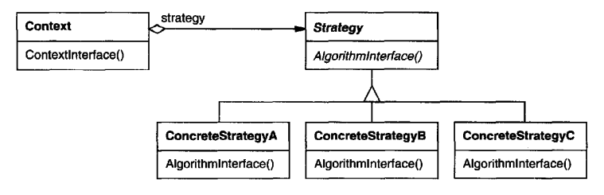

# Strategy

## Intent
Define a family of algorithms, which are interchangeable. Clients can vary the strategy to be used in a given implementation.

## Motivation
There are multiple algorithms for breaking a stream of text into lines. Hard-wiring all of those into the classes that require them is not feasible because:
 * Clients using the algorithms become bigger and harder to maintain because the algorithms are complicated and there are a dozen of them
 * Different algorithms will be appropriate at different times. We don't want to support multiple algorithms if we don't need all of them.
 * It's difficult to add new algorithms and modify existing ones because it involves modifying an existing class, which is probably quite big.

These problems can be avoided by encapsulating different algorithms in different classes which are plugged into a client, which uses them. These classes are called strategies:


In the above example, Composition uses a Compositor class which defines the actual algorithm which is used. Composition merely delegates flow of control to the compositor.

Compositors implement a given line-breaking algorithm and clients of Composition instantiate it with the strategy they want to use.

## Applicability
Use Strategy when:
 * Many related classes differ only in their behavior. Strategies enable you to vary the behavior of a class.
 * You need to use different algorithms for different conditions.
 * Strategies also allow you to encapsulate algorithm-specific data which clients shouldn't be aware of.
 * If a class has multiple conditional branches with different behaviors, you can extract each of these behaviors in different strategies.

## Structure


## Participants
 * Strategy (Composition) - declares an interface common to all strategies
 * ConcreteStrategy (SimpleCompositor, TeXCompositor, ArrayCompositor) - implements the given algorithm
 * Context (Composition) - gets configures with a given strategy and optionally exposes an interface for use by the strategy

## Consequences
 * Families of related algorithms - Strategy hierarchies define a family of algorithms for contexts to reuse. Inheritance can help with reuse of the common parts across all algorithms.
 * An alternative to subclassing - instead of subclassing the Context with varying behavior, the varying behavior can be encapsulated in strategies. This is a more flexible alternative.
 * Strategies eliminate conditional statements - instead of stuffing a lot of conditionals into the context class, the respective behavior can be encapsulated and delegated to strategies.
 * A choice of implementations - Strategy enables the client to choose the most appropriate way to implement a given algorithm.
 * Clients must be aware of different strategies - a potential drawback of the pattern is that there's extra burden on the client to choose a strategy which is to be used.
 * Communication overhead between strategies and Context - some strategies might need extra data, which other, simpler strategies don't use. The context will have to pass as much data as needed.
 * Increased number of objects - strategies create an additional overhead on the number of objects in the application. If you want to optimize this, you could make the strategies stateless and reuse them (ie Flyweight pattern).

## Implementation
Some implementation issues to consider:
 * Pass explicit data or the context itself to strategy implementations?

These are the two options one has when choosing how to implement the strategy pattern. 

The former approach keeps the strategy and context decoupled, but increases communication overhead.
The latter approach creates coupling between strategy and context, and also requires the Context to provide a more elaborate interface, tailored to the Strategy's needs.

 * Strategy as template parameter.

This technique is applicable if the strategy can be derived at compile-time and it doesn't have to be changed at run-time.
Additionally, it's only applicable in languages which support default instantiation of generics. Java is not among them.

 * Making Strategy objects optional - if a default strategy is applicable, providing a strategy as parameter can be made optional to simplify client implementations.

## Sample Code
Example Context and Strategy implementations:
```java
public interface Strategy<T> {
  List<T> sort(List<T> elements);
}

public static class Context<T> {
  private Strategy<T> strategy;

  public Context() {
    this(new DefaultStrategy<>());
  }

  public Context(Strategy<T> strategy) {
    this.strategy = strategy;
  }

  List<T> sort(List<T> elements) {
    return strategy.sort(elements);
  }
}

public static class DefaultStrategy<T> implements Strategy<T> {
  @Override
  public List<T> sort(List<T> elements) {
    return elements.stream().sorted().collect(Collectors.toList());
  }
}
```

Example usage:
```java
Context<Integer> defaultCtx = new Context<>();
List<Integer> result1 = defaultCtx.sort(Arrays.asList(5, 2, 3, 1, 4));
System.out.println(result1);

Context<Integer> customCtx = new Context<>(new DefaultStrategy<>());
List<Integer> result2 = customCtx.sort(Arrays.asList(5, 2, 3, 1, 4));
System.out.println(result2);
```

## Related Patterns
Flyweight can be used to optimize unnecessary allocations of Strategy objects.
