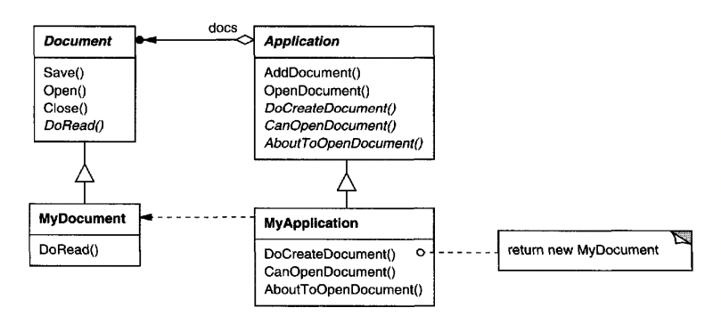
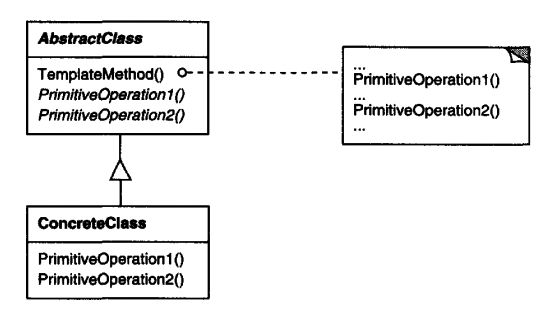

# Template Method

## Intent
Define the skeleton of an algorithm and let subclasses implement some of its steps. The pattern lets subclasses change parts of the algorithm, without changing its structure.

## Motivation
An application framework provides the abstract classes Application and Document. 
They define the algorithms for using the respective objects, but some parts of the algorithm should be deferred to the clients which use the framework.


In the above example, `Application` and `Document` are abstract classes, defined by the framework, while `MyDocument` and `MyApplication` are classes implemented by clients.

Application defines an `openDocument` method which defines the algorithm for opening documents, reused across all subclasses.

Subclasses have to override `canOpenDocument` and `doCreateDocument` which are abstract methods. These define the steps of the algorithm, which client classes are responsible to implement.
Optionally, they can also override `aboutToOpenDocument` which is a hook - a method which does nothing by default, but is invoked on certain events. 
In this case, it is invoked right before opening the document.

In particular, this hook enables clients to plug-in custom behavior before opening the document if they want to.

Similarly, `Document` defines an `open` method which can't be overriden and defines the algorithm for opening a document, but also provides a `doRead` abstract method, which subclasses have to override.

For sample implementation, see the `Sample Code` section.

In this example, the `openDocument` method in `Application` is a template method - a method which defines an algorithm in terms of abstract operations, which subclasses have to specify.
Using this technique, the `openDocument` algorithm is fixed, but some parts of it can vary.

## Applicability
Template Method should be used:
 * to implement the fixed parts of an algorithm and let subclasses define the parts of the algorithm which can vary.
 * When many subclasses share common behavior, which can be extracted in a base class to avoid code duplication.
 * To control subclass extensions via hooks, which are invoked at specific events. These hooks can be overriden by subclasses to plug-in additional behavior.

## Structure


## Participants
 * AbstractClass (Application) - Defines abstract primitive operations, which classes need to override & implements the template method which invokes the primitive operations among other non-variable operations.
 * ConcreteClass (MyApplication) - Implements the primitive operations, which carry-out subclass-specific steps of the algorithm.

## Consequences
Template methods are a fundamental technique in class libraries and frameworks, because they enable us to factor out common behavior in library classes, while letting clients implement the variable parts.

This pattern leads to an inverted control structure, referred to as the "Hollywood Principle" - Don't call us, we'll call you.
In example, the parent class calls child operations, rather than the other way around.

Template Methods invoke the following kinds of operations:
 * Concrete operations - defined in the abstract class, usually not overriden by subclasses.
 * Primitive operations - abstract operations, overriden by subclasses.
 * Factory methods
 * Hook operations - these are empty by default, but can be overriden by subclasses to attach additional behavior.

An example use-case of using template method is when a subclass overrides a given operation and always needs to invoke a parent class operation:
```java
@Override
public void operation() {
  super.operation();
  // derived class behavior...
}
```

Instead, this can be rewritten as a template method like this, to avoid relying on the subclasses to remember to invoke parent operations:
```java
public void operation() {
  // parent class behavior...
  hookOperation();
}
```

Hook operations do nothing in the parent class, but can be extended in the subclass:
```java
// in parent class
public void hookOperation() {}

// in derived class
@Override
public void hookOperation() {
  // derived class behavior...
}
```

## Implementation
Some implementation issues worth considering:
 * Leveraging access control mechanisms - these can be used to control which operations can/need to/shouldn't be extended.
    * Operations that need to be extended - declare `abstract`
    * Operations that can be extended - declare `protected` (if you don't want to expose them beyond the subclasses)
    * Operations that shouldn't be extended - declare `final`
 * Minimizing primitive operations - the more primitive operations clients need to define, the more tedious it is for clients to use the base class.
 * Naming conventions - you can use a naming convention to indicate which operations need to be extended and which can be extended
    * ie `doSomething` must be extended, `onSomething` can be extended (hook) 

## Sample Code
Example base classes with template methods:
```java
public abstract class Application {
  private final List<Document> docs = new ArrayList<>();

  public void openDocument(String name) {
    if (!canOpenDocument(name)) {
      return;
    }

    Document doc = doCreateDocument();
    if (doc != null) {
        docs.add(doc);
        doc.open();
        doc.doRead();
    }
  }

  protected abstract boolean canOpenDocument(String name);

  protected abstract Document doCreateDocument();

  protected void aboutToOpenDocument(Document doc) {}
}

public abstract class Document {
  public final void open() {
    // open the document...
    doRead();
  }

  public abstract void doRead() {}
}
```

Example subclasses, which implement the primitive operations:
```java
public class MyApplication extends Application {
  @Override
  protected boolean canOpenDocument(String name) {
    return true;
  }

  @Override
  protected Document doCreateDocument() {
    return new MyDocument();
  }

  @Override
  protected void aboutToOpenDocument(Document doc) {
    // handle the hook invoked before opening the doc...
  }
}

public class MyDocument extends Document {
  @Override
  public void doRead() {
    // handle the hook invoked after opening the document...
  }
}
```

## Related Patterns
Factory methods are often called by template methods.

Template methods use inheritance to vary parts of an algorithm. Strategy uses delegation to vary the entire algorithm.
