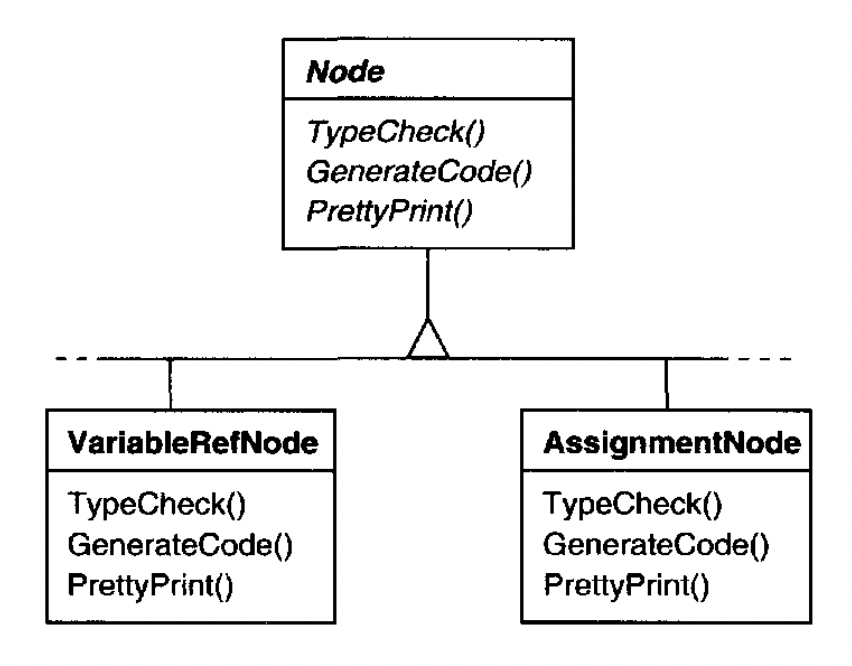
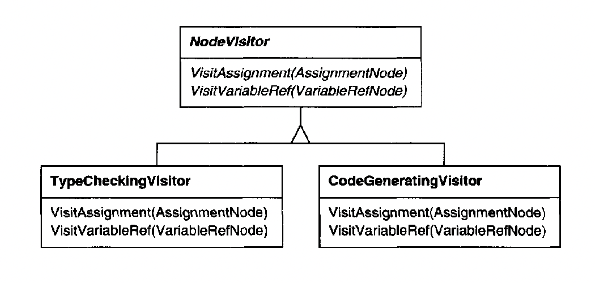
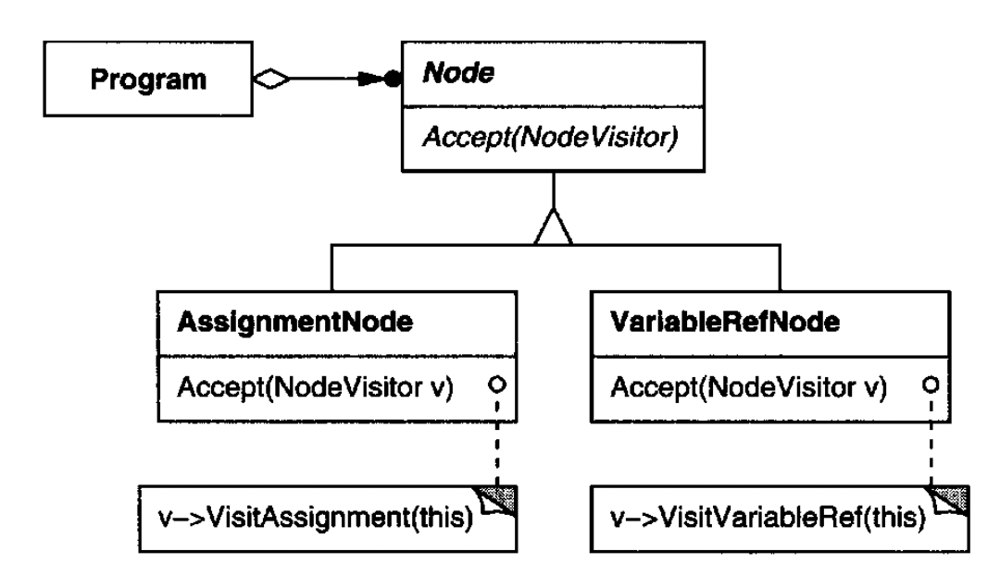
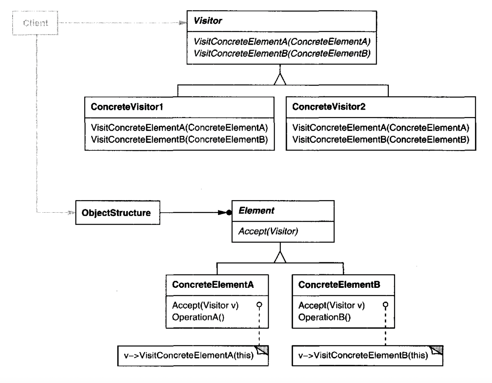
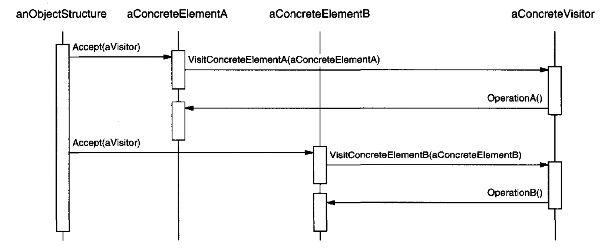

# Visitor

## Intent
Represent an operation to be performed on a collection of elements, be it hierarchical or not.

Visitor lets you define new operations without changing the classes of the elements on which it operates.

## Motivation
Example use-case, a compiler needs to execute some static analysis on the abstract syntax tree of a given program.

The static analysis can include various kinds of checks - unused variables, possible optimizations or readability improvements, unreachable code, etc.

Any of these checks also depend on the type of node they're being applied to. E.g. Variables will be analysed differently from assignment operations in certain analyses.

One way to address this issue is to let all your node implementation classes have one method per analysis type:


The problem with this approach is that it leads to a complex system which is hard to understand and extend.
Instead of classes having one responsibility, they have multiple ones. This makes it hard to understand everything a class is doing.
Also, adding a new kind of analysis involves changing all the classes in the class hierarchy.

An alternative is to have all analysis-related behavior in separate classes, called **visitors**.
These visitors accept as arguments a concrete node in a program and proceed with its analysis based on the data of the given node.


Node classes will also need an additional `Accept` operation which delegates to the visitor method which accepts the correct type for the given node.

e.g. `AssignmentNode` invokes `visitor.VisitAssignment(this)`, `VariableRefNode` invokes `visitor.VisitVariableRef(this)`.


The main benefit of this pattern is that it makes adding new kinds of operations easy - all you need to do is define a new visitor and pass it to the object structure.
In effect, you can add new static analysis operations without changing any of the node classes.

## Applicability
Use Visitor when:
 * An object structure contains classes with differing interfaces and you want to apply operations that depend on the concrete classes, not the common interface.
 * Many distinct and unrelated operations need to be applied on an object structure and you want to avoid polluting the classes with details about those operations.
 * The classes of an object structure rarely change but you often want to define new operations on them.

## Structure


## Participants
 * Visitor (NodeVisitor) - declares a Visit operation for each ConcreteElement in the object structure. Subclasses can access the data they need via the public interface.
 * ConcreteVisitor (TypeCheckingVisitor) - implements each operation defined by Visitor. Can also store & accumulate state during traversal.
 * Element (Node) - defines an Accept operation that takes a Visitor as argument.
 * ConcreteElement (AssignmentNode) - implements the Accept operation
 * ObjectStructure (Program)
    * can enumerate its elements
    * may provide high-level interface for visitor to access the elements
    * could be a Composite or a simpler collection such as a list

Example interaction diagram:


## Consequences
 * Visitor makes adding new operations easy - simply add a new visitor vs. changing all classes within an object structure.
 * Visitors gather related information together - behavior related to a particular operation is centralized within a visitor, rather than being spread out across all objects.
 * Adding new ConcreteElement classes is hard - on the flip side, adding a new concrete element class is hard because it requires changing the Visitor interface, along with all visitor implementations.
    * Key consideration before applying the Visitor pattern. Which happens more often - adding new classes or adding new operations?
 * Accumulating state - it is common for visitors to accumulate state during traversal. Without a visitor, that state will need to be passed as arguments to classes.
 * Breaking encapsulation - if a visitor needs access to a ConcreteElement's private state, that would require it to expose it via its public interface which breaks encapsulation.

## Implementation
The implementation section can be mostly derived from the Sample Code section and it mentions issues not applicable to most modern use-cases and languages. Refer to the book for the details.

## Sample Code
Example visitors:
```java
public interface EquipmentVisitor {
     void visit(Equipment e);
}

public class PriceVisitor implements EquipmentVisitor {
  private int totalPrice = 0;

  public int getTotalPrice() {
    return totalPrice;
  }

  @Override
  public void visit(Equipment e) {
    totalPrice += e.netPrice();
  }
}
```

Example abstract class for equipments:
```java
public abstract class Equipment {
  abstract int power();
  abstract int netPrice();
  abstract int discountPrice();

  void accept(EquipmentVisitor v) {
    v.visit(this);
  }
}
```

Example implementations of equipment:
```java
public class CompositeEquipment extends Equipment {
  private final List<Equipment> children  = new ArrayList<>();

  @Override
  int power() {
    return children.stream()
            .map(Equipment::power)
            .reduce(0, Integer::sum);
  }

  @Override
  int netPrice() {
    return children.stream()
            .map(Equipment::netPrice)
            .reduce(0, Integer::sum);
  }

  @Override
  int discountPrice() {
    return children.stream()
            .map(Equipment::discountPrice)
            .reduce(0, Integer::sum);
  }

  public void add(Equipment e) {
    children.add(e);
  }

  public void remove(Equipment e) {
    children.remove(e);
  }
}

public class FloppyDisk extends Equipment {
  @Override
  int power() {
    return 5;
  }

  @Override
  int netPrice() {
    return 10;
  }

  @Override
  int discountPrice() {
    return 2;
  }
 }

public class Card extends Equipment {
  @Override
  int power() {
    return 7;
  }

  @Override
  int netPrice() {
    return 20;
  }

  @Override
  int discountPrice() {
    return 3;
  }
}

public class Chassis extends CompositeEquipment {
  @Override
  int power() {
    return 1 + super.power();
  }

  @Override
  int netPrice() {
    return 13 + super.netPrice();
  }

  @Override
  int discountPrice() {
    return 1 + super.discountPrice();
  }
}

public class Bus extends CompositeEquipment {
  @Override
  int power() {
    return 12 + super.power();
  }

  @Override
  int netPrice() {
    return 9 + super.netPrice();
  }

  @Override
  int discountPrice() {
    return 1 + super.discountPrice();
  }
}
```

Example usage:
```java
Chassis chassis = new Chassis();
Bus bus = new Bus();
chassis.add(bus);

bus.add(new Card());
chassis.add(new FloppyDisk());

PriceVisitor visitor = new PriceVisitor();
chassis.accept(visitor);

System.out.println(visitor.getTotalPrice());
```

## Related Patterns
Composite - visitors are useful to create operations to be applied on all composite elements.
Interprete - visitor can be applied to implement interpretation.
