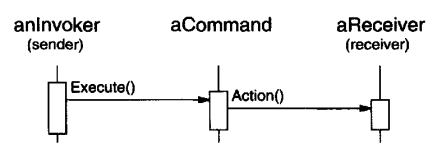
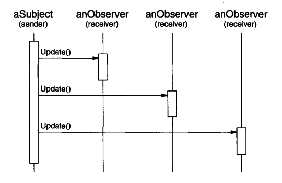
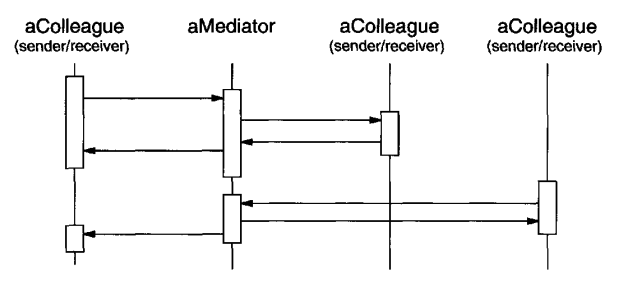
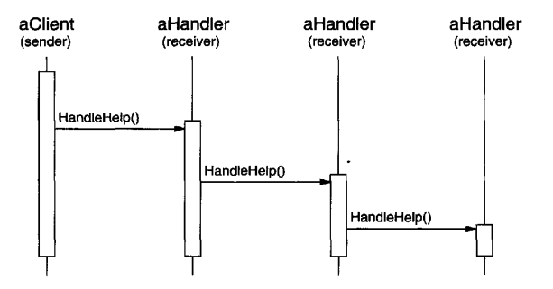

# Behavioral Patterns Discussion

## Encapsulating Variation
When there's a part of a program which changes frequently, there are patterns which offer us to encapsulate that varying part in an object, which can be modified separately from the rest of the program.
 * A Strategy object encapsulates a varying algorithm
 * A State object encapsulates a state-dependent behavior
 * A Mediator encapsulates the communication protocol between objects
 * An Iterator encapsulates how you access and traverse the components of an aggregate

## Objects as Arguments
Several patterns introduce an object which is always used as an argument. E.g. Visitor.

A Visitor is an argument passed to `Accept` functions on objects it visits.

Other patterns are magic tokens which are passed around and used at a later time.
 * In Command, the token represents a request
 * In Memento, the token represents the internal state of an object at a given point in time

In both cases, the token has a complex internal representation, but the client is not aware of it.

## Should communication be encapsulated or distributed?
Mediator and Observer are competing patterns. Observer distributes communication between observers and receivers, Mediator centralizes communication instead.

Observers are usually more reusable and interchangeable, but on the other hand, Mediators are easier to understand as they use an easier flow of control.

## Decoupling Senders and Receivers
When objects refer to each other directly, they become dependent on each other. Command, Observer, Mediator and Chain of Responsibility enable you to decouple senders from receivers with different trade-offs.

The Command pattern lets you decouple senders from receivers by using a Command object that defines the binding with the receiver:

The Observer pattern decouples senders from receivers by introducing an interface for signaling changes in senders without them explicitly referencing the receivers.
The receivers are defined (and can be changed) at runtime:

The Mediator decouples objects by enabling them to refer to each other indirectly via the Mediator object:

Finally, the Chain of Responsibility decouples senders from receivers by letting you send a request to a variable number of receivers, each of which can handle the request:

## Summary
With few exceptions, behavioral patterns complement each other:
 * A class in CoR usually includes at least one application of Template Method
 * CoR can also use Command to represent requests as objects
 * An iterator can traverse a collection, while a Visitor can apply an operation to all elements of a collection

Behavioral patterns work well with other types of patterns as well:
 * A Composite system can use a Visitor to apply operations on all elements of the composite hierarchy
 * A Composite can also use Chain of Responsibility to let children access some properties of their parent chain
 * The Composition might be created using a Builder of some sort of Factory or Prototype
