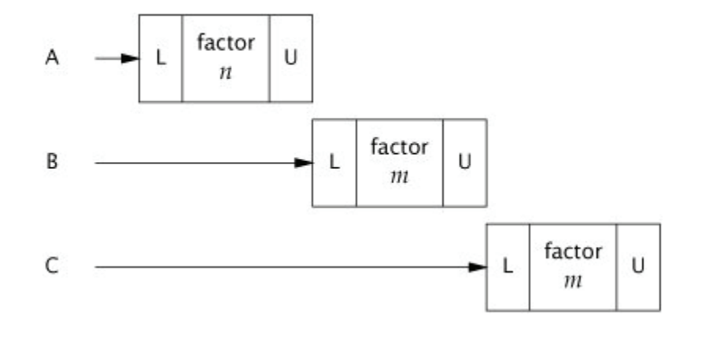

# Chapter 02 - Thread Safety

Concurrency is more about achieving thread-safety, than it is about creating & managing threads. Those are mechanisms, but at its core, concurrency aims to encapsulate shared mutable state from uncontrolled concurrent access.

Shared mutable state - properties of a class and/or properties of a dependent class (usually part of the class' properties). Any piece of data which can affect the class' externally visible behavior.

When should you synchronize? - when a shared, mutable variable is accessed by more than one thread **and** at least one of them modifies it.

Synchronization in Java is usually achieved by using the `synchronized` keyword, but it can also be achieved via the `volatile` keyword, atomic variables & explicit locks.

How to fix synchronization:
 * Don't share the variable between threads
 * Make the variable immutable
 * Use appropriate synchronization upon access
 
Good object-oriented practices (encapsulation) can help you achieve thread-safety more easily.

# What is thread-safety?
> A class is thread-safe when it continues to behave correctly when accessed from multiple threads.

Thread-safe classes encapsulate synchronization so that clients don't have to.

## Example - a stateless servlet
```java
@ThreadSafe
public class StatelessFactorizer implements Servlet {
  public void service(ServletRequest req, ServletResponse resp) {
    BigInteger i = extractFromRequest(req);
    BigInteger[] factors = factor(i);
    encodeIntoResponse(resp, factors);
  }
}
```

This file doesn't have any synchronization but it is thread-safe as it's a stateless class. All stateless classes are thread-safe.

It is only when servlets want to remember things from one request to another that the thread safety requirements become an issue.

# Atomicity
If we want to add a hit counter to the previous example, we could do it like this (not thread-safe!):
```java
@NotThreadSafe
public class UnsafeCountingFactorizer implements Servlet {
  private long count = 0;
  
  public long getCount() { return count; }
  
  public void service(ServletRequest req, ServletResponse resp) {
    BigInteger i = extractFromRequest(req);
    BigInteger[] factors = factor(i);
    
    ++count;
    encodeIntoResponse(resp, factors);  
  }
}
```

This class is not thread-safe as there is a state variable (count), which is accessed by multiple threads without any synchronization.
In the example above, it might appear that `++count` is an atomic operation but it isn't as its executing three different commands under the hood.

Several threads accessing that can lead to [this situation](https://github.com/preslavmihaylov/booknotes/blob/master/java/java-concurrency-in-practice/chapter-01/README.md#risks-of-threads).

## Race conditions
`UnsafeCountingFactorizer` has several race conditions.

The most common type of race condition is `check-then-act`. It happens when a given state-changing operation (the `act`) is executed if a given condition is met (the `check`).

Example:
```java
if (count < 10) {
  count = count + 1;
}
```

If the above example is executed by several threads, the count might receive a value greater than `10` which would violate the code snippet's invariant.

A common check-then-act race condition is lazy initialization:
```java
@NotThreadSafe
public class LazyInitRace {
  private ExpensiveObject instance = null;
  
  public ExpensiveObject getInstance() {
    if (instance == null)
      instance = new ExpensiveObject();
    return instance;
  }
}
```

Another common type of race condition is `read-modify-write`. The counting example has that race condition as the `++count` operation reads the value & then modifies it without any synchronization.

## Compound actions
To avoid race conditions, there must be a way to ensure that all dependent operations (e.g. `check-then-act`) are executed atomically.

An atomic compound action is one which, from the perspective of thread A, is either executed all the way or not executed at all.

Example of using atomic variables for fixing the `UnsafeCountingFactorizer` example:
```java
@ThreadSafe
public class UnsafeCountingFactorizer implements Servlet {
  private final AtomicLong count = new AtomicLong(0);
  
  public long getCount() { return count; }
  
  public void service(ServletRequest req, ServletResponse resp) {
    BigInteger i = extractFromRequest(req);
    BigInteger[] factors = factor(i);
    
    count.incrementAndGet();
    encodeIntoResponse(resp, factors);  
  }
}
```

## Locking
In the above example, there is one state variable & it is sufficient to merely use an atomic variant of it to make the class thread-safe.  
However, if there are two state variables, participating in the same invariant, it is not sufficient to make both of them atomic.  

Example of a non-thread-safe class - counting factorizer, using caching for last number & factors:
```java
@NotThreadSafe
public class UnsafeCountingFactorizer implements Servlet {
  private final AtomicReference<BigInteger> lastNumber = new AtomicReference<>();
  private final AtomicReference<BigInteger[]> lastFactors = new AtomicReference<>();
  
  public long getCount() { return count; }
  
  public void service(ServletRequest req, ServletResponse resp) {
    BigInteger i = extractFromRequest(req);
    if (i.equals(lastNumber.get())) {
      encodeIntoResponse(resp, lastFactors.get());
    } else {
      BigInteger[] factors = factor(i);
      lastNumber.set(i);
      lastFactors.set(factors);
      encodeIntoResponse(resp, factors);
    }
  }
}
```

With unlucky timing, the invariant that the `lastFactors` are the factors of the `lastNumber` can be violated. Hence, when multiple variables participate in an invariant, they must be updated in a single atomic operation.

### Intrinsic locks
The built-in mechanism in java for locking is using the `synchronized` block:
```java
synchronized(variable) {
  // block of code executing atomically
}
```

A synchronized method is a shorthand for synchronizing on the entire object (i.e. `this`):
```java
public synchronized void doSomething() {
  // synchronized method on "this"
}
```

These locks are effectively mutexes & are often called intrinsic locks.  

** If two distinct blocks of code are synchronized on the same object, they will be atomic with respect to each other**.  
This is why, it is important to synchronize variables, belonging to the same invariant with the same lock.

The `CountingFactorizer` from the previous example can be made thread-safe using locks:
```java
@ThreadSafe
public class SlowCountingFactorizer implements Servlet {
  private final BigInteger lastNumber = new BigInteger();
  private final BigInteger[] lastFactors = new BigInteger[];
  
  public long getCount() { return count; }
  
  public synchronized void service(ServletRequest req, ServletResponse resp) {
    BigInteger i = extractFromRequest(req);
    if (i.equals(lastNumber.get())) {
      encodeIntoResponse(resp, lastFactors.get());
    } else {
      BigInteger[] factors = factor(i);
      lastNumber.set(i);
      lastFactors.set(factors);
      encodeIntoResponse(resp, factors);
    }
  }
}
```

Although this is thread-safe, it is unbearable low-performant as only one request can be executed at a time. This is an example of how concurrency mechanism can bring performance problems.

## Guarding state with locks
Compound actions need to be guarded by a lock & the variables involved need to be guarded by the same lock wherever they are accessed.

It is a common misunderstanding that only the write-path of a shared variable need to be synchronized. Both read and write paths need to be synchronized due to problems with visibility (See chapter 3).

Additionally, related variables need to be guarded by the same lock. That lock is often "this" but that need not necessarily be so. It is merely a convenience so that one must not create an explicit lock object every time he uses synchronization.

A common practice is to synchronize all public methods of a class to make it thread-safe. This is not bad practice (e.g. the `Vector` class uses this approach), but one must be wary of potential problems:
 * Problems with liveness & performance (see previous example)
 * Problems with insufficient synchronization on compound actions.
For example, this is not thread-safe code, although it is using a thread-safe class:
```java
if (vector.contains(i)) {
 vector.add(i);
}
```

## Liveness & Performance
The problem with `SlowCountingFactorizer` is that the synchronization was excessive. That servlet will execute requests in this manner:  


This can make users quite frustrated, especially when the servlet is under high load.

Instead, strive for making the synchronized blocks are small as possible, but not too small.  

An example of a too small synchronized block would be not synchronizing compound actions together.  
An example of a too big synchronized block is synchronizing the whole method and/or unnecessarily synchronizing long-running I/O.

Here's the above class rewritten with proper synchronization:
```java
@ThreadSafe
public class CachedFactorizer implements Servlet {
  @GuardedBy("this") private BigInteger lastNumber;
  @GuardedBy("this") private BigInteger[] lastFactors;
  @GuardedBy("this") private long hits;
  @GuardedBy("this") private long cacheHits;
 
 public synchronized long getHits() { return hits; }
 public synchronized double getCacheHitRatio() {
   return (double) cacheHits / (double) hits;
 }
 
 public void service(ServletRequest req, ServletResponse resp) {
   BigInteger i = extractFromRequest(req);
   BigInteger[] factors = null;
   synchronized (this) {
     ++hits;
     if (i.equals(lastNumber)) {
       ++cacheHits;
       factors = lastFactors.clone();
     }
   }
   if (factors == null) {
     factors = factor(i);
     synchronized (this) {
       lastNumber = i;
       lastFactors = factors.clone();
     }
   }
   
   encodeIntoResponse(resp, factors);
 }
} 
```

Notice that the hit counter is also included & guarded by the same lock & synchronized blocks. This is not necessary as that state variable is not related to the caching invariant. It can be synchronized using a different lock. 

However, bear in mind that acquiring and releasing locks all the time has some overhead as well, so it is best, in this case, to just synchronize it using the same lock as the caching invariant.

Avoid synchronizing long-running I/O or network operations.
