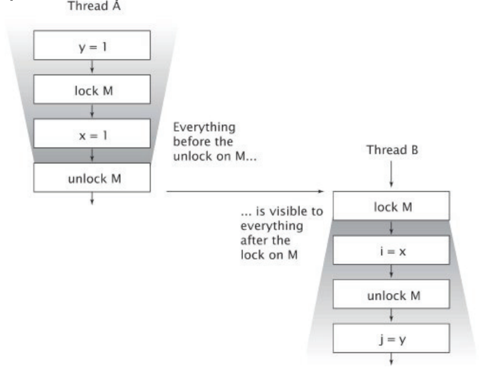

# Chapter 03 - Sharing Objects

So far, we've covered how to synchronize shared mutable data. This chapter focuses on techniques for publishing objects.

It will also cover the subtle problem of visibility.  
Synchronization is needed not only to make sure shared mutable state is modified atomically, but to also ensure that other threads can see the result of modifying state from a different thread.

# Visibility
In a single-threaded environment, when a value is written to a thread, it can be immediately read afterwards.  
This is not the case in a multi-threaded environment - there is no guarantee that a modification will be seen by another thread if synchronization is not used.

```java
public class NoVisibility {
    private static boolean ready;
    private static int number;
    private static class ReaderThread extends Thread {
    public void run() {
        while (!ready)
            Thread.yield();
            System.out.println(number);
        }
    }
 
    public static void main(String[] args) {
        new ReaderThread().start();
        number = 42;
        ready = true;
    }
} 
```

In the above program, there is absolutely no guarantee what the result will be. It might be that the program never terminates, that 0 is printed, or that you print the correct value - 42.  
There is no guarantee that the writes in one thread will be anticipated in the same order in a different thread (or anticipated at all).  

The reason for this is that the JVM makes some optimizations (e.g. reordering, turning a variable to a constant, etc) behind the scenes.  
In a normal single-threaded environment, it makes these optimizations but it also guarantees that the instructions will be executed sequentially in the eyes of the user.  

In a multi-threaded environment, the JVM isn't aware that certain variables can be modified in a separate thread and hence, cannot deduce relationships between given operations.

To avoid this problem, always use appropriate synchronization when sharing variables across threads - **even if other threads only read a variable without modifying it**.

## Stale data
What we observed just now is referred to as **stale data** - a thread reading a value which is out of date.  
This can cause serious problems, such as corrupted data structures, inaccurate computations, infinite loops.  

In the example below, there is a non-thread-safe integer. Although there are no compound actions, it is susceptible to stale data due to the lack of synchronization:
```java
@NotThreadSafe
public class MutableInteger {
    private int value;
    
    public int get() { return value; }
    public void set(int value) { this.value = value; }
} 
```

A better version is this. Notice that both `set` and `get` are synchronized as it is insufficient to merely synchronize the writes:
```java
@ThreadSafe
public class SynchronizedInteger {
    @GuardedBy("this") private int value;
    
    public synchronized int get() { return value; }
    public synchronized void set(int value) { this.value = value; }
} 
```

## Nonatomic 64-bit operations
If synchronization or the `volatile` keyword is not used, you are susceptible to stale data, but at least you'll get data which was correct at some point in time.  
This is guaranteed for 32-bit variables & not guaranteed for 64-bit variables (e.g. long).  

If a long variable is susceptible to staleness, you might get in a situation where you read the high 32 bits of one value & the low 32 bits of another.  
The reason is that the JVM allows operations on 64-bit values to be executed with more than one instruction.  

## Locking and visibility
Synchronizing reads and writes to a variable guarantee that subsequent reads in a different thread will see all previous writes in the original one.  
However, this is only guaranteed if both reads & writes are synchronized with the same lock.  



> Locking is not just about mutual exclusion; it is also about memory visibility. To ensure that all threads see the most up to date values of shared mutable variables, the reading and writing threads must synchronize on a common lock.

## Volatile variables
The `volatile` keyword is a lighter form of synchronization mechanism in java which only guarantees visibility, but doesn't guarantee atomicity.
Synchronized variables, on the other hand, verify both.

What the `volatile` keyword does it is instructs the JVM to avoid storing a given variable in caches so that when another processor reads that variable, it always reads the latest value.  
Additionally, no special optimizations are done to the variable to avoid abnormal behavior.  

In effect, the `volatile` keyword is signaling to the JVM that a variable will be used by more than one thread.  

The authors do not recommend relying on volatile variables too much as that can lead to deep reasoning for concurrency guarantees.  
A typical use-case for volatile variables are simple status flags.

> Locking can guarantee both visibility and atomicity; volatile variables can only guarantee visibility.

To use a volatile variable, all these conditions need to be met:
 * Writes to a volatile variable do not depend on its previous state (e.g. `cnt++`)
 * The variable does not participate in compound actions with other state variables
 * Locking is not required for any other reason while the variable is being accessed

# Publication & Escape
Publishing an object means making it available for read & write outside of its current scope. In many situations, we don't want to publish an object and its internals.  
If it happens without our consent, it is said that the object has escaped.  

In other times, we do want to publish an object, but that should be done in a thread-safe manner.  
Be wary that publishing internal state variables might compromise an object's invariants.  

The most blatant way to publish an object is via a public static field:
```java
public static Set<Secret> knownSecrets;

public void initialize() {
    knownSecrets = new HashSet<Secret>();
} 
```

Publishing an object also publishes any object the former refers to via a nonprivate access field/method.

Returning a reference to a private field from a non-private method publishes that object:
```java
class UnsafeStates {
    private String[] states = new String[] {
        "AK", "AL" ...
    };

    public String[] getStates() { return states; }
} 
```

Finally, an object can escape by publishing an inner class reference, which has access to its parent `this` reference:
```java
public class ThisEscape {
    public ThisEscape(EventSource source) {
        source.registerListener(
            new EventListener() {
                public void onEvent(Event e) {
                    doSomething(e);
            }
        });
    }
} 
```

If an object escapes, it matters not if someone actually capitalizes on the occassion as the class is effectively unsafe.  
An analogy is someone stealing your password. He might not use it right away, but your accounts are already exposed.  

## Safe construction practices
If the `this` reference escapes during construction, the class is considered to be not properly constructed.  
The `ThisEscape` class in the above example is such an example.  

This is true even if the escape happens as a last statement in the constructor.  

A common mistake is to start a new thread from a constructor. The new thread has a reference to `this`, making the object not properly constructed.  
It is perfectly fine to **create** a new thread from a constructor, but it is not OK to start it from within. Same goes for registering event listeners.  

To avoid this, use a factory method with a private constructor:
```java
public class SafeListener {
    private final EventListener listener;
    private SafeListener() {
        listener = new EventListener() {
            public void onEvent(Event e) {
                doSomething(e);
            }
        };
    }
 
    public static SafeListener newInstance(EventSource source) {
        SafeListener safe = new SafeListener();
        source.registerListener(safe.listener);
        return safe;
    }
} 
```

# Thread confinement
One way of simplifying thread-safety problems is to confine objects to a single thread.  
If an object is used exclusively by a single thread, that code is thread-safe even if the object isn't.  

GUI applications (e.g. Swing framework) use this extensively via event loops.  

Events in a GUI application execute on a single thread & objects from the framework need to be used from the event loop thread.  
If some object needs to be accesed outside of that thread, Swing has a mechanism (`invokeLater`) to prevent thread-safety violations.  

Thread confinement is a mechanism defined by your application's design. The java language doesn't guarantee confinement in any way (just as it doesn't guarantee locking).

## Ad-hoc thread confinement

Ad-hoc thread confinement means delegating thread confinement entirely to the implementation.  
This should be used sparingly. Prefer the stronger forms of thread confinement (next sections).

## Stack confinement
Stack confinement means to use local variables when managing objects.  
An object, which is encapsulated in a local variable can be used, even if it isn't thread-safe as long as you don't let its reference escape the scope.  

Local variables are thread-safe as they are confined to the executing thread's stack, rather than the heap memory, which is shared among threads.  
Local primitive variables are thread-safe as they can't be shared as per the language specifications. They are always confined to the executign thread's stack.  

## ThreadLocal
ThreadLocal allows you to create global variables, which have separate instances per thread.  
For example, if you have a global JDBC connection in your single-threaded application & you want to migrate to a multi-threaded application, it makes sense to leverage `ThreadLocal` as it will associate a different connection to the different threads in use of your app.  

If you hadn't used `ThreadLocal` your connection might be used without synchronization leading to a thread-safety violation.  
```java
private static ThreadLocal<Connection> connectionHolder = 
    new ThreadLocal<Connection>() {
        public Connection initialValue() {
            return DriverManager.getConnection(DB_URL);
        }
    };

public static Connection getConnection() {
    return connectionHolder.get();
} 
```

This can also be used if some frequently used operation requires a temporary buffer to perform the computation.   
If you want to avoid reallocating the buffer, you might want to extract it into a `ThreadLocal` state variable. That way, you will achieve the optimization you're aiming for + maintaining thread-safety without extra synchronization.

# Immutability
Immutable objects can only be in a single state, which is created in the object's constructor.  
All their fields are final & can't be modified.  

Immutable objects make achieving thread-safety easier as there is no need for explicit synchronization.  
They still need, however, to make changing a immutable object reference visible (e.g. via `volatile`).

An object is immutable when:
 * Its state cannot be modified after construction
 * All its fields are final (not necessarily but it is necessary unless you are Doug Lee)
 * It is properly constructed (the `this` reference didn't escape during construction)

Immutable objects can still use mutable objects internally as long as their references don't escape:
```java
@Immutable
public final class ThreeStooges {
    private final Set<String> stooges = new HashSet<String>();
    public ThreeStooges() {
        stooges.add("Moe");
        stooges.add("Larry");
        stooges.add("Curly");
    }

    public boolean isStooge(String name) {
        return stooges.contains(name);
    }
} 
```

## Final fields
Final fields are a less-strict form of the `const` keyword in C++.  
They don't let an object reference change after construction, although they don't prevent the object's internal state to change.  

However, they also have special "initialization safety" guarantee by the Java memory model.  
It is this guarantee that allows immutable objects to be freely accesssed and shared without synchronization.  

Even if an object is mutable, you should still consider making all fields that can be made final - final.  
A mostly thread-safe object is still better than a not-at-all thread-safe object.

It is best practice to use the `final` keyword wherever possible, just as it is good practice to use the `private` keyword wherever possible as well.

## Example: using volatile to publish immutable objects
In the `CachingFactorizer` examples, we struggled with making the cache thread-safe as it involved compound operations which had to be synchronized jointly.  
You can create an immutable holder class which simplifies synchronization on the cache:
```java
@Immutable
class OneValueCache {
    private final BigInteger lastNumber;
    private final BigInteger[] lastFactors;

    public OneValueCache(BigInteger i,
        BigInteger[] factors) {
        lastNumber = i;
        lastFactors = Arrays.copyOf(factors, factors.length);
    }

    public BigInteger[] getFactors(BigInteger i) {
        if (lastNumber == null || !lastNumber.equals(i))
            return null;
        else
            return Arrays.copyOf(lastFactors, lastFactors.length);
    }
} 
```

Then, using the `volatile` keyword guarantees that changes to the cache instance will be visible by all threads:
```java
@ThreadSafe
public class VolatileCachedFactorizer implements Servlet {
    private volatile OneValueCache cache = new OneValueCache(null, null);

    public void service(ServletRequest req, ServletResponse resp) {
        BigInteger i = extractFromRequest(req);
        BigInteger[] factors = cache.getFactors(i);
        if (factors == null) {
            factors = factor(i);
            cache = new OneValueCache(i, factors);
        }

        encodeIntoResponse(resp, factors);
    }
}
```

# Safe publication
This section covers how to publish objects safely.  
An improperly published object might appear to be in an inconsistent state to another thread.  

An example of improper publication:
```java
// Unsafe publication
public Holder holder;

public void initialize() {
    holder = new Holder(42);
} 
```

If an object is published in this way, some very bizarre things might happen if it is used in a thread different than the publishing one:
```java
public class Holder {
    private int n;

    public Holder(int n) { this.n = n; }
    public void assertSanity() {
        if (n != n)
            throw new AssertionError("This statement is false.");
    }
} 
```

In the example above, `n` might appear to be `null` to a caller thread, although it has been assigned a value via the constructor.  
What's more it could appear to be null the first time it's read and not null the second time, which might lead to the bizarre assertion.  

## Immutable objects and initialization safety
As we've seen, synchronization is needed when constructing mutable objects.  
However, the Java memory model has special guarantees for immutable objects.  

If an object meets all of the requirements for immutability, then it can be safely published without additional synchronization.  

In the above example, if `Holder` was immutable, it could not throw the assertion error, even if it wasn't properly published.  

This guarantee also extends to final fields of mutable objects. If a field is declared `final`, it is safely published without additional synchronization.  
Additional synchronization might be required, however, if the value's state is modified at a later stage.  

## Safe publication idioms

An object is properly published if:
 * It is initialized from a static field
 * A reference is stored to it into a volatile variable or an `AtomicReference`
 * A reference is stored in a `final` field of a properly constructed object
 * A reference is stored in a field, properly guarded by a lock

Additionally, if objects are published into a thread-safe collection (e.g. `ConcurrentHashMap`), they are safely published due to that collection's internal synchronization.

## Effectively immutable objects
If an object is not immutable, but its state doesn't change after safe publication, it is effectively immutable.  
This allows your program to avoid having to deal with synchronization as long as object state is not modified after construction.  

## Mutable objects
Mutable objects must be safely published, but also, subsequent reads and write need to be synchronized.  
Safe publication only ensures that the initial state of an object is visible after publication. Subsequent state changes need to be synchronized.  

To sum up:
 * Immutable objects can be published using any publishing mechanism
 * Effectively immutable objects need to be safely published
 * Mutable objects need to be safely published & access to them need to be synchronized

## Sharing objects safely
Whenever you acquire a reference to a shared object, you need to know what you are allowed to do with it.

The most useful synchronization policies:
 * Thread-confined objects is owned exclusively by its own thread & can be safely mutated in it.
 * Shared read-only objects can be accessed concurrrently without additional synchronization. These include immutable and effectively immutable objects
 * Shared thread-safe objects perform synchronization internally, so clients can use it without additional synchronization (unless a compound non-atomic action is used)
 * Guarded objects can be used concurrently only with a specific lock held. 
