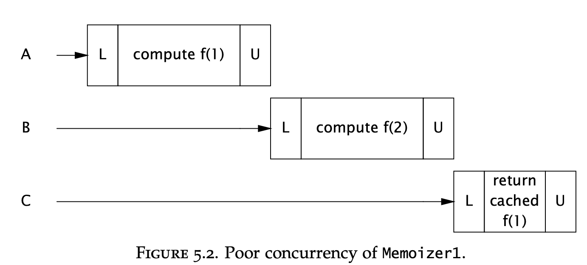
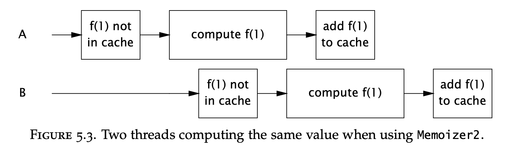
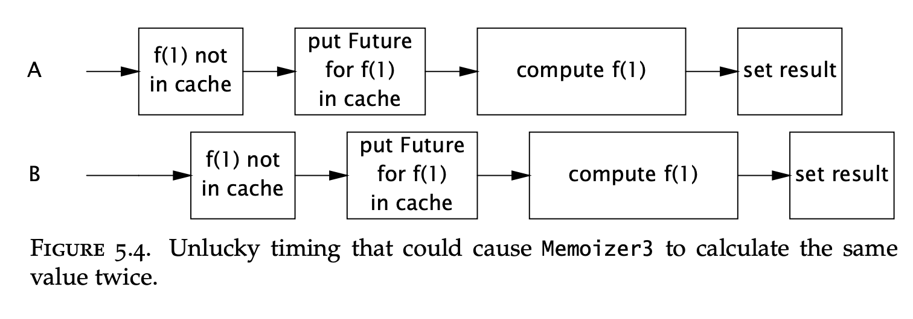

# Chapter 05 - Building Blocks

- [Synchronized Collections](#synchronized-collections)
  - [Problems with synchronized collections](#problems-with-synchronized-collections)
  - [Iterators and ConcurrentModificationException](#iterators-and-concurrentmodificationexception)
  - [Hidden Iterators](#hidden-iterators)
- [Concurrent collections](#concurrent-collections)
  - [ConcurrentHashMap](#concurrenthashmap)
  - [Additional atomic Map operations](#additional-atomic-map-operations)
  - [CopyOnWriteArrayList](#copyonwritearraylist)
- [Blocking Queues and the producer-consumer pattern](#blocking-queues-and-the-producer-consumer-pattern)
  - [Example: desktop search](#example-desktop-search)
  - [Serial thread confinement](#serial-thread-confinement)
  - [Deques and work stealing](#deques-and-work-stealing)
- [Blocking and interruptible methods](#blocking-and-interruptible-methods)
- [Synchronizers](#synchronizers)
  - [Latches](#latches)
  - [FutureTask](#futuretask)
  - [Semaphores](#semaphores)
  - [Barrier](#barrier)
- [Building an efficient, scalable result cache](#building-an-efficient-scalable-result-cache)

This chapter covers the most useful concurrenct libraries & collections available for you to use in order to leverage thread-safety delegation.

# Synchronized Collections

Include the `Vector` and `Hashtable` classes, along with the synchronized wrapper (`Collections.synchronizedX`).  
The way these work is by synchronizing every single public method (java monitor pattern), wrapping the underlying collection.

## Problems with synchronized collections
The main problem is that there are a lot of use-cases for compound actions on synchronized collections, for which there isn't any support - e.g. `putIfAbsent`, iteration, navigation, etc.

These methods on Vector are, for example, not thread-safe and can produce wrong results:
```java
public static Object getLast(Vector list) {
    int lastIndex = list.size() - 1;
    return list.get(lastIndex);
}

public static void deleteLast(Vector list) {
    int lastIndex = list.size() - 1;
    list.remove(lastIndex);
}
```

Writing these methods in a thread-safe way would require client-side locking.

Correct way to do it:
```java
public static Object getLast(Vector list) {
    synchronized (list) {
        int lastIndex = list.size() - 1;
        return list.get(lastIndex);
    }
}

public static void deleteLast(Vector list) {
    synchronized (list) {
        int lastIndex = list.size() - 1;
        list.remove(lastIndex);
    }
}
```

Traditional iteration could still produce an `ArrayIndexOutOfBounds` exception:
```java
for (int i = 0; i < vector.size(); i++)
    doSomething(vector.get(i));
```

A way to handle this is to lock the list while iterating over it. This, however, prevents other threads from accessing it:
```java
synchronized (vector) {
    for (int i = 0; i < vector.size(); i++)
        doSomething(vector.get(i));
}
```

## Iterators and ConcurrentModificationException
Modern concurrent collections still have the problem with modification during iteration.

If you iterate a concurrent list & a modification happens meanwhile, you will get a `ConcurrentModificationException`.

Note that detecting this is not guaranteed, but it's more of a best-effort guarantee. This is a deliberate design trade-off to improve performance of modification detection code.

The solution here is also to lock the collection while iterating it, but this introduces risks of deadlock. 

An alternative is to clone the collection & iterate the clone. The cloning operation will still need to be locked.

## Hidden Iterators
Sometimes, implicit iteration could happen in unobvious ways. Whenever this happen, make sure to deal with it as you would deal with normal iteration:
```java
public class HiddenIterator {
    @GuardedBy("this")
    private final Set<Integer> set = new HashSet<Integer>();

    public synchronized void add(Integer i) { set.add(i); }
    public synchronized void remove(Integer i) { set.remove(i); }

    public void addTenThings() {
        Random r = new Random();
        for (int i = 0; i < 10; i++)
            add(r.nextInt());
        System.out.println("DEBUG: added ten elements to " + set);
    }
}
```

Encapsulating the `HashSet` into a synchronized collection would delegate the thread-safety to the thread-safe collection and at least won't produce wrong results.

Iteration could also be invoked when invoking the `hashCode` method, when passing the collection as a constructor to another object, etc.

# Concurrent collections
In Java 5, alternatives to synchronized collections are added, which are better to use nowadays.  
The problem with synchronized collections is that throughput suffers due to their excessive synchronization.

Use `ConcurrentHashMap` instead of a synchronized map and `CopyOnWriteArrayList` instead of a synchronized list.

Additionally, the new `Queue` class is added along with its `BlockingQueue` derivative and `PriorityQueue`.  
The blocking queue is very useful in producer-consumer designs.

`ConcurrentSkipListMap` and `ConcurrentSkipListSet` are the concurrent alternatives to `SortedMap` and `SortedSet`.

## ConcurrentHashMap

This collection uses a sophisticated locking strategy, which improves performance and throughput compared to its synchronized map counterpart.  

It also doesn't throw a `ConcurrentModificationException` upon modification while iterating. Instead, it offers a weakly consistent iterator, which may or may not reflect modifications in the map.  
Additionally, `size()` and `isEmpty()` are no longer strongly consistent, but are instead approximations.

This is done in order to focus on the more widely used `get`, `put` methods in concurrent environments. This collection is meant to change a lot, all the time.

It, however, doesn't support acquiring the map lock explicitly, in contrast to synchronized collections.

For most use-cases, prefer the `ConcurrentHashMap` instead of the synchronized map.

## Additional atomic Map operations
Since client-side locking is not supported in concurrent maps, commonly used compound actions (such as `putIfAbsent`) are explicitly implemented:
```java
public interface ConcurrentMap<K,V> extends Map<K,V> {
    // Insert into map only if no value is mapped from K
    V putIfAbsent(K key, V value);

    // Remove only if K is mapped to V
    boolean remove(K key, V value);
    
    // Replace value only if K is mapped to oldValue
    boolean replace(K key, V oldValue, V newValue);
    
    // Replace value only if K is mapped to some value
    V replace(K key, V newValue);
}
```

## CopyOnWriteArrayList
This is a concurrent replacement to synchronized list, which derives its thread-safety by relying on an effectively immutable object.  
Whenever modification happens in such an array list, the whole list is copied.

Hence, when iterating such a list, the iterated collection will not change since the time the iterator was created, even if there are concurrent modifications.

This, of course, has some additional cost due to the underlying copying. This class was designed for use-cases where iteration is more common than modification.

# Blocking Queues and the producer-consumer pattern
Blocking queues support the operation a normal queue does, but they block on `take()` if the queue is empty and on `put()` if the queue is full.

They are useful for implementing producer-consumer designs where there are a number of producers and a number of consumers as it allows producers and consumers to be decoupled from one another.  

One important caveat when designing a solution with a blocking queue is to always use a bounded queue as otherwise, if producers produce work faster than consumers can process it, you might run out of memory.

The class library offers several implementations of this interface - `LinkedBlockingQueue` and `ArrayBlockingQueue` are standard concurrent FIFO queues. `PriorityBlockingQueue` allows elements to be ordered.

Finally, `SynchronousQueue` works like the first blocking queues, but without storing the elements. Instead, when using the synchronous queue and you `enqueue` something, you must wait for some thread to `dequeue` your element before you proceed.

## Example: desktop search
```java
public class FileCrawler implements Runnable {
    private final BlockingQueue<File> fileQueue;
    private final FileFilter fileFilter;
    private final File root;

    ...

    public void run() {
        try {
            crawl(root);
        } catch (InterruptedException e) {
            Thread.currentThread().interrupt();
        }
    }

    private void crawl(File root) throws InterruptedException {
        File[] entries = root.listFiles(fileFilter);
        if (entries != null) {
            for (File entry : entries)
                if (entry.isDirectory())
                    crawl(entry);
                else if (!alreadyIndexed(entry))
                    fileQueue.put(entry);
        }
    }
}

public class Indexer implements Runnable {
    private final BlockingQueue<File> queue;

    public Indexer(BlockingQueue<File> queue) {
        this.queue = queue;
    }

    public void run() {
        try {
            while (true)
                indexFile(queue.take());
        } catch (InterruptedException e) {
            Thread.currentThread().interrupt();
        }
    }
}
```

Here's how this boots up:
```java
public static void startIndexing(File[] roots) {
    BlockingQueue<File> queue = new LinkedBlockingQueue<File>(BOUND);
    FileFilter filter = new FileFilter() {
        public boolean accept(File file) { return true; }
    };

    for (File root : roots)
        new Thread(new FileCrawler(queue, filter, root)).start();
    for (int i = 0; i < N_CONSUMERS; i++)
        new Thread(new Indexer(queue)).start();
}
```

## Serial thread confinement
This is a technique, used by blocking queues, for transferring non-thread-safe objects in a thread-safe way between producer and consumer threads.

What this means is that object ownership is confined to one thread.

What a blocking queue does is it transfers ownership of a given object to a given thread by ensuring safe publication & by not using it anymore or making it available to other threads.

As long as a thread doesn't use an object anymore after putting it in a queue, transfer will be thread-safe.

## Deques and work stealing
In Java 6, two more classes are added - `Deque` and `BlockingDeque` which extend `Queue` and `BlockingQueue`.

These are queues, which support taking work from both the tail and the head.

They are used in a pattern, related to producer-consumer called work stealing. In this design, every worker has his own deque he takes work from.
But if his deque is exhausted, a worker will "steal" work from the tail of the deque of another worker.

This is often more scalable than a standard producer-consumer design as workers are working off their own work queue, instead of using a shared one.

# Blocking and interruptible methods

Whenever you're blocked on e.g. a `take` method of a blocking queue, you might get an `InterruptedException`. This signals that the queue's operation was cancelled and it lets you stop your work gracefully, rather than blocking forever.

Whenever you receive an `InterruptedException`, you should do one of two things:
 * Propagate it up the call stack
 * Acknowledge it and interrupt the current thread

```java
public class TaskRunnable implements Runnable {
    BlockingQueue<Task> queue;
    ...
    public void run() {
        try {
            processTask(queue.take());
        } catch (InterruptedException e) {
            // restore interrupted status
            Thread.currentThread().interrupt();
        }
    }
}
```

You should never swallow this exception & not propagate it as this deprives the caller from the opportunity to stop the thread in case of cancellation. This could lead to thread leakage.

# Synchronizers

A synchronizer is a class which manages control flow between multiple threads based on its own state. Blocking queues are an example of a synchronizers but there are more.

## Latches
A latch is a synchronizer which makes all threads waiting on it block until a given condition is met.

Example use-cases:
 * A service is dependent on other services starting beforehand
 * A service is waiting on some resource to get initialized

The most commonly used latch is the `CountDownLatch`. It allows you to enqueue N events you are waiting for to complete before proceeding.

Example usage where the duration of execution for given tasks is measured:
```java
public class TestHarness {
    public long timeTasks(int nThreads, final Runnable task) throws InterruptedException {
        final CountDownLatch startGate = new CountDownLatch(1);
        final CountDownLatch endGate = new CountDownLatch(nThreads);

        for (int i = 0; i < nThreads; i++) {
            Thread t = new Thread() {
                public void run() {
                    try {
                        startGate.await();
                        try {
                            task.run();
                        } finally {
                            endGate.countDown();
                    }
                    } catch (InterruptedException ignored) { }
                    }
            };
            t.start();
        }

        long start = System.nanoTime();
        startGate.countDown();

        endGate.await();
        long end = System.nanoTime();
        return end-start;
    }
}
```

## FutureTask
A `FutureTask` is a synchronizer where a thread waits on the completion of a given task & safely receives the result from it.

This is used when you want to start a lengthy task before you need the result from it & block on receiving the result (if not received already) when you need it.

Example:
```java
public class Preloader {
    private final FutureTask<ProductInfo> future =
        new FutureTask<ProductInfo>(new Callable<ProductInfo>() {
            public ProductInfo call() throws DataLoadException {
                return loadProductInfo();
            }
        });

    private final Thread thread = new Thread(future);

    public void start() { thread.start(); }

    public ProductInfo get() throws DataLoadException, InterruptedException {
        try {
            return future.get();
        } catch (ExecutionException e) {
            Throwable cause = e.getCause();
            if (cause instanceof DataLoadException)
                throw (DataLoadException) cause;
            else
                throw launderThrowable(cause);
        }
    }
}
```

All exceptions are wrapped in an `ExecutionException` and specific exceptions need to be casted & handled as necessary.

## Semaphores

A semaphore allows one to specify the maximum number of simultaneous threads accessing a given resource. It can also be used to implement bounded collections - collections with a maximum size.

The semaphore works by giving out permits which can be returned when they are not used anymore. Whenever someone attempts to get a permit, but the maximum allowed permits are already given out, the operation blocks.

Semaphores can be used to implement resource pools, such as a database connection pool.

Example usage for implementing a bounded hash set:
```java
public class BoundedHashSet<T> {
    private final Set<T> set;
    private final Semaphore sem;

    public BoundedHashSet(int bound) {
        this.set = Collections.synchronizedSet(new HashSet<T>());
        sem = new Semaphore(bound);
    }

    public boolean add(T o) throws InterruptedException {
        sem.acquire();
        boolean wasAdded = false;
        try {
            wasAdded = set.add(o);
            return wasAdded;
        }
        finally {
            if (!wasAdded)
                sem.release();
        }
    }

    public boolean remove(Object o) {
        boolean wasRemoved = set.remove(o);
        if (wasRemoved)
            sem.release();
        return wasRemoved;
    }
}
```

## Barrier
A barrier is similar to a latch, but instead of waiting for a given event to happen, you are waiting for a certain amount of threads to reach a given point.

It implements the protocol "Everyone arrive at McDonalds at 6 PM. If you arrive earlier, wait for the others to arrive and we'll decide what to do afterwards".

It can be used when you have an algorithm which is divided into multiple independent parts, but there are synchronization points, where the computations are combined.

For example, `MergeSort` can be implemented by having two thread sort their part of the array in parallel, but both wait for each others' completion before merging the sorted arrays.

Example Usage:
```java
public class CellularAutomata {
    private final Board mainBoard;
    private final CyclicBarrier barrier;
    private final Worker[] workers;

    public CellularAutomata(Board board) {
        this.mainBoard = board;
        int count = Runtime.getRuntime().availableProcessors();
        this.barrier = new CyclicBarrier(count, new Runnable() {
            public void run() {
                mainBoard.commitNewValues();
            }
        });

        this.workers = new Worker[count];
        for (int i = 0; i < count; i++)
            workers[i] = new Worker(mainBoard.getSubBoard(count, i));
    }

    private class Worker implements Runnable {
        private final Board board;

        public Worker(Board board) { this.board = board; }

        public void run() {
            while (!board.hasConverged()) {
                for (int x = 0; x < board.getMaxX(); x++)
                    for (int y = 0; y < board.getMaxY(); y++)
                        board.setNewValue(x, y, computeValue(x, y));
                try {
                    barrier.await();
                } catch (InterruptedException ex) {
                    return;
                } catch (BrokenBarrierException ex) {
                    return;
                }
            }
        }
    }

    public void start() {
        for (int i = 0; i < workers.length; i++)
            new Thread(workers[i]).start();
        mainBoard.waitForConvergence();
    }
}
```

# Building an efficient, scalable result cache
This is a full-blown example of implementing a result cache.

A naive approach to implement it would be to use a non-thread-safe hash map & explicitly synchronize the `compute` method:
```java
public interface Computable<A, V> {
    V compute(A arg) throws InterruptedException;
}

public class ExpensiveFunction implements Computable<String, BigInteger> {
    public BigInteger compute(String arg) {
        // after deep thought...
        return new BigInteger(arg);
    }
}

public class Memoizer1<A, V> implements Computable<A, V> {
    @GuardedBy("this")
    private final Map<A, V> cache = new HashMap<A, V>();
    private final Computable<A, V> c;

    public Memoizer1(Computable<A, V> c) {
        this.c = c;
    }

    public synchronized V compute(A arg) throws InterruptedException {
        V result = cache.get(arg);
        if (result == null) {
            result = c.compute(arg);
            cache.put(arg, result);
        }

        return result;
    }
}
```

This is thread-safe but not well performant:


An alternative would be to use a concurrent hash map:
```java
public class Memoizer2<A, V> implements Computable<A, V> {
    private final Map<A, V> cache = new ConcurrentHashMap<A, V>();
    private final Computable<A, V> c;

    public Memoizer2(Computable<A, V> c) { this.c = c; }

    public V compute(A arg) throws InterruptedException {
        V result = cache.get(arg);
        if (result == null) {
            result = c.compute(arg);
            cache.put(arg, result);
        }

        return result;
    }
}
```

This is better performant, but has a window of vulnerability where a given value could be computed twice:


To solve this, instead of storing a result, we can store a `FutureTask` in the cache. Threads coming after the first thread would wait on the result from the first thread's computation:
```java
public class Memoizer3<A, V> implements Computable<A, V> {
    private final Map<A, Future<V>> cache = new ConcurrentHashMap<A, Future<V>>();
    private final Computable<A, V> c;

    public Memoizer3(Computable<A, V> c) { this.c = c; }

    public V compute(final A arg) throws InterruptedException {
        Future<V> f = cache.get(arg);
        if (f == null) {
            Callable<V> eval = new Callable<V>() {
                public V call() throws InterruptedException {
                    return c.compute(arg);
                }
            };

            FutureTask<V> ft = new FutureTask<V>(eval);
            f = ft;
            cache.put(arg, ft);
            ft.run(); // call to c.compute happens here
        }

        try {
            return f.get();
        } catch (ExecutionException e) {
            throw launderThrowable(e.getCause());
        }
    }
}
```

This is way better than the previous versions but still has a small window of vulnerability for a computation to be computed twice.  
This is due to the check-then-act operation on the map, which is a compound operation.

If two threads get the same `null` value at the same time, both of them will initiate computing the result:


This is the final version, which leverages the atomic `putIfAbsent` operation:
```java
public class Memoizer<A, V> implements Computable<A, V> {
    private final ConcurrentMap<A, Future<V>> cache = new ConcurrentHashMap<A, Future<V>>();
    private final Computable<A, V> c;

    public Memoizer(Computable<A, V> c) { this.c = c; }

    public V compute(final A arg) throws InterruptedException {
        while (true) {
            Future<V> f = cache.get(arg);
            if (f == null) {
                Callable<V> eval = new Callable<V>() {
                    public V call() throws InterruptedException {
                        return c.compute(arg);
                    }
                };

                FutureTask<V> ft = new FutureTask<V>(eval);
                f = cache.putIfAbsent(arg, ft);
                if (f == null) { 
                    f = ft; 
                    ft.run(); 
                }
            }

            try {
                return f.get();
            } catch (CancellationException e) {
                cache.remove(arg, f);
            } catch (ExecutionException e) {
                throw launderThrowable(e.getCause());
            }
        }
    }
}
```
