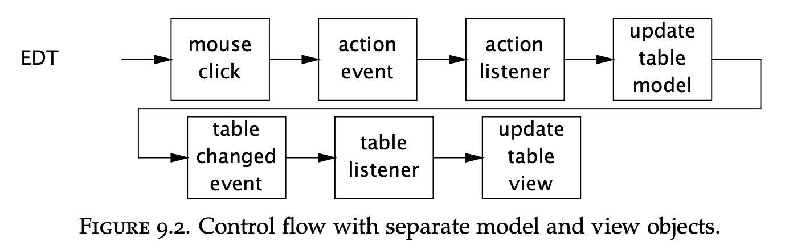

# Chapter 09 - GUI Applications
GUI Applications have their own peculiar threading issues.

E.g. if you're writing a Swing application, certain tasks need to be executed in Swing's event thread.  
Swing data structures are not thread-safe either.

Nearly all GUI toolkits are implemented this way - exploiting thread-confinement.

# Why are GUIs single-threaded?
All modern GUI frameworks are single-threaded subsystems. They work by having a dedicated event threda, called EDT (Event Dispatch Thread).

The reason why GUI frameworks are implemented like this is because of all sorts of problems with race conditions & deadlocks if they were implemented in a multi-threaded way.

The root cause of the inherent problems in a multi-threaded GUI is that input from OS affects high-level objects & high-level objects affect output on OS level (e.g. changing the background).
This leads to inconsistent lock ordering, which leads to deadlock.

In short, all GUI developers have rediscovered via experience that making a multi-threaded GUI is infeasible as of now.

Single-threaded GUI systems achieve thread safety through thread confinement. The alternative is you having to be an expert in thread-safety in order to use a GUI framework.

## Sequential event processing
Tasks in the event queue process sequentially. This makes development easier, but poses other risks - long-running tasks in the event queue will make the latter short-running ones slow.

This is why, if you need to run a long-running task, you should process it in a different thread than the event thread & return the result to the event thread once the processing is complete.

## Thread confinement in Swing
All swing objects are thread confined to the event thread. Any component should be created, queries & modified in the event thread only.

There are only a few exceptions with methods which are thread-safe and meant to be used outside of the event dispatch thread:
 * `SwingUtilities.isEventDispatchThread` - checks if the current thread is the event thread
 * `SwingUtilities.invokeLater` - schedule a `Runnable` for execution on the event thread
 * `SwingUtilities.invokeAndWait` - Schedule a `Runnable` for execution on the event thread & block until completed
 * Methods to requeue a repaint or revalidation request on the event thread
 * Methods for adding and removing listeners

The Swing event thread can be thought of as an instance of a single-threaded `Executor`.

# Short-running GUI tasks
Short-running tasks can be executed on the event thread seamlessly. There is no need for any parallel execution or anything fancy.

Example:
```java
final Random random = new Random();
final JButton button = new JButton("Change Color");
...
button.addActionListener(new ActionListener() {
    public void actionPerformed(ActionEvent e) {
        button.setBackground(new Color(random.nextInt()));
    }
});
```

The control flow of the above example:


A more complicated example is updating a formal data model, such as a `TableModel` or a `TreeModel`.
The reason is that these are defined by a model and a view. The view is subscribed to any change on the model:


What's interesting to note is that, again, control flow never leaves the EDT.

# Long-running GUI tasks
If there were no long-running tasks, the entire application could be run in the event thread and you need not pay any attention to multi-threading issues.

Prior to Java 6, Swing didn't have an easy mechanism to schedule tasks for execution in a background thread.
In this case, using a cached thread pool executor is a viable option.

We start with a simple task that doesn't support cancellation or progress indication or update the GUI upon finishing:
```java
ExecutorService backgroundExec = Executors.newCachedThreadPool();
...
button.addActionListener(new ActionListener() {
public void actionPerformed(ActionEvent e) {
    backgroundExec.execute(new Runnable() {
        public void run() { doBigComputation(); }
    });
}});
```

Enhanced example \w GUI presentation object update upon completion:
```java
button.addActionListener(new ActionListener() {
    public void actionPerformed(ActionEvent e) {
        button.setEnabled(false);
        label.setText("busy");
        backgroundExec.execute(new Runnable() {
            public void run() {
                try {
                    doBigComputation();
                } finally {
                    GuiExecutor.instance().execute(new Runnable() {
                        public void run() {
                            button.setEnabled(true);
                            label.setText("idle");
                        }
                    });
                }
            }
        });
    }
});
```

note that the feedback action after completion is not executed in the background thread, but is instead scheduled for execution in the EDT.

## Cancellation
You can add support for cancellation using a `FutureTask` as it is the most convenient way to achieve it.

Example:
```java
Future<?> runningTask = null; // thread-confined
...
startButton.addActionListener(new ActionListener() {
    public void actionPerformed(ActionEvent e) {
        if (runningTask == null) {
            runningTask = backgroundExec.submit(new Runnable() {
                public void run() {
                    while (moreWork()) {
                        if (Thread.currentThread().isInterrupted()) {
                            cleanUpPartialWork();
                            break;
                        }
                        doSomeWork();
                    }
                }
            });
        }
    }
});

cancelButton.addActionListener(new ActionListener() {
    public void actionPerformed(ActionEvent event) {
        if (runningTask != null)
            runningTask.cancel(true);
}});
```

## Progress & completion indication
`FutureTask` also has a `done` hook which simplifies completion notification.

## SwingWorker
The previous examples used vanilla `Executor` objects for managing background tasks.
Swing now has support for this out of the box using `SwingWorker`.

# Shared data models
Swing presentation models are not thread-safe and should be confined to the event thread.

Maintaining thread-safety in a single-threaded GUI app is easy. But what if you have to change some of these models in a background thread?

## Thread-safe data models
One option is to use thread-safe classes for the data models. This is viable as long as responsiveness doesn't suffer as a result.

A variant of the `ConcurrentHashMap` or the `CopyOnWriteArrayList` can be used for sharing data.

## Split data models
In GUI applications, the typical models (such as `TreeModel`) are typically managed by two different objects.

One is the view model & the other is the application domain model. This design is referred to as split-model design.
In such a design, the presentation object is confined to the EDT, while the domain model is thread-safe & can be accessed by multiple threads.

Consider this split-model design if a data model needs to be shared by more than one thread & using a thread-safe data model is not viable.

## Other forms of single-threaded subsystems
Thread confinement is not limited to GUI applications. 

Sometimes, the developer is forced to use thread-confinement when e.g. using a native library which requires that all access to the library be done in the same thread.

All the techniques discussed in this chapter can be borrowed for designing solutions for other single-threaded subsystems as well.
