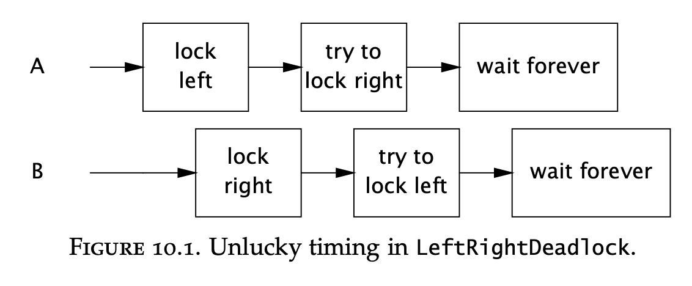

# Chapter 10 - Avoiding Liveness Hazards
Too much safety could lead to liveness problems.   
Liveness == problems with your program crashing/stalling/being too slow but not necessarily producing wrong results.

Using too many locks can lead to lock ordering deadlocks. Bounding our resources too much using semaphores & bounded thread pools could lead to resource deadlocks.  
Java applications can't recover from a deadlock so it is worthwhile exploring what causes deadlock in the first place.

# Deadlock
Deadlock is illustrated by the five philosophers problem - 5 philosophers sit on a dining table & they have five chopsticks between them (not five pairs). A philosopher can alternate between thinking or eating.

Some algorithms would tackle this problem effectively by making the philosopher attempt to pick up both chopsticks before eating and putting down the chopstick he picked up if the other is not available with a retry mechanism after a minute.

Others would lead to deadlock - philosophers attempt to pick both chopsticks & don't drop the one picked up already if the other one is not available.

When a thread holds a lock forever, other threads will block forever waiting for the thread to release the lock.

Example - When thread A holds lock L and tries to acquire lock M, but at the same time thread B holds M and tries to acquire L, both threads will wait forever.

This is the simplest case of deadlock - two threads forever waiting for the other due to a cyclic locking dependency.
You can think of the locking dependency as a directed graph. If there is a cycle in the graph, there is a deadlock.

Database systems represent locking dependency this exact way and are able to break out of deadlocks by constantly traversing this locking dependency graph & cancelling transactions which form a cycle.
The JVM, unfortunately, doesn't have such a mechanism. If a java application deadlocks it's the end of the game.

## Lock-ordering deadlocks
Example lock-ordering deadlock:
```java
// Warning: deadlock-prone!
public class LeftRightDeadlock {
    private final Object left = new Object();
    private final Object right = new Object();

    public void leftRight() {
        synchronized (left) {
            synchronized (right) {
                doSomething();
            }
        }
    }

    public void rightLeft() {
        synchronized (right) {
            synchronized (left) {
                doSomethingElse();
            }
        }
    }
}
```

Example deadlock control flow:


In this example, the deadlock can happen because the locks `left` and `right` are not acquired in the same order, leading to a cyclic locking dependency.

**If two locks are always acquired in the same order, a lock-ordering deadlock cannot happen.**

Verifying lock-ordering dependencies requires a global analysis of the whole program. Both `leftRight` and `rightLeft` don't seem to have an issue when analysed in isolation.
When, however, analysed as one whole, the lock-ordering dependency is found.

## Dynamic lock order deadlocks
When the lock object used is dynamic, rather than static, ensuring avoidance of lock-ordering deadlock can be out of our hands.

Example:
```java
// Warning: deadlock-prone!
public void transferMoney(Account fromAccount, Account toAccount, DollarAmount amount) throws InsufficientFundsException {
    synchronized (fromAccount) {
        synchronized (toAccount) {
            if (fromAccount.getBalance().compareTo(amount) < 0)
                throw new InsufficientFundsException();
            else {
                fromAccount.debit(amount);
                toAccount.credit(amount);
            }
        }
    }
}
```

In this case, the lock objects are input parameters & the order of locking depends on the order of arguments being passed, which is out of our control.

Example deadlock scenario:
```java
// In thread A
transferMoney(myAccount, yourAccount, 10);

// In thread B
transferMoney(yourAccount, myAccount, 20);
```

One way to avoid lock ordering problems like these, which don't entirely depend on our input, is to ensure that the locks are always acquired in the same order regardless of input order.
For example, you could order the accounts based on the hash code & synchronize consistently.

Solution:
```java
private static final Object tieLock = new Object();
public void transferMoney(final Account fromAcct, final Account toAcct, final DollarAmount amount) throws InsufficientFundsException {
    class Helper {
        public void transfer() throws InsufficientFundsException {
            if (fromAcct.getBalance().compareTo(amount) < 0)
                throw new InsufficientFundsException();
            else {
                fromAcct.debit(amount);
                toAcct.credit(amount);
            }
        }
    }

    int fromHash = System.identityHashCode(fromAcct);
    int toHash = System.identityHashCode(toAcct);
    if (fromHash < toHash) {
        synchronized (fromAcct) {
            synchronized (toAcct) {
                new Helper().transfer();
            }
        }
    } else if (fromHash > toHash) {
        synchronized (toAcct) {
            synchronized (fromAcct) {
                new Helper().transfer();
            }
        }
    } else {
        synchronized (tieLock) {
            synchronized (fromAcct) {
                synchronized (toAcct) {
                    new Helper().transfer();
                }
            }
        }
    }
}
```

In the above scenario, a tie-breaking lock is used in the cases where the hash codes are equal.
It poses a performance hit, but the tie occurs very rarely, due to the randomness of hash codes.

One might argue that deadlocks due to issues like these occur rarely, but in heavily-loaded applications, lock acquisitions happen billions of times daily.
It is sufficient for only one of those cases to deadlock to bring the entire application to a grinding halt.

Example load test causing deadlock in above scenario:
```java
public class DemonstrateDeadlock {
    private static final int NUM_THREADS = 20;
    private static final int NUM_ACCOUNTS = 5;
    private static final int NUM_ITERATIONS = 1000000;

    public static void main(String[] args) {
        final Random rnd = new Random();
        final Account[] accounts = new Account[NUM_ACCOUNTS];
        for (int i = 0; i < accounts.length; i++)
            accounts[i] = new Account();

        class TransferThread extends Thread {
            public void run() {
                for (int i=0; i<NUM_ITERATIONS; i++) {
                    int fromAcct = rnd.nextInt(NUM_ACCOUNTS);
                    int toAcct = rnd.nextInt(NUM_ACCOUNTS);
                    DollarAmount amount = new DollarAmount(rnd.nextInt(1000));
                    transferMoney(accounts[fromAcct], accounts[toAcct], amount);
                }
            }
        }

        for (int i = 0; i < NUM_THREADS; i++)
            new TransferThread().start();
    }
}
```

## Deadlocks between cooperating objects
Multiple lock acquisitions are not always as obvious as in the left-right example. Sometimes, they might be caused by two cooperating classes:
```java
// Warning: deadlock-prone!
class Taxi {
    @GuardedBy("this") private Point location, destination;
    private final Dispatcher dispatcher;

    public Taxi(Dispatcher dispatcher) {
        this.dispatcher = dispatcher;
    }

    public synchronized Point getLocation() {
        return location;
    }

    public synchronized void setLocation(Point location) {
        this.location = location;
        if (location.equals(destination))
            dispatcher.notifyAvailable(this);
    }
}

class Dispatcher {
    @GuardedBy("this") private final Set<Taxi> taxis;
    @GuardedBy("this") private final Set<Taxi> availableTaxis;

    public Dispatcher() {
        taxis = new HashSet<Taxi>();
        availableTaxis = new HashSet<Taxi>();
    }

    public synchronized void notifyAvailable(Taxi taxi) {
        availableTaxis.add(taxi);
    }

    public synchronized Image getImage() {
        Image image = new Image();
        for (Taxi t : taxis)
            image.drawMarker(t.getLocation());

        return image;
    }
}
```

In the above scenario, if one thread calls `setLocation` and another one `getImage` at the same time, a deadlock is possible.

The reason is that the `setLocation` acquires the `Taxi` lock and `Dispatcher` lock in this order, while `getImage` acquires the same locks in reverse order.

## Open calls
`Taxi` and `Dispatcher` are OK on their own, but not ok when used together. The writer of `Taxi` has to know the implementation details of `Dispatcher` in order to be coded correctly.

This should not be the case as these classes are independent & such a constraint breaks encapsulation.

The root cause of the problem was that an alien method was called while holding a lock. An alien method is a method we don't own. 
That could be a method of another class or a method which can be overridden in a subclass.

> Calling an alien method with a lock held is difficult to analyze and should be avoided.

On the contrary, calling an alien method without a lock held is called an open call and should be preferred.

Classes that make open calls are more well-behaved and more easily composable.

Analyzing programs for deadlocks is easier when classes use open calls only as finding lock-ordering dependencies is way easier.

The solution to the problem we saw is refactoring the `Taxi` and `Dispatcher` to have smaller synchronized blocks, leading to open calls:
```java
@ThreadSafe
class Taxi {
    @GuardedBy("this") private Point location, destination;
    private final Dispatcher dispatcher;

    public synchronized Point getLocation() {
        return location;
    }

    public void setLocation(Point location) {
        boolean reachedDestination;
        synchronized (this) {
            this.location = location;
            reachedDestination = location.equals(destination);
        }

        if (reachedDestination)
            dispatcher.notifyAvailable(this);
    }
}

@ThreadSafe
class Dispatcher {
    @GuardedBy("this") private final Set<Taxi> taxis;
    @GuardedBy("this") private final Set<Taxi> availableTaxis;

    public synchronized void notifyAvailable(Taxi taxi) {
        availableTaxis.add(taxi);
    }

    public Image getImage() {
        Set<Taxi> copy;
        synchronized (this) {
            copy = new HashSet<Taxi>(taxis);
        }

        Image image = new Image();
        for (Taxi t : copy)
            image.drawMarker(t.getLocation());

        return image;
    }
}
```

Making synchronized blocks smaller can lead to less atomicity. 

Sometimes, this is OK as operations are independent - e.g. the location of the taxi is independent of the dispatcher's notification.
Other times, less atomicity leads to some inconsistencies which are tolerable - the `getImage` might not receive the latest snapshot, but is OK as the snapshot is fresh enough.

Finally, if less atomicity can compromise safety, other atomicity mechanisms can be used. For example, you could confine a non-atomic execution to a single thread while waiting for an open call to finish.

## Resource deadlocks
Threads can also deadlock when waiting for a shared resource.

If:
 1) a task depends on connections to two different databases
 2) the connections are not always acquired in the same order
 3) The shared resource pool is bounded

these preconditions can lead to a deadlock.

Another variant of a resource deadlock is when a task, dependent on another task is submitted to a single-threaded executor.  
This could also happen if the executor is bounded, but is less likely than with a single-threaded one.

# Avoiding and diagnosing deadlocks
One way to avoid lock-ordering deadlocks is by never acquiring more than one lock at a time.

This is sometimes impractical but can lead to less maintenance cost if possible.

Otherwise, use a consistent lock-ordering strategy (like the hash-based order) through your application.

Avoid making non-open calls as this will tremendously simplify lock-ordering analysis.

## Timed lock attempts
Another way of avoiding deadlocks is by using explicit locks, instead of intrinsic ones. They provide the `tryLock` utility which times out if a lock is not acquired.

When a `tryLock` fails you don't necessarily know what happened but at least you could record the error for retrospective analysis.

## Deadlock analysis with thread dumps
A thread dump provides a stack trace for each running thread, similar to a stack trace accompanying an exception.
They also include locking information, which can aid in lock-ordering analysis.

What's more, when a thread dump is triggered, the JVM analyses the lock-ordering graph & provides information on deadlocks if found.

A thread dump is triggered by `kill -3` on Unix or by clicking `Ctrl-\` when the process is in the foreground.

Example of thread dump \w a deadlock found:
```
Found one Java-level deadlock:
=============================
"ApplicationServerThread":
waiting to lock monitor 0x080f0cdc (a MumbleDBConnection),
which is held by "ApplicationServerThread"
"ApplicationServerThread":
waiting to lock monitor 0x080f0ed4 (a MumbleDBCallableStatement),
which is held by "ApplicationServerThread"
Java stack information for the threads listed above:
"ApplicationServerThread":
at MumbleDBConnection.remove_statement
- waiting to lock <0x650f7f30> (a MumbleDBConnection)
at MumbleDBStatement.close
- locked <0x6024ffb0> (a MumbleDBCallableStatement)
...
"ApplicationServerThread":
at MumbleDBCallableStatement.sendBatch
- waiting to lock <0x6024ffb0> (a MumbleDBCallableStatement)
at MumbleDBConnection.commit
- locked <0x650f7f30> (a MumbleDBConnection)
...
```


# Other liveness hazards
Deadlock is the most commonly-encountered liveness problem but there are others as well. This section breezes through them.

## Starvation
Starvation occurs when a thread is perpetually denied access to resources it needs in order to make progress.

The most commonly starved resource is CPU cycles.
It can also be caused by inappropriate use of thread priorities, executing nonterminating constructs (infinite for-loops or resource waits) with a lock held. 

The thread priorities are a platform-dependent mechanism as each platform has different mechanisms for defining priorities. Using thread priorities makes your program platform-dependent.

Additionally, it could lead to starvation problems as some threads might never get executed due to low priority.

## Poor responsiveness
This can be caused by a thread holding a lock for too much time or due to a long background task stalling the foreground GUI process. 

In the latter situation, you have a reasonable case for thread priorities to prevent background threads from disrupting user input.

## Livelock
A livelock happens when a thread is not blocked, but never makes progress as it constantly retries an operation that always fails.

Example scenario is a message in a message processing system being rolled back & put in the head of the queue. 
This way, the message processing system can never continue as it retries the same transaction which always ends up the same way.

Livelock can also occur if multiple cooperating threads change their state in a way that neither of them can make progress.
A live example of this is when two polite people clash into each other & both of them attempt to make way to the other person, resulting in no one going forward.

To resolve this issue, you might include some randomness in the protocol to avoid packets always clashing into each other.
For example, when two ethernet packages collide, the ethernet receivers retry their messages with some random backoff interval to avoid colliding again.


