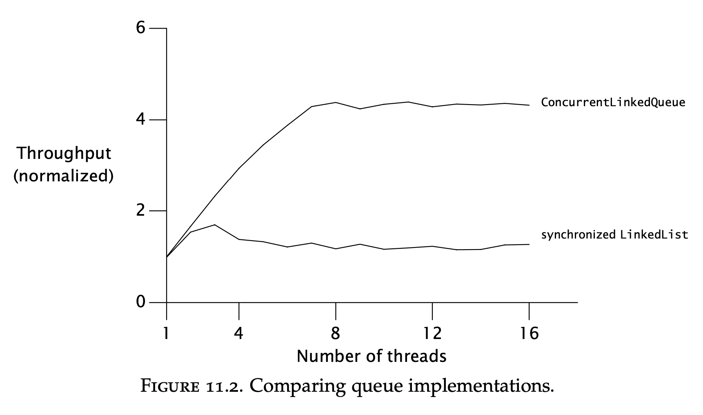
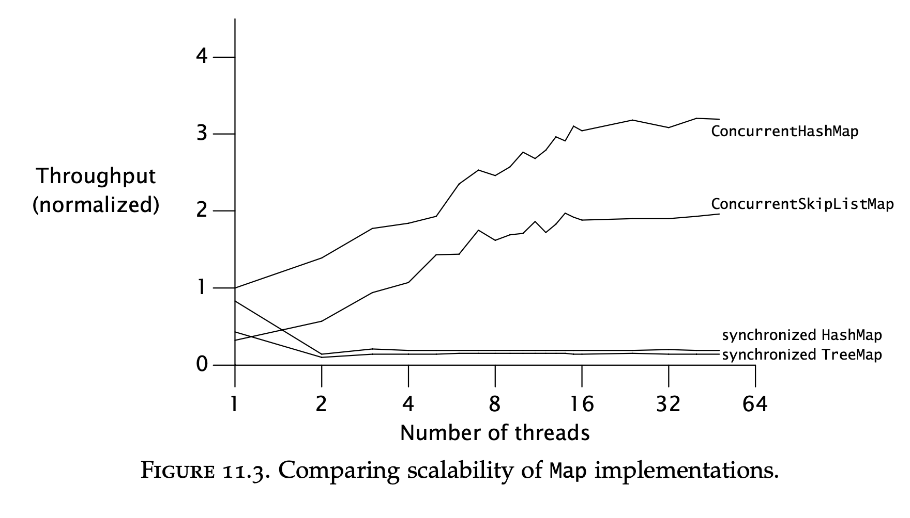

# Chapter 11 - Performance and Scalability
The rationale for using concurrency is often because one wants to achieve more performance.

This chapter focuses on analyzing, monitoring and improving the performance of multi-threaded programs.
Often times, however, performance improvements come at the cost of complexity and/or safety risks.

Safety should not be compromised in favor of performance.

# Thinking about performance
When we think about performance, we usually mean extracting more throughput with fewer resources.

Performance is often bound by a certain resource (bottleneck). E.g. database calls, I/O, CPU, etc.

Additionally, using multiple threads has some performance costs in comparison to single-threaded programs due to context switching, locking, etc.
In some cases, a multi-threaded program could perform worse than a single-threaded equivalent.

By using concurrency to exploit performance we aim for two things:
 * Utilize the available resources more effectively
 * Leverage the existing resources more effectively (e.g. keeping the CPUs as busy as possible)

## Performance vs. Scalability
Performance can be measured in multiple ways:
 * service time
 * latency,
 * throughput
 * efficiency
 * capacity
 * scalability

The latter two properties are measures of "how much" work can be done. The first ones are measures of "how fast" work can be done.
> Scalability == the extent to which capacity is improved when additional resources are added

Designing and tuning for performance is very different from tuning for scalability.

In the former case, the goal is to do the same amount of work with less effort.
In the later case, the goal is to parallelize the work so that capacity is improved when additional resources are added.

Often times, these two goals are at odds with each other. Sometimes, degrading performance can lead to improved scalability.

A monolithic, coupled application with an MVC architecture will yield better performance for a single request than a multitier architecture, split across several systems (micro services).

For most web applications, scalability is often more important than performance. That is what this chapter focuses on.

## Evaluating performance tradeoffs
Nearly all engineering decisions are tradeoffs.

Often times, one has to make tradeoffs based on limited information. E.g. quicksort is better for large datasets, but bubblesort is best for small ones.
One has to know in advance the amount of data in order to process it most effectively.

This is what most often leads to premature optimizations - making trade offs with limited requirements.
It is best to optimize for correctness first & only improve performance after it is proven to be insufficient.

> First make it right, then make it fast - if it is not fast enough already

Applying performance optimizations often lead to higher complexity & less readability. This inherently increases maintenance cost.

Before making a performance optimization to make a routine faster, think about:
 * What does "fast" mean in this case?
 * Under what conditions will this actually be faster? Light vs. heavy load. Small vs. big datasets. Support answer with measurements.
 * How often are these conditions met? Is it an edge-case or a typical use-case?
 * What are the costs of applying this performance optimization?

The quest for performance is the single greatest source of concurrency bugs. It has lead to countless bad idioms for the sake of performance.

E.g. the double-check idiom over plain & simple synchronization.

Measure performance improvement before & after optimizations.

# Amdahl's law
This law basically states that the maximum utilization of an application is bounded by two parameters - the % of serial code + the % parallelization.

The first parameter means how serial your instructions are. Can they be performed in parallel.
The second parameter means, in the context of multi-threading, how many threads/processors you are using.

It also expresses exactly how much % performance gain you can get based on the % serialization of your routine.

In sum, the more serial your routine is, the less parallelizable it is.

Example serialized runnable:
```java
public class WorkerThread extends Thread {
    private final BlockingQueue<Runnable> queue;

    public WorkerThread(BlockingQueue<Runnable> queue) {
        this.queue = queue;
    }

    public void run() {
        while (true) {
            try {
                Runnable task = queue.take();
                task.run();
            } catch (InterruptedException e) {
                break; /* Allow thread to exit */
            }
        }
    }
}
```

This piece of code is limited by the serialized portion, which is the blocking take on the blocking queue.

## Example: serialization hidden in frameworks


This graphic shows that merely the choice of a concurrent data structure can greatly improve/degrade scalability.

## Applying Amdahl's law qualitatively
It is hard to measure the % serialization of a routine, but Amdahl's law can still be applied by measuring the relative serialization of different versions of a routine.

In the later parts of the chapter, by applying the techniques of splitting a lock in two & lock striping, one can see that lock striping provides relatively better % serialization, hence scales better.

# Costs introduced by threads
Single-threaded programs have no scheduling or synchronization overhead. Multi-threaded programs, on the other hand, have some overhead in this regard.

The use of threads should outweigh the costs they bring.

## Context switching
When a thread is scheduled out in favor of another one, a context switch occurs.

In this event, the OS has to persist the thread's execution context in memory & load the new thread's context in the CPU.

Additionally, the new thread will most probably make a lot of cache misses when it is first loaded. This is why when a thread is first loaded, it has a "grace period" during which it is not scheduled out even if it blocks.

A single-threaded program never context switches as there is only one thread.

A high quantity of context switches will lead to a lot of time spent in the kernel space (over 10%). This can indicate a lot of context switches occurring.

## Memory synchronization
The performance cost of using `synchronized` and `volatile` keywords is that caches are invalidated & the JVM is prohibited from performing certain optimizations.
Nevertheless, the cost of synchronization is not that great to advocate compromising safety.

However, one must differentiate between contended & uncontended synchronization:
 * Uncontended synchronization - synchronizing when no other threads are waiting for the lock
 * Contended synchronization - synchronizing when there are multiple threads waiting for the lock, leading to blocked threads.

Uncontended synchronization can be entirely handled by the JVM and a developer shouldn't bother with them.
What's more, the JVM can remove synchronized blocks if it discovers that there is no need for the lock.

Examples - an empty synchronized block, synchronizing on a `new Object()`, synchronizing on a thread-confined variable, etc.

## Blocking
Contended locking causes threads to block. Blocking a thread can be implemented either by spin-waiting (actively polling the state) or by suspension, which involves the OS (incurring overhead).

Spin-waiting is better for short wait times, suspension is better for long ones. Most JVMs simply use suspension. Some choose between both based on profiling data.

# Reducing lock contention
Contended locks are the root cause for most performance bottlenecks in concurrent routines.

Lock contention is based on two parameters:
 * How long a lock is held
 * How often a lock is acquired

If the product of these two is sufficiently small, most lock acquisitions will be uncontended. Hence one can optimize concurrent algorithms by reducing either of these.

Alternatively, one can avoid using locking altogether & relying on alternative concurrency mechanisms to guarantee safety.

## Narrowing lock scope ("Get in, get out")
If you try your best to hold the lock for as little as possible, lock contention will be reduced.

Bad example, leading to lock contention:
```java
@ThreadSafe
public class AttributeStore {
    @GuardedBy("this") private final Map<String, String> attributes = new HashMap<String, String>();

    public synchronized boolean userLocationMatches(String name, String regexp) {
        String key = "users." + name + ".location";
        String location = attributes.get(key);
        if (location == null)
            return false;
        else
            return Pattern.matches(regexp, location);
    }
}
```

In the above example, only the map access needs to be synchronized, not the whole method.

A better way to implement this:
```java
@ThreadSafe
public class BetterAttributeStore {
    @GuardedBy("this") private final Map<String, String> attributes = new HashMap<String, String>();

    public boolean userLocationMatches(String name, String regexp) {
        String key = "users." + name + ".location";
        String location;
        synchronized (this) {
            location = attributes.get(key);
        }

        if (location == null)
            return false;
        else
            return Pattern.matches(regexp, location);
    }
}
```

It can even be further improved by delegating thread-safety to a thread-safe collection entirely (such as `ConcurrentHashMap`).

A synchronized block needs to be shrunk only if a significant computation is performed inside of it.
Shrinking a synchronized block too much can lead to safety issues - e.g. not synchronizing compound actions.

## Reducing lock granularity
One could improve lock contention by using more granular locks for independent objects.

Example:
```java
@ThreadSafe
public class ServerStatus {
    @GuardedBy("this") public final Set<String> users;
    @GuardedBy("this") public final Set<String> queries;

    ...

    public synchronized void addUser(String u) { users.add(u); }
    public synchronized void addQuery(String q) { queries.add(q); }
    public synchronized void removeUser(String u) { users.remove(u); }
    public synchronized void removeQuery(String q) { queries.remove(q); }
}
```

In this example, the same lock is used for two independent state variables. If two separate locks are used for the two variables, the routines will be more scalable:
```java
@ThreadSafe
public class ServerStatus {
    @GuardedBy("users") public final Set<String> users;
    @GuardedBy("queries") public final Set<String> queries;

    ...

    public void addUser(String u) {
        synchronized (users) {
            users.add(u);
        }
    }

    public void addQuery(String q) {
        synchronized (queries) {
            queries.add(q);
        }
    }

    // remove methods similarly refactored to use split locks
}
```

This technique is useful when a lock experiences moderate contention. 
Using lock splitting on moderately contended locks can turn them into mostly uncontended locks.

When there is little contention, the net improvement in performance/throughput will be small.
But this will increase the threshold at which performance starts to suffer.

For highly contended locks, this might not improve performance significantly.

## Lock striping
Lock splitting on a heavily contended lock can lead to two heavily contended locks. This will not improve matters greatly.

This technique can be extended to partitioning a variable-set of independent objects into multiple locks.

For example, `ConcurrentHashMap` uses 16 different locks to synchronize access to different parts of the underlying hash buckets.

This technique is called lock striping & improves performance greatly on objects susceptible to such partitioning.

However, it makes dealing with synchronization much more complex. 
For example, when the hashmap needs to expand, it has to acquire all the locks before doing so, which is more complex than acquiring a single object lock.

Example implementation of a hash map using lock striping:
```java
@ThreadSafe
public class StripedMap {
    // Synchronization policy: buckets[n] guarded by locks[n%N_LOCKS]
    private static final int N_LOCKS = 16;
    private final Node[] buckets;
    private final Object[] locks;

    private static class Node { ... }

    public StripedMap(int numBuckets) {
        buckets = new Node[numBuckets];
        locks = new Object[N_LOCKS];
        for (int i = 0; i < N_LOCKS; i++)
            locks[i] = new Object();
    }

    private final int hash(Object key) {
        return Math.abs(key.hashCode() % buckets.length);
    }

    public Object get(Object key) {
        int hash = hash(key);
        synchronized (locks[hash % N_LOCKS]) {
        for (Node m = buckets[hash]; m != null; m = m.next)
            if (m.key.equals(key))
                return m.value;
        }

        return null;
    }

    public void clear() {
        for (int i = 0; i < buckets.length; i++) {
            synchronized (locks[i % N_LOCKS]) {
                buckets[i] = null;
            }
        }
    }
    ...
}
```

## Avoiding hot fields
Using lock striping & lock splitting can improve matters when two threads are accessing independent objects.

However, if the implementation has some kind of a "hot field", which is used in all synchronized operations, regardless of the objects, this hinders scalability.
For example, in the hashmap implementation, one has to provide a `size()` method. 

You could implement size by counting each element every time the method is invoked or by changing the counter on every insert/deletion.

The later approach would introduce a hot field as that field will be updated on every object insertion/deletion regardless of whether the objects are independent of one another.
This is an example where performance is at odds with scalability -> optimizing the `size()` method will hinder the data structure's scalability.

In the `ConcurrentHashMap` implementation, this is handled by counting the size of each stripe. Size increments are guarded by that stripe's lock. 
When `size()` is invoked, all the stripes' sizes are summed. This is more performant than counting all objects from scratch and yet, preserves scalability.

## Alternatives to exclusive locks
Other means of optimizing contended locks is by using different means for synchronization:
 * Delegating thread-safety to concurrent collections
 * Using read-write locks
 * Using immutable objects & atomic variables

Read-write locks allow multiple readers & a single writer for a given synchronized block.
When a collection is more often read, than written, this provides better concurrency than the `synchronized` keyword.

When a collections is written once & read-only, using an immutable object offers the best concurrency.

When you have hot fields, they can be optimized by using atomic variables. They are better than synchronizing the hot fields as they use lower-level synchronization mechanisms.
Removing hot fields altogether will improve scalability even more.

# Monitoring CPU utilization
When looking for performance improvements, you can see how much your multi-threaded program utilizes the CPUs.

If the CPUs are asymmetrically utilized, this indicates some bottleneck in your code. Here are some potential reasons:
 * Insufficient load - try increasing the load on your system first to make sure it is fully saturated. This could be bottlenecked by the client system causing the load.
 * I/O Bound - your code might be waiting on external resources
 * Externally bound - your application might be blocked waiting on external web services or a database
 * Lock contention - your application might be bottlenecked by "hot locks". This can be additionally monitored by a profiler, showing which locks are contended a lot.

If your application is keeping your CPUs sufficiently utilized, you can monitor if adding additional CPUs will improve performance.

## Just say no to object pooling
Object pooling is a technique where instead of deallocating objects, you recycle them into a pool, where they can be reclaimed.

This was used as a performance optimization when garbage collection was expensive. Nowadays, it isn't and this shouldn't be used.

It is more complex and it also degrades performance for small & medium objects. It only makes sense for very large objects.

This technique, nowadays, makes sense in VERY constrained environments.

# Example: Comparing Map performance
This simply shows that using the concurrent collections is better than using the synchronized versions:


The bottleneck with the synchronized collections is the lock contention imposed by using intrinsic locks.

# Reducing context switch overhead
An example problem involving context switching is logging.

Many logging libraries are thin wrappers around `println` utilities. This is an approach where each thread logs in its own context.

An alternative is to have a dedicated logging thread which solely logs incoming requests. All other threads append their messages to a blocking queue & continue their work.
This is often more performant than the former approach as it involves less context switching.

When multiple threads are trying to write to stdout, they are all blocked on I/O & context switching occurs, waiting for the bounded resource.
By having a dedicated background logging thread, it is only that thread which is blocked on the I/O. All other threads can continue its work.

