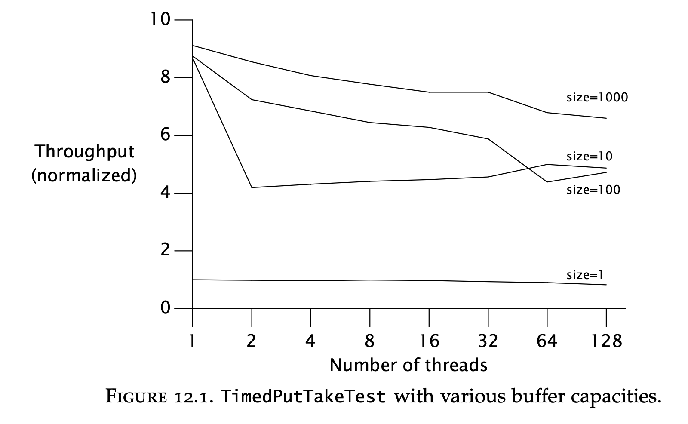
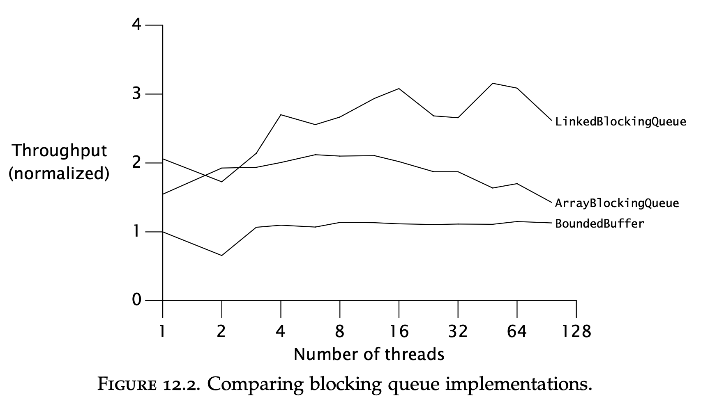
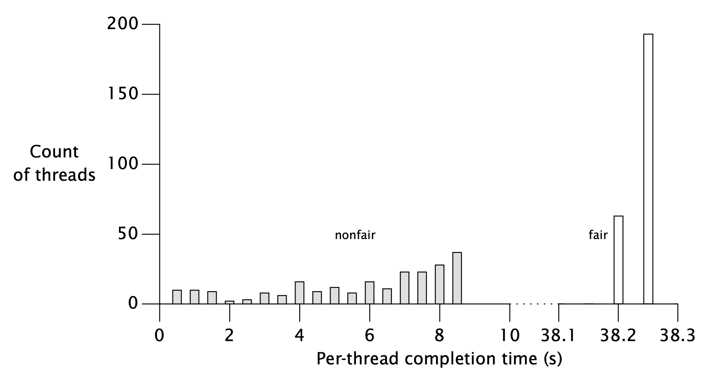
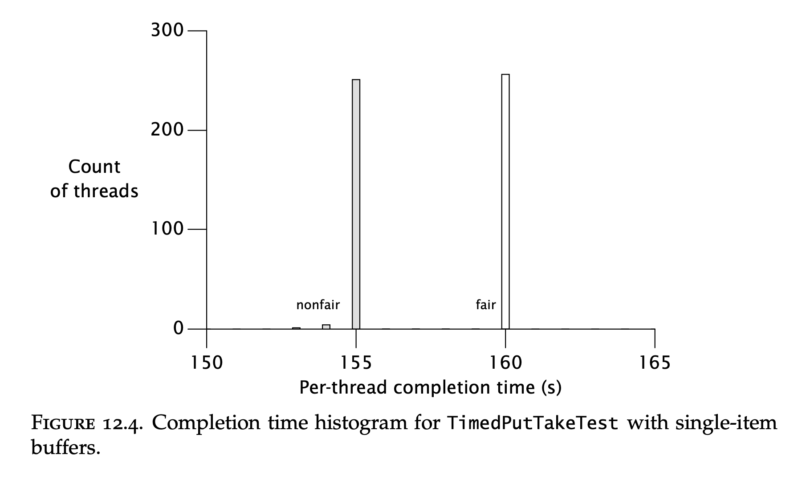
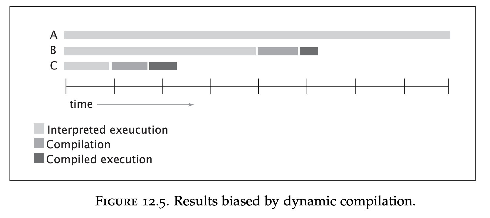

# Chapter 12 - Testing Concurrent Programs
Testing concurrent programs has some similarities with testing traditional programs.

The challenge with tests for concurrency is that bugs are non-deterministic.

Tests for concurrency fall into two categories - testing for safety & liveness.
Testing for safety includes testing a class' invariants.
Testing for liveness includes testing for progress and nonprogress.

Finally, performance testing will also be covered. They could test several properties:
 * Throughput - the rate at which concurrent tasks are completed
 * Responsiveness - The delay between subsequent requests
 * Scalability - The improvement of throughput (or lack thereof) when more CPUs are added

# Testing for correctness
The tests in this chapter will be for a `BoundedBuffer` implementation:
```java
@ThreadSafe
public class BoundedBuffer<E> {
    private final Semaphore availableItems, availableSpaces;
    @GuardedBy("this") private final E[] items;
    @GuardedBy("this") private int putPosition = 0, takePosition = 0;

    public BoundedBuffer(int capacity) {
        availableItems = new Semaphore(0);
        availableSpaces = new Semaphore(capacity);
        items = (E[]) new Object[capacity];
    }

    public boolean isEmpty() {
        return availableItems.availablePermits() == 0;
    }

    public boolean isFull() {
        return availableSpaces.availablePermits() == 0;
    }

    public void put(E x) throws InterruptedException {
        availableSpaces.acquire();
        doInsert(x);
        availableItems.release();
    }

    public E take() throws InterruptedException {
        availableItems.acquire();
        E item = doExtract();
        availableSpaces.release();
        return item;
    }

    private synchronized void doInsert(E x) {
        int i = putPosition;
        items[i] = x;
        putPosition = (++i == items.length)? 0 : i;
    }

    private synchronized E doExtract() {
        int i = takePosition;
        E x = items[i];
        items[i] = null;
        takePosition = (++i == items.length)? 0 : i;
        return x;
    }
}
```

## Basic unit tests
The first tests written for the class should be traditional sequential tests, verifying postconditions and invariants:
 ```java
class BoundedBufferTest extends TestCase {
    void testIsEmptyWhenConstructed() {
        BoundedBuffer<Integer> bb = new BoundedBuffer<Integer>(10);
        assertTrue(bb.isEmpty());
        assertFalse(bb.isFull());
    }

    void testIsFullAfterPuts() throws InterruptedException {
        BoundedBuffer<Integer> bb = new BoundedBuffer<Integer>(10);
        for (int i = 0; i < 10; i++)
            bb.put(i);
        assertTrue(bb.isFull());
        assertFalse(bb.isEmpty());
    }
}
 ```

 These tests are helpful as they can disclose when there is a basic problem with your class before starting to test for race conditions.

## Testing blocking operations
In order to test blocking operations, you will have to spawn some threads. This is required for any kind of concurrency related test.

In order to, however, drive such a test to completion, your class must also support interruption:
```java
void testTakeBlocksWhenEmpty() {
    final BoundedBuffer<Integer> bb = new BoundedBuffer<Integer>(10);
    Thread taker = new Thread() {
        public void run() {
            try {
                int unused = bb.take();
                fail(); // if we get here, it’s an error
            } catch (InterruptedException success) { }
        }};

    try {
        taker.start();
        Thread.sleep(LOCKUP_DETECT_TIMEOUT);
        taker.interrupt();
        taker.join(LOCKUP_DETECT_TIMEOUT);
        assertFalse(taker.isAlive());
    } catch (Exception unexpected) {
        fail();
    }
}
```

## Testing safety
A good way to test the safety of a producer-consumer design is to verify that all items which were produced were eventually consumed.

A naive way to test this is to execute the operations on the tested class & execute the same operations on a "shadow" list as well. This is suboptimal as the shadow list will have to be thread-safe, adding additional synchronization.

Instead, a checksum function can be used to verify that the expected checksum matches in the end.
A thing to watch out for is whether the checksum should be order-sensitive or not. If you are testing a single producer and single consumer, it should be order-sensitive. 

If not, it should be order-insensitive.

One caveat when designing the test is choosing a good RNG. RNGs tend to be thread-safe, adding additional synchronization, so you should instead stick to a simpler pseudo-random number generator, perhaps written by yourself:
```java
static int xorShift(int y) {
    y ^= (y << 6);
    y ^= (y >>> 21);
    y ^= (y << 7);

    return y;
}
```

Here's the actual test:
```java
public class PutTakeTest {
    private static final ExecutorService pool = Executors.newCachedThreadPool();
    private final AtomicInteger putSum = new AtomicInteger(0);
    private final AtomicInteger takeSum = new AtomicInteger(0);
    private final CyclicBarrier barrier;
    private final BoundedBuffer<Integer> bb;
    private final int nTrials, nPairs;

    public static void main(String[] args) {
        new PutTakeTest(10, 10, 100000).test(); // sample parameters
        pool.shutdown();
    }

    PutTakeTest(int capacity, int npairs, int ntrials) {
        this.bb = new BoundedBuffer<Integer>(capacity);
        this.nTrials = ntrials;
        this.nPairs = npairs;
        this.barrier = new CyclicBarrier(npairs * 2 + 1);
    }

    void test() {
        try {
            for (int i = 0; i < nPairs; i++) {
                pool.execute(new Producer());
                pool.execute(new Consumer());
            }

            barrier.await(); // wait for all threads to be ready
            barrier.await(); // wait for all threads to finish
            assertEquals(putSum.get(), takeSum.get());
        } catch (Exception e) {
            throw new RuntimeException(e);
        }
    }

    class Producer implements Runnable { /* Listing 12.6 */ }
    class Consumer implements Runnable { /* Listing 12.6 */ }
}
```

A thing to watch out for is the necessary use of barriers in order to make sure that all threads start working at the same time.

And here are the producer and consumer:
```java
/* inner classes of PutTakeTest (Listing 12.5) */
class Producer implements Runnable {
    public void run() {
        try {
            int seed = (this.hashCode() ^ (int)System.nanoTime());
            int sum = 0;
            barrier.await();
            for (int i = nTrials; i > 0; --i) {
                bb.put(seed);
                sum += seed;
                seed = xorShift(seed);
            }

            putSum.getAndAdd(sum);
            barrier.await();
        } catch (Exception e) {
            throw new RuntimeException(e);
        }
    }
}

class Consumer implements Runnable {
    public void run() {
        try {
            barrier.await();
            int sum = 0;
            for (int i = nTrials; i > 0; --i) {
                sum += bb.take();
            }

            takeSum.getAndAdd(sum);
            barrier.await();
        } catch (Exception e) {
            throw new RuntimeException(e);
        }
    }
}
```

Another thing to watch out for is that tests like these might never terminate if e.g. a deadlock is encountered.

For situations like these, you should define a maximum timeout for executing a test. 
Afterwards, the failure needs to be analyzed.

## Testing resource management
Apart from testing that a class conforms to its specification, you might want to test that a class doesn't cause any leakage.

This can be achieved using heap inspection tools & tests like the one below:
```java
class Big { double[] data = new double[100000]; }

void testLeak() throws InterruptedException {
    BoundedBuffer<Big> bb = new BoundedBuffer<Big>(CAPACITY);

    int heapSize1 = /* snapshot heap */;
    for (int i = 0; i < CAPACITY; i++)
        bb.put(new Big());
    for (int i = 0; i < CAPACITY; i++)
        bb.take();

    int heapSize2 = /* snapshot heap */;
    assertTrue(Math.abs(heapSize1-heapSize2) < THRESHOLD);
}
```

## Using callbacks
If a class provides hooks to attach callbacks to, this can simplify testing.

For example, if you want to test a custom thread pool executor, you can attach testing callbacks which track the class' execution policy under different circumstances.

Here's an example thread factory, which records the num of threads created:
```java
class TestingThreadFactory implements ThreadFactory {
    public final AtomicInteger numCreated = new AtomicInteger();
    private final ThreadFactory factory = Executors.defaultThreadFactory();

    public Thread newThread(Runnable r) {
        numCreated.incrementAndGet();
        return factory.newThread(r);
    }
}
```

This can later be used in a test like this:
```java
public void testPoolExpansion() throws InterruptedException {
    int MAX_SIZE = 10;
    ExecutorService exec = Executors.newFixedThreadPool(MAX_SIZE);
    for (int i = 0; i < 10 * MAX_SIZE; i++)
        exec.execute(new Runnable() {
            public void run() {
                try {
                    Thread.sleep(Long.MAX_VALUE);
                } catch (InterruptedException e) {
                    Thread.currentThread().interrupt();
                }
            }
        });

    for (int i = 0; i < 20 && threadFactory.numCreated.get() < MAX_SIZE; i++)
        Thread.sleep(100);

    assertEquals(threadFactory.numCreated.get(), MAX_SIZE);
    exec.shutdownNow();
}
```

This test verifies that the thread pool correctly expands by adding additional threads but never goes over the maximum allowed threads.

## Generating more interleavings
Since concurrency bugs are often low-probability events, it is often hard to reproduce bugs with 100% certainty.

Your chances, however, can be improved by encouraging more context switching, which can potentially lead to bugs surfacing more often.

This can be achieved using `Thread.yield()` or by sleeping for a short, but non-zero period:
```java
public synchronized void transferCredits(Account from, Account to, int amount) {
    from.setBalance(from.getBalance() - amount);
    if (random.nextInt(1000) > THRESHOLD)
        Thread.yield();
    to.setBalance(to.getBalance() + amount);
}
```

The burden of adding & removing this code when deploying to production/testing can be decreased by relying on aspect-oriented programming.

# Testing for performance
Performance tests aim to accomplish two things:
 * Representative performance measure for common use-cases
 * Identifying the best capacity configuration to extract the most throughput

## Extending PutTakeTest to add timing
We'll add some performance test to the existing test suite.

Instead of measuring the time it takes to perform a single action, we'll measure the average time per action.

To accomplish this, a barrier timer is used:
```java
public class BarrierTimer implements Runnable {
    private boolean started;
    private long startTime, endTime;

    public synchronized void run() {
        long t = System.nanoTime();
        if (!started) {
            started = true;
            startTime = t;
        } else
            endTime = t;
    }

    public synchronized void clear() {
        started = false;
    }

    public synchronized long getTime() {
        return endTime - startTime;
    }
}
```

Example usage:
```java
this.timer = new BarrierTimer();
this.barrier = new CyclicBarrier(npairs * 2 + 1, timer);
```

The barrier action parameter in the constructor is invoked after the first await invocation.

Example usage in test:
```java
public void test() {
    try {
        timer.clear();
        for (int i = 0; i < nPairs; i++) {
            pool.execute(new Producer());
            pool.execute(new Consumer());
        }

        barrier.await();
        barrier.await();
        long nsPerItem = timer.getTime() / (nPairs * (long)nTrials);
        System.out.print("Throughput: " + nsPerItem + " ns/item");
        assertEquals(putSum.get(), takeSum.get());
    } catch (Exception e) {
        throw new RuntimeException(e);
    }
}
```

By running this test, a reasonable graph displaying performance under various configurations is derived:


## Comparing multiple algorithms
This bounded buffer implementation performs poorly in comparison with standard library implementations.

The reason is that too much thread contention happens due to synchronization:


## Measuring responsiveness
To measure responsiveness, you can create a histogram showing the variance in response times of a single task:


This compares variance using fair vs unfair semaphores. It shows that unfair semaphores produce a lot less latency.

Unfair semaphore == first thread to ask for a free lock receives it (even if there were other threads which asked for it beforehand).
Fair semaphore == Threads asking for a lock are enqueued & contention is resolved in-order.

On the other hand, if the buffer size is small, latency is great regardless of semaphore configuration:


# Avoiding performance testing pitfalls
When writing performance tests, you should watch out for some common pitfalls which trump a performance test's validity.

## Garbage collection
Garbage collection is unpredictable. You don't know when it will run.

If you have a run which measures N invocations & garbage collection runs on invocation N+1, a small deviance in trials count can change the test results drastically.

This can be solved by:
 * Disabling garbage collection while running your test
 * Ensure that garbage collection consistently runs several times during your test

The later strategy is often better as it allows you to factor in the allocation costs in your performance tests.

## Dynamic compilation
The way the JVM works is that it interprets VM code on-demand & compiles a certain piece of code if it is used frequently enough.

This is in contrast to languages like C, C++ and Go, which compile the code beforehand & Javascript, Python, etc which only interpret the code.

Performance impact, caused by dynamic compilation:


To deal with this, you have two options:
 * Make sure your test runs long enough to make these deviations insignificant as they will vary in the beginning of the test run
 * Add some warmup period to your test to allow the JVM some time to trigger compilation

## Unrealistic sampling of code paths
The JVM does some optimizations to produce more efficient compiled code. These optimizations might be reverted in a real program at a later stage as an assumption is invalidated.

To prevent the JVM from doing these optimizations, you should run multi-threaded performance testing even if you only want single-threaded performance tests.

## Unrealistic degrees of contention
If your tasks are short-lived contention will be higher. If they are longer, contention will improve.

If your tests use short-lived tasks but your application usually uses more long-lived ones, the performance tests will show different results from what your application actually achieves.

Hence, try to adjust your task size to be relatively equal to the task sizes in your application's typical use-cases.

## Dead code elimination
The JVM optimizes program execution by trimming away parts of the program which produce dead code.

For example, if your method returns some value as a result but you never use the result in your programs, that might get optimized out, resulting in unrealistic performance.

To mitigate this, verify return values are used in a manner like this:
```java
if (foo.x.hashCode() == System.nanoTime())
    System.out.print(" ");
```

Additionally, make sure your test programs run with the same JVM options as your main applications as performance can vary greatly based on certain flags.

Additionally, result should not only be used, but also unguessable. If it is guessable, some compilers might optimize that by changing the method actions into a constant operation.

# Complementary testing approaches
Your programs should have additional processes in addition to tests to ensure validity & high-quality.

Rely on some additional tools to improve code quality:
 * Code review
 * Static analysis tools - finding common sources of bugs (e.g. unreleased locks)
 * Profiling and monitoring - measuring performance & finding bottlenecks
 * Aspect-oriented programming - e.g. asserting invariants are met
