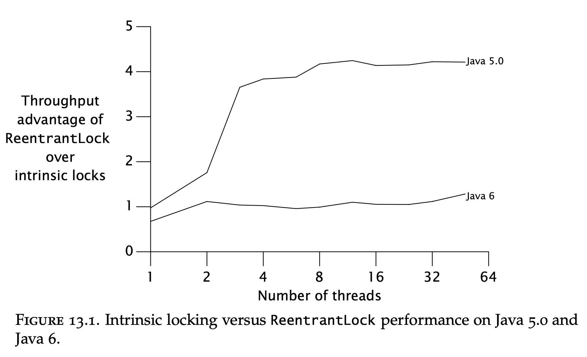
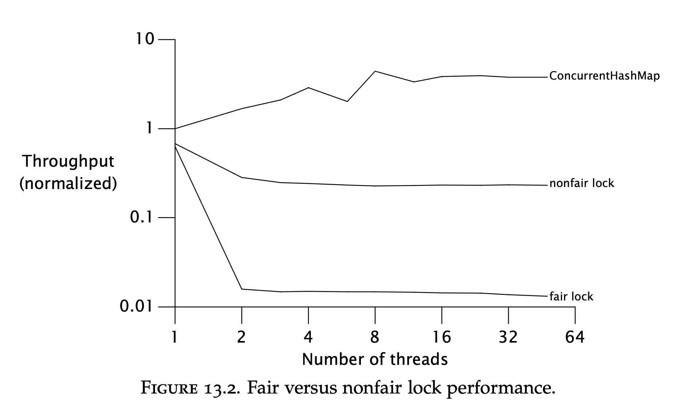
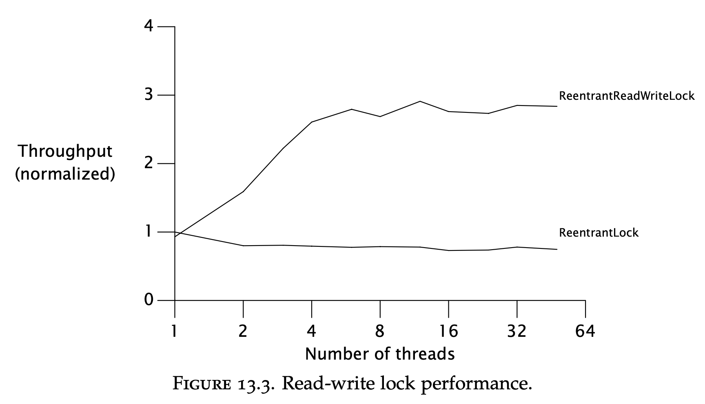

# Chapter 13 - Explicit Locks
Explicit locks are not a better alternative to intrinsic locks, but rather, an alternative with more advanced features.

## Lock and ReentrantLock
`Lock` is the explicit lock interface lock implementation adhere to:
```java
public interface Lock {
    void lock();
    void lockInterruptibly() throws InterruptedException;
    boolean tryLock();
    boolean tryLock(long timeout, TimeUnit unit) throws InterruptedException;
    void unlock();
    Condition newCondition();
}
```

It has support for unconditional, polled, timed and interruptible lock acquisition.
Intrinsic locks, on the contrary, only support unconditional locking.

`ReentrantLock` implements the `Lock` interface & provides the same guarantees as an intrinsic lock.

The downside of intrinsic locking is that it doesn't support all the features provided by the `Lock` interface.

The standard idiom for using explicit locks:
```java
Lock lock = new ReentrantLock();
...

lock.lock();
try {
    // update object state
    // catch exceptions and restore invariants if necessary
} finally {
    lock.unlock();
}
```

If one forgets to use the `finally` block, this is a ticking time bomb. 
The more complex usage of explicit locks is the reason that it isn't a direct substitute for intrinsic locks.

## Polled and timed lock acquisition
Polled and timed lock acquisition is useful for preventing deadlocks.
This is not the case with intrinsic locks as a deadlock is fatal.

Example usage:
```java
public boolean transferMoney(Account fromAcct, Account toAcct, DollarAmount amount, long timeout, TimeUnit unit)
        throws InsufficientFundsException, InterruptedException {
    long fixedDelay = getFixedDelayComponentNanos(timeout, unit);
    long randMod = getRandomDelayModulusNanos(timeout, unit);
    long stopTime = System.nanoTime() + unit.toNanos(timeout);
    while (true) {
        if (fromAcct.lock.tryLock()) {
            try {
                if (toAcct.lock.tryLock()) {
                    try {
                        if (fromAcct.getBalance().compareTo(amount) < 0)
                            throw new InsufficientFundsException();
                        else {
                            fromAcct.debit(amount);
                            toAcct.credit(amount);
                            return true;
                    }
                    } finally {
                        toAcct.lock.unlock();
                    }
                }
            } finally {
                fromAcct.lock.unlock();
            }
        }

        if (System.nanoTime() > stopTime)
            return false;
        NANOSECONDS.sleep(fixedDelay + rnd.nextLong() % randMod);
    }
}
```

This is an alternative solution to the dynamic lock ordering problem.
The random hold-off at the end is there to avoid livelocks.

Another use-case for timed locks is allocating a time budget to a given activity:
```java
public boolean trySendOnSharedLine(String message, long timeout, TimeUnit unit) throws InterruptedException {
    long nanosToLock = unit.toNanos(timeout) - estimatedNanosToSend(message);
    if (!lock.tryLock(nanosToLock, NANOSECONDS))
        return false;
    try {
        return sendOnSharedLine(message);
    } finally {
        lock.unlock();
    }
}
```

## Interruptible lock acquisition
Interruptible lock acquisition simplifies implementation of cancellable tasks. Intrinsic locks aren't interruptible.

Example usage:
```java
public boolean sendOnSharedLine(String message) throws InterruptedException {
    lock.lockInterruptibly();
    try {
        return cancellableSendOnSharedLine(message);
    } finally {
        lock.unlock();
    }
}

private boolean cancellableSendOnSharedLine(String message) throws InterruptedException { ... }
```

## Non-block-structured locking
Intrinsic locks have to be released in the scope they were acquired.
Explicit locks allow for locks to be held across several scopes.

This can sometimes be useful.

For example, implementing a concurrent linked list requires one to lock nodes while traversing them.
Using this technique, one can achieve lock granularity by locking only one node at a time while it's being traversed.

# Performance considerations
In Java 5, explicit locks were much more performant than intrinsic locks.
In Java 6, the performance is not significantly greater:


# Fairness
Explicit locks have a constructor allowing one to specify if locking should be fair or unfair.

Fair locking == threads acquire a lock in order.
Unfair locking == the first thread who requests a free lock is the one who gets it.

An analogy is waiting on a queue in front of the doctor's office. 

"Fair" locking would ensure that patients get in the room in order of appearance.
"Unfair" locking would allow an impudent youngster to get in the room before the old ladies waiting in-line.

In real life, unfair locking is bad. In multi-threaded programs, it is good.

Fair locking incurs tremendous overhead & should be avoided if possible.
The reason is that there might be significant delay between when a lock is released & when a suspended thread attempts to acquire it.

Unfair locking enables the first thread which asks for the lock to acquire it, which would avoid unnecessary suspension.

Performance comparison:


# Choosing between synchronized & ReentrantLock
Although explicit locks provide all these nice features, intrinsic locks are simpler & more familiar.

Using explicit locks can be dangerous & error-prone. Use them only if you really need any of the features they provide.

# Read-Write locks
A standard explicit/intrinsic lock is mutually-exclusive.

There can be only a single writer or a single reader at a time, not both.
For read-heavy data structures, this can be excessive. Read-write locks loosen up the locking constraints by allowing multiple readers or a single writer at a time.

The `ReadWriteLock` interface:
```java
public interface ReadWriteLock {
    Lock readLock();
    Lock writeLock();
}
```

Read-write locks perform better than explicit locks when a data structure is read-heavy. But they perform worse in other circumstances due to their complexity.

A read-write lock's configuration is quite complex compared to standard locks:
 * Release preference - when a writer releases a lock, who should be given preference? Readers or writers?
 * Reader barging - If the lock is held by readers & there are writers awaiting, should newly arrived readers acquire the lock or wait for the writer first?
    * Allowing the readers to acquire the lock improves performance but risks writer starvation
 * Reentrancy - are the read/write locks reentrant?
 * Downgrading - if a thread holds the write lock & wants to acquire the read lock, can it acquire it without releasing the write lock?
 * Upgrading - if a thread holds the read lock, is it permitted to acquire the write lock? Most implementations don't allow that as it risks deadlock.

The best default choice for a read-write lock implementation is the `ReentrantReadWriteLock`:
 * It supports reentrant read/write locks
 * It supports downgrading & prohibits upgrading
 * It can be made fair or unfair via its constructor
 * If a writer requests the lock, new readers are not allowed until the writer acquires the lock

Read-write locks improve performance when most operations don't modify the guarded resources & when the locks are held moderately long.

Example read-write map implementation:
```java
public class ReadWriteMap<K,V> {
    private final Map<K,V> map;
    private final ReadWriteLock lock = new ReentrantReadWriteLock();
    private final Lock r = lock.readLock();
    private final Lock w = lock.writeLock();

    public ReadWriteMap(Map<K,V> map) {
        this.map = map;
    }

    public V put(K key, V value) {
        w.lock();
        try {
            return map.put(key, value);
        } finally {
            w.unlock();
        }
    }
    // Do the same for remove(), putAll(), clear()

    public V get(Object key) {
        r.lock();
        try {
            return map.get(key);
        } finally {
            r.unlock();
        }
    }
    // Do the same for other read-only Map methods
}
```

Comparison between read-write & explicit locks, wrapping an array list:

