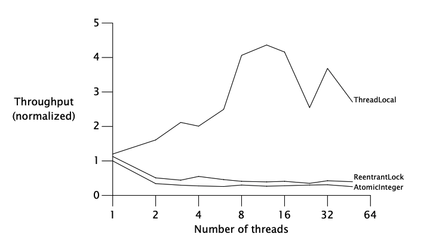
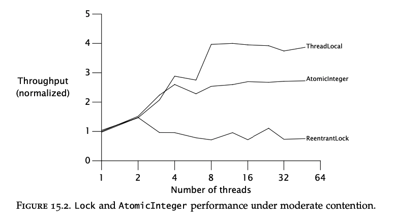

# Chapter 15 - Atomic Variables and Nonblocking synchronization

There are two ways to achieve atomicity:
 * Locking, which we've already covered throughout the book
 * Nonblocking algorithms - an alternative which achieves the same level of atomicity with much better performance at the cost of more convoluted code

Many of java's standard library classes rely on non-blocking algorithms which makes them much more performant then their counterparts, relying on `synchronized`.

As of Java 5.0, the way to implement non-blocking algorithms is using atomic variables.

## Disadvantages of locking
When a lock is uncontended, there is not a lot of overhead for the JVM.

When a lock is contended, however, a thread is suspended using the help of the operating system.
This is a costly operation & the ratio of useful work to suspension time can be high for highly contended locks.

An alternative is using the `volatile` keyword. However, although it is a lighther-weight synchronization mechanism, it doesn't provide the same atomicity guarantees as locks.

There are other drawbacks of locks as well:
 * E.g. when a lock is held by a thread the rest of the threads cannot do anything. This is bad in cases when a thread does a lenghty operation

Hence, it would be beneficial to have some kind of a synchronization mechanism which has the advantages of volatile variables, while preserving the atomicity of compound actions.

## Hardware support for concurrency
Exclusive locking is a pessimistic technique - if you don't always lock your door, something bad will happen.

There is an alternative optimistic technique - attempting to execute an action which ought to be atomic & detecting if a collision happened.
This is similar to the saying "it is easier to obtain forgiveness, than it is to obtain permission". Easier == more efficient.

All modern processors have support for such operations, implemented in hardware. The most commonly used one is `compareAndSwap`.
Until Java 5.0, this operation was not natively available, but afterwards, it became available via the use of atomic variables.

### Compare and swap
`CAS` is the typical route modern CPU architectures take to implement non-blocking synchronization.

The typical signature of the operation is `CAS(V, A, B)`.

What it does is it updates the value of memory location `V` to the value `B` only if the current value in `V` is equal to `A`.
In other words, you are specifying "I think the current value of `V` is `A`. If that is so, update it to `B`".

This enables you to optimistically attempt to modify a given memory register & detect an error if it was unsuccessful due to another thread already updating the value.
In case of a failure, you can (most often) try again, backoff, do nothing, etc.

In rare circumstances, there is a posibility of a livelock.

Example implementation of `CAS`, which demonstrates the way it works without getting close to the performance or actual implementation:
```java
@ThreadSafe
public class SimulatedCAS {
    @GuardedBy("this") private int value;

    public synchronized int get() { return value; }
    public synchronized int compareAndSwap(int expectedValue, int newValue) {
        int oldValue = value;
        if (oldValue == expectedValue)
            value = newValue;

        return oldValue;
    }

    public synchronized boolean compareAndSet(int expectedValue, int newValue) {
        return (expectedValue == compareAndSwap(expectedValue, newValue));
    }
}
```

### A nonblocking counter
Example counter using the `CAS` operation:
```java
@ThreadSafe
public class CasCounter {
    private SimulatedCAS value;

    public int getValue() {
        return value.get();
    }

    public int increment() {
        int v;
        do {
            v = value.get();
        } while (v != value.compareAndSwap(v, v + 1));

        return v + 1;
    }
}
```

In practice, just use an `AtomicLong` or `AtomicInteger` for such use cases.

This code looks a lot more convoluted than an alternative using locking, but in fact, it is way more performant.
The reason is that locking might have a simple & compact syntax, but in reality, it does a lot of things under the hood including a `CAS` somewhere.

So you are trading the simplicity of locking for the development time overhead of explicitly using `CAS` to boost performance.

### CAS support in the JVM
Before Java 5.0, support for CAS was not included in the JVM. As of Java 5.0, such support was added for the primitive types (e.g. int, long, etc).

The JVM always compiles CAS to the most efficient implementation based on the underlying hardware. In the worst case, when no CAS is available, the JVM uses a spin lock.

## Atomic variable classes
Atomic variable classes encapsulate the support for CAS operations.

They have some convenience functions like `add`. `incrementAndGet`, etc. but also expose the generic `compareAndSet` method which is a thin wrapper over hardware CAS.

There are twelve atomic variable classes divided into 4 groups:
 * Scalars - `AtomicInteger`, `AtomicLong`, `AtomicBoolean` and `AtomicReference`
 * Field updaters - `AtomicReferenceFieldUpdater`, `AtomicIntegerFieldUpdater`, `AtomicLongFieldUpdater`. These enable one to update fields without allocating new instances. Entirely meant for performance purposes.
 * Arrays - `AtomicIntegerArray`, `AtomicLongArray` and `AtomicReferenceArray`. These provide atomic `CAS` operations for array elements.
 * Compound variables - `LongAdder`, `DoubleAdder`, `AtomicStampedReference`, etc. These provide atomic `CAS` operations for very specific compound actions, useful in limited use cases.

The atomic variable classes do not redefine `hashCode` and `equals`, making them bad candidates for e.g. hash table keys.

### Atomics as "better volatiles"
In cases where you might want to use `volatile` variables, it might make better sense to use atomic variables instead.

When implementing a `NumberRange` class, it is insufficient to use two volatile or atomic variables for the upper and lower bounds due to the usage of compound actions.

Instead, one could use an atomic reference with an immutable `IntPair` class:
```java
public class CasNumberRange {
    @Immutable
    private static class IntPair {
        final int lower; // Invariant: lower <= upper
        final int upper;
        ...
    }

    private final AtomicReference<IntPair> values = new AtomicReference<IntPair>(new IntPair(0, 0));

    public int getLower() { return values.get().lower; }
    public int getUpper() { return values.get().upper; }

    public void setLower(int i) {
        while (true) {
            IntPair oldv = values.get();
            if (i > oldv.upper)
                throw new IllegalArgumentException("Can’t set lower to " + i + " > upper");

            IntPair newv = new IntPair(i, oldv.upper);
            if (values.compareAndSet(oldv, newv))
                return;
        }
    }

    // similarly for setUpper
}
```

### Performance comparison: locks versus atomic variables
To demonstrate performance differences between the two, an implementation of a PRNG is given with a `ReentrantLock` and with an `AtomicVariable`.

Atomic variable version:
```java
@ThreadSafe
public class AtomicPseudoRandom extends PseudoRandom {
    private AtomicInteger seed;

    AtomicPseudoRandom(int seed) {
        this.seed = new AtomicInteger(seed);
    }

    public int nextInt(int n) {
        while (true) {
            int s = seed.get();
            int nextSeed = calculateNext(s);
            if (seed.compareAndSet(s, nextSeed)) {
                int remainder = s % n;
                return remainder > 0 ? remainder : remainder + n;
            }
        }
    }
}
```

Reentrant lock version:
```java
@ThreadSafe
public class ReentrantLockPseudoRandom extends PseudoRandom {
    private final Lock lock = new ReentrantLock(false);
    private int seed;

    ReentrantLockPseudoRandom(int seed) {
        this.seed = seed;
    }

    public int nextInt(int n) {
        lock.lock();
        try {
            int s = seed;
            seed = calculateNext(s);
            int remainder = s % n;
            return remainder > 0 ? remainder : remainder + n;
        } finally {
            lock.unlock();
        }
    }
}
```

There is also a thread local version of this algorithm. Each class maintains its own `ThreadLocal` version of the seed.

Performance comparison under heavy contention:


Performance comparison under moderate contention:


The conclusion is that under heavy contention, locks perform better than atomics but under more realistic moderate contention, atomics scale better.

Finally, the `ThreadLocal` variant shows that the best performance can be achieved if data is not shared at all.

## Nonblocking algorithms
An algorithm is nonblocking when failure of suspension of any thread doesn't cause failure or suspension of another thread.
Lock-based algorithms cause suspension if the thread holding a lock is blocked on I/O.

An algorithm is called lock-free, then some thread can make progress at each step.

Good nonblocking algorithms satisfy both conditions. Additionally, CAS-based algorithms are immune to deadlock or priority inversion, but are susceptible to starvation or livelock.

There are good known non-blocking algorithms for common data structures. Designing new non-blocking algorithms is a task best left for experts.

### A nonblocking stack
```java
@ThreadSafe
public class ConcurrentStack <E> {
    AtomicReference<Node<E>> top = new AtomicReference<Node<E>>();

    public void push(E item) {
        Node<E> newHead = new Node<E>(item);
        Node<E> oldHead;
        do {
            oldHead = top.get();
            newHead.next = oldHead;
        } while (!top.compareAndSet(oldHead, newHead));
    }

    public E pop() {
        Node<E> oldHead;
        Node<E> newHead;
        do {
            oldHead = top.get();
            if (oldHead == null)
                return null;
            newHead = oldHead.next;
        } while (!top.compareAndSet(oldHead, newHead));

        return oldHead.item;
    }
    
    private static class Node <E> {
        public final E item;
        public Node<E> next;

        public Node(E item) {
            this.item = item;
        }
    }
}
```

The key in nonblocking algorithms is how to limit the number of changes to a single shared element, while preserving data consistency. 
This enables one to use a simple nonblocking algorithm as shown above.

### A nonblocking linked list
Writing a nonblocking algorithm for a simple data structure, involving a single shared element is easy.

But when there is more than one shared element, achieving thread safety using only atomic variables requires very convoluted and "smart" tricks.

Such an example is implementing a linked queue (via a linked list):
```java
@ThreadSafe
public class LinkedQueue <E> {
    private static class Node <E> {
        final E item;
        final AtomicReference<Node<E>> next;

        public Node(E item, Node<E> next) {
            this.item = item;
            this.next = new AtomicReference<Node<E>>(next);
        }
    }

    private final Node<E> dummy = new Node<E>(null, null);
    private final AtomicReference<Node<E>> head = new AtomicReference<Node<E>>(dummy);
    private final AtomicReference<Node<E>> tail = new AtomicReference<Node<E>>(dummy);

    public boolean put(E item) {
        Node<E> newNode = new Node<E>(item, null);
        while (true) {
            Node<E> curTail = tail.get();
            Node<E> tailNext = curTail.next.get();
            if (curTail == tail.get()) {
                if (tailNext != null) {
                    // Queue in intermediate state, advance tail
                    tail.compareAndSet(curTail, tailNext);
                } else {
                    // In quiescent state, try inserting new node
                    if (curTail.next.compareAndSet(null, newNode)) {
                        // Insertion succeeded, try advancing tail
                        tail.compareAndSet(curTail, newNode);
                        return true;
                    }
                }
            }
        }
    }
}
```

In the above algorithm, there are some clever and not-straightforward tricks which involve reasoning about what are the possible states of the two atomic variables and writing the algorithm for all such states in order to achieve consistency.

For the messy details, refer to the book.

### Atomic field updaters
In the actual implementation of `ConcurrentQueue`, a volatile variable with an atomic field updater is used instead of an atomic variable.

The purpose is entirely for performance gains. In most scenarios, a normal atomic variable performs well enough, you'd rarely need to use this:
```java
private class Node<E> {
    private final E item;
    private volatile Node<E> next;

    public Node(E item) {
        this.item = item;
    }
}

private static AtomicReferenceFieldUpdater<Node, Node> nextUpdater = AtomicReferenceFieldUpdater.newUpdater(Node.class, Node.class, "next");
```

The purpose of this class is to enable one to atomically update a field without allocating a new instance of it.

### The ABA problem
In some cases, you're not only interested in whether "There is still an `A` value in the `V` register". Instead, you might be interested in whether someone has changed the value from A -> B -> A again.
In typical CAS algorithms, you won't detect that as you're comparing the value `A` against itself, although a mutation had occured beforehand.

You would typically care about this only in environments which lack garbage collection. If you use garbage collection, this doesn't matter.

In the unlikely event where you don't have garbage collection, this problem can be addressed by using version stamps for the atomic variable. 
That way, you can detect whether the memory register has "your version" of the `A` value.

Support for this is provided by the `AtomicStampedReference` class and its relatives.
