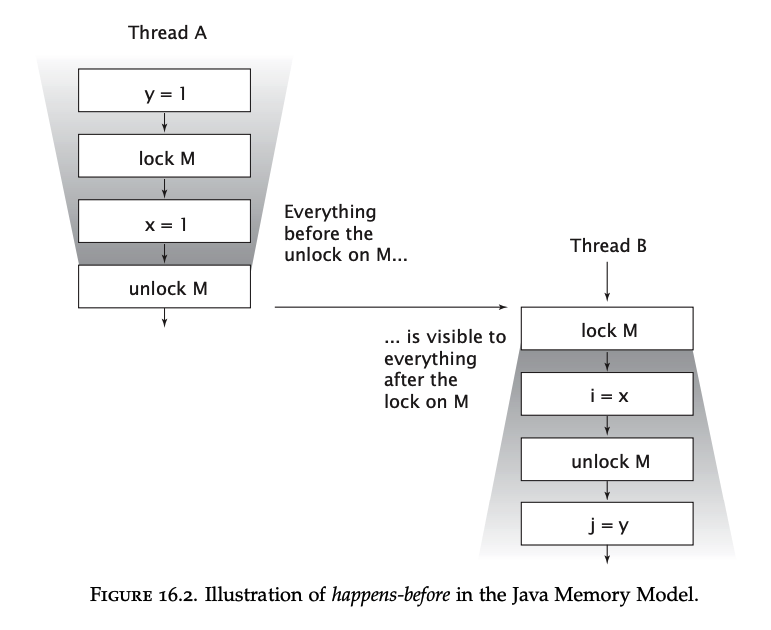

# Chapter 16 - The Java Memory Model
Throughout the book, the topic of the Java Memory Model (JMM) was avoided as this includes some low-level details answering the question "why" certain design decisions work.

Throughout your practice, sticking to those design decisions suffices for you to write effective concurrent code. 
However, understanding the why behind those decisions might help some to understand them better.

## What is a memory model and why would I want one?
Given the statement:
```java
aVariable = 3;
```

The JMM answers the question "under what circumstances, does a thread that reads the variable sees the most recent value (3)?".
In other words, the JMM is a set of guarantees which the JVM makes regarding memory operations. Those can be leveraged by developers in order to write thread-safe code.

Why do we need such guarantees? 
Because the most restrictive guarantee - e.g. a thread will always see the latest value, will severely limit the potential performance optimizations the JVM might do behind the scenes to improve performance.

Much of the advances in processing speed over the years is attributed to such optimizations - caching, pipelined instruction execution, time when a value in cache is committed to main memory, etc.

Instead, the JVM doesn't make such restrictive guarantees, but provides the JMM which does list the guarantees the JVM makes.

One such guarantee is that in a single-threaded environment, the JVM will maintain within thread as-if-serial semantics.
In other words, some performance optimizations might be going on behind the scenes to optimize execution, but from the user's perspective, the program is executing linearly.

In a multi-threaded environment, on the other hand, this guarantee does not hold & inter-thread coordination depends on the developer adding proper synchronization.

### Platform memory models
Processors have their own memory models which make certain guarantees about what other processors can see at any time.

The JMM shields the developer from the platform-specific memory models & provides a common model which is shared across all platforms. 
The differences between the JMM and the platform-specific memory model are managed by inserting memory barriers at appropriate places in order to hold the JMM guarantees (even if the platform MM doesn't).

### Reordering
All problems which occur due to threads executing their operations out of order are summarized as reorderings.

Example:
```java
public class PossibleReordering {
    static int x = 0, y = 0;
    static int a = 0, b = 0;

    public static void main(String[] args) throws InterruptedException {
        Thread one = new Thread(new Runnable() {
            public void run() {
                a = 1;
                x = b;
            }
        });
        Thread other = new Thread(new Runnable() {
            public void run() {
                b = 1;
                y = a;
            }
        });

        one.start(); other.start();
        one.join(); other.join();
        System.out.println("( "+ x + "," + y + ")");
    }
}
```

This program can print all possible values - (0, 0), (0, 1), (1, 0), (1, 1)

This demonstrates that it is extremely hard to reason about reorderings as demonstrated by even the simplest concurrent program.

By using synchronization, the JVM & the hardware are prohibited from performing any reorderings on the operations.

### The Java Memory Model in 500 words or less
The JMM defines a partial ordering function called "happens-before".

Partial ordering is:
 * Reflexive -> X happens-before X
 * Antisymmetric -> if X happens-before Y then Y "happens-after" X
 * Transitive -> if X happens-before Y and Y happens-before Z => X happens-before Z

To guarantee that a thread executing action B sees the results of action A (in another thread), there must be a **happens-before** relation between them.

When there are one or more reads & at least one write on a variable without a **happens-before** relation, there is a data race.
A program which has no data races is said to be correctly synchronized & all actions in such a program "appear" to happen in a sequential global order.

Happens-before guarantees by the JMM:
 * Program order rule - Every action in thread A **happens-before** any other action in the same thread which come later in the program order
 * Monitor lock rule - monitor unlock **happens-before** monitor lock (if actions are on the same monitor)
 * Volatile variable rule - write on volatile variable **happens-before** all subsequent reads of the variable
 * Thread start rule - A call to `Thread.start` **happens-before** any action in the started thread
 * Thread termination rule - Any action in thread A **happens-before** detecting the thread is terminated in any other thread
 * Interruption rule - Interrupt on a thread **happens-before** the thread detects it is interrupted
 * Finalizer rule - End of constructor **happens-before** start of finalizer
 * Transitivity - already explained

Example of the `Monitor lock rule`:


Note that if two threads synchronize on a different lock, there is no **happens-before** relation between them.

### Piggybacking on synchronization
Sometimes, you could take advantage of an already established **happens-before** relationship to avoid implementing your own synchronization.

This technique is called "piggybacking" & is very dependent on the careful ordering of instructions.

It shouldn't be undertaken lightly. The book shows an example of using piggybacking which is quite advanced & shouldn't be done at home. Consult it for more details.

What's practical, however, is to use piggybacking for the more common scenarios of leveraging a thread-safe collection's safe publication guarantees to avoid implementing your own.

## Publication
Safe publication techniques are based on the guarantees made by the JMM. They are based on **happens-before** relations established by the JMM.
This section explores those.

### Unsafe publication
Unsafe publication occurs when there is no **happens-before** relation between initializing the object and subsequent reads.

Unsafely published objects could lead to two problems:
 * Not seeing the initialized shared object reference
 * Seeing the shared object reference, but not observing the most recent values of the object's fields - observing a "partially constructed object"

Example:
```java
@NotThreadSafe
public class UnsafeLazyInitialization {
    private static Resource resource;
    public static Resource getInstance() {
        if (resource == null)
            resource = new Resource(); // unsafe publication
        return resource;
    }
}
```

One possible problem of this code is that the object might be initialized twice, leading to two global references.
But even if you don't care about this inefficiency, there is still a problem as a thread might correctly see that the object is initialized, but not see the object fields' latest values.

Except for immutable objects, it is not safe to use an object initialized in another thread if there is no **happens-before** relation.

If you're using an immutable object, you cannot observe it in a partially constructed state (eliminating the second problem), but you can observe an uninitialized reference to the object while the reference is already initialized.

### Safe publication
The safe publication idioms covered in chapter 3 ensure that an object is safely published from thread A to B.

When an object is safely published by being put on a blocking queue, being locked or being volatile, there is a **happens-before** relation which occurs between the initialization and all subsequent actions in another thread.

This happens-before relation actually provides a stronger guarantee than safe publication does.

Because:
 * All actions in thread A **happens-before** the initialization of the object AND
 * The object initialization **happens-before** all subsequent actions in thread B
then, thread B not only sees the latest value of the object, but also sees all memory writes thread A did before the handoff. Leveraging this would be an example of using the piggybacking technique.

For example, if there is a shared variable A and shared object B, if a thread always modifies variable A before safely publishing object B, then there is no need for additional synchronization on the shared variable A.

Nevertheless, thinking in terms of **happens-before** relations is more low level than thinking in terms of the more high-level concept of safe publication & the rest of the thread-safety idioms.
Such reasoning should only be used when aiming to extract the last drop of performance improvements of a class.

### Safe initialization idioms
A way to fix the problem with lazily initializing `Resource` in one of the previous section is to use synchronization:
```java
@ThreadSafe
public class SafeLazyInitialization {
    private static Resource resource;
    public synchronized static Resource getInstance() {
        if (resource == null)
            resource = new Resource();
        return resource;
    }
}
```

If the method is not invoked way too much throughout the program, the contention on this lock will be low & performance will be sufficiently good.

The JVM provides a special guarantee for static initializers that all static initializers will happen before initial usage, hence no additional synchronization is needed for them.

This can be leveraged to avoid synchronization altogether like this:
```java
@ThreadSafe
public class EagerInitialization {
    private static Resource resource = new Resource();

    public static Resource getResource() { return resource; }
}
```

This is thread-safe without any synchronization because the resource is initialized via a static initializer. This example, however, lost the benefits of lazy initialization.
Taking this a step further, we could maintain the lazy initialization & still avoid synchronization by using the **lazy initialization holder class** idiom:
```java
@ThreadSafe
public class ResourceFactory {
    private static class ResourceHolder {
        public static Resource resource = new Resource();
    }

    public static Resource getResource() {
        return ResourceHolder.resource;
    }
}
```

This is one of the best ways to achieve lazy initialization (along with using an enum).

### Double-checked locking
The DCL idiom is a very old technique promising the best performance when aiming for a thread-safe lazy initialization:
```java
@NotThreadSafe
public class DoubleCheckedLocking {
    private static Resource resource;

    public static Resource getInstance() {
        if (resource == null) {
            synchronized (DoubleCheckedLocking.class) {
                if (resource == null)
                    resource = new Resource();
            }
        }

        return resource;
    }
}
```

This was used back in the days when thread contention was way too costly and techniques like this one promised substantial performance improvements.
The rationale behind it is that in the usual code path, when the object is already initialized, there is no contention altogether.

If it is observed to not be initialized, the synchronized block guarantees that if the object was indeed initialized in another thread, it won't be reinitialized again.

However, there is still a problem with this code as the worst-case scenario is that a thread would observe that an object's reference is initialized, but its fields are not (fully) initialized.

This can be fixed by making the variable `volatile`, which doesn't incur very large performance costs.
However, the necessity for this technique has long passed and it shouldn't be used in modern codebases.

## Initialization safety
The final fields of a **properly constructed** object will not be observed in an inconsistent state even if an object is not safely published.
This extends to all fields reachable from a final field.

This means that if an object has only final fields and is not safely published, the only possible problem is observing a not initialized reference to the object.
You will never observe a partially constructed object if all its fields are final.

However, final fields only guarantee that the object will be observed in a consistent state since its initialization. Additional synchronization might be required if the object's state is subsequently modified.
Additionally, if the object's reference is allowed to escape during construction, that invalidates this initialization safety guarantee.
