# Jenkov Concurrency Tutorial
> [Tutorial link](http://tutorials.jenkov.com/java-concurrency/index.html)

## Introduction
### What is Multithreading
Multithreading == multiple threads of execution inside a single program.
A multithreaded application is as if you have multiple CPUs executing your code at once.

However, threads != CPUs. Usually, a single CPU will share its execution time with multiple threads.


### Why Multithreading?
#### Better utilization of a single CPU
e.g. whilst one thread is waiting for input from a network, another one can run during this time.

#### Better utilization of multiple CPUs
If your computer has multiple CPUs then you'd need to use threads to fully utilize them.

#### Better UX in terms of responsiveness
A blocking operation (e.g. downloading a photo) in a UI should not cause the whole UI to stall. This can be achieved by having the UI be handled on a separate thread.

#### Better UX in terms of fairness
If one client's request takes too much time, the rest of the clients' requests should proceed.

### Multithreading vs. Multitasking
In the past, computers with a single CPU were able to execute only one program at a time.
This changed with the advent of multitasking.

#### Multitasking
Multitasking enables you to execute multiple programs at a time with a single CPU.
It was achieved by allowing programs to multiplex their CPU time - ie your foreground movie is running, but a background downloading program runs for a little from time to time.

#### Multithreading
Multithreading == multiple threads of execution inside the same program.
Multitasking == multiple programs running at the same time with the same CPU.

### Multithreading is hard
Multithreaded programs give rise to new kinds of errors not seen in single-threaded ones.
This stems from the fact that multiple threads are accessing the same shared memory, possibly, across different CPUs.

## Multithreading benefits
### Better CPU Utilization
Example sequential processing of files:
```
  5 seconds reading file A
  2 seconds processing file A
  5 seconds reading file B
  2 seconds processing file B
-----------------------
 14 seconds total
```

Example parallel processing of files (using the same CPU). Achieved by using the CPU for reading the second file while its idle:
```
  5 seconds reading file A
  5 seconds reading file B + 2 seconds processing file A
  2 seconds processing file B
-----------------------
 12 seconds total
```

### Simple Program Design
Sometimes, writing multithreaded code can result in simpler design as each processing unit is independent than the rest, hence, can be easier to read.

### More Responsive Programs
When multiple requests come to a server and the former requests take a long time to process, latter requests will have to wait regardless of processing time.

By using multithreading, one can achieve a much more responsive server.

Example without multithreading:
```
  while(server is active){
    listen for request
    process request
  }
```

Example with multithreading:
```
  while(server is active){
    listen for request
    hand request to worker thread
  }
```

## Multithreading Costs
To use multithreading in an application, the benefits gained should outweigh the costs.

Here are some of the costs of multithreading.
### More complex design
Some parts might be simpler by using multithreading, others though, might be more complex.

E.g. code involving shared data which needs to be synchronized.

### Context Switching Overhead
When a CPU needs to switch from executing one thread to another, there is some overhead incurred due to having to save the state of the thread in memory.

When you switch between threads too often, the time taken to switch threads might be more than the actual processing time.

### Increased Resource Consumption
A thread needs some resources in order to run. Hence, creating too much threads can consume a lot of memory/OS resources.

## Concurrency Models
Concurrency model == mechanism by which threads collaborate.

### Shared State vs Separate State
An important aspect of concurrency models is whether the state is shared or not.

Shared state -> can lead to race conditions and deadlocks.
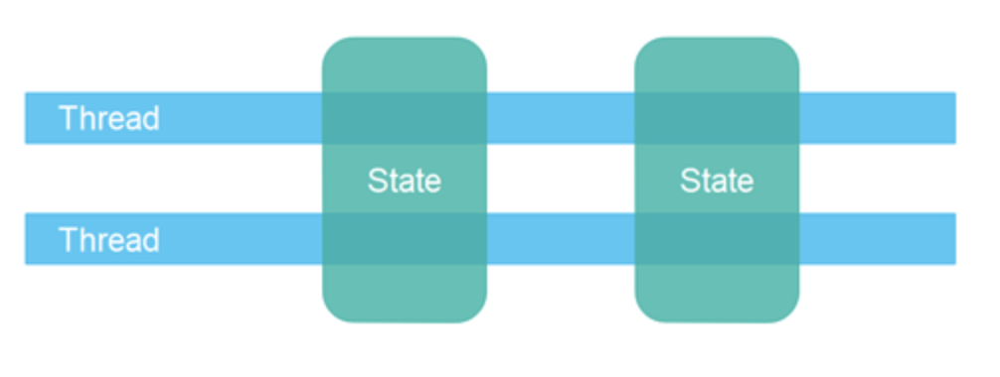

Separate state -> threads use their own state which is shared via immutable objects or copies
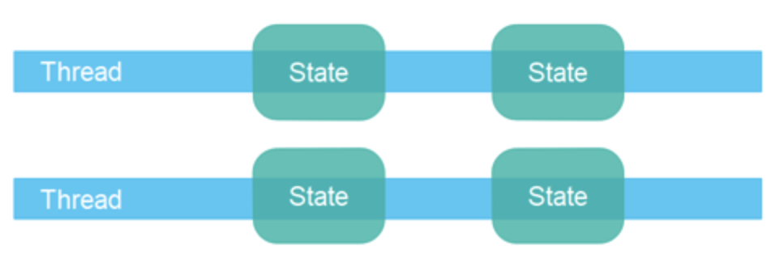

### Parallel Workers
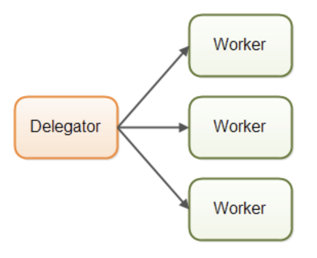

This is the most commonly used concurrency model in java application (implemented via the Executors framework).

Advantages - easy to understand & parallelize further
Disadvantages:
 * Uses shared state & it had all its disadvantages
 * Stateless workers - using shared state means that you need to re-read it every time you need it to avoid using a stale copy. This can be slow at times
 * Job ordering is nondeterministic - you can't guarantee the order of execution for the jobs

### Assembly Line (aka event-driven)
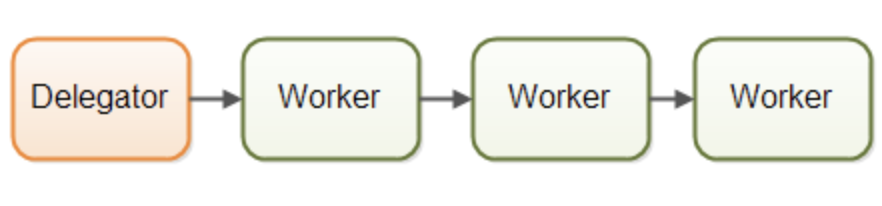

These systems are usually designed to use non-blocking IO and the non-blocking IO is the boundary between the workers.
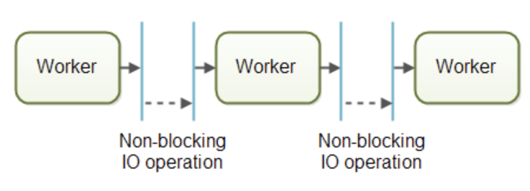

Example implementation - in NodeJS with promises. Other implementations - Akka, Vert.x

Advantages:
 * No shared state - no need to worry about thread-safety
 * Stateful workers - since data is confined to workers, they can be stateful, ie keep their own data in-memory at all times
 * Better hardware conformity (aka mechanical sympathy) - single-threaded code plays nicer with hardware as you can use more optimized data structures and algorithms. You can also cache data.
 * Job ordering is possible - you can even log all events in a system & recreate the system's state from the logs later

Disadvantages:
 * May lead to complicated code
   * implementing callback hell
   * execution flow spread across several classes

### Actors vs. channels
Both use the "assembly line" concurrency model.

In the actor model, each worker is called an actor and they can send messages to one another.
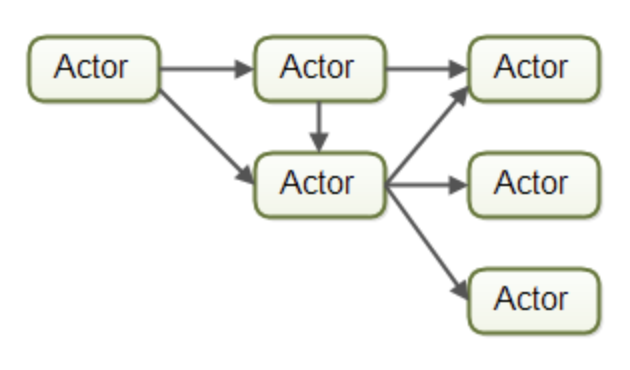

In the channels model, each worker subscribes to messages on a channel which other workers can send messages to.
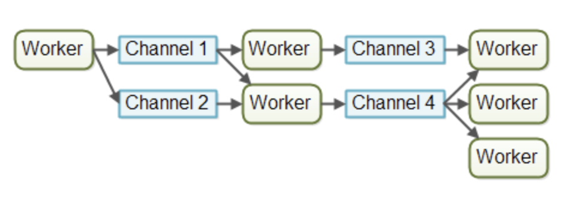

In the author's (and my) opinion, the channels model is more flexible as workers are decoupled from one another by leveraging channels.

### Functional Parallelism
Another popular concurrency model is functional parallelism.

Its idea is that a program execution can be broken down to the composition of individual functions 
which communicate by copying inputs/outputs (or using immutable objects) among them but never sharing them.

Function calls can be parallelized on multiple CPUs.

The caveat with this approach is knowing which functional calls to parallelize.
Some might be too small to be worth the hassle.

Example implementation is the java stream API.

### Which concurrency model is best?
If your tasks are naturally parallel & independent, the parallel workers concurrency model might be well suited for the job.
If the tasks need to share some state, the assembly line concurrency model fits better.

## Same-Threading
Concurrency model where a single-threaded system scales to N single-threaded systems.

### Why Single-threaded systems?
They are much simpler to deal with than multi-threaded systems due to the lack of shared state. Additionally, they can use non-thread safe data structures which utilize the CPU much more efficiently.

The downside is that a single-threaded system cannot fully utilize the CPU cores available on a machine:
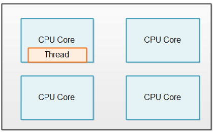

### Same-threading == single-threading scaled out


Multi-threaded system == a lot of threads which share state.
Same-threaded system == a lot of threads not sharing any state.
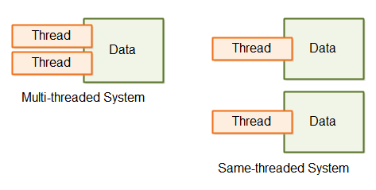

### Thread Communication
If two threads in a same-threaded system need to communicate, they can achieve it by sending messages.
Messages are arbitrary byte sequences where the receiving thread get a copy of the original message.

The communication can take place via queues, pipes, unix sockets, TCP sockets, etc.

## Concurrency vs. Parallelism
Concurrency != Parallelism although they look very similar at first glance.

Concurrent execution == program is making progress on more than one task simultaneously. Doesn't necessarily need parallel execution:
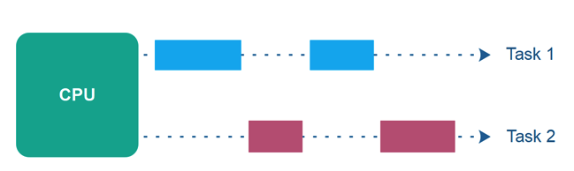

Parallel execution == Program is making progress on more than one task in parallel.
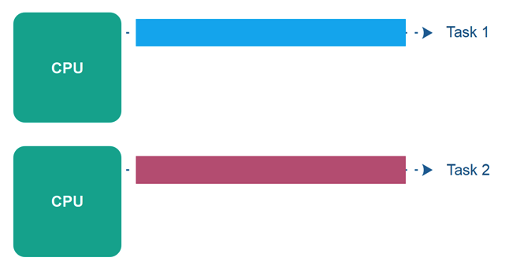

Parallel concurrent execution == N tasks on M CPUs where N > M.
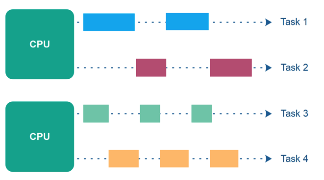

Parallelism == big task is split into subtasks which are executed concurrently and/or in parallel:
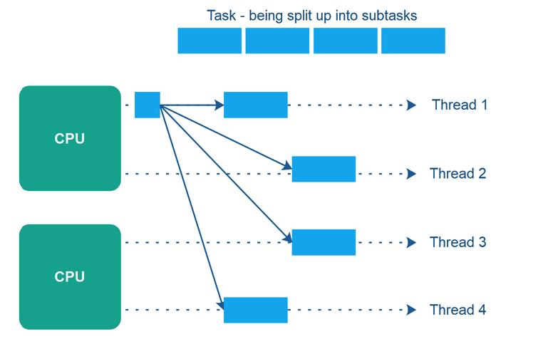

### Concurrency/Parallelism combos
 * Concurrent, not parallel - e.g. working on task #1 while task #2 is waiting for file IO
 * Parallel, not concurrent - e.g. program works on only one task which is split in subtasks & they are executed in parallel
 * Not concurrent, not parallel - e.g. traditional CLI applications
 * Concurrent, Parallel - e.g. web server handling multiple requests in parallel and some of them are multiplexed on the same CPU while waiting for database operation to complete.Q

## Single-threaded concurrency
Making progress on more than one task on a single thread.

### Still new ground
Popular libraries, technologies still use this concurrency model. Netty, Vert.x, Undertow and NodeJS use this model.

The model is centered around an event loop - a thread running in a loop, waiting for events in the system. When an event is invoked, your code, subscribed to the event gets executed.

### Classic multi-threaded concurrency
Typically assign one task per thread, but there are nuances, e.g. thread pools.

Advantages:
 * Relatively easy to distribute the work load across multiple threads

Disadvantages:
 * Hard to maintain & less performant when shared data gets involved.

### Single-threaded concurrency
You implement your task switching.

Benefits:
 * No thread visibility or race condition problems
 * control over task switching - you can decide how big of a chunk to work on before task switching
 * control over task prioritization

In the author's opinion, there are few benefits of this concurrency model over the classic multi-threaded approach. Javascript uses this model because it is a single-threaded language & it's the only option we've got.

### Challenges
 * Implementation required - you need to learn how to implement this model & actually implement it
 * Blocking operations have to be avoid or completed in background threads
 * Only uses a single CPU

### Single-threaded implementation - via thread loop
an infinite for loop is waiting for tasks to complete & completes them if any are present.
This thread can also be paused for several milliseconds if no work is estimated to come to avoid wasting CPU time in a tight loop.
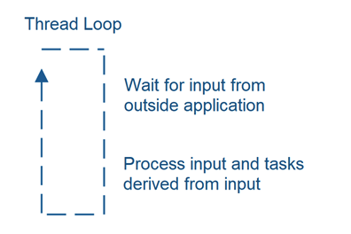

Agent - a component which does some work & is invoked by the thread loop.
Thread loops invoke agents:
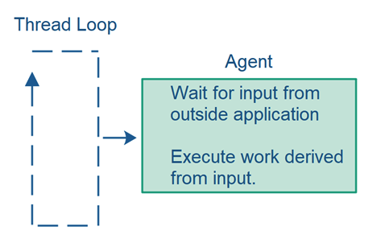

## Creating and starting Java threads
Thread == like a virtual CPU which executes your code

### Creating threads
```java
new Thread().start();
```

This example doesn't provide the thread any code to execute, therefore it will stop after it's started.

Ways to provide code for threads to execute:
 * Subclassing:
```java
  public class MyThread extends Thread {

    public void run(){
       System.out.println("MyThread running");
    }
  }
```

 * Via Runnable:
```java
  new Thread(() -> { System.out.println("Lambda Runnable running"); }).start();
```

Common pitfall, avoid invoking `run()` over `start()`. That method executes the runnable in the current thread, rather than the new one.

Specifying the name of the thread:
```java
Thread thread = new Thread("New Thread") {
  public void run(){
    System.out.println("run by: " + getName());
  }
};


thread.start();
System.out.println(thread.getName());
```

Getting the current thread object:
```java
Thread thread = Thread.currentThread();
```

To stop a thread, the implementation should allow it. Example:
```java
public class MyRunnable implements Runnable {

    private boolean doStop = false;

    public synchronized void doStop() {
        this.doStop = true;
    }

    private synchronized boolean keepRunning() {
        return this.doStop == false;
    }

    @Override
    public void run() {
        while(keepRunning()) {
            // keep doing what this thread should do.
            System.out.println("Running");

            try {
                Thread.sleep(3L * 1000L);
            } catch (InterruptedException e) {
                e.printStackTrace();
            }

        }
    }
}
```

## Race Conditions & Critical Sections
A race condition can occur in a critical section where the result of execution depends on the sequence of concurrently executing operations.

### Types of race conditions
 * Read-modify-write - read a value, modify it and write it back.
```java
  public class Counter {

     protected long count = 0;

     public void add(long value){
         this.count = this.count + value;
     }
  }
```

This can produce wrong results if executed by multiple threads simultaneously.

 * Check-then-act check a condition and act on it
```java
public class CheckThenActExample {

    public void checkThenAct(Map<String, String> sharedMap) {
        if(sharedMap.containsKey("key")){
            String val = sharedMap.remove("key");
            if(val == null) {
                System.out.println("Value for 'key' was null");
            }
        } else {
            sharedMap.put("key", "value");
        }
    }
}
```

In this situation, it is possible that multiple threads try to remove the same value, but only one of them will get a value back.

### Preventing race conditions
To prevent race conditions, you must ensure that critical sections are executed as an atomic instruction.

This can be achieved, typically, by using the `synchronized` keyword in Java.

You might also want to improve critical section throughput.
This can be achieved by splitting a big critical section into smaller ones.

Example:
```java
public class TwoSums {
    
    private int sum1 = 0;
    private int sum2 = 0;
    
    public void add(int val1, int val2){
        synchronized(this){
            this.sum1 += val1;   
            this.sum2 += val2;
        }
    }
}
```

This can be written (correctly) like so:
```java
public class TwoSums {
    
    private int sum1 = 0;
    private int sum2 = 0;

    private Integer sum1Lock = new Integer(1);
    private Integer sum2Lock = new Integer(2);

    public void add(int val1, int val2){
        synchronized(this.sum1Lock){
            this.sum1 += val1;   
        }
        synchronized(this.sum2Lock){
            this.sum2 += val2;
        }
    }
}
```

Note that this is a contrived example just to illustrate the concept. Critical sections for such small instructions are unnecessary.

## Thread Safety & Shared Resources
Code that is safe to call by multiple threads is thread-safe.
Code is thread safe -> no race conditions.

Local variables are thread-safe as they are stored inside the thread's own memory.

Thread-safe method example:
```java
public void someMethod(){

  long threadSafeInt = 0;

  threadSafeInt++;
}
```

Object member variables are not thread-safe by default if multiple threads share the same object instance.

Example:
```java
NotThreadSafe sharedInstance = new NotThreadSafe();

new Thread(new MyRunnable(sharedInstance)).start();
new Thread(new MyRunnable(sharedInstance)).start();

public class MyRunnable implements Runnable{
  NotThreadSafe instance = null;

  public MyRunnable(NotThreadSafe instance){
    this.instance = instance;
  }

  public void run(){
    this.instance.add("some text");
  }
}
```

If the instance is not shared, though, this code is thread-safe:
```java
new Thread(new MyRunnable(new NotThreadSafe())).start();
new Thread(new MyRunnable(new NotThreadSafe())).start();
```

### Thread Control Escape Rule
```
If a resource is created, used and disposed within
the control of the same thread,
and never escapes the control of this thread,
the use of that resource is thread safe.
```

A resource can be anything - object, database, file, etc.

If the objects you're using are thread-safe but the underlying resource (e.g. database) is accessed concurrently, this might not be thread-safe.
Example:
```
check if record X exists
if not, insert record X
```

Example going wrong:
```
Thread 1 checks if record X exists. Result = no
Thread 2 checks if record X exists. Result = no
Thread 1 inserts record X
Thread 2 inserts record X
```

## Thread Safety & Immutability
Race conditions occur only if multiple threads are accessing the same resource and writing to it.
If they only read it, it is thread-safe.

If we make the shared objects immutable, they are thread-safe. Example:
```java
public class ImmutableValue{

  private int value = 0;

  public ImmutableValue(int value){
    this.value = value;
  }

  public int getValue(){
    return this.value;
  }
}
```

To execute values on the immutable object, a new object is to be returned:
```java
public class ImmutableValue{

  private int value = 0;

  public ImmutableValue(int value){
    this.value = value;
  }

  public int getValue(){
    return this.value;
  }

  
  public ImmutableValue add(int valueToAdd){
    return new ImmutableValue(this.value + valueToAdd);
  }
}
```

The reference, though, is not thread-safe.

Example:
```java
public class Calculator{
  private ImmutableValue currentValue = null;

  public ImmutableValue getValue(){
    return currentValue;
  }

  public void setValue(ImmutableValue newValue){
    this.currentValue = newValue;
  }

  public void add(int newValue){
    this.currentValue = this.currentValue.add(newValue);
  }
}
```

In the above case, the object is immutable & thread-safe but its reference is not and needs to be synchronized.

## Java Memory Model
The JMM specifies how the Java VM works with the main memory.

Internal JMM:
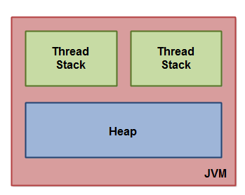

How the JMM maps to the hardware memory model:
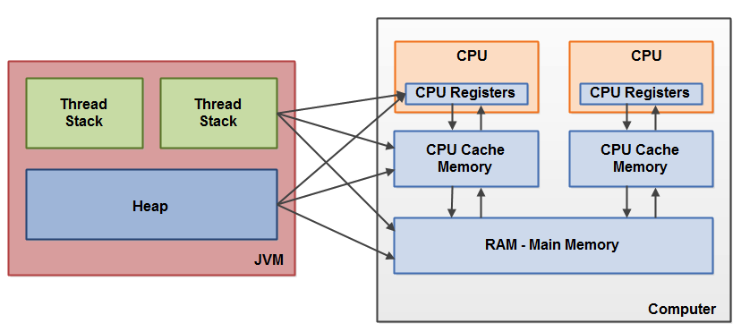

When objects are stored in various different memory locations in a computer, certain problems may occur.

### Visibility
If two threads are sharing an object, without proper synchronization updates to the object by one thread might not be visible to another.

Typical explanation - the change from one thread is not flushed to main memory for it to be observed by another, running on a different CPU:
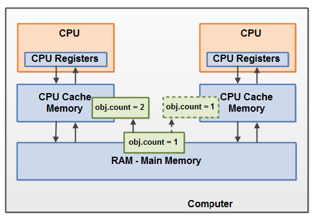

One way to solve this is to use the `volatile` keyword.

### Race conditions
If two threads are sharing an object and both of them are updating it, a race condition can occur:
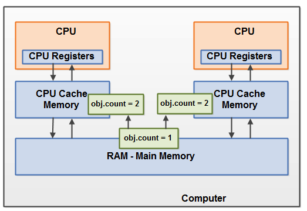

One way to solve this is to use the `synchronized` keyword.

## Java Happens Before guarantee
Happens before guarantees - a set of rules governing how the JMM is allowed to reorder instructions for performance gains.

### Instruction reordering
Modern CPUs can execute non-dependent instructions in parallel. Example:
```
a = b + c

d = e + f
```

Instruction reordering is allowed by the JMM as long as it doesn't change the semantics of the program.
However, when these instructions happen across multiple threads, the JMM doesn't guarantee the order of the instructions which can lead to problems.

The rootcause is that the dependent instructions are not visible to the second thread.

One way to guarantee visibility is to use the `volatile` keyword. It provides a guarantee that operations on the variable will be visible by all threads accessing it.

The reason is that the JMM provides a `happens-before` guarantee for volatile variables - ie, `writes to volatile variables happens-before subsequent reads`.
This imposes a restriction on the JMM to not do any wise things to reorder instructions.

As a side-effect, this can also lead to "synchronization piggybacking" where you can achieve synchronization on non-synchronized variables by piggybacking on the `happens-before` guarantee.

Example:
```
this.nonVolatileVarA = 34;
this.nonVolatileVarB = new String("Text");
this.volatileVarC    = 300;
```

In this example, all three variables are visible to other threads, despite the fact that only the third one is declared `volatile`.

There are similar read/write guarantees for the `synchronized` keyword I won't go through because it is not so important.

The TLDR is that `happens-before` guarantees are the assembly of java concurrency and you shouldn't rely too heavily on it.

## Java Synchronized block
When you use the `synchronized` keyword, you are locking a section of your code to be executed by only one thread at a time. The rest will have to wait for the first one to finish.

Example synchronized instance method:
```java
public class MyCounter {

  private int count = 0;

  public synchronized void add(int value){
      this.count += value;
  }
}
```

This method is synchronized on the instance of the object, not the class itself. In example, different instances can execute that method in parallel.

Additionally, this also means that only one synchronized method on a single instance can be executed at a time. Example:
```java
public class MyCounter {

  private int count = 0;

  public synchronized void add(int value){
      this.count += value;
  }
  public synchronized void subtract(int value){
      this.count -= value;
  }
}
```

In this case, only one thread can be executing either `add` or `subtract` at a time.

Static methods can be synchronized as well, but they are synchronized on the class itself, rather than the instance:
```java
public static MyStaticCounter{

  private static int count = 0;

  public static synchronized void add(int value){
      count += value;
  }
}
```

You can also synchronize specific blocks of a method as well:
```java
  public void add(int value){

    synchronized(this){
       this.count += value;   
    }
  }
```

The passed parameter to `synchronized` is the object being locked on. In this case, it is the class instance.

These two methods are equivalent in terms of synchronization:
```java
  public class MyClass {
  
    public synchronized void log1(String msg1, String msg2){
       log.writeln(msg1);
       log.writeln(msg2);
    }

  
    public void log2(String msg1, String msg2){
       synchronized(this){
          log.writeln(msg1);
          log.writeln(msg2);
       }
    }
  }
```

In most cases, it makes sense to synchronize on `this`. As a rule of thumb, don't synchronize on any primitive objects.

### Limitations
The `synchronzed` keyword allows only one thread to read or write at a time. There are alternatives for other use cases.

E.g. for multiple reading threads and one writing thread, use Read/Write locks.
E.g. for multiple writing threads, use a Semaphore.

Also note that there is some performance overhead when using `synchronized` due to lock contention.

As a caveat, the synchronized keyword allows reentrance. In example, you can invoke several `synchronized` blocks at the same time as long as they are synchronized on the same object.
Example:
```java
public class MyClass {
    
  List<String> elements = new ArrayList<String>();
    
  public void count() {
    if(elements.size() == 0) {
        return 0;
    }
    synchronized(this) {
       elements.remove();
       return 1 + count();  
    }
  }
}
```

## Java volatile keyword
volatile -> mark a variable as being stored in main memory.

### Variable visibility problems
Without any synchronization or the use of volatile, you are not guaranteed that writes to a variable will be observed by other threads.

One reason might be that threads are writing the value in their own CPU caches only & not persisting the value in main memory, so other threads can't see the change.
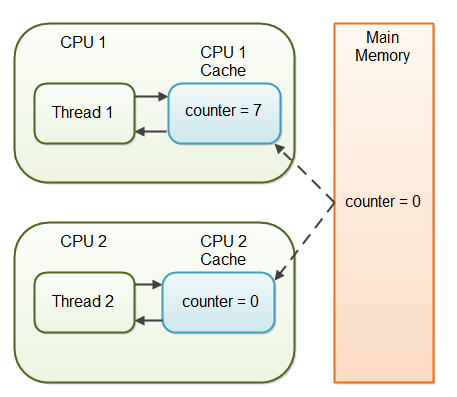

Declaring a variable `volatile` guarantees that all threads will observe previous writes to the variable at all times.
However, it does not guard you against race conditions.

### Full volatile visibility guarantee
```
If Thread A writes to a volatile variable and Thread B subsequently reads the same volatile variable, then all variables visible to Thread A before writing the volatile variable, will also be visible to Thread B after it has read the volatile variable.
If Thread A reads a volatile variable, then all variables visible to Thread A when reading the volatile variable will also be re-read from main memory.
```

Other than what was already explained, this definition also provides some other guarantees. Example:
```java
public class MyClass {
    private int years;
    private int months
    private volatile int days;

    public int totalDays() {
        int total = this.days;
        total += months * 30;
        total += years * 365;
        return total;
    }

    public void update(int years, int months, int days){
        this.years  = years;
        this.months = months;
        this.days   = days;
    }
}
```

In this example, only days is volatile and yet, all other variables are effectively volatile as well as they piggyback on the `days`' variable synchronization.

### volatile is not always enough
volatile prevents visibility issues but doesn't save you from race conditions. In case of race conditions, synchronization via `synchronized` or other means is still necessary.

## CPU Cache Coherence
Throughout this tutorial, it was mentioned that certain synchronization primitives (e.g. `volatile`) force some variables to be flushed to main memory in order for them to be visible to other threads.

This is actually often not the case due to a performance optimization the CPU does - Cache coherence.

In a nutshell - instead of flushing the values all the way to main memory, they can be flushed to L1/L2 cache & then that value can be copied on the rest of the caches as well to guarantee that all CPUs will see them.
This way, you guarantee visibility while also sustaining performance gains from leveraging caches.
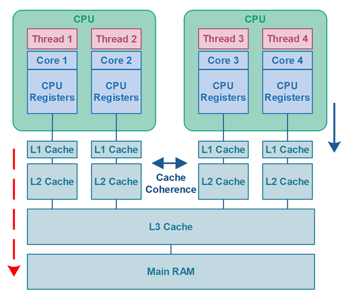

## False sharing in Java
False sharing == when a thread modifies a variable, its cache line is invalidated which can lead to invalidating other unrelated variables, which happen to be stored on the same cache line.

When CPU reads a value from a cache, it doesn't just read a single byte. It reads a whole cache line as otherwise, that would be inefficient.

This can lead to a performance degradation where two threads write to independent variables and yet, pay performance costs as if they're modifying the same variable.

Example:
```java
public class Counter {

    public volatile long count1 = 0;
    public volatile long count2 = 0;

}

public class FalseSharingExample {

    public static void main(String[] args) {

        Counter counter1 = new Counter();
        Counter counter2 = counter1;

        long iterations = 1_000_000_000;

        Thread thread1 = new Thread(() -> {
            long startTime = System.currentTimeMillis();
            for(long i=0; i<iterations; i++) {
                counter1.count1++;
            }
            long endTime = System.currentTimeMillis();
            System.out.println("total time: " + (endTime - startTime));
        });
        Thread thread2 = new Thread(() -> {
            long startTime = System.currentTimeMillis();
            for(long i=0; i<iterations; i++) {
                counter2.count2++;
            }
            long endTime = System.currentTimeMillis();
            System.out.println("total time: " + (endTime - startTime));
        });

        thread1.start();
        thread2.start();
    }
}
```

This code takes 36s to run on author's laptop.
If instead, separate counters are used, it takes 9s to run.

A huge performance overhead due to false sharing.

One way to solve this issue is to use separate objects which don't have false sharing.
Alternatively, one can use the `@Contended` keyword to let java know that it should pad empty bytes at the end of a field to prevent false sharing:
```java
public class Counter1 {

    @jdk.internal.vm.annotation.Contended
    public volatile long count1 = 0;
    public volatile long count2 = 0;
}
```

You can also group fields to be close together in RAM using the annotation:
```java
public class Counter1 {

    @jdk.internal.vm.annotation.Contended("group1")
    public volatile long count1 = 0;

    @jdk.internal.vm.annotation.Contended("group1");
    public volatile long count2 = 0;

    @jdk.internal.vm.annotation.Contended("group2");
    public volatile long count3 = 0;

}
```

The amount of bytes to pad with depends on the underlying hardware. For 64-bit systems, 64 bits of padding is sufficient. For 128-bit ones, it is not.

By default, java uses 128 bits of padding. You can customize that via this flag:
```
-XX:ContendedPaddingWidth=64
```

## Java ThreadLocal
ThreadLocal in java enables you to create variables that are confined to the thread they've been created in.
That way, these variables are thread-safe although they appear to be shared.

However, this also means that each thread will see its own version of the variable - if e.g. two threads increment a thread-local counter once, they will both see 1 as a result.

Example:
```java
private ThreadLocal<String> myThreadLocal = new ThreadLocal<String>();

myThreadLocal.set("Hello ThreadLocal");
String threadLocalValue = myThreadLocal.get();
```

A thread local can have an initial value:
```java
private ThreadLocal myThreadLocal = new ThreadLocal<String>() {
    @Override protected String initialValue() {
        return String.valueOf(System.currentTimeMillis());
    }
};

// OR
ThreadLocal threadLocal = ThreadLocal.withInitial(
        () -> { return String.valueOf(System.currentTimeMillis()); } );
```

## Thread Signaling
Purpose is for threads to communicate with one another. e.g. a thread should only execute something if another one has completed its execution.

One option is signaling via a shared object:
```java
public class MySignal{

  protected boolean hasDataToProcess = false;

  public synchronized boolean hasDataToProcess(){
    return this.hasDataToProcess;
  }

  public synchronized void setHasDataToProcess(boolean hasData){
    this.hasDataToProcess = hasData;  
  }
}
```

In the waiting thread, there has to be a busy wait in place for this pattern to work.
```java
protected MySignal sharedSignal = ...

...

while(!sharedSignal.hasDataToProcess()){
  //do nothing... busy waiting
}
```

An alternative is to use java's wait, notify and notifyAll methods which all objects share.
What these do is that they allow a thread to `wait()` on an object until another thread `notify()`es on the same object.
`notifyAll()` on the other hand, wakes up all threads which are waiting rather than a single one.

Note that both operations need to be executed while synchronizing on the monitor object. Contrary to most other methods, if `wait()` is invoked in a `synchronized` block, the lock is released until a new `wait()` or `notify()` is triggered.

If any of these signaling methods are invoked outside of a synchronized block, an exception is thrown.

Example:
```java
public class MonitorObject{}

public class MyWaitNotify{
  MonitorObject myMonitorObject = new MonitorObject();

  public void doWait(){
    synchronized(myMonitorObject){
      try{
        myMonitorObject.wait();
      } catch(InterruptedException e){...}
    }
  }

  public void doNotify(){
    synchronized(myMonitorObject){
      myMonitorObject.notify();
    }
  }
}
```

### Missed signals
If a thread invokes `notify` without any threads `wait`ing on that object, the method will return successfully.
However, if a subsequent thread `wait`s, the signal will not be received and that thread will be blocked forever.

To prevent this, you have to track whether a notify signal was received:
```java
public class MyWaitNotify2{
  MonitorObject myMonitorObject = new MonitorObject();
  boolean wasSignalled = false;

  public void doWait(){
    synchronized(myMonitorObject){
      if(!wasSignalled){
        try{
          myMonitorObject.wait();
         } catch(InterruptedException e){...}
      }
      //clear signal and continue running.
      wasSignalled = false;
    }
  }

  public void doNotify(){
    synchronized(myMonitorObject){
      wasSignalled = true;
      myMonitorObject.notify();
    }
  }
}
```

### Spurious wakeups
For some reason, a thread which is `wait`int might get randomly woken up without receiving a `notify` signal in the first place.

This is why, the common pattern to deal with `wait()` is to do it in a while loop & track if the notify signal was received:
```java
public class MyWaitNotify3{
  MonitorObject myMonitorObject = new MonitorObject();
  boolean wasSignalled = false;

  public void doWait(){
    synchronized(myMonitorObject){
      while(!wasSignalled){
        try{
          myMonitorObject.wait();
         } catch(InterruptedException e){...}
      }
      //clear signal and continue running.
      wasSignalled = false;
    }
  }

  public void doNotify(){
    synchronized(myMonitorObject){
      wasSignalled = true;
      myMonitorObject.notify();
    }
  }
}
```

### Gotcha - don't call signaling methods on constants or global objects
If you use a constant string as the monitor object, the JVM is likely to reference all constant strings in your application to the same object.
Hence, your signaling methods will be shared across all the objects in your application which use them.

## Deadlock
Deadlock occurs when multiple threads need the same locks but obtain them in different order.

Conceptual example:
```
Thread 1  locks A, waits for B
Thread 2  locks B, waits for A
```

Example:
```java
public class TreeNode {
 
  TreeNode parent   = null;  
  List     children = new ArrayList();

  public synchronized void addChild(TreeNode child){
    if(!this.children.contains(child)) {
      this.children.add(child);
      child.setParentOnly(this);
    }
  }
  
  public synchronized void addChildOnly(TreeNode child){
    if(!this.children.contains(child){
      this.children.add(child);
    }
  }
  
  public synchronized void setParent(TreeNode parent){
    this.parent = parent;
    parent.addChildOnly(this);
  }

  public synchronized void setParentOnly(TreeNode parent){
    this.parent = parent;
  }
}
```

In this case, if the child invokes `setParent` at the same time as the parent invokes `addChild` a deadlock will occur.
```
Thread 1: parent.addChild(child); //locks parent
          --> child.setParentOnly(parent);

Thread 2: child.setParent(parent); //locks child
          --> parent.addChildOnly()
```

Deadlocks can also occur in database transactions. Example:
```
Transaction 1, request 1, locks record 1 for update
Transaction 2, request 1, locks record 2 for update
Transaction 1, request 2, tries to lock record 2 for update.
Transaction 2, request 2, tries to lock record 1 for update.
```

## Deadlock Prevention
It is possible to prevent deadlocks using some techniques.

### Lock ordering
If you always acquire your locks in the same order, it is not possible to get a deadlock.

This is very effective but works well only if you know all the locks you need ahead of time.

### Lock timeout
Another technique is to timeout if you don't acquire one of your locks in a given amount of time.
Once you timeout, you wait a random number of milliseconds before trying again.

The random delay is to prevent livelocks - issue where multiple threads timeout at the same time & retry at the same time resulting in a timeout again.

Example lock timeout:
```
Thread 1 locks A
Thread 2 locks B

Thread 1 attempts to lock B but is blocked
Thread 2 attempts to lock A but is blocked

Thread 1's lock attempt on B times out
Thread 1 backs up and releases A as well
Thread 1 waits randomly (e.g. 257 millis) before retrying.

Thread 2's lock attempt on A times out
Thread 2 backs up and releases B as well
Thread 2 waits randomly (e.g. 43 millis) before retrying.
```

### Deadlock detection
a more heavyweight deadlock prevention mechanism used when lock ordering is not possible and lock timeout is not feasible.

Everytime a thread acquires lock that is recorded in a data structure.
When a thread is denied acquiring a lock, it can traverse the lock graph to detect if there are any deadlocks.

Once a deadlock is detected, some or all of the threads back up & retry acquiring the locks again similar to the lock timeout mechanism.

## Starvation and fairness
If a thread is not granted CPU time because others grab it all, this situation is called "starvation". The solution is called "fairness" - allowing all threads an opportunity to utilise the CPU.

### Causes of starvation in Java
* Threads with high priority swallow all CPU time from threads with lower priority.
* Threads are blocked indefinitely on a lock because others are allowed to enter before them
* A thread `wait`ing on an object waits indefinitely because other threads are awakened before it all the time

There are some techniques to implement fairness but this is a very advanced use-case which is rarely needed in practice. For the details, check out the article.

## Nested monitor lockout
```
Thread 1 synchronizes on A
Thread 1 synchronizes on B (while synchronized on A)
Thread 1 decides to wait for a signal from another thread before continuing
Thread 1 calls B.wait() thereby releasing the lock on B, but not A.

Thread 2 needs to lock both A and B (in that sequence)
        to send Thread 1 the signal.
Thread 2 cannot lock A, since Thread 1 still holds the lock on A.
Thread 2 remain blocked indefinately waiting for Thread1
        to release the lock on A

Thread 1 remain blocked indefinately waiting for the signal from
        Thread 2, thereby
        never releasing the lock on A, that must be released to make
        it possible for Thread 2 to send the signal to Thread 1, etc.
```

Practical example:
```java
//lock implementation with nested monitor lockout problem

public class Lock{
  protected MonitorObject monitorObject = new MonitorObject();
  protected boolean isLocked = false;

  public void lock() throws InterruptedException{
    synchronized(this){
      while(isLocked){
        synchronized(this.monitorObject){
            this.monitorObject.wait();
        }
      }
      isLocked = true;
    }
  }

  public void unlock(){
    synchronized(this){
      this.isLocked = false;
      synchronized(this.monitorObject){
        this.monitorObject.notify();
      }
    }
  }
}
```

### Nested monitor lockout vs. Deadlock
```
In deadlock, two threads are waiting for each other to release locks.

In nested monitor lockout, Thread 1 is holding a lock A, and waits
for a signal from Thread 2. Thread 2 needs the lock A to send the
signal to Thread 1.
```

## Slipped conditions
In the time between when a thread has checked a condition and when it has acted upon it, that condition has changed.

Example:
```java
if (!list.contains(a)) {
  list.add(a);
}
```

Between `contains` and `add` the condition might have changed which means that two threads can add `a` to the list multiple times.

## Locks in java
A lock in java is analogous to using `synchronized` blocks but provides more advanced capabilities.

Example:
```java
public class Counter{

  private Lock lock = new Lock();
  private int count = 0;

  public int inc(){
    lock.lock();
    int newCount = ++count;
    lock.unlock();
    return newCount;
  }
}
```

Locks can be reentrant. A reentrant lock is one where if it is acquired multiple times by the same thread, it does not block.

Synchronized blocks are reentrant:
```java
public class Reentrant{

  public synchronized outer(){
    inner();
  }

  public synchronized inner(){
    //do something
  }
}
```

This will not result in an error.

The equivalent lock in java is a `ReentrantLock`.

Note that when using lock, it is important that the critical section is guarded by a `try-finally` to prevent not unlocking the lock:
```java
lock.lock();
try{
  //do critical section code, which may throw exception
} finally {
  lock.unlock();
}
```

## Read-write locks in java
A read-write lock allows you to only lock the resource on writes, rather than locking both reads and writes.

Note that using a single lock on writes & not doing synchronization on reads is incorrect as there would be thread visibility problems.
The full article offers a thorough `ReadWriteLock` implementation which is irrelevant IMO, as one doesn't usually go on implementing locks themselves.

Similar to normal locks, the `try-finally` lock pattern needs to be used here as well for the same reasons as last time:
```java
lock.lockWrite();
try{
  //do critical section code, which may throw exception
} finally {
  lock.unlockWrite();
}
```

## Reentrance Lockout
This is a similar issue to deadlock & nested monitor lockout which leads to infinite block.

It happens when you reenter a critical section using a non-reentrant lock.

Example reentrance:
```java
public class Reentrant{

  public synchronized outer(){
    inner();
  }

  public synchronized inner(){
    //do something
  }
}
```

This example is valid & has no issues as the `synchronized` block is reentrant. However, if you had used a non-reentrant lock instead, it would have lead to an issue.

## Semaphores
A thread synchronization primitive that can be used to either send signals across threads or to guard critical sections similar to locks.

### Using semaphores for signaling
```java
// In some method...
Semaphore semaphore = new Semaphore();

SendingThread sender = new SendingThread(semaphore);

ReceivingThread receiver = new ReceivingThread(semaphore);

receiver.start();
sender.start();

public class SendingThread {
  Semaphore semaphore = null;

  public SendingThread(Semaphore semaphore){
    this.semaphore = semaphore;
  }

  public void run(){
    while(true){
      //do something, then signal
      this.semaphore.take();

    }
  }
}

public class ReceivingThread {
  Semaphore semaphore = null;

  public ReceivingThread(Semaphore semaphore){
    this.semaphore = semaphore;
  }

  public void run(){
    while(true){
      this.semaphore.release();
      //receive signal, then do something...
    }
  }
}
```

### Other details
Counting semaphore == one which counts the number of signals sent/received.
Bounded semaphore == counting semaphore which also sets a bound to the number of signals sent/received. Very similar to channels in Go and bounded queue in Java, but without transferring any data.

## Blocking queues
A thread-safe queue which blocks if you attempt to take an element from it and it is empty and if you attempt to push an element to it and it's full. This is called a channel in Go.
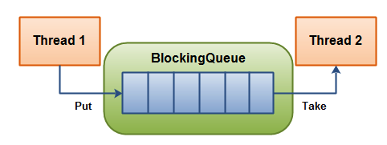

## The Producer-Consumer Pattern
A concurrency design pattern which allows multiple threads to enqueue work and multiple threads to dequeue work.

This design pattern detaches the number of threads on either side of the operation from the algorithm, enabling one to scale this as they please.

Use-cases:
 * Reduce foreground thread latency
 * Load-balance work across threads
 * Implement backpressure

Backpressure - when producers put in more work than can be done. In that case, a backpressure implementation will cause the producers to block & not accept any more work until the previous jobs are completed.

Example foreground thread latency:
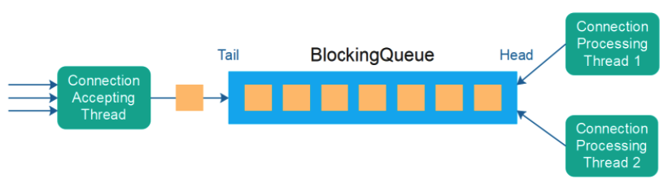
Programming Concurrency on the JVM: Mastering Synchronization, STM, and Actors

## Thread pools
A pool of threads that can be reused rather than destroyed after first use.

The reason for this is that creating a new thread has some performance overhead which can be avoided.
Additionally, using a thread pool enables you to specify how many threads are active at a time.

Thread pools visualized:
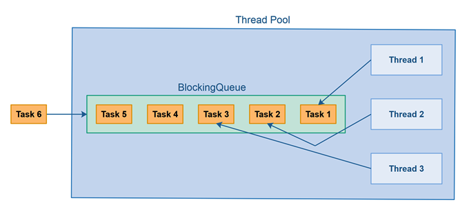

The standard way to leverage a thread pool in java is to use the executor framework. In the article, an implementation of one is offered but one would rarely need to implement a thread pool themselves in practice.

## Compare and swap
A technique used when designing concurrent algorithms. 
What CAS does is to compare the value of a variable with an expected value and if the values are equal, it atomically swaps them for a new value.
An alternative to standard locking which is more complicated to implement but more performant.

Locking is oftentimes not optimal due to wasted time waiting before a thread is woken up to retry acquiring a lock:
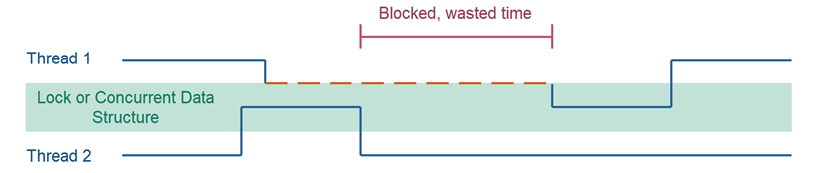

On the other hand, CAS is similar to busy waiting for a lock to be released in that is makes the checks more frequently & hence, less time is wasted:


The downside is that more CPU time is wasted while waiting to execute an operation but in practice, if critical sections are minimal, this is rarely the case.

All atomic classes in java use CAS.

## Anatomy of a synchronizer
This article is very similar to the [Building custom synchronizers](https://github.com/preslavmihaylov/booknotes/tree/master/java/java-concurrency-in-practice/chapter-14) chapter in JCIP so you better use that as a reference instead.

## Non-blocking Algorithms
Algorithms which allow threads to access shared state without blocking the threads involved.

A blocking concurrency algorithm is an algorithm which either:
 * Performs the action requested by the thread - OR
 * Blocks the thread until the action can be performed safely

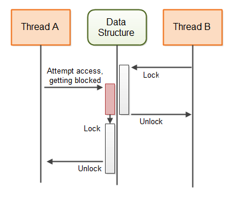

A non-blocking concurrency algorithm is an algorithm which either:
 * Performs the action requested by the thread - OR
 * Notifies the requesting thread that the action could not be performed

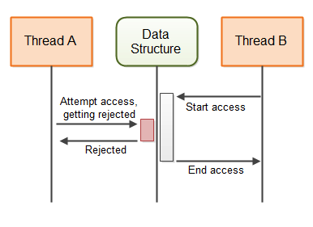

Example non-blocking counter:
```java
import java.util.concurrent.atomic.AtomicLong;

public class AtomicCounter {
    private AtomicLong count = new AtomicLong(0);

    public void inc() {
        boolean updated = false;
        while(!updated){
            long prevCount = this.count.get();
            updated = this.count.compareAndSet(prevCount, prevCount + 1);
        }
    }

    public long count() {
        return this.count.get();
    }
}
```

This type of locking is also referred to as optimistic locking.

Benefits of non-blocking algorithms:
 * Choice to either block or do something else once refused to acquire a lock
 * Better performance
 * No deadlocks

The rest of the article goes into details of how non-blocking algorithms can be implemented for more complicated data structures which is something one would rarely do themselves.
Instead, use non-blocking data structure implementations which are available in the standard library or as OS libraries.

## Amdahl's Law
Used to calculate how much a computation can be sped up by running part of it in parallel.

A program can be split into two parts - one which can't be parallelized and one which can.
T - total execution time when program is executed sequentially.
B - Non-parallelizable part
T-B - parallelizable part
N - parallelization factor (ie, how many CPUs are used to parallelize the execution)

Amdahl's law:
```
T(N) = B + ( T(1) - B ) / N
```

Example:

given a program with 40% non-parallelizable part & 60% parallelizable part with parallelization:
N = 2:
```
T(2) = 0.4 + ( 1 - 0.4 ) / 2
     = 0.4 + 0.6 / 2
     = 0.4 + 0.3
     = 0.7
```

N = 5:
```
T(5) = 0.4 + ( 1 - 0.4 ) / 5
     = 0.4 + 0.6 / 5
     = 0.4 + 0.12
     = 0.52
```

In a nutshell, parallelizing the program with 5 CPUs results in 2x faster execution.

### The law illustrated
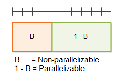

If parallelization is 2:
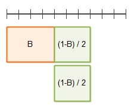

If parallelization is 3:
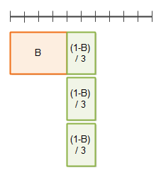

The takeaway is that throwing hardware at a program can only optimize it to a certain degree. After a given point, you'd need to optimize your non-parallelizable part of the program.
