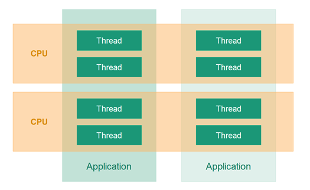

# Jenkov Concurrency Tutorial
> [Tutorial link](http://tutorials.jenkov.com/java-concurrency/index.html)

## Introduction
### What is Multithreading
Multithreading == multiple threads of execution inside a single program.
A multithreaded application is as if you have multiple CPUs executing your code at once.

However, threads != CPUs. Usually, a single CPU will share its execution time with multiple threads.


### Why Multithreading?
#### Better utilization of a single CPU
e.g. whilst one thread is waiting for input from a network, another one can run during this time.

#### Better utilization of multiple CPUs
If your computer has multiple CPUs then you'd need to use threads to fully utilize them.

#### Better UX in terms of responsiveness
A blocking operation (e.g. downloading a photo) in a UI should not cause the whole UI to stall. This can be achieved by having the UI be handled on a separate thread.

#### Better UX in terms of fairness
If one client's request takes too much time, the rest of the clients' requests should proceed.

### Multithreading vs. Multitasking
In the past, computers with a single CPU were able to execute only one program at a time.
This changed with the advent of multitasking.

#### Multitasking
Multitasking enables you to execute multiple programs at a time with a single CPU.
It was achieved by allowing programs to multiplex their CPU time - ie your foreground movie is running, but a background downloading program runs for a little from time to time.

#### Multithreading
Multithreading == multiple threads of execution inside the same program.
Multitasking == multiple programs running at the same time with the same CPU.

### Multithreading is hard
Multithreaded programs give rise to new kinds of errors not seen in single-threaded ones.
This stems from the fact that multiple threads are accessing the same shared memory, possibly, across different CPUs.

## Multithreading benefits
### Better CPU Utilization
Example sequential processing of files:
```
  5 seconds reading file A
  2 seconds processing file A
  5 seconds reading file B
  2 seconds processing file B
-----------------------
 14 seconds total
```

Example parallel processing of files (using the same CPU). Achieved by using the CPU for reading the second file while its idle:
```
  5 seconds reading file A
  5 seconds reading file B + 2 seconds processing file A
  2 seconds processing file B
-----------------------
 12 seconds total
```

### Simple Program Design
Sometimes, writing multithreaded code can result in simpler design as each processing unit is independent than the rest, hence, can be easier to read.

### More Responsive Programs
When multiple requests come to a server and the former requests take a long time to process, latter requests will have to wait regardless of processing time.

By using multithreading, one can achieve a much more responsive server.

Example without multithreading:
```
  while(server is active){
    listen for request
    process request
  }
```

Example with multithreading:
```
  while(server is active){
    listen for request
    hand request to worker thread
  }
```

## Multithreading Costs
To use multithreading in an application, the benefits gained should outweigh the costs.

Here are some of the costs of multithreading.
### More complex design
Some parts might be simpler by using multithreading, others though, might be more complex.

E.g. code involving shared data which needs to be synchronized.

### Context Switching Overhead
When a CPU needs to switch from executing one thread to another, there is some overhead incurred due to having to save the state of the thread in memory.

When you switch between threads too often, the time taken to switch threads might be more than the actual processing time.

### Increased Resource Consumption
A thread needs some resources in order to run. Hence, creating too much threads can consume a lot of memory/OS resources.
