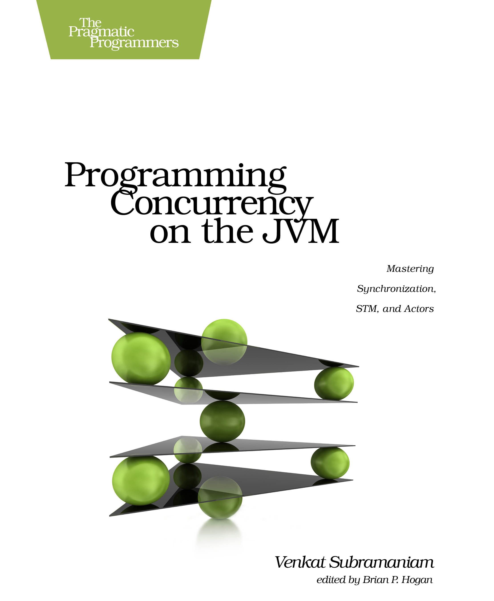

# Programming Concurrency on the JVM
Book notes taken during my read-through of [Programming Concurrency on the JVM](https://www.amazon.com/Programming-Concurrency-JVM-Mastering-Synchronization/dp/193435676X).

## Preface
 * [Chapter 01 - The Power and Perils of Concurrency](./chapter-01/)

## Strategies for Concurrency
 * [Chapter 02 - Division of Labor](./chapter-02)
 * [Chapter 03 - Design Approaches](./chapter-03)

## Modern Java/JDK Concurrency
 * [Chapter 04 - Scalability and Thread Safety](./chapter-04)
 * [Chapter 05 - Taming Shared Mutability](./chapter-05)

## Software Transactional Memory
 * [Chapter 06 - Introduction to STM](./chapter-06)
 * [Chapter 07 - STM in Clojure, Groovy, Java, JRuby and Scala](./chapter-07)

## Actor-based Concurrency
 * [Chapter 08 - Favoring Isolated Mutability](./chapter-08)
 * [Chapter 09 - Actors in Groovy, Java, JRuby and Scala](./chapter-09)

## Epilogue
 * [Chapter 10 - Zen of Programming Concurrency](./chapter-10)
