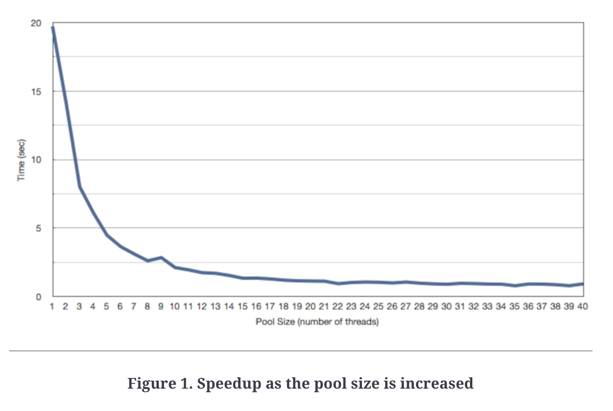
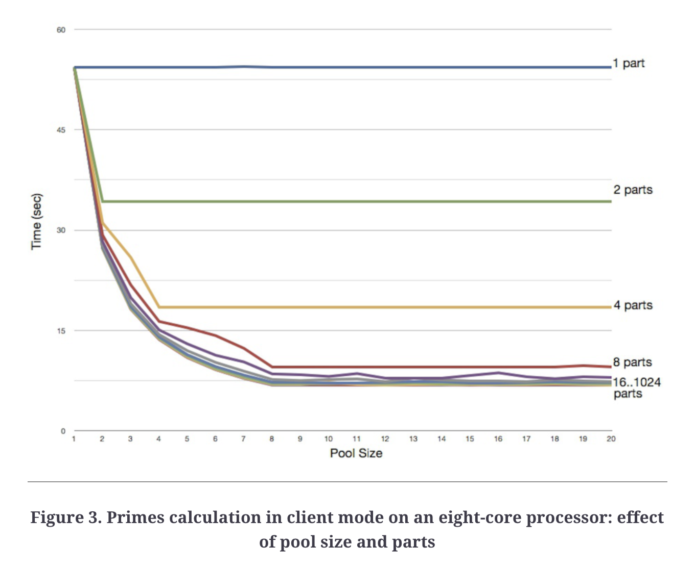

# Chapter 2: Division of Labor
Single-threaded program running on multiple cores is not expected to run faster. You have to properly divide it and run tasks concurrently.

## From sequential to concurrent
Moving from sequential execution to concurrent involves several steps:

### Determine number of threads
a good rule of thumb is to have at least as many as the # of processors.
If the task is compute-intensive, then this number is fine. If it is IO-intensive, more threads are better.

```
Number of threads = Number of Available Cores / (1 - Blocking Coefficient)
```

### Determine the number of parts
To do this, we need to know the nature of the problem.

 * fetch price for each stock - each subtask consists of fetching a single stock price and all tasks are relatively equal in terms of duration. So this split is adequate.
 * Calculate N primes - Splitting this in subsets is not ideal work distribution since smaller numbers are more easily checked for primeness. However, determining equal work distribution is complex & not worth the cost so we can stick to feeding our threads parts which are big enough to keep them busy.

## Concurrency in IO-Intensive Apps
IO-intensive apps benefit from more threads than available processors.

Example program - calculate total asset value given a stock amount & tickers.

method for getting price of a single stock:
```java
public class YahooFinance {
  public static double getPrice(final String ticker) throws IOException {
    final URL url = new URL("http://ichart.finance.yahoo.com/table.csv?s=" + ticker);
 	
    final BufferedReader reader = new BufferedReader(
      new InputStreamReader(url.openStream()));
 	
    //Date,Open,High,Low,Close,Volume,Adj Close
    //2011-03-17,336.83,339.61,330.66,334.64,23519400,334.64
    final String discardHeader = reader.readLine();
    final String data = reader.readLine();
    final String[] dataItems = data.split(",");
    final double priceIsTheLastValue = Double.valueOf(dataItems[dataItems.length - 1]);
    return priceIsTheLastValue;
  }
}
```

methods for reading tickers from txt file and timing the operation of solving the problem:
```java
public abstract class AbstractNAV {
  public static Map<String, Integer> readTickers() throws IOException {
    final BufferedReader reader =
      new BufferedReader(new FileReader("stocks.txt"));
 	
    final Map<String, Integer> stocks = new HashMap<String, Integer>();
 	
 	
    String stockInfo = null;
    while((stockInfo = reader.readLine()) != null) {
      final String[] stockInfoData = stockInfo.split(",");
      final String stockTicker = stockInfoData[0];
      final Integer quantity = Integer.valueOf(stockInfoData[1]);
 	
      stocks.put(stockTicker, quantity);
    }
 	
    return stocks;
  }
 	
 	
  public void timeAndComputeValue()
    throws ExecutionException, InterruptedException, IOException {
 	
    final long start = System.nanoTime();
    final Map<String, Integer> stocks = readTickers();
    final double nav = computeNetAssetValue(stocks);
    final long end = System.nanoTime();
 	
    final String value = new DecimalFormat("$##,##0.00").format(nav);
    System.out.println("Your net asset value is " + value);
    System.out.println("Time (seconds) taken " + (end - start)/1.0e9);
  }
 	
 	
  public abstract double computeNetAssetValue(final Map<String, Integer> stocks)
    throws ExecutionException, InterruptedException, IOException;
}
```

Sequential solution:
```java
public class SequentialNAV extends AbstractNAV {
 	
  public double computeNetAssetValue(final Map<String, Integer> stocks) throws IOException {
    double netAssetValue = 0.0;
    for(String ticker : stocks.keySet()) {
      netAssetValue += stocks.get(ticker) * YahooFinance.getPrice(ticker);
    }
 	
    return netAssetValue;
  }
 	
  public static void main(final String[] args)
      throws ExecutionException, IOException, InterruptedException {
    new SequentialNAV().timeAndComputeValue();
  }
}
```

Result of running solution:
```
Your net asset value is $13,661,010.17
Time (seconds) taken 19.776223
```

This solution is inefficient as is doesn't reap the benefits of having multiple cores and the potential speedup of concurrency.

To solve it efficiently, we'll use a blocking coefficient of 0.9 as the task is very IO-intensive.
```java
public class ConcurrentNAV extends AbstractNAV {
  public double computeNetAssetValue(final Map<String, Integer> stocks) 
      throws InterruptedException, ExecutionException {      
    final int numberOfCores = Runtime.getRuntime().availableProcessors();
    final double blockingCoefficient = 0.9;
    final int poolSize = (int)(numberOfCores / (1 - blockingCoefficient));
    
    System.out.println("Number of Cores available is " + numberOfCores);
    System.out.println("Pool size is " + poolSize);
    final List<Callable<Double>> partitions = 
      new ArrayList<Callable<Double>>();
    for(final String ticker : stocks.keySet()) {
      partitions.add(new Callable<Double>() {
        public Double call() throws Exception {
          return stocks.get(ticker) * YahooFinance.getPrice(ticker);
        }        
      });
    }
        
    final ExecutorService executorPool = 
      Executors.newFixedThreadPool(poolSize);    
    final List<Future<Double>> valueOfStocks = 
      executorPool.invokeAll(partitions, 10000, TimeUnit.SECONDS);
      
    double netAssetValue = 0.0; 
    for(final Future<Double> valueOfAStock : valueOfStocks)  
      netAssetValue += valueOfAStock.get(); 

    executorPool.shutdown();
    return netAssetValue;   
  } 

  public static void main(final String[] args)
    throws ExecutionException, InterruptedException, IOException { 
    new ConcurrentNAV().timeAndComputeValue();
  }
}
```

Result of concurrent solution:
```
Number of Cores available is 2
Pool size is 20
Your net asset value is $13,661,010.17
Time (seconds) taken 0.967484
```

In this solution, there weren't any synchronization concerns as the only mutable variable we had was `netAssetValue` which is only mutated in the main thread.

One potential optimisation is using a `CompletionService` to receive `Future` results more efficiently.  
Currently, we're waiting for the results of the futures in order but they might come back out of order.

## Speedup for the IO-intensive App


IO-intensive apps are very susceptible to concurrency even on small # of cores as shown in the graph.

## Concurrency in computationally intensive apps
The number of cores has a greater influence on speedup on computationally intensive apps.

In this example, we'll compute all prime numbers up to 10 million.

Abstract class which has non-concurrency related methods:
```java
public abstract class AbstractPrimeFinder {
  public boolean isPrime(final int number) {
    if (number <= 1) return false;

    for(int i = 2; i <= Math.sqrt(number); i++)
      if (number % i == 0) return false;

    return true;
  }

  public int countPrimesInRange(final int lower, final int upper) {
    int total = 0;

    for(int i = lower; i <= upper; i++)
      if (isPrime(i)) total++;

    return total;
  }
  
  public void timeAndCompute(final int number) {
    final long start = System.nanoTime();
    
    final long numberOfPrimes = countPrimes(number);
    
    final long end = System.nanoTime();
    
    System.out.printf("Number of primes under %d is %d\n", 
      number, numberOfPrimes);
    System.out.println("Time (seconds) taken is " + (end - start)/1.0e9);
  }

  public abstract int countPrimes(final int number);
}
```

Sequential solution:
```java
public class SequentialPrimeFinder extends AbstractPrimeFinder {
  public int countPrimes(final int number) {
    return countPrimesInRange(1, number);
  }
  
  public static void main(final String[] args) { 
    new SequentialPrimeFinder().timeAndCompute(Integer.parseInt(args[0]));
  }
}
```

Result:
```
Number of primes under 10000000 is 664579
Time (seconds) taken is 6.544368
```

### Concurrent computation
Since the task is compute-heavy, the blocking coefficient is zero.

Hence, the # of threads will be equal to the number of processors.

Solution:
```java
public class ConcurrentPrimeFinder extends AbstractPrimeFinder {
  private final int poolSize;
  private final int numberOfParts;

  public ConcurrentPrimeFinder(final int thePoolSize, final int theNumberOfParts) {
    poolSize = thePoolSize;
    numberOfParts = theNumberOfParts;
  }

  public int countPrimes(final int number) {
    int count = 0;      
    try {
      final List<Callable<Integer>> partitions = 
        new ArrayList<Callable<Integer>>(); 
      final int chunksPerPartition = number / numberOfParts;
      for(int i = 0; i < numberOfParts; i++) {
        final int lower = (i * chunksPerPartition) + 1;
        final int upper = 
          (i == numberOfParts - 1) ? number 
            : lower + chunksPerPartition - 1;
        partitions.add(new Callable<Integer>() {
          public Integer call() {
            return countPrimesInRange(lower, upper);
          }        
        });
      }
      final ExecutorService executorPool = Executors.newFixedThreadPool(poolSize); 
      final List<Future<Integer>> resultFromParts = executorPool.invokeAll(partitions, 10000, TimeUnit.SECONDS);
      executorPool.shutdown(); 
      for(final Future<Integer> result : resultFromParts)
        count += result.get(); 
    } catch(Exception ex) { throw new RuntimeException(ex); }

    return count;          
  }
  public static void main(final String[] args) {
    if (args.length < 3)
      System.out.println("Usage: number poolsize numberOfParts");    
    else
      new ConcurrentPrimeFinder(
          Integer.parseInt(args[1]), Integer.parseInt(args[2]))
        .timeAndCompute(Integer.parseInt(args[0]));
  }
}
```

Result if we run the program with two parts:
```
Number of primes under 10000000 is 664579
Time (seconds) taken is 4.236507
```

The speedup is ~1.5 but we expected ~2.0. This happened because the parts were too few so the later core performed more work than the first.

This can be fixed by increasing the number of parts to 100:
```
Number of primes under 10000000 is 664579
Time (seconds) taken is 3.550659
```

## Speedup of the computationally intensive app



Takeaways:
 * The number of parts need to be at least equal to the number of cores. Otherwise, the concurrent app is slower than the sequential one.
 * More threads than number of cores doesn't help. Notice that the curve flattens once the # of threads reaches the # of cores (eight)
 * Having more partitions is better than having fewer
 * After a certain amount of partitions, having more doesn't yield any benefits.

## Strategies for effective concurrency
 * Synchronization issues can be easily avoided once we get rid of shared mutable state.
   * Provide shared immutability or isolated mutability where possible
 * the number of threads and number of partitions affects the performance of the program
   * For IO-intensive tasks, having more threads is beneficial. Use the formula mentioned to calculate the optimal # of threads.
   * For computationally intensive tasks, more threads can actually hurt.
 * A uniform partitioning improves performance, but in order to derive what partitioning strategy to use, one needs to understand the nature of the problem
