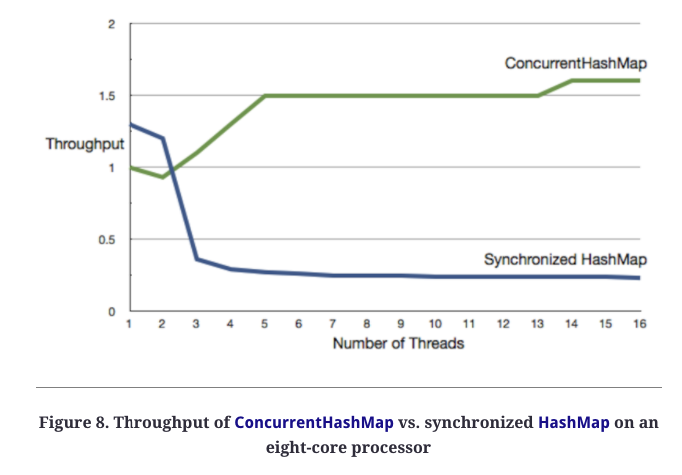

# Chapter 4: Scalability and Thread Safety
This chapter will explore how to work with Java 5's threading API by building a disk utility program which calculates the total size of files in a directory.

## Managing Threads with ExecutorService
Starting instances of `Thread` is generally a bad practice as one can't reuse them.

Using executors, we can leverage thread pools which enables us to reuse threads for multiple tasks.
Also, using executors we can configure the type of thread pool we want to use - fixed, single-threaded, cached, scheduled, etc.

## Coordinating threads
We can use the `Callable` interface, along with `invokeAll` from the `ExecutorService` to schedule tasks and wait for their results.

Example total size calculator - sequential implementation:
```java
public class TotalFileSizeSequential {
  private long getTotalSizeOfFilesInDir(final File file) {
    if (file.isFile()) return file.length();
    
    final File[] children = file.listFiles();
    long total = 0;
    if (children != null)
      for(final File child : children) 
        total += getTotalSizeOfFilesInDir(child);      
    return total;
  }
  
  // main method...
}
```

Example run:
```
> java TotalFileSizeSequential /etc
Total Size: 2266456
Time taken: 0.011836

> java TotalFileSizeSequential /usr
Total Size: 3793911517
Time taken: 18.570144
```

Naive concurrent implementation:
```java
public class NaivelyConcurrentTotalFileSize {
  private long getTotalSizeOfFilesInDir(
    final ExecutorService service, final File file) 
    throws InterruptedException, ExecutionException, TimeoutException {
    if (file.isFile()) return file.length();
    
    long total = 0;
    final File[] children = file.listFiles();
    
    if (children != null) {
      final List<Future<Long>> partialTotalFutures = 
        new ArrayList<Future<Long>>();      
      for(final File child : children) {
        partialTotalFutures.add(service.submit(new Callable<Long>() { 
          public Long call() throws InterruptedException, 
            ExecutionException, TimeoutException { 
            return getTotalSizeOfFilesInDir(service, child); 
          }
        }));
      }
      
      for(final Future<Long> partialTotalFuture : partialTotalFutures) 
        total += partialTotalFuture.get(100, TimeUnit.SECONDS); 
    }
    
    return total;
  }

  private long getTotalSizeOfFile(final String fileName) 
    throws InterruptedException, ExecutionException, TimeoutException {
	  final ExecutorService service = Executors.newFixedThreadPool(100);
	  try {
	    return getTotalSizeOfFilesInDir(service, new File(fileName)); 
	  } finally {
		  service.shutdown();
	  }
  }
    
  // main method...
}
```

Results for running the program for `/etc`:
```
> java NaivelyConcurrentTotalFileSize /etc
Total Size: 2266456
Time taken: 0.12506
```

It actually took more time than the sequential version due to the scheduling overhead of a small directory.
Running this for `/usr` times out.

The problem with this code is that there is a pool-induced deadlock - the thread pool is clogged because for huge directory hierarchies, threads will spawn sub-threads in the same executor and wait for their results.
If the directories are many, then this will result in 100 threads idly waiting for tasks to finish.

The solution is to not wait for results in the calling thread.

Revised solution:
```java
public class ConcurrentTotalFileSize {
  class SubDirectoriesAndSize {
    final public long size;
    final public List<File> subDirectories;
    public SubDirectoriesAndSize(
      final long totalSize, final List<File> theSubDirs) {
      size = totalSize;
      subDirectories = Collections.unmodifiableList(theSubDirs);
    }
  }

  private SubDirectoriesAndSize getTotalAndSubDirs(final File file) {
    long total = 0;
    final List<File> subDirectories = new ArrayList<File>();
    if(file.isDirectory()) {
      final File[] children = file.listFiles();
      if (children != null)
        for(final File child : children) {
          if (child.isFile())
            total += child.length();
          else
            subDirectories.add(child);
        }
    }
    return new SubDirectoriesAndSize(total, subDirectories);
  }

  private long getTotalSizeOfFilesInDir(final File file) 
    throws InterruptedException, ExecutionException, TimeoutException {
    final ExecutorService service = Executors.newFixedThreadPool(100);
    try {
      long total = 0;
      final List<File> directories = new ArrayList<File>();
      directories.add(file);
      while(!directories.isEmpty()) {
        final List<Future<SubDirectoriesAndSize>> partialResults = 
          new ArrayList<Future<SubDirectoriesAndSize>>();
        for(final File directory : directories) {
          partialResults.add(
            service.submit(new Callable<SubDirectoriesAndSize>() {
            public SubDirectoriesAndSize call() {
              return getTotalAndSubDirs(directory);
            }
          }));
        }
        directories.clear();     
        for(final Future<SubDirectoriesAndSize> partialResultFuture : 
          partialResults) {
          final SubDirectoriesAndSize subDirectoriesAndSize = 
            partialResultFuture.get(100, TimeUnit.SECONDS);
          directories.addAll(subDirectoriesAndSize.subDirectories);
          total += subDirectoriesAndSize.size;
        }
      }
      return total;
    } finally {
      service.shutdown();
    }
  }

  // main method...
}
```

Result:
```
> java ConcurrentTotalFileSize /usr
Total Size: 3793911517
Time taken: 8.220475
```

### Coordination using CountDownLatch
The problem with the concurrent implementation was that it was complicated. The benefits of the naive concurrent implementation was that it was simple but it didn't work for large directories.

If we compromise a bit on shared mutability we can achieve working concurrent code which is simpler.

Idea - increment the total count in a shared variable & wait for all threads to finish in the main thread using a count down latch.

Implementation:
```java
public class ConcurrentTotalFileSizeWLatch {  
  private ExecutorService service;
  final private AtomicLong pendingFileVisits = new AtomicLong();
  final private AtomicLong totalSize = new AtomicLong();
  final private CountDownLatch latch = new CountDownLatch(1);
  private void updateTotalSizeOfFilesInDir(final File file) {
    long fileSize = 0;
    if (file.isFile())
      fileSize = file.length();
    else {      
      final File[] children = file.listFiles();      
      if (children != null) {
        for(final File child : children) {
          if (child.isFile()) 
            fileSize += child.length();
          else {
            pendingFileVisits.incrementAndGet();
            service.execute(new Runnable() {
              public void run() { updateTotalSizeOfFilesInDir(child); }
            });            
          }
        }
      }
    }
    totalSize.addAndGet(fileSize);
    if(pendingFileVisits.decrementAndGet() == 0) latch.countDown();
  }

  private long getTotalSizeOfFile(final String fileName) 
    throws InterruptedException {
    service  = Executors.newFixedThreadPool(100);
    pendingFileVisits.incrementAndGet();
    try {
     updateTotalSizeOfFilesInDir(new File(fileName));
     latch.await(100, TimeUnit.SECONDS);
     return totalSize.longValue();
    } finally {
      service.shutdown();
    }
  }

  // main method...
}
```

Result:
```
> java ConcurrentTotalFileSizeWLatch /usr
Total Size: 3793911517
Time taken: 10.22789
```

This code was a bit slower than the original concurrent implementation, but a lot simpler.

## Exchanging Data
When we want to exchange data between cooperating threads, using global variables is one option, but it doesn't scale well for more complex applications.

The author mentions two options for achieving this using the concurrent API:
 * Exchanger - a synchronization point where two threads can swap data in a thread-safe manner
 * BlockingQueue - a queue which blocks on insert/remove based on its available space.

Implementation of previous problem with blocking queue:
```java
public class ConcurrentTotalFileSizeWQueue {  
  private ExecutorService service;
  final private BlockingQueue<Long> fileSizes = 
    new ArrayBlockingQueue<Long>(500);
  final AtomicLong pendingFileVisits = new AtomicLong();
  private void startExploreDir(final File file) {
    pendingFileVisits.incrementAndGet();
    service.execute(new Runnable() {
      public void run() { exploreDir(file); }
    });          
  }
  private void exploreDir(final File file) {
    long fileSize = 0;
    if (file.isFile())
      fileSize = file.length();
    else {
      final File[] children = file.listFiles();
      if (children != null)
        for(final File child : children) {
          if (child.isFile())
            fileSize += child.length();
          else {
            startExploreDir(child);
          }
        }
    }
    try { 
      fileSizes.put(fileSize); 
    } catch(Exception ex) { throw new RuntimeException(ex); }
    pendingFileVisits.decrementAndGet();          
  }

  private long getTotalSizeOfFile(final String fileName) 
    throws InterruptedException {
    service  = Executors.newFixedThreadPool(100);
    try {
      startExploreDir(new File(fileName));
      long totalSize = 0;
      while(pendingFileVisits.get() > 0 || fileSizes.size() > 0)
      {
        final Long size = fileSizes.poll(10, TimeUnit.SECONDS);
        totalSize += size;
      }
      return totalSize;
    } finally {
      service.shutdown();
    }
  }   

  // main method...
}
```

Result:
```
> java ConcurrentTotalFileSizeWQueue /usr
Total Size: 3793911517
Time taken: 10.293993
```

This solution is similar to the previous one in terms of performance, but a notch simpler.

## Java 7 Fork-Join API
An optimization to our naive concurrent implementation is to use a `ForkJoinPool`:
 * It dynamically manages threads based on processors and task demand
 * It employs work stealing where inactive threads steal work from active ones

Using fork-join pools is a suitable solution for problems which can be broken down into small recursive & sequential subtasks.

Implementation:
```java
public class FileSize {
  
  private final static ForkJoinPool forkJoinPool = new ForkJoinPool();
  
  private static class FileSizeFinder extends RecursiveTask<Long> {
    final File file;
    
    public FileSizeFinder(final File theFile) {
      file = theFile;
    }
    
    @Override public Long compute() {
      long size = 0;
      if (file.isFile()) {
        size = file.length();
      } else {
        final File[] children = file.listFiles();
        if (children != null) {
          List<ForkJoinTask<Long>> tasks = 
            new ArrayList<ForkJoinTask<Long>>();
          for(final File child : children) {
            if (child.isFile()) {
              size += child.length();
            } else {
              tasks.add(new FileSizeFinder(child));
            }
          }
          
          for(final ForkJoinTask<Long> task : invokeAll(tasks)) {
            size += task.join();
          }
        }
      }
      
      return size;
    }
  }

  public static void main(final String[] args) {
    final long start = System.nanoTime();
    final long total = forkJoinPool.invoke(
        new FileSizeFinder(new File(args[0])));
    final long end = System.nanoTime();
    System.out.println("Total Size: " + total);
    System.out.println("Time taken: " + (end - start)/1.0e9);    
  }
}
```

Result:
```
> java com.agiledeveloper.pcj.FileSize /etc
Total Size: 2266456
Time taken: 0.038218

> java com.agiledeveloper.pcj.FileSize /usr
Total Size: 3793911517
Time taken: 8.35158
```

As is seen, this version of the program performed pretty well compared to our previous attempts.

## Scalable Collections
Modern Java has support for concurrent collections, which are thread-safe collections that don't compromise performance.

Previously, one had to choose between synchronized list and array list to either favor thread-safety or performance. Now, this is no longer necessary with the advent of concurrent collections.
The only drawback is that concurrent collections have slightly different semantics. They can be modified while being iterated, but that's a cost we have to bear for its performance benefits.



## Lock vs. Synchronized
If we rely on Java's standard concurrency API, we'll have to use explicit locking at some point.

There are two ways to achieve it - `synchronized` keyword and the `Lock` interface.

`synchronized` properties:
 * Simple to use & guarantees critical section frees up the lock
 * Can't set a timeout
 * Can't interrupt lock acquisition
 * Can't support multiple readers/single writer
 * Can't mock in unit tests

Implementations of the `Lock` interface, on the other hand, support all of the above but are trickier to use as they require the `try-finally` pattern:
```java
aMonitor.lock();
try {
  //...
} finally {
  aMonitor.unlock();
}
```

The downsides of this is that it's easier to mess up than traditional `synchronized` blocks and code looks more messy.

Example:
```java
public class AccountService {
  public boolean transfer(
    final Account from, final Account to, final int amount) 
    throws LockException, InterruptedException {
    final Account[] accounts = new Account[] {from, to};
    Arrays.sort(accounts);
    if(accounts[0].monitor.tryLock(1, TimeUnit.SECONDS)) {
      try {
        if (accounts[1].monitor.tryLock(1, TimeUnit.SECONDS)) {
          try {
            if(from.withdraw(amount)) {
              to.deposit(amount);
              return true;
            } else {
              return false;
            }
          } finally {
            accounts[1].monitor.unlock();
          }
        }
      } finally {
        accounts[0].monitor.unlock();
      }
    }  
    throw new LockException("Unable to acquire locks on the accounts");
  }
}
```

The author suggests using `Lock` over `synchronized` although Brian Goetz suggests using `synchronized` in apps which won't benefit from the features of the former due to its simplicity.

## Recap
The moden Java concurrency API improves a lot of things:
 * Managing thread pools
 * Easily schedule tasks for concurrent execution
 * Exchange data between threads in a thread-safe manner
 * Benefit from better performance using concurrent collections
 * Gain fine-grained synchronization

However, we still need to be vigilant when dealing with shared mutability.
