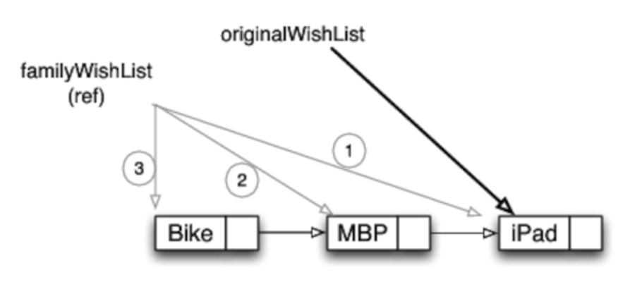

# Chapter 6: Introduction to Software Transactional Memory
The problem with traditional ways to synchronize shared mutable memory is that it's very easy to make an error which can lead to disasters.
We should have better tools to deal with synchronizing shared memory than the current mechanisms.

That's where STM comes in, which is popularized by Clojure.
This model is very suitable fore frequent reads and infrequent writes types of problems.

It's simple to use and gives predictable results.

## Synchronization Damns Concurrency
Synchronizing shared memory leads to thread-safety at the expense of reduced concurrency.

Additionally, we don't get any indication if we fail to synchronize properly using standard JDK toolkits.
That's simply something we've gotten used to.

## The Deficiency of the Object Model
OOP has led us down data hiding via abstractions -> combining state with procedures -> encapsulated and mutated state.

This wasn't the original intent. In effect, we've merged the identity of an object with its data.

This has lead to all the synchronization approaches and subsequent issues we're experiencing today.

## Separation of Identity and State
Approach of STM-driven programming -> separate identity from its immutable state.
This leads to greater concurrency and bare-minimum contention.


In the example above (tracking google's stock price), when a new price is received, we add to the historic price index instead of changing it.
That way, we only need to make a quick change of the identity to point to the new value.

For optimization purposes, persistent data structures are used to avoid extraneous copying for large objects.

All these operations are encapsulated and provided by the STM concurrency model.

## Software Transactional Memory
Separating identity from state solves the two major synchronization issues:
 * Crossing the memory barrier (visibility issues)
 * Preventing race conditions

In STM (demonstrated via Clojure), access to memory happens inside transactions.

If there are no conflicts in a transaction, there are no locks & maximum concurrency is achieved.
If there are conflicts, the transaction manager steps in and resolves the conflict.

By design, values are immutable. Identities are mutable only within transactions. 
If an attempt to change a value outside of a transaction occurs, the attempt fails with an exception.

If there's a conflict, a transaction is retried until it succeeds.
It's, however, our responsibility to ensure transaction code is idempotent - ie executing the transaction multiple times has the same result.

In practice, this means that state-changing operations such as printing to the terminal should not occur inside a transaction.

Example #1 - changing a value in Clojure without a transaction:
```clojure
(def balance (ref 0))

(println "Balance is" @balance)

(ref-set balance 100)

(println "Balance is now" @balance)
```

Notes:
 * `ref` provides facilities to change the identity of an object
 * `ref-set` changes the identity of an object

This code results in `IllegalStateException`.

This is an improvement over java as rather than getting unexpected behavior due to mutating shared memory, we get an error.

To wrap code in a transaction, we use `dosync`:
```clojure
(def balance (ref 0))

(println "Balance is" @balance)

(dosync 
  (ref-set balance 100))

(println "Balance is now" @balance)
```

Result:
```
Balance is 0
Balance is now 100
```

Differences between `dosync` and `synchronized` in Java:
 * We get an error if we don't `dosync`
 * `dosync` lets competing transactions to execute the same snippet concurrently
 * There is no possibility for deadlock
 * No need to think about order of locks and etc

Changing an identity in a transaction:
 * `ref-set` - sets the value of the identity and returns the value
 * `alter` - sets the value by applying a function over the identity
 * `commute` - advanced use-case which is rarely useful. See book chapter for more details

In addition to `ref`s, Clojure provides `atom`s which are like atomic variables in Java. They provide granular synchronized operations which don't need transactions.
If, however, multiple atoms participate in the same invariant, they need to be wrapped in a transaction to avoid race conditions.

## Transactions in STM
STM transactions are similar to database transactions.

DB Transactions provide ACID properties.
STM transactions provide ACI properties because Durability is not guaranteed in non-persistent memory.

A - either all changes are visible outside of transaction or none of them.
C - Either the entire transaction runs to completion or none of it
I - Transactions don't see partial changes of other transactions. Changes are seen only upon successful completion.

Clojure STM uses Multiverse Concurrency Control (MVCC) much like databases do - ie similar to optimistic locking in databases.

Once a transaction begins, Clojure notes the timestamps of states. If the timestamps are different at the end of a transaction, it is rolled back.
If a transaction is successful, the new timestamps are recorded.

## Concurrency using STM
What happens if two transactions try to change the same identity?

Example:
```clojure
(defn deposit [balance amount]
  (dosync
    (println "Ready to deposit..." amount)
    (let [current-balance @balance]
      (println "simulating delay in deposit...")
      (. Thread sleep 2000)
      (alter balance + amount)
      (println "done with deposit of" amount))))

(defn withdraw [balance amount]
  (dosync
    (println "Ready to withdraw..." amount)
    (let [current-balance @balance]
      (println "simulating delay in withdraw...")
      (. Thread sleep 2000)
      (alter balance - amount)
      (println "done with withdraw of" amount))))

(def balance1 (ref 100))

(println "Balance1 is" @balance1)

(future (deposit balance1 20))
(future (withdraw balance1 10))

(. Thread sleep 10000)

(println "Balance1 now is" @balance1)
```

Result:
```
Balance1 is 100
Ready to deposit... 20
simulating delay in deposit...
Ready to withdraw... 10
simulating delay in withdraw...
done with deposit of 20
Ready to withdraw... 10
simulating delay in withdraw...
done with withdraw of 10
Balance1 now is 110
```

One of the transactions succeeds, while the other one was retried.
Note that this transaction is not idempotent due to its printing. This should be avoided in production code.

What if we want to mutate a list?

Example:
```clojure
(defn add-item [wishlist item]
  (dosync (alter wishlist conj item)))

(def family-wishlist (ref '("iPad")))
(def original-wishlist @family-wishlist)

(println "Original wish list is" original-wishlist)

(future (addItem family-wishlist "MBP"))
(future (addItem family-wishlist "Bike"))

(. Thread sleep 1000)

(println "Original wish list is" original-wishlist)
(println "Updated wish list is" @family-wishlist)
```

Result:
```
Original wish list is (iPad)
Original wish list is (iPad)
Updated wish list is (Bike MBP iPad)
```

How the result looks in memory (thanks to persistent data structures):


### Handling Write Skew Anomaly
Write skew anomaly:
 * Two transactions (t1 and t2) read the same two values (v1 and v2)
 * t1 updates v1, t2 updates v2
 * both transactions run to completion, but if their computation depends on the reads of the other value this might break invariants.

Example, given an invariant that total balance can't go below 1000:
```clojure
(def checking-balance (ref 500))
(def savings-balance (ref 600))

(defn withdraw-account [from-balance constraining-balance amount]
  (dosync
    (let [total-balance (+ @from-balance @constraining-balance)]
      (. Thread sleep 1000)
      (if (>= (- total-balance amount) 1000)
        (alter from-balance - amount)
        (println "Sorry, can't withdraw due to constraint violation")))))

(println "checking-balance is" @checking-balance)
(println "savings-balance is" @savings-balance)
(println "Total balance is" (+ @checking-balance @savings-balance))

(future (withdraw-account checking-balance savings-balance 100))
(future (withdraw-account savings-balance checking-balance 100))

(. Thread sleep 2000)

(println "checking-balance is" @checking-balance)
(println "savings-balance is" @savings-balance)
(println "Total balance is" (+ @checking-balance @savings-balance))
```

Result:
```
checking-balance is 500
savings-balance is 600
Total balance is 1100
checking-balance is 400
savings-balance is 500
Total balance is 900
```

Note that the total balance went below 1000 which broke the invariant.

To avoid this, in clojure one can `ensure` that a value only being read is not changed outside of the transaction.

Example:
```clojure
(defn withdraw-account [from-balance constraining-balance amount]
  (dosync
    (let [total-balance (+ @from-balance (ensure @constraining-balance))]
      (. Thread sleep 1000)
      (if (>= (- total-balance amount) 1000)
        (alter from-balance - amount)
        (println "Sorry, can't withdraw due to constraint violation")))))
```

Result:
```
checking-balance is 500
savings-balance is 600
Total balance is 1100
checking-balance is 500
savings-balance is 500
Total balance is 1000
Sorry, can't withdraw due to constraint violation
```

Conclusion:
 * STM is very useful for typical web applications where there are frequent reads/writes on non-shared data and infrequent reads/writes on shared data
 * It won't work well in an application with very frequent writes
 * This model is much more preferable than the typical Java concurrency model due to its simplicity and being less error-prone

## Concurrency using Akka/Multiverse STM
How to use STM in JVM-based languages?
 * Using clojure STM within Java (to be seen in [chapter 7](../chapter-07))
 * Multiverse STM API - using annotations
 * Akka - framework for JVM languages which supports both STM and actors

Difference between Clojure and Akka - If a mutable entity is not wrapped in a transaction, its mutation acts like `atom`s in Clojure.

In Akka, transactions can be setup via config files or programmatically via factories.
Nested transactions appear as a single outer transaction.

To use Akka references, one needs to use `Ref<T>` provided by the framework.

Akka is available in both Java and Scala.

## Creating Transactions

Example transaction in Java:
```java
​ 	
return new Atomic<Object>() {
  public Object atomically() {
    //code to run in a transaction...
    return resultObject;
  }
}.execute();
```

Example implementing the `EnergySource` class via Akka transactions.
```java
public class EnergySource {
  private final long MAXLEVEL = 100;
  final Ref<Long> level = new Ref<Long>(MAXLEVEL);
  final Ref<Long> usageCount = new Ref<Long>(0L);
  final Ref<Boolean> keepRunning = new Ref<Boolean>(true);
  private static final ScheduledExecutorService replenishTimer =
    Executors.newScheduledThreadPool(10);


  private EnergySource() {}
  
  private void init() {   
    replenishTimer.schedule(new Runnable() {
      public void run() { 
        replenish();
        if (keepRunning.get()) replenishTimer.schedule(
          this, 1, TimeUnit.SECONDS);
      }
    }, 1, TimeUnit.SECONDS);
  }
  
  public static EnergySource create() {
    final EnergySource energySource = new EnergySource();
    energySource.init();
    return energySource;
  }

  public void stopEnergySource() { keepRunning.swap(false); }

  public long getUnitsAvailable() { return level.get(); }

  public long getUsageCount() { return usageCount.get(); }

  public boolean useEnergy(final long units) {
    return  new Atomic<Boolean>() {
      public Boolean atomically() {
        long currentLevel = level.get();
        if(units > 0 && currentLevel >= units) {
          level.swap(currentLevel - units);
          usageCount.swap(usageCount.get() + 1);
          return true;          
        } else {
          return false;
        }
      }  
    }.execute();
  }

  private void replenish() {
    new Atomic() {
      public Object atomically() {
        long currentLevel = level.get();
        if (currentLevel < MAXLEVEL) level.swap(currentLevel + 1);
        return null;
      }
    }.execute();
  }
}
```

and the main class & method:
```java
public class UseEnergySource {
  private static final EnergySource energySource = EnergySource.create();
    
  public static void main(final String[] args) 
    throws InterruptedException, ExecutionException {
    System.out.println("Energy level at start: " + 
      energySource.getUnitsAvailable());
        
    List<Callable<Object>> tasks = new ArrayList<Callable<Object>>();    

    for(int i = 0; i < 10; i++) {
      tasks.add(new Callable<Object>() {
        public Object call() {
          for(int j = 0; j < 7; j++) energySource.useEnergy(1);
          return null;
        }
      });
    }
    
    final ExecutorService service = Executors.newFixedThreadPool(10);
    service.invokeAll(tasks);
    
    System.out.println("Energy level at end: " + 
      energySource.getUnitsAvailable());
    System.out.println("Usage: " + energySource.getUsageCount());
    
    energySource.stopEnergySource();
    service.shutdown();
  }
}
```

In Scala, it takes a lot less effort to create transactions:
```scala
atomic {
  //code to run in a transaction....
  /* return */ resultObject
}
```

Scala version of `EnergySource`:
```scala
class EnergySource private() {
  private val MAXLEVEL = 100L
  val level = Ref(MAXLEVEL)
  val usageCount = Ref(0L)
  val keepRunning = Ref(true)

  private def init() = {
    EnergySource.replenishTimer.schedule(new Runnable() {
      def run() = { 
        replenish
        if (keepRunning.get) EnergySource.replenishTimer.schedule(
          this, 1, TimeUnit.SECONDS)
      }
    }, 1, TimeUnit.SECONDS)
  }
  
  def stopEnergySource() = keepRunning.swap(false)

  def getUnitsAvailable() = level.get

  def getUsageCount() = usageCount.get

  def useEnergy(units : Long) = {
    atomic {
      val currentLevel = level.get
      if(units > 0 && currentLevel >= units) {
        level.swap(currentLevel - units)
        usageCount.swap(usageCount.get + 1)
        true
      } else false
    }
  }

  private def replenish() = 
    atomic { if(level.get < MAXLEVEL) level.swap(level.get + 1) }
}

object EnergySource {
  val replenishTimer = Executors.newScheduledThreadPool(10)
	
  def create() = {
    val energySource = new EnergySource
    energySource.init
    energySource
  }
}
```

A slight change is made to the `create` method since scala doesn't support static methods.

And here's the main function:
```scala
object UseEnergySource {
  val energySource = EnergySource.create()
  
  def main(args : Array[String]) {
    println("Energy level at start: " + energySource.getUnitsAvailable())

    val caller = self
    for(i <- 1 to 10) actor {
      for(j <- 1 to 7) energySource.useEnergy(1)
      caller ! true
    }        
    
    for(i <- 1 to 10) { receiveWithin(1000) { case message => } }

    println("Energy level at end: " + energySource.getUnitsAvailable())
    println("Usage: " + energySource.getUsageCount())

    energySource.stopEnergySource()    
  }
}
```

Result:
```
Energy level at start: 100
Energy level at end: 30
Usage: 70
```

## Creating Nested Transactions
Nested transactions get synchronized as if they are part of the outer transaction executing them.

Example `Account` class for doing withdraws and deposits:
```java
public class Account {
  final private Ref<Integer> balance = new Ref<Integer>();
  
  public Account(int initialBalance) { balance.swap(initialBalance); }
  
  public int getBalance() { return balance.get(); }

  public void deposit(final int amount) {
    new Atomic<Boolean>() {
      public Boolean atomically() {
        System.out.println("Deposit " + amount);
        if (amount > 0) {
          balance.swap(balance.get() + amount);
          return true;          
        }
        
        throw new AccountOperationFailedException();
      }  
    }.execute();
  }

  public void withdraw(final int amount) {
    new Atomic<Boolean>() {
      public Boolean atomically() {
        int currentBalance = balance.get();
        if (amount > 0 && currentBalance >= amount) {
          balance.swap(currentBalance - amount);
          return true;
        }
        
        throw new AccountOperationFailedException();
      }  
    }.execute();
  }
}
```

The `AccountService` and the `Main` method create an outer transaction which uses the `Account`:
```java
public class AccountService {
  public void transfer(
    final Account from, final Account to, final int amount) {
    new Atomic<Boolean>() {
       public Boolean atomically() {
         System.out.println("Attempting transfer...");
         to.deposit(amount);
         System.out.println("Simulating a delay in transfer...");
         try { Thread.sleep(5000); } catch(Exception ex) {}
         System.out.println("Uncommitted balance after deposit $" +
           to.getBalance());
         from.withdraw(amount);
         return true;
       }
    }.execute();
  }

  public static void transferAndPrintBalance(
   final Account from, final Account to, final int amount) {
    boolean result = true;
    try {
      new AccountService().transfer(from, to, amount);
    } catch(AccountOperationFailedException ex) {
      result = false;
    }

    System.out.println("Result of transfer is " + (result ? "Pass" : "Fail"));
    System.out.println("From account has $" + from.getBalance());
    System.out.println("To account has $" + to.getBalance());
  } 

  public static void main(final String[] args) throws Exception { 
    final Account account1 = new Account(2000);
    final Account account2 = new Account(100);

    final ExecutorService service = Executors.newSingleThreadExecutor();
    service.submit(new Runnable() {
      public void run() {
        try { Thread.sleep(1000); } catch(Exception ex) {}
        account2.deposit(20);
      }
    });
    service.shutdown();
    
    transferAndPrintBalance(account1, account2, 500);
    
    System.out.println("Making large transfer...");
    transferAndPrintBalance(account1, account2, 5000);
  }
}
```

Result:
```
Attempting transfer...
Deposit 500
Attempting transfer...
Deposit 500
Simulating a delay in transfer...
Deposit 20
Uncommitted balance after deposit $600
Attempting transfer...
Deposit 500
Simulating a delay in transfer...
Uncommitted balance after deposit $620
Result of transfer is Pass
From account has $1500
To account has $620
Making large transfer...
Deposit 5000
Simulating a delay in transfer...
Uncommitted balance after deposit $5620
Result of transfer is Fail
From account has $1500
To account has $620
```

Notice that one of the outer transactions was rolled back regardless of its inner transactions succeeding.

Using transactions is much simpler than using the traditional `Lock` interface in Java. Code is much easier to write and less verbose.

Example without printing and misc routines:
```java
public void transfer(
  final Account from, final Account to, final int amount) {
  new Atomic<Boolean>() {
     public Boolean atomically() {
       to.deposit(amount);
       from.withdraw(amount);
       return true;
     }
  }.execute();
}
```

Here's the Scala version.

Account example:
```scala
class Account(val initialBalance : Int) {
  val balance = Ref(initialBalance)

  def getBalance() = balance.get()
  
  def deposit(amount : Int) = {
    atomic {
      println("Deposit " + amount)
      if(amount > 0) 
        balance.swap(balance.get() + amount)
      else
        throw new AccountOperationFailedException()
    }
  }
  
  def withdraw(amount : Int) = {
    atomic {
      val currentBalance = balance.get()
      if(amount > 0 && currentBalance >= amount) 
        balance.swap(currentBalance - amount)
      else
        throw new AccountOperationFailedException()
    }
  }
}
```

AccountService:
```scala
object AccountService {
  def transfer(from : Account, to : Account, amount : Int) = {
    atomic {
      println("Attempting transfer...")
      to.deposit(amount)
      println("Simulating a delay in transfer...")
      Thread.sleep(5000)
      println("Uncommitted balance after deposit $" + to.getBalance())
      from.withdraw(amount)
    }
  }

  def transferAndPrintBalance(
    from : Account, to : Account, amount : Int) = {
    var result = "Pass"
    try {
      AccountService.transfer(from, to, amount)
    } catch {
      case ex => result = "Fail"
    }

    println("Result of transfer is " + result)
    println("From account has $" + from.getBalance())
    println("To account has $" + to.getBalance())
  } 
   
  def main(args : Array[String]) = {
    val account1 = new Account(2000)
    val account2 = new Account(100)

    actor {
      Thread.sleep(1000)
      account2.deposit(20)
    }
    
    transferAndPrintBalance(account1, account2, 500)
    
    println("Making large transfer...")
    transferAndPrintBalance(account1, account2, 5000)
  }
}
```

The result is the same as in the java example.

## Configuring Akka Transactions
Configurations of transactions can be changed programmatically or via an `akka.conf` file.

Example configuring read-only transaction:
```java
public class CoffeePot {
  private static final Ref<Integer> cups = new Ref<Integer>(24);
  
  public static int readWriteCups(final boolean write) { 
    final TransactionFactory factory = 
      new TransactionFactoryBuilder().setReadonly(true).build();
      
    return new Atomic<Integer>(factory) {
      public Integer atomically() { 
        if(write) cups.swap(20);
        return cups.get(); 
      }
    }.execute();
  }
  
  public static void main(final String[] args) {
    System.out.println("Read only");
    readWriteCups(false);

    System.out.println("Attempt to write");
    try {
      readWriteCups(true);      
    } catch(Exception ex) {
      System.out.println("Failed " + ex);
    }
  }
}
```

The Main method:
```java
public class CoffeePot {
  private static final Ref<Integer> cups = new Ref<Integer>(24);
  
  public static int readWriteCups(final boolean write) { 
    final TransactionFactory factory = 
      new TransactionFactoryBuilder().setReadonly(true).build();
      
    return new Atomic<Integer>(factory) {
      public Integer atomically() { 
        if(write) cups.swap(20);
        return cups.get(); 
      }
    }.execute();
  }
  
  public static void main(final String[] args) {
    System.out.println("Read only");
    readWriteCups(false);

    System.out.println("Attempt to write");
    try {
      readWriteCups(true);      
    } catch(Exception ex) {
      System.out.println("Failed " + ex);
    }
  }
}
```

Result:
```
Read only
Attempt to write
Failed org.multiverse.api.exceptions.ReadonlyException:
Can't open for write transactional object 'akka.stm.Ref@1272670619'
because transaction 'DefaultTransaction' is readonly'
```

Scala version:
```scala
object CoffeePot {
  val cups = Ref(24)
  
  def readWriteCups(write : Boolean) = { 
    val factory = TransactionFactory(readonly = true)
      
    atomic(factory) {
        if(write) cups.swap(20)
        cups.get() 
    }
  }

  def main(args : Array[String]) : Unit = {
    println("Read only")
    readWriteCups(false)

    println("Attempt to write")
    try {
      readWriteCups(true)      
    } catch {
      case ex => println("Failed " + ex)
    }
  }
}
```

## Blocking Transactions - Sensible Wait
If our transaction depends on some external variable changing, we can configure blocking which adds some sensible wait before attempting the transaction again.
One can also configure a timeout for a transaction.

Example:
```java
public class CoffeePot {
  private static final long start = System.nanoTime();
  private static final Ref<Integer> cups = new Ref<Integer>(24);
  
  private static void fillCup(final int numberOfCups) { 
    final TransactionFactory factory = 
      new TransactionFactoryBuilder()
      .setBlockingAllowed(true)
      .setTimeout(new DurationInt(6).seconds())
      .build();
      
    new Atomic<Object>(factory) {
      public Object atomically() {
        if(cups.get() < numberOfCups) {
          System.out.println("retry........ at " + 
            (System.nanoTime() - start)/1.0e9); 
          retry();
        }
        cups.swap(cups.get() - numberOfCups);
        System.out.println("filled up...." + numberOfCups);
        System.out.println("........ at " + 
          (System.nanoTime() - start)/1.0e9); 
        return null;
      }
    }.execute();
  }

  public static void main(final String[] args) { 
    final Timer timer = new Timer(true);
    timer.schedule(new TimerTask() {
      public void run() { 
        System.out.println("Refilling.... at " + 
          (System.nanoTime() - start)/1.0e9);
        cups.swap(24);
      }
    }, 5000);
    
    fillCup(20);
    fillCup(10);
    try {
      fillCup(22);      
    } catch(Exception ex) {
      System.out.println("Failed: " + ex.getMessage());
    }
  }
}
```

Result:
```
filled up....20
........ at 0.423589
retry........ at 0.425385
retry........ at 0.427569
Refilling.... at 5.130381
filled up....10
........ at 5.131149
retry........ at 5.131357
retry........ at 5.131521
Failed: Transaction DefaultTransaction has timed with a
total timeout of 6000000000 ns
```

Scala version:
```scala
object CoffeePot {
  val start = System.nanoTime()
  val cups = Ref(24)
  
  def fillCup(numberOfCups : Int) = { 
    val factory = TransactionFactory(blockingAllowed = true, 
      timeout = 6 seconds)

    atomic(factory) {
      if(cups.get() < numberOfCups) {
        println("retry........ at " + (System.nanoTime() - start)/1.0e9) 
        retry()
      }
      cups.swap(cups.get() - numberOfCups)
      println("filled up...." + numberOfCups)
      println("........ at " + (System.nanoTime() - start)/1.0e9)       
    }      
  }

  def main(args : Array[String]) : Unit = { 
    val timer = new Timer(true)
    timer.schedule(new TimerTask() {
      def run() { 
        println("Refilling.... at " + (System.nanoTime() - start)/1.0e9)
        cups.swap(24)
      }
    }, 5000)
    
    fillCup(20)
    fillCup(10)
    try {
      fillCup(22)      
    } catch {
      case ex => println("Failed: " + ex.getMessage())
    }
  }
}
```

## Commit and Rollback Events
We can add side-effect code on commit and rollback events.
These snippets of code only execute once either a transaction commits successfully or it rolls back.

This is achieved using the `deferred` (commit event) and `compensating` (rollback event) methods.

Example:
```java
public class Counter {
  private final Ref<Integer> value = new Ref<Integer>(1);
      
  public void decrement() {
    new Atomic<Integer>() {
      public Integer atomically() {
        
        deferred(new Runnable() {
          public void run() {
            System.out.println(
              "Transaction completed...send email, log, etc.");
          }  
        });

        compensating(new Runnable() {
          public void run() {
            System.out.println("Transaction aborted...hold the phone");
          }  
        });

        if(value.get() <= 0) 
          throw new RuntimeException("Operation not allowed");
                     
        value.swap(value.get() - 1);
        return value.get();        
      }
    }.execute();
  }
}

public class UseCounter {
  public static void main(final String[] args) {
    Counter counter = new Counter();
    counter.decrement();
    
    System.out.println("Let's try again...");
    try {
      counter.decrement();      
    } catch(Exception ex) {
      System.out.println(ex.getMessage());
    }
  }
}
```

Result:
```
Transaction aborted...hold the phone
Transaction completed...send email, log, etc.
Let's try again...
Transaction aborted...hold the phone
Operation not allowed
```

Scala version:
```scala
class Counter {
  private val value = Ref(1)
      
  def decrement() = {
    atomic {      
      
      deferred { println("Transaction completed...send email, log, etc.") }
      
      compensating { println("Transaction aborted...hold the phone") }
      
      if(value.get() <= 0) 
        throw new RuntimeException("Operation not allowed")
                         
      value.swap(value.get() - 1)
      value.get()              
    }
  }
}

object UseCounter {
  def main(args : Array[String]) : Unit = {
    val counter = new Counter()
    counter.decrement()
    
    println("Let's try again...")
    try {
      counter.decrement()      
    } catch {
      case ex => println(ex.getMessage())
    }
  }
}
```

## Collections and Transactions
One issue with STM is performance degradation. These concerns can be handled using persistent data structures.
These are available in Java and other JVM languages as well.

The persistent data structures Akka provides are `TransactionalVector` and `TransactionalMap`.

Example with `TransactionalMap` in Java:
```java
public class Scores {
  final private TransactionalMap<String, Integer> scoreValues = 
    new TransactionalMap<String, Integer>();
  final private Ref<Long> updates = new Ref<Long>(0L);
  
  public void updateScore(final String name, final int score) {
    new Atomic() {
      public Object atomically() {
        scoreValues.put(name, score);
        updates.swap(updates.get() + 1);
        if (score == 13) 
          throw new RuntimeException("Reject this score");
        return null;
      }
    }.execute();
  }

  public Iterable<String> getNames() {
    return asJavaIterable(scoreValues.keySet());
  }    
  
  public long getNumberOfUpdates() { return updates.get(); }

  public int getScore(final String name) { 
    return scoreValues.get(name).get(); 
  }
}

public class UseScores {
  public static void main(final String[] args) { 
    final Scores scores = new Scores();
    scores.updateScore("Joe", 14);
    scores.updateScore("Sally", 15);
    scores.updateScore("Bernie", 12);
    System.out.println("Number of updates: " + scores.getNumberOfUpdates());
	
    try {
      scores.updateScore("Bill", 13);
    } catch(Exception ex) {
      System.out.println("update failed for score 13");
    }
    
    System.out.println("Number of updates: " + scores.getNumberOfUpdates());
	
    for(String name : scores.getNames()) {
      System.out.println(
        String.format("Score for %s is %d", name, scores.getScore(name)));
    }
  }
}
```

Result:
```
Number of updates: 3
update failed for score 13
Number of updates: 3
Score for Joe is 14
Score for Bernie is 12
Score for Sally is 15
```

Scala version:
```scala
class Scores {
  private val scoreValues = new TransactionalMap[String, Int]()
  private val updates = Ref(0L)
  
  def updateScore(name : String, score : Int) = {
    atomic {
      scoreValues.put(name, score)
      updates.swap(updates.get() + 1)
      if (score == 13) throw new RuntimeException("Reject this score")
    }
  }

  def foreach(codeBlock : ((String, Int)) => Unit) = 
    scoreValues.foreach(codeBlock)
  
  def getNumberOfUpdates() = updates.get()
}

object UseScores {
  def main(args : Array[String]) : Unit = { 
    val scores = new Scores()
    
    scores.updateScore("Joe", 14)
    scores.updateScore("Sally", 15)
    scores.updateScore("Bernie", 12)
    
    println("Number of updates: " + scores.getNumberOfUpdates())

    try {
      scores.updateScore("Bill", 13)
    } catch {
      case ex => println("update failed for score 13")
    }
    
    println("Number of updates: " + scores.getNumberOfUpdates())

    scores.foreach { mapEntry =>
      val (name, score) = mapEntry
      println("Score for " + name + " is " + score)
    }    
  }
}
```

## Dealing with the Write Skew Anomaly
To deal with write skew anomaly, in Akka, one has to configure it.

Example reproducing the issue:
```java
public class Portfolio {
  final private Ref<Integer> checkingBalance = new Ref<Integer>(500);
  final private Ref<Integer> savingsBalance = new Ref<Integer>(600);
  
  public int getCheckingBalance() { return checkingBalance.get(); }
  public int getSavingsBalance() { return savingsBalance.get(); }
  
  public void withdraw(final boolean fromChecking, final int amount) {
    new Atomic<Object>() { 
      public Object atomically() {
        final int totalBalance = 
          checkingBalance.get() + savingsBalance.get();
        try { Thread.sleep(1000); } catch(InterruptedException ex) {}
        if(totalBalance - amount >= 1000) {
          if(fromChecking)
            checkingBalance.swap(checkingBalance.get() - amount);
          else
            savingsBalance.swap(savingsBalance.get() - amount);
        }
        else
          System.out.println(
            "Sorry, can't withdraw due to constraint violation");
        return null;
      }        
    }.execute();
  }
}

public class UsePortfolio {
  public static void main(final String[] args) throws InterruptedException {
    final Portfolio portfolio = new Portfolio(); 
    
    int checkingBalance = portfolio.getCheckingBalance();
    int savingBalance = portfolio.getSavingsBalance();
    System.out.println("Checking balance is " + checkingBalance);
    System.out.println("Savings balance is " + savingBalance);
    System.out.println("Total balance is " + 
      (checkingBalance + savingBalance));
    
    final ExecutorService service = Executors.newFixedThreadPool(10);
    service.execute(new Runnable() {
      public void run() { portfolio.withdraw(true, 100); }
    });
    service.execute(new Runnable() {
      public void run() { portfolio.withdraw(false, 100); }
    });
    
    service.shutdown();
    
    Thread.sleep(4000);
          
    checkingBalance = portfolio.getCheckingBalance();
    savingBalance = portfolio.getSavingsBalance();
    System.out.println("Checking balance is " + checkingBalance);
    System.out.println("Savings balance is " + savingBalance);
    System.out.println("Total balance is " + 
      (checkingBalance + savingBalance));
    if(checkingBalance + savingBalance < 1000) 
      System.out.println("Oops, broke the constraint!");
  }
}
```

Result:
```
Checking balance is 500
Savings balance is 600
Total balance is 1100
Checking balance is 400
Savings balance is 500
Total balance is 900
Oops, broke the constraint!
```

How to fix it?
```java
akka.stm.TransactionFactory factory =
  new akka.stm.TransactionFactoryBuilder()
  .setWriteSkew(false)
  .setTrackReads(true)
  .build();

new Atomic<Object>(factory) { ... }
```

Result after the fix:
```
Checking balance is 500
Savings balance is 600
Total balance is 1100
Sorry, can't withdraw due to constraint violation
Checking balance is 400
Savings balance is 600
Total balance is 1000
```

## Limitations of STM
STM solves the issue with explicit synchronization, but it's suitable only if write collisions are infrequent.

If our app has a lot of write contention, we should look beyond STM (ie Actors).

Example where STM doesn't fit well is the total file size calculator:
```java
public class FileSizeWSTM {
  
  private ExecutorService service;
  final private Ref<Long> pendingFileVisits = new Ref<Long>(0L);
  final private Ref<Long> totalSize = new Ref<Long>(0L);
  final private CountDownLatch latch = new CountDownLatch(1);

  private long updatePendingFileVisits(final int value) {
    return new Atomic<Long>() {
      public Long atomically() {
        pendingFileVisits.swap(pendingFileVisits.get() + value);
        return pendingFileVisits.get();
      }
    }.execute();
  } 

  private void findTotalSizeOfFilesInDir(final File file) {
    try {
      if (!file.isDirectory()) {
        new Atomic() {
          public Object atomically() {
            totalSize.swap(totalSize.get() + file.length());
            return null;          
          }
        }.execute();
      } else {      
        final File[] children = file.listFiles();

        if (children != null) {
          for(final File child : children) {
            updatePendingFileVisits(1);
            service.execute(new Runnable() {
              public void run() { 
                findTotalSizeOfFilesInDir(child); }
            });
          }
        }
      }

      if(updatePendingFileVisits(-1) == 0) latch.countDown();      
    } catch(Exception ex) {
      System.out.println(ex.getMessage());
      System.exit(1);
    }
  }

  private long getTotalSizeOfFile(final String fileName) 
    throws InterruptedException {
    service  = Executors.newFixedThreadPool(100);
    updatePendingFileVisits(1);
    try {
     findTotalSizeOfFilesInDir(new File(fileName));
     latch.await(100, TimeUnit.SECONDS);
     return totalSize.get();
    } finally {
      service.shutdown();
    }
  }
    
  public static void main(final String[] args) throws InterruptedException {
    final long start = System.nanoTime();
    final long total = new FileSizeWSTM().getTotalSizeOfFile(args[0]);
    final long end = System.nanoTime();
    System.out.println("Total Size: " + total);
    System.out.println("Time taken: " + (end - start)/1.0e9);
  }
}
```

Result:
```
Total file size for /etc
Total Size: 2266408
Time taken: 0.537082

Total file size for /usr
Too many retries on transaction 'DefaultTransaction', maxRetries = 1000
Too many retries on transaction 'DefaultTransaction', maxRetries = 1000
Too many retries on transaction 'DefaultTransaction', maxRetries = 1000
...
```

As seen above, using STM for this problem yielded worse results than our original version of the program.

## Recap
STM is very powerful, but not applicable in all use-cases:
 * Provides maximum concurrency, driven by application behavior
 * Explicit lock-free programming
 * Ensures identities are changed only within transactions
 * Deadlock-free concurrency

The only downside is that this model doesn't perform well for problems with high write frequency.
