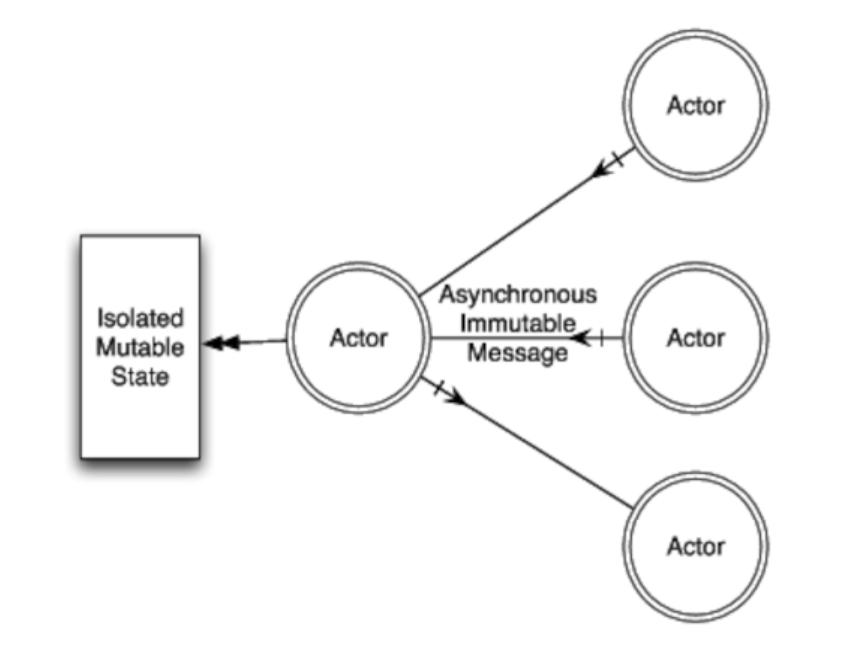
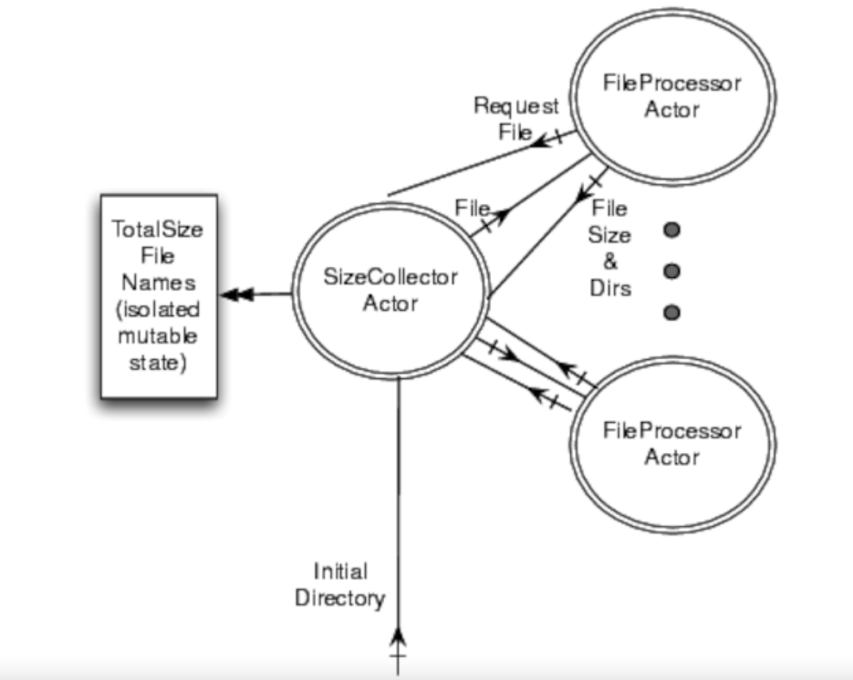

# Chapter 8: Favoring Isolated Mutability
Another approach for effective concurrency is event-based message passing where mutability is isolated in tasks which communicate by exchanging immutable messages among themselves.

For actors, we'll still use Akka which supports that + STM.

  - [Isolating Mutability Using Actors](#isolating-mutability-using-actors)
  - [Actor Qualities](#actor-qualities)
  - [Creating Actors](#creating-actors)
  - [Sending and Receiving Messages](#sending-and-receiving-messages)
  - [Working with Multiple Actors](#working-with-multiple-actors)
  - [Coordinating Actors](#coordinating-actors)
  - [Using Typed Actors](#using-typed-actors)
  - [Typed Actors and Murmurs](#typed-actors-and-murmurs)
  - [Mixing Actors and STM](#mixing-actors-and-stm)
  - [Using Transactors](#using-transactors)
  - [Coordinating Typed Actors](#coordinating-typed-actors)
  - [Remote Actors](#remote-actors)
  - [Recap](#recap)

## Isolating Mutability Using Actors
Java favors shared mutability, while functional languages favor shared immutability.
Both are extremes which are problematic.

Instead, isolated mutability enables one to make modifications but confined to a single thread, which is a good compromise.
This can be achieved using Actors - only one actor can modify the state of a given object. Their inputs and outputs are immutable.


Actors act as independent workers working on their own state & task. To communicate, they send immutable messages to each other.

## Actor Qualities
Actors can receive messages, process requests & send responses.

Each actor has a built-in message queue. Actors can send messages & they are non-blocking by default.


Once active, an Actor is either processing a message or waiting for one to arrive.
Once stopped, an Actor cannot receive any messages anymore.

Actors are not tied to threads. Instead, they reuse them, similar to thread pools.
However, once a thread is used by an actor, it is dedicated to that actor only.

## Creating Actors
We'll use Akka as a framework for actor-based concurrency.

Basic Actor example:
```java
@SuppressWarnings("unchecked")
public class HollywoodActor extends UntypedActor {
  public void onReceive(final Object role) {
    System.out.println("Playing " + role + 
      " from Thread " + Thread.currentThread().getName());
  }  
}

public class UseHollywoodActor {
  public static void main(final String[] args) throws InterruptedException { 
    final ActorRef johnnyDepp = Actors.actorOf(HollywoodActor.class).start();   
    johnnyDepp.sendOneWay("Jack Sparrow");
    Thread.sleep(100);
    johnnyDepp.sendOneWay("Edward Scissorhands");
    Thread.sleep(100);
    johnnyDepp.sendOneWay("Willy Wonka");
    Actors.registry().shutdownAll();
  }
}
```

Result:
```
Playing Jack Sparrow from Thread akka:event-driven:dispatcher:global-1
Playing Edward Scissorhands from Thread akka:event-driven:dispatcher:global-2
Playing Willy Wonka from Thread akka:event-driven:dispatcher:global-3
```

Notes:
 * The `onReceive` method gets invoked once an actor receives a message.
 * Actors can be accessed via the actor registry
 * The same actor can be executed by different threads for different messages
 * Akka provides `ActorRef`s instead of the actors directly to prevent us from interacting with actors directly

Example which passes constructor parameters:
```java
@SuppressWarnings("unchecked")
public class HollywoodActor extends UntypedActor {
  private final String name;
  public HollywoodActor(final String theName) { name = theName; }

  public void onReceive(final Object role) {
    if(role instanceof String)
      System.out.println(String.format("%s playing %s", name, role));
    else
      System.out.println(name + " plays no " + role);
  }  
}

public class UseHollywoodActor {
  public static void main(final String[] args) throws InterruptedException { 

    final ActorRef tomHanks = Actors.actorOf(new UntypedActorFactory() {
        public UntypedActor create() { return new HollywoodActor("Hanks"); }
      }).start();

    tomHanks.sendOneWay("James Lovell");
    tomHanks.sendOneWay(new StringBuilder("Politics"));
    tomHanks.sendOneWay("Forrest Gump");
    Thread.sleep(1000);
    tomHanks.stop();
  }
}
```

Result:
```
Hanks playing James Lovell
Hanks plays no Politics
Hanks playing Forrest Gump
```

<details><summary>Scala example</summary>

```scala
class HollywoodActor extends Actor {
  def receive = {
    case role => 
    println("Playing " + role + 
      " from Thread " + Thread.currentThread().getName())
  }  
}

object UseHollywoodActor {
  def main(args : Array[String]) :Unit = { 
    val johnnyDepp = Actor.actorOf[HollywoodActor].start()    
    
    johnnyDepp ! "Jack Sparrow"
    Thread.sleep(100)
    johnnyDepp ! "Edward Scissorhands"
    Thread.sleep(100)
    johnnyDepp ! "Willy Wonka"

    Actors.registry.shutdownAll
  }
}
```

Result:
```
Playing Jack Sparrow from Thread akka:event-driven:dispatcher:global-1
Playing Edward Scissorhands from Thread akka:event-driven:dispatcher:global-2
Playing Willy Wonka from Thread akka:event-driven:dispatcher:global-3
```

And here's the constructor parameter example:
```scala
class HollywoodActor(val name : String) extends Actor {
  def receive = {
    case role : String => println(String.format("%s playing %s", name, role))
    case msg => println(name + " plays no " + msg)
  }  
}

object UseHollywoodActor {
  def main(args : Array[String]) : Unit = {

    val tomHanks = Actor.actorOf(new HollywoodActor("Hanks")).start()

    tomHanks ! "James Lovell"
    tomHanks ! new StringBuilder("Politics")
    tomHanks ! "Forrest Gump"
    Thread.sleep(1000)
    tomHanks.stop()
  }
}
```

Result:
```
Hanks playing James Lovell
Hanks plays no Politics
Hanks playing Forrest Gump
```

</details>

## Sending and Receiving Messages
Any message can be send to an actor but we are responsible for making it immutable.

By default, message sending is nonblocking but Akka also provides two-way blocking communication.
If a response doesn't arrive in a configurable timeout, an exception is thrown.

Example two-way communication (send message & expect response):
```java
public class FortuneTeller extends UntypedActor {
  public void onReceive(final Object name) {
      getContext().replyUnsafe(String.format("%s you'll rock", name));
  }  

  public static void main(final String[] args) {
    final ActorRef fortuneTeller = 
      Actors.actorOf(FortuneTeller.class).start();
    try {
      final Object response = fortuneTeller.sendRequestReply("Joe");
      System.out.println(response);
    } catch(ActorTimeoutException ex) {
      System.out.println("Never got a response before timeout");      
    } finally {
      fortuneTeller.stop();      
    }
  }
}
```

Result:
```
Joe you'll rock
```

Problem with this code is that `replyUnsafe` will fail if there is no blocking receiver on the other end. To mitigate this issue, we can use `replySafe`:
```java
public class FortuneTeller extends UntypedActor {
  public void onReceive(final Object name) {
    if(getContext().replySafe(String.format("%s you'll rock", name)))
      System.out.println("Message sent for " + name);
    else
      System.out.println("Sender not found for " + name);
  }  

  public static void main(final String[] args) {
    final ActorRef fortuneTeller = 
      Actors.actorOf(FortuneTeller.class).start();
    
    try {
      fortuneTeller.sendOneWay("Bill");
      final Object response = fortuneTeller.sendRequestReply("Joe");
      System.out.println(response);
    } catch(ActorTimeoutException ex) {
      System.out.println("Never got a response before timeout");      
    } finally {
      fortuneTeller.stop();      
    }
  }
}
```

Result:
```
Sender not found for Bill
Message sent for Joe
Joe you'll rock
```

Notes:
 * If we want to receive a reply but not block, we can use `sendRequestReplyFuture` which returns a `Future`

<details><summary>Scala example</summary>

```scala
class FortuneTeller extends Actor {
  def receive = {
    case name : String =>
      self.reply(String.format("%s you'll rock", name))
  }  
}

object FortuneTeller {
  def main(args : Array[String]) : Unit = {
    val fortuneTeller = Actor.actorOf[FortuneTeller].start()
    
    val response = fortuneTeller !! "Joe"
    response match {
      case Some(responseMessage) => println(responseMessage)
      case None => println("Never got a response before timeout")
    }
   
    fortuneTeller.stop()
  }
}
```

and here's the `replySafe` example:
```scala
class FortuneTeller extends Actor {
  def receive = {
    case name : String =>
      if(self.reply_?(String.format("%s you'll rock", name)))
        println("Message sent for " + name)
      else
        println("Sender not found for " + name)
  }  
}
object FortuneTeller {
  def main(args : Array[String]) : Unit = {
    val fortuneTeller = Actor.actorOf[FortuneTeller].start()
    fortuneTeller ! "Bill"
    val response = fortuneTeller !! "Joe"
    response match {
      case Some(responseMessage) => println(responseMessage)
      case None => println("Never got a response before timeout")
    }
    fortuneTeller.stop()
  }
}
```

Notes:
 * actor ! message == sendOneWay
 * actor !! message == sendRequestReply
 * actor !!! message == sendRequestReplyFuture

</details>

## Working with Multiple Actors
We'll see an example of using multiple actors by implementing the "count primes in range" program using actors.

Example:
```java
public class PrimeFinder {
  public static boolean isPrime(final int number) {
    if (number <= 1) return false;
    final int limit = (int) Math.sqrt(number);
    for(int i = 2; i <= limit; i++) if(number % i == 0) return false;
    return true;
  }
  public static int countPrimesInRange(final int lower, final int upper) {    
    int count = 0;
    for(int index = lower; index <= upper; index++)
      if(isPrime(index)) count += 1;
    return count;
  }  
}

public class Primes extends UntypedActor {
  public void onReceive(final Object boundsList) {
    final List<Integer> bounds = (List<Integer>) boundsList;
    final int count = 
      PrimeFinder.countPrimesInRange(bounds.get(0), bounds.get(1));
    getContext().replySafe(count);
  }    

  public static int countPrimes(
    final int number, final int numberOfParts) {
    final int chunksPerPartition = number / numberOfParts;
    final List<Future<?>> results = new ArrayList<Future<?>>();
    for(int index = 0; index < numberOfParts; index++) {
      final int lower = index * chunksPerPartition + 1;
      final int upper = (index == numberOfParts - 1) ? number : 
          lower + chunksPerPartition - 1;
      final List<Integer> bounds = Collections.unmodifiableList(
        Arrays.asList(lower, upper));
      final ActorRef primeFinder = Actors.actorOf(Primes.class).start();
      results.add(primeFinder.sendRequestReplyFuture(bounds));
    }

    int count = 0;
    for(Future<?> result : results) 
      count += (Integer)(result.await().result().get());
    
    Actors.registry().shutdownAll();   
    return count;
  }

  public static void main(final String[] args) {
    if (args.length < 2) 
      System.out.println("Usage: number numberOfParts");    
    else {
      final long start = System.nanoTime();
      final int count = countPrimes(
        Integer.parseInt(args[0]), Integer.parseInt(args[1]));
      final long end = System.nanoTime();
      System.out.println("Number of primes is " + count);
      System.out.println("Time taken " + (end - start)/1.0e9);
    }
  }
}
```

Result:
```
Number of primes is 664579
Time taken 3.890996
```

These results are similar to the results we got using traditional java concurrency but without that much effort.

<details><summary>Scala example</summary>

```scala
object PrimeFinder {
  def isPrime(number : Int) : Boolean = {
    if (number <= 1) return false

    var limit = scala.math.sqrt(number).toInt
    var i = 2
    while(i <= limit) {
      if(number % i == 0) return false
      i += 1
    }    
    return true
  }

  def countPrimesInRange(lower : Int, upper : Int) : Int = {    
    var count = 0
    var index = lower
    while(index <= upper) {
      if(isPrime(index)) count += 1
      index += 1
    }    
    count
  }  
}

class Primes extends Actor {
  def receive = {
    case (lower : Int, upper : Int) => 
      val count = PrimeFinder.countPrimesInRange(lower, upper)
      self.replySafe(new Integer(count))
  }    
}

object Primes {
  def countPrimes(number : Int, numberOfParts : Int) = {
    val chunksPerPartition : Int = number / numberOfParts
    
    val results = new Array[Future[Integer]](numberOfParts)
    var index = 0
    
    while(index < numberOfParts) {
      val lower = index * chunksPerPartition + 1
      val upper = if (index == numberOfParts - 1) 
        number else lower + chunksPerPartition - 1
      val bounds = (lower, upper)
      val primeFinder = Actor.actorOf[Primes].start()
      results(index) = (primeFinder !!! bounds).asInstanceOf[Future[Integer]]
      index += 1
    }

    var count = 0
    index = 0
    while(index < numberOfParts) {
      count += results(index).await.result.get.intValue()
      index += 1
    }    
    Actors.registry.shutdownAll
    count
  }

  def main(args : Array[String]) : Unit = {
    if (args.length < 2) 
      println("Usage: number numberOfParts")    
    else {
      val start = System.nanoTime
      val count = countPrimes(args(0).toInt, args(1).toInt)
      val end = System.nanoTime
      println("Number of primes is " + count)
      println("Time taken " + (end - start)/1.0e9)
    }
  }
}
```
</details>

## Coordinating Actors
We'll explore how actors can interact among each other via the total file size calculator program.

Design:


Solution:
```java
class RequestAFile {}

class FileSize {
  public final long size;
  public FileSize(final long fileSize) { size = fileSize; }
}

class FileToProcess {
  public final String fileName;
  public FileToProcess(final String name) { fileName = name; }
}

class FileProcessor extends UntypedActor {
  private final ActorRef sizeCollector;
  
  public FileProcessor(final ActorRef theSizeCollector) { 
    sizeCollector = theSizeCollector; 
  }
  
  @Override public void preStart() { registerToGetFile(); }
  
  public void registerToGetFile() { 
    sizeCollector.sendOneWay(new RequestAFile(), getContext()); 
  }
  
  public void onReceive(final Object message) {
    FileToProcess fileToProcess = (FileToProcess) message;
    final File file = new java.io.File(fileToProcess.fileName);
    long size = 0L;
    if(file.isFile()) {
      size = file.length();
    } else {
      File[] children = file.listFiles();
      if (children != null)
        for(File child : children)
          if (child.isFile())
            size += child.length();
          else
            sizeCollector.sendOneWay(new FileToProcess(child.getPath()));
    }
      
    sizeCollector.sendOneWay(new FileSize(size));
    registerToGetFile();
  }
}

class SizeCollector extends UntypedActor {
  private final List<String> toProcessFileNames = new ArrayList<String>();
  private final List<ActorRef> idleFileProcessors = 
    new ArrayList<ActorRef>();
  private long pendingNumberOfFilesToVisit = 0L;
  private long totalSize = 0L;
  private long start = System.nanoTime();

  public void sendAFileToProcess() {
    if(!toProcessFileNames.isEmpty() && !idleFileProcessors.isEmpty())
      idleFileProcessors.remove(0).sendOneWay(
        new FileToProcess(toProcessFileNames.remove(0)));
  } 
   
  public void onReceive(final Object message) {
    if (message instanceof RequestAFile) {
      idleFileProcessors.add(getContext().getSender().get());
      sendAFileToProcess();
    }
      
    if (message instanceof FileToProcess) {
      toProcessFileNames.add(((FileToProcess)(message)).fileName);
      pendingNumberOfFilesToVisit += 1;
      sendAFileToProcess();
    }

    if (message instanceof FileSize) {
      totalSize += ((FileSize)(message)).size;
      pendingNumberOfFilesToVisit -= 1;
      
      if(pendingNumberOfFilesToVisit == 0) {        
        long end = System.nanoTime();
        System.out.println("Total size is " + totalSize);
        System.out.println("Time taken is " + (end - start)/1.0e9);    
        Actors.registry().shutdownAll();    
      }
    }
  }
}

public class ConcurrentFileSizeWAkka {
  public static void main(final String[] args) { 
    final ActorRef sizeCollector = 
      Actors.actorOf(SizeCollector.class).start();
      
    sizeCollector.sendOneWay(new FileToProcess(args[0]));
    
    for(int i = 0; i < 100; i++) 
      Actors.actorOf(new UntypedActorFactory() {
        public UntypedActor create() {
          return new FileProcessor(sizeCollector); 
        }
      }).start();        
  }
}
```

Result:
```
Total size is 3793911517
Time taken is 8.599308
```

The performance is comparable to the traditional java concurrency versions but with no synchronization issues to deal with. 

<details><summary>Scala example</summary>
```scala
case object RequestAFile
case class FileSize(size : Long)
case class FileToProcess(fileName : String)

class FileProcessor(val sizeCollector : ActorRef) extends Actor {
  override def preStart = registerToGetFile
  
  def registerToGetFile = { sizeCollector ! RequestAFile }
  
  def receive = {
    case FileToProcess(fileName) =>
      val file = new java.io.File(fileName)

      var size = 0L
      if(file.isFile()) {
        size = file.length()
      } else {
        val children = file.listFiles()
        if (children != null)
          for(child <- children)
            if (child.isFile())
              size += child.length()
            else
              sizeCollector ! FileToProcess(child.getPath())
      }
      
      sizeCollector ! FileSize(size)
      registerToGetFile    
  }
}

class SizeCollector extends Actor {
  var toProcessFileNames = List.empty[String]
  var fileProcessors = List.empty[ActorRef]
  var pendingNumberOfFilesToVisit = 0L
  var totalSize = 0L
  val start = System.nanoTime()

  def sendAFileToProcess() : Unit = {
    if(!toProcessFileNames.isEmpty && !fileProcessors.isEmpty) {
      fileProcessors.head ! FileToProcess(toProcessFileNames.head)
      fileProcessors = fileProcessors.tail
      toProcessFileNames = toProcessFileNames.tail      
    }
  }    
  def receive = {
    case RequestAFile =>
      fileProcessors = self.getSender().get :: fileProcessors
      sendAFileToProcess()     
    case FileToProcess(fileName) =>
      toProcessFileNames = fileName :: toProcessFileNames
      pendingNumberOfFilesToVisit += 1
      sendAFileToProcess()
    case FileSize(size) =>
      totalSize += size
      pendingNumberOfFilesToVisit -= 1
      if(pendingNumberOfFilesToVisit == 0) {
        val end = System.nanoTime()
        println("Total size is " + totalSize)
        println("Time taken is " + (end - start)/1.0e9)        
        Actors.registry.shutdownAll
      }
  }
}

object ConcurrentFileSizeWAkka {
  def main(args : Array[String]) : Unit = {
    val sizeCollector = Actor.actorOf[SizeCollector].start()
    
    sizeCollector ! FileToProcess(args(0))
    
    for(i <- 1 to 100) 
      Actor.actorOf(new FileProcessor(sizeCollector)).start()
  }  
}
```
</details>

## Using Typed Actors
Examples so far used untyped messaged we had to type cast. Typed actors enable us to avoid doing this by specifying the types of messages you receive.

This is implemented by having the actor implement a user-defined interface and implementing the actor doesn't look much different than implementing an ordinary class.

The gotcha is that the Akka framework transforms normal method invocations into messages under the hood.
 * void methods work like `sendOneWay`
 * methods with return values work like `sendRequestReply`
 * methods that return `Future` work like `sendRequestReplyFuture`

This feature will be demonstrated by implementing the `EnergySource` example seen in previous chapters using actors.

Example `EnergySource` with the first few methods:
```java
public interface EnergySource {
  long getUnitsAvailable();
  long getUsageCount();
  void useEnergy(final long units);
}

public class EnergySourceImpl extends TypedActor implements EnergySource {
  private final long MAXLEVEL = 100L;
  private long level = MAXLEVEL;
  private long usageCount = 0L;
  
  public long getUnitsAvailable() { return level; }
  
  public long getUsageCount() { return usageCount; }
  
  public void useEnergy(final long units) {
    if (units > 0 && level - units >= 0) {
      System.out.println(
        "Thread in useEnergy: " + Thread.currentThread().getName());
      level -= units;
      usageCount++;
    }
  }
}

public class UseEnergySource {
  public static void main(final String[] args) 
    throws InterruptedException { 
    System.out.println("Thread in main: " + 
      Thread.currentThread().getName());
    
    final EnergySource energySource = 
      TypedActor.newInstance(EnergySource.class, EnergySourceImpl.class);

    System.out.println("Energy units " + energySource.getUnitsAvailable());

    System.out.println("Firing two requests for use energy");
    energySource.useEnergy(10);
    energySource.useEnergy(10);
    System.out.println("Fired two requests for use energy");
    Thread.sleep(100);
    System.out.println("Firing one more requests for use energy");
    energySource.useEnergy(10);

    Thread.sleep(1000);
    System.out.println("Energy units " + energySource.getUnitsAvailable());
    System.out.println("Usage " + energySource.getUsageCount());
    
    TypedActor.stop(energySource);
  }
}
```

Result:
```
Thread in main: main
Energy units 100
Firing two requests for use energy
Fired two requests for use energy
Thread in useEnergy: akka:event-driven:dispatcher:global-2
Thread in useEnergy: akka:event-driven:dispatcher:global-2
Firing one more requests for use energy
Thread in useEnergy: akka:event-driven:dispatcher:global-3
Energy units 70
Usage 3
```

Note that some of the invocations of the Actor's methods happened in different threads. 
Despite this being the case, there is no danger of synchronization issues as the Akka framework ensures this under the hood.

<details><summary>Scala example</summary>

```scala
trait EnergySource {
  def getUnitsAvailable() : Long
  def getUsageCount() : Long
  def useEnergy(units : Long) : Unit
}

class EnergySourceImpl extends TypedActor with EnergySource {
  val MAXLEVEL = 100L
  var level = MAXLEVEL
  var usageCount = 0L
  
  def getUnitsAvailable() = level
  
  def getUsageCount() = usageCount
  
  def useEnergy(units : Long) = {
    if (units > 0 && level - units >= 0) {
      println("Thread in useEnergy: " + Thread.currentThread().getName())
      level -= units
      usageCount += 1
    }
  }
}

object UseEnergySource {
  def main(args : Array[String]) : Unit = {
    println("Thread in main: " + Thread.currentThread().getName())
    
    val energySource = TypedActor.newInstance(
      classOf[EnergySource], classOf[EnergySourceImpl])

    println("Energy units " + energySource.getUnitsAvailable)

    println("Firing two requests for use energy")
    energySource.useEnergy(10)
    energySource.useEnergy(10)
    println("Fired two requests for use energy")
    Thread.sleep(100)
    println("Firing one more requests for use energy")
    energySource.useEnergy(10)

    Thread.sleep(1000);
    println("Energy units " + energySource.getUnitsAvailable)
    println("Usage " + energySource.getUsageCount)
    
    TypedActor.stop(energySource)
  }
}
```
</details>

## Typed Actors and Murmurs
Our original `EnergySource` implementation had a replenish feature which allowed it to replenish automatically.

How to achieve this using Actors?
 * Have a method `replenish` which the user has to invoke every 1s -> burden on the user
 * Start a timer inside the actor using `Timer`s and prestart/poststop hooks -> timers run in their own threads, hence data access needs to be synchronized
 * Murmurs - actors send messages to themselves

Implementing murmurs in java requires a lot of boilerplate.
The reason for the overcomplicated code is that murmurs are implemented using native scala constructs which need to be retrofitted into Java's type system.

<details><summary>Java example with a lot of boilerplate</summary>

```java
public class EnergySourceImpl extends TypedActor implements EnergySource {  
  private final long MAXLEVEL = 100L;
  private long level = MAXLEVEL;
  private long usageCount = 0L;
  class Replenish {}
  @Override public void preStart() {
    Scheduler.schedule(
      optionSelf().get(), new Replenish(), 1, 1, TimeUnit.SECONDS);
  }
  
  @Override public void postStop() { Scheduler.shutdown(); }

  private void replenish() {
    System.out.println("Thread in replenish: " + 
      Thread.currentThread().getName());
    if (level < MAXLEVEL) level += 1;
  }    

  @Override public PartialFunction receive() {
    return processMessage().orElse(super.receive());
  }

  private PartialFunction processMessage() {

    class MyDispatch extends AbstractFunction1 implements PartialFunction {
      public boolean isDefinedAt(Object message) {
        return message instanceof Replenish;
      }
      
      public Object apply(Object message) {
        if (message instanceof Replenish) replenish();
        return null;
      }

      public Function1 lift() {
        return PartialFunction$class.lift(this);
      }
      
      public PartialFunction andThen(Function1 function) {
        return PartialFunction$class.andThen(this, function);
      }  
      
      public PartialFunction orElse(PartialFunction function) {
        return PartialFunction$class.orElse(this, function);
      }      
    };
    
    return new MyDispatch();
  }

  public long getUnitsAvailable() { return level; } 
  public long getUsageCount() { return usageCount; }
  public void useEnergy(final long units) {
    if (units > 0 && level - units >= 0) {
      System.out.println(
        "Thread in useEnergy: " + Thread.currentThread().getName());
      level -= units;
      usageCount++;
    }
  }
}
```
</details>

The scala version is much easier to read and understand.

Scala example:
```scala
class EnergySourceImpl extends TypedActor with EnergySource {  
  val MAXLEVEL = 100L
  var level = MAXLEVEL
  var usageCount = 0L
  case class Replenish()
  override def preStart() = 
    Scheduler.schedule(self, Replenish, 1, 1, TimeUnit.SECONDS)
  override def postStop() = Scheduler.shutdown
  override def receive = processMessage orElse super.receive

  def processMessage : Receive = {
    case Replenish => 
      println("Thread in replenish: " + Thread.currentThread.getName)
      if (level < MAXLEVEL) level += 1
  }

  def getUnitsAvailable() = level
  def getUsageCount() = usageCount
  def useEnergy(units : Long) = {
    if (units > 0 && level - units >= 0) {
      println("Thread in useEnergy: " + Thread.currentThread.getName)
      level -= units
      usageCount += 1
    }
  }
}
```

Result:
```
Thread in main: main
Energy units 100
Firing two requests for use energy
Fired two requests for use energy
Thread in useEnergy: akka:event-driven:dispatcher:global-2
Thread in useEnergy: akka:event-driven:dispatcher:global-2
Firing one more requests for use energy
Thread in useEnergy: akka:event-driven:dispatcher:global-3
Thread in replenish: akka:event-driven:dispatcher:global-4
Energy units 71
Usage 3
```

## Mixing Actors and STM
The downside to using Actors is that there is no native way to manage consensus across tasks.

E.g. either all actions of actors succeed or none of them.
This limitation can be mitigated using STM which is provided by the Akka framework.

To demonstrate this, the `AccountService` example will be implemented again using actors.

In that problem, if one actor has to implement `deposit` and one has to implement `withdraw`, they need to coordinate their actions so that either both succeed or both fail.

To achieve this, Akka provides two feasible options:
 * using transactors
 * coordinating typed actors

## Using Transactors
Transactors == transactional actors

They bring execution of multiple actors in a transaction.

Transactors can process messages in three ways:
 * The default is to process them in its own transaction
 * `normally` allows one to define that a message will be processed outside of a transaction, like normal messages
 * `Coordinated` allows one to specify a message to be processed as part of an overarching transaction

In addition to linking other actors in a transaction, we can specify pre/post transaction actions.

Java example:
```java
public class Deposit {
  public final int amount;
  public Deposit(final int theAmount) { amount = theAmount; }
}

public class Withdraw {
  public final int amount;
  public Withdraw(final int theAmount) { amount = theAmount; }
}

public class FetchBalance {}

public class Balance {
  public final int amount;
  public Balance(final int theBalance) { amount = theBalance; }
}

public class Transfer {
  public final ActorRef from;
  public final ActorRef to;
  public final int amount;
  public Transfer(final ActorRef fromAccount, 
    final ActorRef toAccount, final int theAmount) {
    from = fromAccount;
    to = toAccount;
    amount = theAmount;
  }
}

public class Account extends UntypedTransactor {
  private final Ref<Integer> balance = new Ref<Integer>(0);
  
  public void atomically(final Object message) {
    if(message instanceof Deposit) {
      int amount = ((Deposit)(message)).amount;
      if (amount > 0) {
        balance.swap(balance.get() + amount);
        System.out.println("Received Deposit request " + amount);
      }
    }

    if(message instanceof Withdraw) {
      int amount = ((Withdraw)(message)).amount;
      System.out.println("Received Withdraw request " + amount);
      if (amount > 0 && balance.get() >= amount) 
        balance.swap(balance.get() - amount);
      else {
        System.out.println("...insufficient funds...");
        throw new RuntimeException("Insufficient fund");        
      }
    }
 
    if(message instanceof FetchBalance) {
      getContext().replySafe(new Balance(balance.get()));
    }
  }  
}

public class AccountService extends UntypedTransactor {
  
  @Override public Set<SendTo> coordinate(final Object message) { 
    if(message instanceof Transfer) {
      Set<SendTo> coordinations = new java.util.HashSet<SendTo>();
      Transfer transfer = (Transfer) message;      
      coordinations.add(sendTo(transfer.to, new Deposit(transfer.amount)));
      coordinations.add(sendTo(transfer.from, 
        new Withdraw(transfer.amount)));
      return java.util.Collections.unmodifiableSet(coordinations);
    }

    return nobody();
  }
  
  public void atomically(final Object message) {}
}

public class UseAccountService {
  public static void printBalance(
    final String accountName, final ActorRef account) {

    Balance balance = 
      (Balance)(account.sendRequestReply(new FetchBalance()));
    System.out.println(accountName + " balance is " + balance.amount);
  }
  
  public static void main(final String[] args) 
    throws InterruptedException {
    final ActorRef account1 = Actors.actorOf(Account.class).start();
    final ActorRef account2 = Actors.actorOf(Account.class).start();
    final ActorRef accountService = 
      Actors.actorOf(AccountService.class).start();
    
    account1.sendOneWay(new Deposit(1000));
    account2.sendOneWay(new Deposit(1000));
    
    Thread.sleep(1000);

    printBalance("Account1", account1);
    printBalance("Account2", account2);
    
    System.out.println("Let's transfer $20... should succeed");
    accountService.sendOneWay(new Transfer(account1, account2, 20));

    Thread.sleep(1000);

    printBalance("Account1", account1);
    printBalance("Account2", account2);

    System.out.println("Let's transfer $2000... should not succeed");
    accountService.sendOneWay(new Transfer(account1, account2, 2000));

    Thread.sleep(6000);

    printBalance("Account1", account1);
    printBalance("Account2", account2);
   
    Actors.registry().shutdownAll();
  }
}
```

Result:
```
Received Deposit request 1000
Received Deposit request 1000
Account1 balance is 1000
Account2 balance is 1000
Let's transfer $20... should succeed
Received Deposit request 20
Received Withdraw request 20
Account1 balance is 980
Account2 balance is 1020
Let's transfer $2000... should not succeed
Received Withdraw request 2000
...insufficient funds...
Received Deposit request 2000
Account1 balance is 980
Account2 balance is 1020
```

Notes:
 * If one interacts with a transactor directly, its like interacting with a normal actor
 * To coordinate multiple actors, an intermediary actor is required to implement the `coordinate` method
 * The transactors approach shares the same limitations as STM - not optimized for high write frequency

As expected, the scala version is more succinct.
<details><summary>Scala example</summary>

```scala
case class Deposit(val amount : Int)
case class Withdraw(val amount : Int)
case class FetchBalance()
case class Balance(val amount : Int)
case class Transfer(val from : ActorRef, val to : ActorRef, val amount : Int)

class Account extends Transactor {
  val balance = Ref(0)
  
  def atomically = {
    case Deposit(amount) =>
      if (amount > 0) {
        balance.swap(balance.get() + amount)
        println("Received Deposit request " + amount)
      }

    case Withdraw(amount) =>
      println("Received Withdraw request " + amount)
      if (amount > 0 && balance.get() >= amount) 
        balance.swap(balance.get() - amount)
      else {
        println("...insufficient funds...")
        throw new RuntimeException("Insufficient fund")
      }
 
    case FetchBalance =>
      self.replySafe(Balance(balance.get()))
  }
}

class AccountService extends Transactor {
  
  override def coordinate = { 
    case Transfer(from, to, amount) =>
      sendTo(to -> Deposit(amount), from -> Withdraw(amount))
  }

  def atomically = { case message => }
}

object UseAccountService {
  
  def printBalance(accountName : String, account : ActorRef) = {
    (account !! FetchBalance) match {
      case Some(Balance(amount)) =>
        println(accountName + " balance is " + amount)
      case None =>
        println("Error getting balance for " + accountName)
    }
  }
  
  def main(args : Array[String]) = {
    val account1 = Actor.actorOf[Account].start()
    val account2 = Actor.actorOf[Account].start()
    val accountService = Actor.actorOf[AccountService].start()
  
    account1 ! Deposit(1000)
    account2 ! Deposit(1000)
    
    Thread.sleep(1000)

    printBalance("Account1", account1)
    printBalance("Account2", account2)
    
    println("Let's transfer $20... should succeed")
    accountService ! Transfer(account1, account2, 20)

    Thread.sleep(1000)

    printBalance("Account1", account1)
    printBalance("Account2", account2)

    println("Let's transfer $2000... should not succeed")
    accountService ! Transfer(account1, account2, 2000)

    Thread.sleep(6000)

    printBalance("Account1", account1)
    printBalance("Account2", account2)
    
    Actors.registry.shutdownAll
  }
}
```
</details>

## Coordinating Typed Actors
Typed actors are very appealing due to their similarity with OO programming, but there are a few gotchas when coordinating typed actors.

Also, have in mind that you can only coordinate void methods.

Java example:
```java
public interface Account {
  int getBalance();
  @Coordinated void deposit(final int amount);
  @Coordinated void withdraw(final int amount);
}

public interface AccountService {
  void transfer(final Account from, final Account to, final int amount);
}

public class AccountImpl extends TypedActor implements Account {
  private final Ref<Integer> balance = new Ref<Integer>(0);

  public int getBalance() { return balance.get(); }
  
  public void deposit(final int amount) {
    if (amount > 0) {
      balance.swap(balance.get() + amount);
      System.out.println("Received Deposit request " + amount);
    }
  }

  public void withdraw(final int amount) {
    System.out.println("Received Withdraw request " + amount);
    if (amount > 0 && balance.get() >= amount) 
      balance.swap(balance.get() - amount);
    else {
      System.out.println("...insufficient funds...");
      throw new RuntimeException("Insufficient fund");
    }
  }
}

public class AccountServiceImpl 
  extends TypedActor implements AccountService {

  public void transfer(
    final Account from, final Account to, final int amount) {

    coordinate(true, new Atomically() {
      public void atomically() {
        to.deposit(amount);
        from.withdraw(amount);
      }
    });
  }
}

public class UseAccountService {
  
  public static void main(final String[] args) 
    throws InterruptedException {

    final Account account1 = 
      TypedActor.newInstance(Account.class, AccountImpl.class);
    final Account account2 = 
      TypedActor.newInstance(Account.class, AccountImpl.class);
    final AccountService accountService = 
      TypedActor.newInstance(AccountService.class, AccountServiceImpl.class);

    account1.deposit(1000);
    account2.deposit(1000);

    System.out.println("Account1 balance is " + account1.getBalance());
    System.out.println("Account2 balance is " + account2.getBalance());

    System.out.println("Let's transfer $20... should succeed");

    accountService.transfer(account1, account2, 20);

    Thread.sleep(1000);

    System.out.println("Account1 balance is " + account1.getBalance());
    System.out.println("Account2 balance is " + account2.getBalance());

    System.out.println("Let's transfer $2000... should not succeed");
    accountService.transfer(account1, account2, 2000);

    Thread.sleep(6000);

    System.out.println("Account1 balance is " + account1.getBalance());
    System.out.println("Account2 balance is " + account2.getBalance());
    
    Actors.registry().shutdownAll();
  }
}
```

Result:
```
Received Deposit request 1000
Account1 balance is 1000
Received Deposit request 1000
Account2 balance is 1000
Let's transfer $20... should succeed
Received Deposit request 20
Received Withdraw request 20
Account1 balance is 980
Account2 balance is 1020
Let's transfer $2000... should not succeed
Received Deposit request 2000
Received Withdraw request 2000
...insufficient funds...
Account1 balance is 980
Account2 balance is 1020
```

Notes:
 * The `true` argument to `coordinate` indicates that the transaction should not finish until the actors have finished their nested transactions.

The typed actor coordination evidently looks much better than the untyped version!

<details><summary>Scala example</summary>

```scala
trait Account {
  def getBalance() : Int
  @Coordinated def deposit(amount : Int) : Unit
  @Coordinated def withdraw(amount : Int) : Unit
}

trait AccountService {
  def transfer(from : Account, to : Account, amount : Int) : Unit
}

class AccountImpl extends TypedActor with Account {
  val balance = Ref(0)

  def getBalance() = balance.get()
  
  def deposit(amount : Int) = {
    if (amount > 0) {
      balance.swap(balance.get() + amount)
      println("Received Deposit request " + amount)
    }
  }

  def withdraw(amount : Int) = {
    println("Received Withdraw request " + amount)
    if (amount > 0 && balance.get() >= amount) 
      balance.swap(balance.get() - amount)
    else {
      println("...insufficient funds...")
      throw new RuntimeException("Insufficient fund")
    }
  }
}

class AccountServiceImpl extends TypedActor with AccountService {
  def transfer(from : Account, to : Account, amount : Int) = {
    coordinate {
      to.deposit(amount)
      from.withdraw(amount)
    }
  }
}

object UseAccountService {
  
  def main(args : Array[String]) = {
    val account1 = 
      TypedActor.newInstance(classOf[Account], classOf[AccountImpl])
    val account2 = 
      TypedActor.newInstance(classOf[Account], classOf[AccountImpl])
    val accountService = 
      TypedActor.newInstance(
        classOf[AccountService], classOf[AccountServiceImpl])

    account1.deposit(1000)
    account2.deposit(1000)
    
    println("Account1 balance is " + account1.getBalance())
    println("Account2 balance is " + account2.getBalance())


    println("Let's transfer $20... should succeed")

    accountService.transfer(account1, account2, 20)

    Thread.sleep(1000)

    println("Account1 balance is " + account1.getBalance())
    println("Account2 balance is " + account2.getBalance())

    println("Let's transfer $2000... should not succeed")
    accountService.transfer(account1, account2, 2000)

    Thread.sleep(6000)

    println("Account1 balance is " + account1.getBalance())
    println("Account2 balance is " + account2.getBalance())
    
    Actors.registry.shutdownAll
  }
}
```
</details>

## Remote Actors
The actors we saw so far were inside the same application. There are some developers which advocate making actors separate processes like in Erlang.

Both options are possible via Scala and Akka and interacting with remote actors is indistinguishable from interacting with normal actors.
The only difference is in the initialization.

Akka manages the interprocess communicating using protocol buffers under the hood.

To illustrate this, we'll build a simple app which monitors various computer indicators (CPU, RAM, etc) via remote actors.

Java example:
```java
public class Monitor extends UntypedActor {
  public void onReceive(Object message) {
    System.out.println(message);
  }  

  public static void main(final String[] args) {    
    Actors.remote().start("localhost", 8000)
      .register("system-monitor", Actors.actorOf(Monitor.class));

    System.out.println("Press key to stop");
    System.console().readLine();
    Actors.registry().shutdownAll();
    Actors.remote().shutdown();
  }
}

// in separate application
public class Client {
  public static void main(final String[] args) {
    ActorRef systemMonitor = remote().actorFor(
      "system-monitor", "localhost", 8000);

    systemMonitor.sendOneWay("Cores: " + 
      Runtime.getRuntime().availableProcessors());
    systemMonitor.sendOneWay("Total Space: " + 
      new File("/").getTotalSpace());
    systemMonitor.sendOneWay("Free Space: " + 
      new File("/").getFreeSpace());
  }
}
```

Result:
```
Press key to stop
Cores: 2
Total Space: 499763888128
Free Space: 141636308992
```

Regardless of the ease of use, we're still responsible for passing and using immutable messages.

## Recap
Pros:
 * Actors make it easy to work with isolated mutability
 * No synchronization concerns
 * Efficient one-way messaging but also support send-and-wait
 * Scalable - share a thread pool
 * Support typed messages
 * Support transactions

Cons:
 * In langauges that don't enforce immutability, extra effort is required
 * Unexpected failures of actors we expect a result from can result in starvation
 * Actors don't prevent deadlock and starvation
 * Actors can process messages one at a time

Not all applications are suited for an actor-based model. 
This model is suitable for applications that can be separated into independent units of computation and need not communicate/coordinate frequently.
