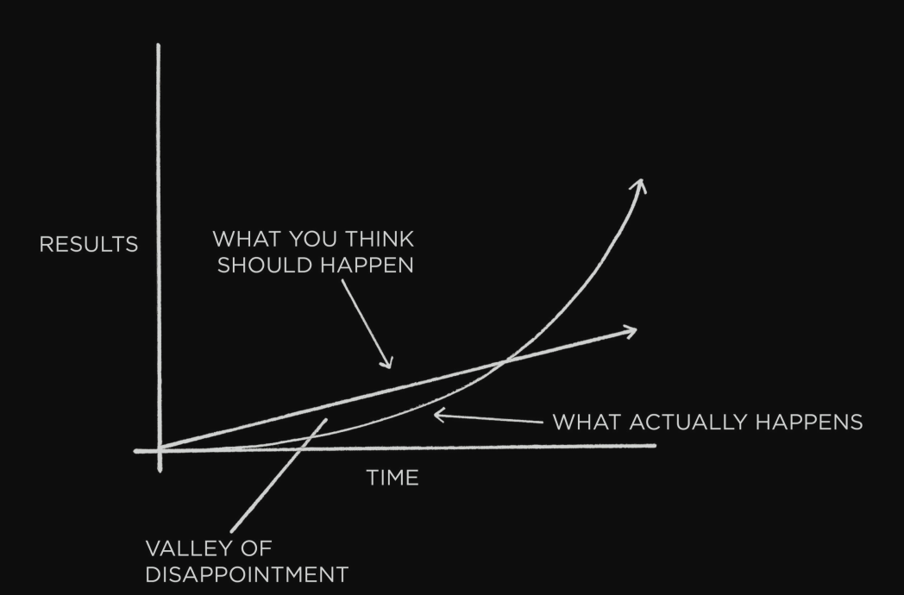

# Atomic Habits
# The Surprising Power of Atomic Habits
The UK cycling team went from absolute noobs to winning championships in 5y all thanks to some coach who focused on the team improving via micro habits, which stack up over time.

Examples:
 * Experimented with different fabric for the outfits which are more aerodynamic
 * Tried different massages to optimize for fastest muscle recovery
 * Optimized hand-washing to minimize players getting a cold

Why does this work? Because of compounding, famously expressed via the formula 1.01^365 = 37.78, ie 1% improvement every day.

On the flip-side, getting 1% worse every day (0.99^365) results in 00.03.

Habits are the compound interest of self-improvement. They seem to make little difference day to day, but deliver massive impact over months & years.

Unfortunately, the slow velocity results in us underestimating the effect of both good and bad habits:
 * We tend to skip workouts
 * We tend to binge-watch netflix or eat a lot

We do this because short-term positive and negative impact is minimal, but that's not the case in the long-term.

**Key takeaway** - focus on putting yourself on the path to success, not on being successful. Focus on your trajectory, rather than current results.

The effect of habits is similar to the behavior of a melting cube. 
While the temperature in a room is increasing, the ice cube seemingly stays in tact, but at some point, a 1 degree increase leads to the cube melting.

Breakthrough moments are the result of many previous actions that build up the potential for a major change. Habits work similarly.

This is one of the core reasons people don't stick to habits - they don't have the patience to wait for the breakthrough because they expect linear gains.

The author refers to the time before a breakthrough as **the plateau of latent potential**.

**Forget about goals, focus on systems.**

Goals are about the results you want to achieve, systems are about the processes that lead to those results.

Goals make sense for setting direction, but systems are best for making progress towards that direction.

Problems with goal-setting:
 * Winners and losers share the same goals - survivorship-bias kicks in. Only a handful of goal-setters succeeded and those are the ones we see. We don't see the dozens of failures.
 * Achieving a goal is a momentary change - by achieving a goal, you're treating a symptom, not the root cause. You can clean your room once, but you need a system to keep it tidy over time.
 * Goals restrict your happiness - you defer happiness until you reach your goal, after which you defer for the next one. Enjoying the process lets you be happy while your system is running.
 * Goals are at odds with long-term progress - once you reach your goal, there's nothing motivating you to keep going. Goal-setting focus is winning the game, systems focus is to continue playing it.

**You don't rise to the level of your goals, you fall to the level of your systems.**

**Atomic** habits are partially about creating tiny habits, but also, they're meant to be the atoms of something bigger, the building blocks of remarkable results.

# How Your Habits Shape Your Identity (and Vice Versa)
